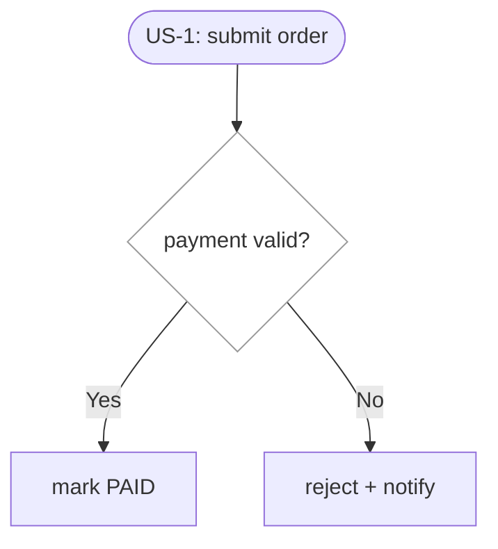

# Plan Format Reference

This document defines the expected format for `plan.md`, used by the **prospec-plan** Skill.

---

## Purpose

`plan.md` is the execution plan for a Story, describing the implementation overview, affected modules, implementation steps, and risk assessment.

---

## Standard Format

### 1. Overview

A 1-2 paragraph summary describing the overall implementation strategy:

```markdown
## Overview

[Paragraph 1: What problem this Story solves]

[Paragraph 2: The implementation strategy and key design decisions]
```

**Example:**

```markdown
## Overview

This story implements a unified error handling mechanism for prospec. Currently, errors are handled inconsistently across different modules, making debugging difficult.

We will create a centralized error handler module that defines standard error types, response formats, and logging strategies. This follows the error handling conventions specified in prospec/CONSTITUTION.md.
```

---

### 2. Technical Summary (Context-Dependent)

This section is **auto-synthesized** based on the project's Knowledge state. Include exactly ONE of the following:

**Brownfield Mode** — when `prospec/ai-knowledge/modules/` has >= 2 modules with README.md:

```markdown
## Technical Summary

> Auto-synthesized from AI Knowledge for this change's context

### Affected Module Overview
| Module | Core Responsibility | Key API | Dependencies |
|--------|-------------------|---------|--------------|
| [name] | [responsibility] | [key exports] | [deps] |

### Existing Patterns (from _conventions.md)
- [Pattern 1]: [brief description]
- [Pattern 2]: [brief description]

### Architecture Constraints (from Constitution)
- [Constraint 1]
- [Constraint 2]
```

**Greenfield Mode** — when AI Knowledge is empty or has < 2 modules:

```markdown
## Technical Context (Greenfield)

> AI Knowledge not yet established — substitute context collected below

### Tech Stack Detection
- Language: (inferred from .prospec.yaml or package.json/pyproject.toml)
- Framework: (inferred from dependencies)
- Test Framework: (inferred from devDependencies)

### Project Structure Scan
- Entry points: (src/index.ts, main.py, etc.)
- Directory summary: (top-level directories + inferred purpose)

### Detected Patterns
- (Scan 2-3 core files for naming conventions, architecture patterns)

### External Dependencies
- (List key dependencies from package.json/requirements.txt)

### [To Be Supplemented]
- Recommend running `prospec knowledge init` + `/prospec-knowledge-generate` for full Knowledge
```

**Optional — External Library Usage (both modes, additive):**

When this change touches a third-party library, plan.md MAY append the following subsection to the Technical Summary (Brownfield) or Technical Context (Greenfield). It is **additive** — it does not alter the Brownfield/Greenfield mutually exclusive formats above.

```markdown
### External Library Usage (on-demand, informational)

> Untrusted reference pulled on-demand from a Context7 MCP (if available) — NOT executed, NOT a gate.

- **{library}**: [current usage snippet / key API shape, from Context7 `query-docs`]
- If no Context7 MCP is available, or the lookup returns nothing: skip silently and leave at most one informational line — `Context7 not consulted — skipped` — never a WARN/FAIL, never blocking.
```

---

### 3. Affected Modules

Use a table to list affected modules:

```markdown
## Affected Modules

| Module | Impact | Changes |
|--------|--------|---------|
| [module name] | [High/Medium/Low] | [Brief description of changes] |
```

**Example:**

```markdown
## Affected Modules

| Module | Impact | Changes |
|--------|--------|---------|
| error-handler | High | New module creation |
| api-middleware | Medium | Integrate centralized error handler |
| logger | Low | Add error-specific log formatting |
```

---

### 4. Call Chain

Present the core call chain for each primary entry point **before** the Implementation Steps — the layered chain from transport down to data access and external side effects — with method names and key params. This surfaces layering violations (a layer reaching past its neighbor, business logic in the entry/transport layer, a skipped data-access layer, a commit-before-emit side effect) at design time. Maps to `_conventions.md` and the Constitution's dependency/layering rule.

```markdown
## Call Chain

POST /orders/{id}/submit
  → OrderRoute.submit(order_id, auth)
  → OrderService.submit(order_id)                    [orchestration]
  → Order.submit()                                   [entity state transition]
  → OrderRepository.update(filter, {status})
  → after-commit hook → emit("order_submitted")      [side effect]
```

- One chain per primary entry point touched by this change.
- Each layer: method name + key params. Mark cross-layer types (named types, never anonymous bags) and external side effects (registered via after-commit hook, never inline before commit).

---

### 5. User Story Flow Diagram (Conditional)

Add a **Mermaid flow diagram** of the User Story's behavioral/decision flow when — and only when — the story is structurally complex. This is a **guidance heuristic, not a mechanical gate**: it helps a reader grasp branches and states that prose obscures, and it does NOT replace the technical Call Chain (Section 4), which stays code-oriented.

Add a diagram when **any-of** these structural signals holds:

- **Branching** — acceptance scenarios fork on a condition into >= 2 distinct decision points / outcomes
- **State machine** — the flow moves through >= 3 sequential state transitions, or has multiple terminal states (success / failure / cancelled ...)
- **Cross-module / cross-actor sequence** — multiple modules or actors interact in an order where the ordering itself is what must be understood

**Skip** the diagram for a single linear happy path, a story with no meaningful branching or state, or single-step CRUD — a diagram there is noise, not clarity.

**How:**

- Depict the **User Story's** behavioral/decision flow (user-observable outcomes), NOT the code call chain.
- Follow `prospec/ai-knowledge/_diagram-conventions.md` — Mermaid `flowchart`, the `classDef` palette (diamond `decisionNode` for branches), node shapes, and label format. Read it on demand.
- Place this section **before** Implementation Steps; title each diagram with the User Story it maps to (e.g. `US-1`), one diagram per complex story.



---

### 6. Implementation Steps

Use an ordered numbered list with details for each step:

```markdown
## Implementation Steps

1. **[Step title]**
   - [Detail 1]
   - [Detail 2]

2. **[Step title]**
   - [Detail 1]
   - [Detail 2]
```

**Example:**

```markdown
## Implementation Steps

1. **Create error-handler module**
   - Define standard error types (ValidationError, NotFoundError, etc.)
   - Implement error code mapping system
   - Create error response formatter

2. **Integrate with existing modules**
   - Update api-middleware to use centralized error handler
   - Refactor existing error handling code
   - Ensure backward compatibility

3. **Add logging and monitoring**
   - Integrate with logger module
   - Add error tracking hooks
   - Configure log levels per error type

4. **Update documentation**
   - Document error codes in prospec/ai-knowledge
   - Add usage examples for developers
   - Update API documentation
```

---

### 7. Risk Assessment

Use a table to list risks, impacts, and mitigation strategies:

```markdown
## Risk Assessment

| Risk | Impact | Mitigation |
|------|--------|------------|
| [Risk description] | [High/Medium/Low] | [Mitigation strategy] |
```

**Example:**

```markdown
## Risk Assessment

| Risk | Impact | Mitigation |
|------|--------|------------|
| Breaking existing error handling | High | Implement gradual migration, maintain backward compatibility |
| Performance overhead | Low | Optimize error handler, benchmark critical paths |
| Incomplete error coverage | Medium | Conduct thorough code review, add integration tests |
```

---

## Scale Tiers

Plan depth follows the change's `metadata.scale`:

| Scale | Plan output |
|-------|-------------|
| `quick` | No plan at all — `/prospec-plan` exits at its Entry Gate; proceed to tasks |
| `standard` (or absent) | Concise plan, keep under **120 lines** (the conditional Section 5 User Story Flow diagram block is excluded from the count) — the default below |
| `full` | Complete architecture analysis — expanded Technical Summary, one Call Chain per entry point, trade-off notes in Risk Assessment; the 120-line cap does not apply |

---

## File Length Guidelines

- Keep under **120 lines** (`standard`; see Scale Tiers for `full`)
- The conditional **User Story Flow diagram** block (Section 5) is **excluded** from the 120-line count
- Ideal number of Implementation Steps: 4-8
- If steps exceed 10, consider splitting into multiple Stories

---

## Reference Information

- Project name: `prospec`
- AI Knowledge path: `prospec/ai-knowledge`
- Constitution file: `prospec/CONSTITUTION.md`
