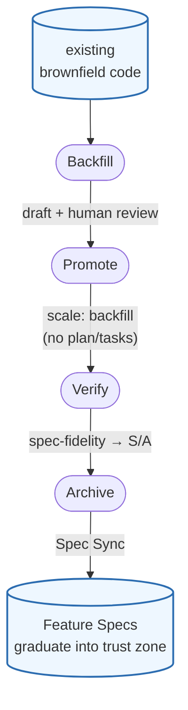

# Prospec

<div align="center">

[](LICENSE)
[](https://www.typescriptlang.org/)
[](tests/)
[](https://nodejs.org/)
[](https://pnpm.io/)

**Progressive Spec-Driven Development (SDD) toolkit for AI coding agents**

*Slash-command Skills · structured AI Knowledge · MCP server — for Claude Code, Copilot, Codex*

[繁體中文](./README.zh-TW.md) • [Quickstart](#quickstart) • [Why Prospec?](#why-prospec) • [How it works](#how-it-works)

**This project is a fork of [ci-yang/prospec](https://github.com/ci-yang/prospec)**

</div>

---

## What is Prospec?

Prospec is a **Skills-driven Spec-Driven Development (SDD) toolkit** for AI coding agents. You drive day-to-day work through slash-command **Skills inside your agent** (Claude Code, Antigravity, Copilot, Codex); a thin **CLI** only bootstraps the project and regenerates Skills/Knowledge. The payoff: your agent follows a consistent `story → plan → tasks → implement → review → verify → archive` workflow, grounded in structured, version-controlled project knowledge.

Three pieces work together:

```
  You ⇄ AI agent
     │
     ├─ Skills .......... run the workflow:  story → plan → tasks →
     │                    implement → review → verify → archive
     │                        ▲
     │                        │ read & grow
     ├─ AI Knowledge .... structured project memory (modules, specs, lessons)
     │                        ▲
     │                        │ generated / regenerated by
     └─ CLI (prospec) ... bootstrap only:  init, agent sync, knowledge init / re-scan structure
```

- **Skills** run the workflow inside your agent — the day-to-day surface.
- **AI Knowledge** is progressive project memory the Skills read and grow with each change.
- **CLI** is a one-time/occasional tool: it scaffolds the project and regenerates Skills + Knowledge — it is *not* in the runtime loop.

**Who is it for?** Developers using an AI coding agent who want repeatable, reviewable workflows on a new project (greenfield) or an existing codebase (brownfield).

## Why Prospec?

| Challenge | How Prospec helps |
|-----------|-------------------|
| AI doesn't know your codebase | `prospec knowledge init` + `/prospec-knowledge-generate` auto-scan and generate AI-readable docs |
| Context window limits | Progressive disclosure: load a summary first, details on-demand (70%+ token saving vs full-dump) |
| Inconsistent AI workflows | Structured Skills enforce `story → plan → tasks → implement → review → verify → archive` |
| Vendor lock-in | Works with 4+ AI CLIs; knowledge stored as universal Markdown |
| No design-to-code bridge | `/prospec-design` generates visual + interaction specs with MCP tool integration |
| Knowledge becomes stale | The verify S/A commit prompt folds a Knowledge Update into the feature commit; the archive Entry Gate re-confirms it as a backstop |
| Verify passes but subtle bugs ship | `/prospec-review` — independent adversarial review between implement and verify |
| Lessons don't persist across sessions | `/prospec-learn` — recurring fixes promote (human-gated) into versioned team rules |

> Each row maps to a Skill or command below — see [AI Skills](#ai-skills) and [CLI Commands](#cli-commands).

---

## Quickstart

From zero to your first AI-driven change in about five minutes.

### Prerequisites

- **Node.js** >= 22.13.0
- An **AI CLI** (one or more): [Claude Code](https://docs.anthropic.com/claude/docs/claude-code) (recommended), [Codex CLI](https://developers.openai.com/codex/cli), [GitHub Copilot CLI](https://docs.github.com/copilot/github-copilot-in-the-cli), or [Antigravity CLI](https://antigravity.google/)

### 1. Install

Prospec is a **bootstrap/update CLI** — once `prospec quickstart` has run (it chains `init` + `agent sync`), your agent works from the committed Skills and Knowledge (Markdown); the binary isn't needed again until you regenerate.

**Option A: Standalone Binary (Recommended & No Node.js Required)**
For macOS and Linux, run the one-click installer script:
```bash
curl -fsSL https://raw.githubusercontent.com/benwu95/prospec/main/install.sh | bash
```

For Windows, run the one-click PowerShell installer script:
```powershell
powershell -c "irm https://raw.githubusercontent.com/benwu95/prospec/main/install.ps1 | iex"
```

Alternatively, download the precompiled binary manually from the [GitHub Releases](https://github.com/benwu95/prospec/releases) page:

- **Linux (x64)**: `prospec-linux-x64`
- **macOS (Apple Silicon)**: `prospec-macos-arm64`
- **macOS (Intel)**: `prospec-macos-x64`
- **Windows (x64)**: `prospec-windows-x64.exe`

(For manual macOS/Linux installation, run `chmod +x prospec-<os>-<arch>` and move the file to `/usr/local/bin/prospec`).


**Option B: Run on demand with npx (Node.js environments)**
Run without installing globally:
```bash
npx github:benwu95/prospec <command>
```

**Option C: Pin as devDependency (Node.js projects)**
Install as a local project dependency:
```bash
npm install -D github:benwu95/prospec     # or: pnpm add -D github:benwu95/prospec
```

> [!WARNING]
> We do **NOT** recommend installing globally via `npm install -g` as global compiling of unpublished forks can fail depending on your local Node/compile environment.


### 2. Bootstrap your project

One command does the deterministic setup — it chains `init` + `agent sync`, skipping any step already done:

```bash
cd my-project                 # a new or existing project

prospec quickstart            # → select AI assistants, choose doc language; creates .prospec.yaml + per-agent config + Skills
```

`prospec quickstart` runs `agent sync`, which writes **Claude Code** → `CLAUDE.md` + `.claude/skills/`; **Antigravity / Codex / Copilot** → `AGENTS.md` + `.agents/skills/`. Then finish onboarding inside your AI agent:

```text
🤖 Run inside your AI Agent chat:
/prospec-quickstart           # localize skill triggers, re-sync config, generate AI Knowledge
```

This one-time finisher is re-runnable and self-terminating; on an existing codebase it reads your modules into AI Knowledge so the agent understands them before your first change.

### 3. Run your first change (inside your AI agent)

You don't have to remember the steps — **describe the change in plain language and the agent drives the SDD loop**, pausing only to ask you questions and to confirm each handoff:

```text
🤖 Run inside your AI Agent chat:
You ▸ Use prospec to add a dark-mode toggle

The agent picks up the request and runs /prospec-ff:
  • asks a few scoping / acceptance questions — you answer in plain language
  • writes story → plan → tasks, then hands off at each stage:

  "Run /prospec-implement now? (Y/n)"             → Y
  implement → "Run /prospec-review now? (Y/n)"    → Y
  review    → "Run /prospec-verify now? (Y/n)"    → Y
  verify reaches grade A → prompts you to commit  → Y
         → "Run /prospec-archive now? (Y/n)"      → Y   ✓ archived
```

Every stage ends by telling you what's next and waiting for your `Y` — answer `n` to stop and the suggestion stays, so you can resume later without tracking where you left off. `/prospec-verify` is the commit boundary: at grade S/A it prompts you to commit (it never commits for you), then offers to archive.

Prefer to drive each step yourself? Run them explicitly:

```text
🤖 Run inside your AI Agent chat:
/prospec-explore                   # (optional) clarify the requirement first
/prospec-new-story add-my-feature  # capture it as a structured story
/prospec-design                    # (optional) UI / interaction specs
/prospec-plan                      # design the implementation (a `quick`-scale change skips this)
/prospec-tasks                     # break the plan into an ordered task checklist
#   ↑ collapse story → plan → tasks in one pass with: /prospec-ff add-my-feature
/prospec-implement                 # implement task-by-task (no commit yet)
/prospec-review                    # adversarial review → fix loop
/prospec-verify                    # validate; prompts you to commit at grade S/A
/prospec-archive                   # archive + sync specs & knowledge
/prospec-learn                     # (periodic) promote recurring lessons → team rules
```

That's the full SDD loop. Because `/prospec-quickstart` already seeded AI Knowledge, the agent starts from an understanding of your modules. The full greenfield &amp; brownfield walkthroughs below break down every step `prospec quickstart` automates.

<details>
<summary>Greenfield vs. brownfield bootstrap — what the two commands expand to</summary>

#### Greenfield (new projects)
`prospec quickstart` → `/prospec-quickstart` is the whole bootstrap:

```bash
mkdir my-project && cd my-project
prospec quickstart --name my-project   # init + agent sync (interactive assistant + language selection)
# then, inside your AI agent:
/prospec-quickstart                     # localize triggers · re-sync · generate AI Knowledge
```

Those two commands expand to:

```bash
# `prospec quickstart` runs:
prospec init --name my-project   # → select AI assistants (interactive checkbox)
                                 # → choose the doc language (default: English, or
                                 #   --language "Traditional Chinese (Taiwan)"); a [MUST]
                                 #   Language Policy rule is seeded into CONSTITUTION.md —
                                 #   code and git commit messages stay in English
                                 # → creates .prospec.yaml + directory structure
prospec agent sync               # → per-agent config + Skills (Claude Code → CLAUDE.md +
                                 #   .claude/skills/; Antigravity / Codex / Copilot →
                                 #   AGENTS.md + .agents/skills/)

# `/prospec-quickstart` then, inside your AI agent:
#   • non-English doc language? proposes native trigger words for `skill_triggers`
#     in .prospec.yaml and re-runs agent sync once you confirm — skills then match
#     requests phrased in your language
#   • prospec knowledge init → /prospec-knowledge-generate (seeds AI Knowledge)
```

On a fresh repo, `/prospec-knowledge-generate` produces a minimal Knowledge base that fills in as you ship changes. Then run your first change exactly as in step 3 above.

#### Brownfield (existing projects)
same two commands; `/prospec-quickstart` reads your existing code into AI Knowledge:

```bash
cd existing-project
prospec quickstart                      # auto-detects tech stack; runs init + agent sync
# then, inside your AI agent:
/prospec-quickstart                     # localize triggers · re-sync · knowledge init · /prospec-knowledge-generate
```

Those two commands expand to:

```bash
# `prospec quickstart` runs:
prospec init          # → auto-detect tech stack; select AI assistants; choose doc
                      #   language (default: English; --language to skip the prompt)
prospec agent sync    # → per-agent config + Skills

# `/prospec-quickstart` then, inside your AI agent:
prospec knowledge init       # → generates raw-scan.md + empty skeletons (prospec/index.md, _conventions.md, module-map.yaml)
/prospec-knowledge-generate  # → AI reads raw-scan.md, decides module partitioning,
                             #   creates modules/*/README.md + fills prospec/index.md
```

Here `knowledge init` reads your existing code, so `/prospec-knowledge-generate` produces a rich Knowledge base up front. Then run your first change exactly as in step 3 above — the develop loop is identical to greenfield.

`knowledge init` captures *how* your code is structured, but brownfield modules usually still lack a Feature Spec describing *what* they do. Closing that WHAT-layer gap is its own first-class flow — see **[Backfill: document existing code into the trust zone](#backfill-document-existing-code-into-the-trust-zone)** below. It is not part of bootstrap, so run it whenever you choose.

</details>

<details>
<summary>Directory layout after completing the Quickstart (<code>prospec quickstart</code> + <code>/prospec-quickstart</code>)</summary>

```
your-project/
├── .prospec.yaml              # Prospec config
├── CLAUDE.md                  # Claude Code config (Layer 0, <100 lines)
├── AGENTS.md                  # Antigravity / Codex / Copilot config (agents.md standard)
├── {base_dir}/
│   ├── README.md              # Short Prospec intro for this project's readers
│   ├── CONSTITUTION.md        # Project rules (user-defined)
│   ├── index.md               # AI Entry Point & Module index (Markdown table)
│   ├── specs/
│   │   ├── product.md         # Product Spec (PRD entry point)
│   │   └── features/          # Living Feature Specs (accumulated)
│   └── ai-knowledge/
│       ├── _conventions.md    # Project conventions
│       ├── _playbook.md       # Team lessons promoted by /prospec-learn (human-gated)
│       ├── _lessons-ledger.md # Accumulating lessons ledger, auto-fed at Archive (version-controlled)
│       ├── raw-scan.md        # Auto-generated project scan data
│       ├── module-map.yaml    # Module dependencies
│       ├── feature-map.yaml   # Feature→module index (optional; bootstrapped at Archive)
│       └── modules/
│           └── {module}/
│               └── README.md  # Module-specific docs
├── .prospec/                  # Change management (not committed)
│   ├── changes/
│   │   └── {change-name}/
│   │       ├── proposal.md        # User Story + acceptance criteria
│   │       ├── design-spec.md     # Visual spec (optional, UI changes)
│   │       ├── interaction-spec.md # Interaction spec (optional)
│   │       ├── plan.md            # Implementation plan
│   │       ├── tasks.md           # Task breakdown (checkbox format)
│   │       ├── delta-spec.md      # Patch Spec (ADDED/MODIFIED/REMOVED)
│   │       └── metadata.yaml      # Change lifecycle metadata
│   └── archive/               # Archived completed changes
├── .claude/skills/            # Skills for Claude Code (one dir per skill)
│   ├── prospec-explore/
│   ├── prospec-new-story/
│   ├── prospec-design/
│   ├── prospec-plan/
│   ├── prospec-tasks/
│   ├── prospec-ff/
│   ├── prospec-implement/
│   ├── prospec-review/
│   ├── prospec-verify/
│   ├── prospec-archive/
│   ├── prospec-learn/
│   ├── prospec-knowledge-generate/
│   ├── prospec-knowledge-update/
│   ├── prospec-backfill-spec/
│   ├── prospec-promote-backfill/
│   ├── prospec-quickstart/       # one-time onboarding finisher (on disk, excluded from entry config)
│   └── prospec-upgrade/          # version-upgrade finisher (on disk, excluded from entry config)
└── .agents/skills/            # Same skills, agents.md format (Antigravity / Codex / Copilot)
    └── prospec-*/
```

</details>

---

## How it works

Prospec runs one linear flow, wrapped in two feedback loops that make it **compound** rather than merely repeat.


Every **Archive** enriches **AI Knowledge** (more complete with each change), and recurring lessons — review findings, the cross-stage `quality_log`, session corrections — promote, **only with human approval**, into an accumulating body of team rules (`Constitution` + `_playbook`). So the next change doesn't start from scratch; it starts from a richer, smarter baseline.

The flow is also **scale-aware**: a user-confirmed `quick` change skips the Plan stage entirely (`story → tasks`), with archive-time backstops — see [Right-Sized Process](#right-sized-process-scale).

### Core principles

Prospec enforces 6 principles over the assets it injects into your project — the generated Skills, configs, and directory structure:

1. **Progressive Disclosure First** — never load all info at once; index → details
2. **Spec is Source of Truth** — changes documented in specs before code
3. **Zero Startup Cost for Brownfield** — no need to document the entire codebase upfront
4. **AI Agent Agnostic** — works with any AI CLI via Markdown adapters
5. **User Controls the Rules** — Constitution is user-defined, the tool enforces
6. **Language Policy** — AI-generated docs in the language you choose at `prospec init` (default: English); code, technical terms, and git commit messages always in English

---

## Backfill: document existing code into the trust zone

Brownfield projects accumulate behavior that no Feature Spec describes. **Backfill** is a first-class, two-skill path that reverse-extracts that behavior from the code and graduates it into the spec trust zone (`prospec/specs/features/`) — and it **never writes the trust zone by hand** (archive stays the sole writer).



1. **Extract** — `/prospec-backfill-spec` reads the code (and tests, git history, docs) and stages a route-compatible `backfill-draft.md`; intent it cannot infer from code is marked `[NEEDS CLARIFICATION]`, never fabricated.
2. **Review** — resolve every `[NEEDS CLARIFICATION]` (the *So that* value, target role, ambiguous AC) and confirm the candidate feature slug. This is the human gate.
3. **Promote** — `/prospec-promote-backfill` turns the reviewed draft into the change scaffold (proposal + delta-spec + metadata) marked `scale: backfill`, `status: implemented`. `backfill` is a **light scale** like `quick` — no hollow `plan.md`/`tasks.md`, because the code already exists.
4. **Verify** — `/prospec-verify` grades **spec-fidelity** (each REQ's `file:line` must resolve), records pre-existing code-quality gaps (e.g. untested brownfield code) as informational tech debt, and only applies that relaxation when a `backfill-draft.md` proves provenance — so a faithful draft reaches S/A instead of being blocked by debt it merely documents, and the marker can't bypass quality gates for new code.
5. **Archive** — `/prospec-archive` graduates the requirements into `prospec/specs/features/{slug}.md`. That is the only step that writes the trust zone.

---

## Upgrading Prospec

When a new prospec version ships, re-run the install to pull the latest (it's an unpublished GitHub fork, so this re-clones + rebuilds the current commit):

```bash
npm install -g github:benwu95/prospec     # or: pnpm add -g github:benwu95/prospec
# pinned per-project devDependency: npm install -D github:benwu95/prospec
```

Then bring an existing project up to date in two steps — a deterministic CLI step, then a consent-gated AI step:

```bash
prospec upgrade                  # CLI (zero-LLM): record the new version, re-sync agents + create any missing init docs
```

```text
🤖 Run inside your AI Agent chat:
/prospec-upgrade                 # in your AI agent: enrich created docs + migrate drifted init-doc formats + localize new-skill triggers (asks before each change)
```

- **`prospec upgrade` (CLI)** records the running prospec version in `.prospec.yaml` `version` (merged in place, so your comments and formatting survive), re-runs `agent sync` so your per-agent config and Skills match the new templates, refreshes the deterministic `raw-scan.md` to the new version's scanner, and prints a migration report (version delta; a **docs inventory** listing every doc `prospec init` creates as present or missing — derived from the same registry init itself uses, so it can never miss a file; then either a nudge to set an `artifact_language` when the project never chose one — e.g. a project scaffolded by a pre-feature CLI — or any newly-added skills missing native-language triggers). On an interactive terminal it prompts you to fill each nudge (like `prospec init`); piped/CI runs — and the `/prospec-upgrade` skill — pass `--no-interactive` and just get the report. It **back-fills any missing init-created doc**, rendering it from the same template `prospec init` uses (skip-if-exists) — so a doc a newer prospec added lands without re-running `prospec init` (which is blocked once `.prospec.yaml` exists) — but it **never overwrites or reformats an existing doc**: `CONSTITUTION.md`, `_conventions.md`, `prospec/index.md`, the canonical convention docs, and module READMEs stay byte-for-byte (migrating an existing doc's format is the skill's job; the only other `ai-knowledge/` write is the always-regenerable `raw-scan.md`).
- **`/prospec-upgrade` (Skill)** finishes the judgment work the CLI can't do safely: it works through the report's docs inventory — comparing each present doc to its latest template and offering to update any whose **format** has drifted, **enriching** the docs the CLI just back-filled that need more than a baseline (e.g. `index.md`'s real module table, or migrating a legacy `_index.md`'s curated columns), and, as a safety net, offering to create any doc still marked missing (a back-fill that failed) — **asking for your confirmation per file** (it never overwrites your authored content). It then localizes triggers for any newly-added skills into your `artifact_language` (filling only the missing ones) and re-runs `agent sync`.

> `.prospec.yaml` `version` is the prospec version the project last upgraded to (a legacy `version: "1.0"` is treated as stale and bumped on first `prospec upgrade`). Need to (re-)localize triggers after adding a skill? Just re-run `prospec agent sync` — it names any skill missing a `skill_triggers` entry, so you fill only the gap. You never need to delete `.prospec.yaml`.

---

## AI Skills

Prospec generates 17 Skills — 15 guide AI through the full SDD lifecycle, plus two periodic finishers: `/prospec-quickstart` (onboarding) and `/prospec-upgrade` (version upgrade):

| Skill | Slash Command | Description |
|-------|---------------|-------------|
| **Explore** | `/prospec-explore` | Think partner for requirement clarification |
| **New Story** | `/prospec-new-story` | Create structured change story |
| **Design** | `/prospec-design` | Generate visual + interaction specs (Generate/Extract modes) |
| **Plan** | `/prospec-plan` | Generate implementation plan + delta-spec |
| **Tasks** | `/prospec-tasks` | Break down into executable tasks |
| **Fast-Forward** | `/prospec-ff` | Generate story → plan → tasks in one go |
| **Implement** | `/prospec-implement` | Implement tasks one-by-one with MCP-first design reading |
| **Review** | `/prospec-review` | Adversarial review → fix loop; verifier-confirmed criticals auto-fixed, spec-aware lens |
| **Verify** | `/prospec-verify` | 5+1 dimension audit with quality grade (S/A/B/C/D); prompts commit at S/A |
| **Archive** | `/prospec-archive` | Archive changes + Spec Sync + Knowledge sync Entry Gate |
| **Learn** | `/prospec-learn` | Feedback promotion: recurring lessons → team `_playbook` / Constitution (auditable, human-gated) |
| **Knowledge Generate** | `/prospec-knowledge-generate` | AI-driven module analysis and knowledge creation |
| **Knowledge Update** | `/prospec-knowledge-update` | Incremental knowledge update from delta-spec |
| **Backfill Spec** | `/prospec-backfill-spec` | Reverse-extract a Feature Spec draft from existing brownfield code (stages a draft, never writes the trust zone) |
| **Promote Backfill** | `/prospec-promote-backfill` | Formalize a reviewed backfill draft into the backfill change scaffold (proposal + delta-spec + metadata, `scale: backfill`, `status: implemented`; a light scale — no plan/tasks); never writes the trust zone |
| **Quickstart** | `/prospec-quickstart` | After `prospec quickstart` runs init + agent sync, localize skill triggers into your artifact language, prepare the Knowledge scan, and chain into `/prospec-knowledge-generate` to seed AI Knowledge; never writes the trust zone |
| **Upgrade** | `/prospec-upgrade` | After `prospec upgrade` records the version, re-syncs agents, and back-fills missing init docs, work through the report's docs inventory: migrate drifted init-doc formats + enrich the docs it created, and localize triggers for newly-added skills (fill-missing only) — each with confirmation + a diff/content preview; never overwrites your authored content |

> **Periodic finishers** — `/prospec-quickstart` (run once after `prospec quickstart`) and `/prospec-upgrade` (run after `prospec upgrade` on a version bump) finish the judgment steps the CLI cannot do deterministically. Both are deployed as Skills on disk but kept out of the always-loaded entry config, so they add no recurring token cost.

### Quality Gates & Self-Improvement

Beyond the linear flow, every workflow Skill carries built-in quality machinery:

- **Output Contract** — each Skill self-reports `Met N/M | Overall: PASS|WARN|FAIL` against objective criteria, so you don't hand-check artifacts.
- **Entry / Exit gates** — a Skill checks preconditions before running (Entry) and Constitution compliance after (Exit); WARN/FAIL records persist to a cross-stage `quality_log` so an earlier stage's concern surfaces at the next.
- **Skill instruction quality** — per-phase gate checklists (finer-grained than the skill-level Entry/Exit gates); a status-aware **next-step handoff** at the end of each linear-flow Skill (plan→tasks→implement→review→verify→archive) (`Run <next-step> now? (Y/n)` — your Y is the trigger, never a silent auto-run); new-session detection of in-progress changes to resume; `/prospec-implement` re-anchors `Progress X/Y | Goal | Next` after each task; and `/prospec-explore` / `/prospec-knowledge-generate` warn when the Constitution is still substantively empty (its gates would otherwise be no-ops).
- **Executable Constitution** — rules carry RFC-2119 severity (MUST→FAIL / SHOULD→WARN / MAY→advisory); `/prospec-verify` grades against them.
- **Deterministic drift gate** — `prospec check` machine-verifies spec ↔ code ↔ knowledge referential integrity with zero tokens; `/prospec-verify` consumes its report at dev time and the scaffolded CI workflow enforces it on every PR. With an optional `feature-map.yaml` (feature→module index, bootstrapped at archive) it adds two governance checks: REQ-prefix legality (WARN) and the feature→module edge (FAIL).
- **Adversarial review** — `/prospec-review` sits between implement and verify: an independent fresh-context reviewer audits the whole change diff; only verifier-confirmed, drop-in criticals are auto-fixed, the rest escalate to you. The **commit boundary** is *after* verify reaches grade S/A, so implement + review + verify fixes land in one atomic commit (prospec prompts; it never auto-commits).
- **Feedback promotion** — every **Archive** auto-harvests a change's recurring lessons into a **version-controlled** ledger (`_lessons-ledger.md`); `/prospec-learn` then scores them with an explicit reproducible rule (frequency + impact modules) and — only with explicit human approval — promotes them into the team `_playbook.md` or the Constitution.

### Right-Sized Process (Scale)

Not every change deserves the full ceremony. At story time, `/prospec-new-story` (or `/prospec-ff`) assesses complexity against explicit criteria and proposes a scale — **you confirm before it is written** to `metadata.yaml`:

| Scale | What changes |
|-------|--------------|
| `quick` | Slim proposal (single story, no FR/SC enumeration), **plan phase skipped entirely** (`story → tasks`), no module-README loading; review/verify report their delta-spec dimensions as `not-applicable` (never a fake PASS) |
| `standard` (default; absent on existing changes) | The current concise flow — plan ≤ 120 lines |
| `full` | Complete architecture analysis — expanded Technical Summary, per-entry-point Call Chains |

Two honest backstops keep `quick` from becoming a spec-drift hole: a change expected to touch spec-covered behavior is **vetoed out of quick** at assessment time, and the `/prospec-archive` Entry Gate re-checks the **actual diff** — spec impact blocks archiving until a minimal Spec Impact section is added, and the knowledge-sync gate derives affected modules from diff paths instead of the absent delta-spec. Engineering discipline is not scaled down: TDD, adversarial review, and Constitution audits run at every scale.

Tasks also carry a **kind** marker (`[M]` manual, `[V]` verification, unmarked = code): completion rates count code tasks only, so an unchecked "run this command manually" reminder never blocks or distorts a gate.

<details>
<summary>Cache-Stable Prefix Ordering (advanced internals)</summary>

Every skill's Startup Loading section is ordered **static-first** so provider prompt caches
(Anthropic explicit `cache_control`, OpenAI/Gemini automatic prefix caching) can reuse the
longest possible prefix across triggers. Each loading item carries one of two markers:

- **`[STABLE]`** — changes only on `agent sync` or governance edits: startup-needed
  `references/` format specs, the Constitution, `_conventions.md`. These load first.
  (Phase-specific format specs in `ff` / `plan` / `archive` are instead read **per-phase
  on-demand** — off the stable prefix, so an early abort never pays for a later phase's format.)
- **`[DYNAMIC]`** — changes per knowledge update, per change, or per trigger: `prospec/index.md`
  (first after the cache boundary), module READMEs, `_playbook.md`, Feature/Product Specs,
  and `.prospec/changes/` artifacts. These load last.

The classification criterion is **cross-request prefix stability**, not "is it generated":
the entry config's Available Skills list is per-project fixed (it changes only when the
skill set changes), so it is `[STABLE]`. Extension authors adding skills must follow the
same ordering — static loads before the boundary, dynamic after — or they break the cache
prefix for every trigger. What the harness measures is the **prospec assembly pipeline**
(its corpus assembles knowledge files, not the skill templates themselves) — see Token
Measurement below. The template-level reorder takes effect at the agent deployment layer,
outside the harness's observable scope (a deliberate exclusion): its benefit follows from
the providers' documented prefix-caching semantics, not from a direct before/after measurement.

</details>

---

## CLI Commands

### Infrastructure Commands

| Command | Description |
|---------|-------------|
| `prospec quickstart [options]` | One-command onboarding: runs `init` + `agent sync` (skipping completed steps), then hands off to `/prospec-quickstart` in your AI agent for trigger localization + Knowledge generation. Same `--name`/`--agents`/`--language` options as `init` |
| `prospec upgrade [--cwd <dir>]` | After a prospec version bump: record the prospec `version` in `.prospec.yaml` (merged in place, preserving comments), re-run `agent sync`, **create any missing init-created doc** (rendered from its template, skip-if-exists), and print a migration report with a docs inventory + the docs it created, then hand off to `/prospec-upgrade`. Never overwrites an existing doc — format migration + enriching created docs are the consent-gated skill's job |
| `prospec init [options]` | Initialize Prospec project structure (`--language` sets the AI-generated document language; default English) |
| `prospec knowledge init [--depth <n>] [--dry-run] [--raw-scan-only]` | Scan project → generate raw-scan.md + curated skeletons (module-map.yaml / prospec/index.md / _conventions.md, only if absent). `--raw-scan-only` regenerates **only** raw-scan.md (deterministic, no LLM), leaving curated files untouched — run after code changes or before `/prospec-knowledge-generate` to refresh the structure snapshot |
| `prospec agent sync [--cli <name>]` | Sync AI agent configs + generate Skills (reads `skill_triggers` from .prospec.yaml for native-language trigger words) |

> **Agent config layout** — `agent sync` writes each detected agent's entry config + Skills:
> - **Claude Code** → `CLAUDE.md` + `.claude/skills/`
> - **Antigravity / Codex / GitHub Copilot** → `AGENTS.md` + `.agents/skills/` (the shared [agents.md](https://agents.md) open standard; written once even when several are enabled)
>
> Your edits are safe: entry configs carry `prospec:auto` / `prospec:user` blocks. `agent sync` (and `init` for `AGENTS.md`) refresh only the auto block and preserve whatever you write in the user block; a pre-existing hand-written `CLAUDE.md` / `AGENTS.md` is migrated into the user block on first sync rather than clobbered.
>
> Upgrading from an older Prospec? After re-syncing, remove the now-unused `GEMINI.md`, `.gemini/skills/`, `.codex/skills/`, `.github/copilot-instructions.md`, and `.github/instructions/`.


#### Project-scan language support

`prospec knowledge init` (incl. `--raw-scan-only`) detects the following into `raw-scan.md`. Detection is deterministic (no LLM, no network) and best-effort; coverage differs by section:

| Language | Tech Stack | Dependencies | Entry Points | Config Files |
|----------|:---:|:---:|:---:|:---:|
| JavaScript / TypeScript | ✅ (+ framework) | ✅ `package.json` | ✅ | ✅ |
| Python | ✅ | ✅ `pyproject.toml` / `requirements.txt` | ✅ | ✅ |
| Go | ✅ | ✅ `go.mod` | ✅ | ✅ |
| Rust | ✅ | ✅ `Cargo.toml` | ✅ | ✅ |
| Java / Kotlin | ✅ Maven / Gradle | ✅ `pom.xml` ¹ | ✅ | ✅ |
| C# | ✅ | ✅ `*.csproj` | ✅ | ✅ |
| Ruby | ✅ | — ² | ✅ | ✅ |
| PHP | ✅ | ✅ `composer.json` | — | ✅ |
| C | ✅ ³ | ✅ `vcpkg.json` / `conanfile.txt` ⁴ | ✅ | ✅ |
| C++ | ✅ ³ | ✅ `vcpkg.json` / `conanfile.txt` ⁴ | ✅ | ✅ |
| Swift | ✅ `Package.swift` | — ⁵ | ✅ | ✅ |

¹ Java dependencies are read from Maven `pom.xml` only — the Gradle Groovy/Kotlin DSL is not statically parsed. ² Ruby dependencies are not parsed (`Gemfile` is a Ruby DSL). ³ C vs C++ is inferred from source-file extensions; set `tech_stack` in `.prospec.yaml` to override. ⁴ C/C++ dependencies are read from declarative manifests only — `CMakeLists.txt` and `conanfile.py` are imperative and not parsed. ⁵ Swift dependencies are not parsed (`Package.swift` is imperative Swift). Any unrecognized language still appears in the Directory Tree and File Stats sections.

**A language outside this table?** It still scans — the Directory Tree and File Stats sections are always populated, and `/prospec-knowledge-generate` reads the source directly. The Tech Stack line falls back to `unknown`; declare it authoritatively in `.prospec.yaml` `tech_stack` (free-form — it overrides auto-detection and is reported with `Source: config`):

```yaml
tech_stack:
  language: zig
  package_manager: zig build
```

Entry Points, Dependencies, and Config Files have no per-language override — they stay empty for an unrecognized language until detection patterns are added (the scan never invents them).

### Change Management Commands

| Command | Description |
|---------|-------------|
| `prospec change story <name>` | Create change story (scaffold) |
| `prospec change plan [--change <name>] [--force]` | Generate implementation plan (scaffold); refuses to overwrite an existing plan/delta-spec unless `--force` |
| `prospec change tasks [--change <name>] [--force]` | Break down tasks (scaffold); refuses to overwrite an existing tasks.md unless `--force` |

> **Note**: These commands scaffold empty change artifacts. The Skills (`/prospec-new-story`, `/prospec-ff`, …) now create `.prospec/changes/<name>/` and its files directly, so the workflow doesn't call them — they remain available for manual or scripted scaffolding.

### MCP Server

A **read-only**, stdio MCP server that exposes the project's truth — architecture, specs, dependency direction, promoted playbook, and knowledge freshness — to any MCP-capable agent, even one without Prospec Skills installed.

| Command | Description |
|---------|-------------|
| `prospec mcp serve [--cwd <path>]` | Start a **read-only** MCP server on stdio — any MCP-capable agent (even one without Prospec Skills installed) can query the project's architecture truth, spec truth, dependency direction, promoted playbook, and knowledge freshness. `--cwd` pins the project root so one agent can run several project servers regardless of where it was launched |

**Resources** (re-read from disk on every request — clients always see current file state):

| URI | Content |
|-----|---------|
| `knowledge://index` | AI Knowledge module index (`prospec/index.md`) |
| `knowledge://module/{name}` | One module's Recipe-First README |
| `knowledge://module-map` | Module boundaries + `depends_on` (`module-map.yaml`) |
| `knowledge://feature-map` | feature → module index + REQ prefixes (`feature-map.yaml`) |
| `knowledge://playbook` | Human-approved team lessons (`_playbook.md`) |
| `knowledge://health` | Per-module staleness + coverage — same pure function as `prospec check` |
| `spec://product` | Product spec — PRD entry point + feature map (`product.md`) |
| `spec://feature/{name}` | Feature specs (REQ source of truth); archived specs are excluded by the same rule `prospec check` uses |

**Tools**: `search_modules` (which module owns a concept — normalized term-OR match over the curated
index columns, so `drift checker` finds `drift-checker`) and `get_dependency_direction` (may `from`
import `to`? — answered from module-map `depends_on`, or the Constitution chain when no map exists;
the answer states which source it used).

**Registering** — point your agent's MCP config at `prospec mcp serve --cwd <project-root>`. `--cwd`
pins the project so the server resolves its `.prospec.yaml` no matter where the agent was launched —
which also lets one agent register several projects at once. Assumes the recommended global install
(`prospec` on PATH).

Claude Code:

```bash
claude mcp add project-name -- prospec mcp serve --cwd /path/to/project
```

Other agents — the same command in the agent's JSON MCP config:

```json
{
  "mcpServers": {
    "project-name": {
      "command": "prospec",
      "args": ["mcp", "serve", "--cwd", "/path/to/project"]
    }
  }
}
```

To serve several projects from any directory, register one entry per project — each with a unique
name and its own `--cwd` (Claude Code: add `-s user` so it's available everywhere):

```bash
claude mcp add -s user prospec-a -- prospec mcp serve --cwd /path/to/A
claude mcp add -s user prospec-b -- prospec mcp serve --cwd /path/to/B
```

Pinned prospec as a devDependency rather than installed globally? Route through `npx`: prefix the
Claude Code command (`… -- npx prospec mcp serve --cwd /path/to/project`), or in JSON set
`"command": "npx"` with `"prospec"` as the first arg (`["prospec", "mcp", "serve", "--cwd", "/path/to/project"]`).

Honest boundaries: the server is read-only (no tool or resource can modify files), serves one project
per process (the root given by `--cwd`), and is a pure add-on — no Skill or CLI command depends on it,
so everything works unchanged when it is not running. Transport is stdio only; HTTP/SSE is
deliberately not included in this version.

<details>
<summary>Token Measurement — make the token-efficiency claim verifiable</summary>

| Command | Description |
|---------|-------------|
| `pnpm measure:tokens [-- --provider <p>] [-- --budget <usd>] [-- --offline]` | Assemble full-dump / naive-rag / prospec contexts from the live repo and record real provider API usage (requires an API key; default budget US$10 per provider). `--offline` skips all provider calls and writes a keyless char-based **size estimate** to `size-report.json` — cache behavior and $ cost still need an API key |
| `prospec measure [--report <path>] [--offline]` | Display the measurement report (read-only — never calls an API, never burns tokens). `--offline` displays the keyless `size-report.json` size estimate instead |

The harness makes the token-efficiency claim verifiable instead of asserted: for each corpus task
(`tests/fixtures/token-corpus/`, version-controlled task **descriptions** only — contexts are assembled
at run time) it sends each assembled context twice (cold + warm) and reads the provider's real `usage`.

**Agent → measured provider** (copilot/codex have no public benchmark API; they are measured via their
model provider, not the agent harness itself):

| Agent | Provider API | Default model |
|-------|-------------|---------------|
| claude | Anthropic | `claude-haiku-4-5` |
| codex, copilot | OpenAI | `gpt-4.1-mini` |
| antigravity | Google | `gemini-2.5-flash` |

**How to read the numbers (honest boundaries):**

- The efficiency claim is **input-token cost vs the full-dump baseline**; the naive-rag baseline is
  always shown alongside, where the margin is smaller. Output tokens are unaffected and listed honestly.
- **warm\*** numbers are synthetic cache hits (two back-to-back calls); production hit rates depend on
  whether triggers land within the provider's cache TTL. Providers also enforce a minimum cacheable
  prefix (e.g. 4,096 tokens on `claude-haiku-4-5`) — a small prospec assembly below that floor honestly
  records a 0% hit rate even though the mechanism works at production context sizes.
- Cache discount structures differ per provider (Anthropic explicit `cache_control`, OpenAI/Gemini
  automatic prefix caching) — numbers are **comparable only within the same provider**, never across
  providers or repo snapshots (the report records the git commit it measured).
- No thresholds, no CI gating: the report informs humans; it does not pass or fail anything.
- Any "token saving" figure quoted in this project must come from this harness — estimates are not data.

</details>

<details>
<summary>Drift Check (CI gate) — deterministic spec ↔ code ↔ knowledge integrity</summary>

| Command | Description |
|---------|-------------|
| `prospec check [--json] [--strict]` | Deterministic, zero-LLM drift check across spec ↔ code ↔ knowledge: dangling REQ references, broken markdown links, module-map-driven import direction, knowledge freshness (git commit timestamps, WARN-only), kind-aware task completion, README declared-count veracity (e.g. "registers N resources" vs the code it names, WARN-only), knowledge-file size budgets (index.md / core conventions / module READMEs vs their token & line budget, WARN-only), and — when `feature-map.yaml` is present — REQ-prefix legality (WARN) and the feature→module edge (FAIL). `--json` writes machine-readable `prospec-report.json`; `--strict` exits 1 on any FAIL (warn/skipped never affect the exit code) |
| `prospec check --init-ci` | Scaffold a supply-chain-hardened GitHub Actions gate (`.github/workflows/prospec-check.yml`): SHA-pinned actions, least-privilege permissions, report artifact upload, and a sticky PR comment posted from a job that never checks out source |

Honesty rules: an unavailable source degrades the check to `skipped` with an explicit reason —
never a fake PASS — and semantic spec↔code consistency stays with `/prospec-review` (the report
permanently marks it `not-checked`). `/prospec-verify` consumes the same report at dev time, so
the developer and the CI gate always see the same facts, token-free.

**Tuning the `knowledge-size` budgets** — the token/line thresholds default to `l1_per_file: 1800`, `l2_per_module: 1000`, `readme_max_lines: 100` and are overridable **per field** in `.prospec.yaml` `knowledge.token_budget`. Set only the fields you want to change; anything unset falls back to the default:

```yaml
# .prospec.yaml
knowledge:
  token_budget:
    l1_per_file: 1800       # max tokens per L1 file (index.md + each core convention)
    l2_per_module: 1000     # max tokens per module README
    readme_max_lines: 100   # max lines per module README
```

`prospec init` seeds these three fields into a new project's `.prospec.yaml` so they are explicit and adjustable from day one; anything you delete falls back to the default. Over-budget files only WARN (a pressure signal against silent regrowth — never a build breaker, and never affecting `--strict`'s exit code).

</details>

---

## Configuration

Prospec can be configured via a `.prospec.yaml` file in the project root. This is the primary way to customize how AI Knowledge is generated and how the workflow operates.

Key configurations you can tweak:

- **`artifact_language`**: Sets the language for AI-generated documents (e.g. `Traditional Chinese (Taiwan)`). Code, identifiers, technical terms, and git commit messages are always kept in English.
- **`exclude`**: Glob patterns for directories to exclude from AI knowledge scanning. Defaults include node_modules, .git, and common build directories.
- **`agents`**: Specifies which AI agent configs to generate (`claude`, `antigravity`, `codex`, `copilot`).
- **`tech_stack`**: Overrides auto-detected tech stack (e.g., `language: zig`, `package_manager: zig build`).
- **`knowledge.strategy`**: Determines how the project is split into modules during knowledge generation (`auto`, `architecture`, `domain`, `package`).
- **`knowledge.token_budget`**: Controls token/line size limits for L1 and L2 knowledge files.
- **`knowledge.additional_core_conventions`**: Prospec's knowledge system loads `_conventions.md` (and `CONSTITUTION.md`) by default when the Agent starts. If you have other globally shared convention files (e.g., API guidelines, security rules) that you want to be pre-loaded as Core Conventions, you can list them here. These paths are relative to the `ai-knowledge/` directory.
- **`skill_triggers`**: Allows customizing the activation keywords for specific AI Skills to match your native language.

Example `.prospec.yaml`:
```yaml
version: "1.0"
project:
  name: my-project
artifact_language: Traditional Chinese (Taiwan)
exclude:
  - "*.env*"
  - "node_modules"
agents:
  - claude
  - antigravity
knowledge:
  strategy: domain
  token_budget:
    l1_per_file: 1800
    l2_per_module: 1000
    readme_max_lines: 100
  additional_core_conventions:
    - my-custom-api-rules.md
skill_triggers:
  prospec-explore:
    - explore
    - 探索
```

---

## Architecture

Prospec uses **Pragmatic Layered Architecture** for CLI development best practices:

```
src/
├── cli/          — Commander.js commands + formatters
├── services/     — Business logic (14 services)
├── lib/          — Pure utility functions (config, fs, logger, etc.)
├── types/        — Zod schemas + TypeScript types
└── templates/    — Handlebars templates (61 .hbs files)
    └── skills/   — 17 Skill templates + 19 reference templates
```

### Tech Stack

- **CLI Framework**: Commander.js 14 + @inquirer/prompts 8
- **Validation**: Zod 4
- **Templating**: Handlebars 4.7
- **File Scanning**: fast-glob 3.3
- **YAML**: eemeli/yaml 2.x (preserves comments)
- **Testing**: Vitest 4.0 + memfs
- **TypeScript**: 5.9

---

## Testing

```bash
# Run all tests (2092 tests)
pnpm test

# Watch mode
pnpm run test:watch

# Type check
pnpm run typecheck

# Lint
pnpm run lint
```

**Test Coverage**: 2092 tests across 4 categories:
- Unit tests (types + lib + services + cli): 1364 tests
- Contract tests (CLI output + Skill format): 647 tests
- Integration tests: 38 tests
- E2E tests: 43 tests

The suite includes a real `init` + `agent sync` generation contract (`tests/integration/skill-contract.test.ts`) asserting agent-specific reference paths, no dangling references, canonical convention docs, `base_dir`-relative spec paths, and `.agents` convergence.

**Keeping factual counts in sync** — the test totals and `.hbs` inventory quoted across the READMEs and `prospec/index.md` are machine-generated from a single source (vitest + the filesystem), not hand-edited:

```bash
# Rewrite every count in place to match the current suite/filesystem
pnpm counts

# Dry-run: report drift and exit 1 if any count is stale (CI-friendly)
pnpm counts:check
```

---

## Contributing

We welcome contributions! Please see [CONTRIBUTING.md](./CONTRIBUTING.md) for guidelines.

Development uses **pnpm** (Node 22.13+, pnpm 11+).

```bash
# Clone and install
git clone https://github.com/benwu95/prospec.git
cd prospec
pnpm install

# Run in dev mode
pnpm run dev

# Build
pnpm run build

# Test
pnpm test
```

<details>
<summary>Local install — test the <code>prospec</code> CLI globally</summary>

```bash
# First time: install deps, build, then register the bin globally
pnpm install && pnpm run build && pnpm add -g .

# After making changes, just rebuild — the global bin picks up the new dist/
pnpm run build

# Remove it when finished
pnpm uninstall -g prospec
```

> First-time global install needs `pnpm setup` run once (configures the global bin directory).
>
> The single lockfile is `pnpm-lock.yaml`; after changing dependencies run `pnpm install`
> and commit it. See [CONTRIBUTING.md](./CONTRIBUTING.md#dependency-management).

</details>

---

## License

MIT License - see [LICENSE](./LICENSE) for details.

## Acknowledgments

Prospec is a fork of [ci-yang/prospec](https://github.com/ci-yang/prospec) by Ci Yang — the upstream project this codebase originates from.

Beyond that lineage, Prospec draws inspiration from:

- [OpenSpec](https://github.com/openspec-ai/openspec) — Delta Specs, Fast-Forward, Archive
- [Spec-Kit](https://github.com/anthropics/spec-kit) — Constitution validation
- [cc-sdd](https://github.com/kiro-ai/cc-sdd) — Steering analysis, template customization
- [BMAD](https://github.com/bmad-ai/bmad) — Analyst role (prospec-explore)

Prospec's unique contribution: **Skills-driven SDD with a thin CLI** — Skills run the workflow inside your AI agent; the CLI only bootstraps and regenerates. Plus **AI Knowledge as Context Engineering** — structured, versioned, progressive project memory for AI agents.

### See Also

`prospec-verify` and `prospec-review` adapt engineering heuristics (failure-recovery triage, and security / performance / maintainability lens criteria) from [addyosmani/agent-skills](https://github.com/addyosmani/agent-skills) (MIT) — vendored into prospec's own self-contained reference templates, so **no plugin install is required** for prospec to work. If you want the fuller standalone treatment, that plugin is worth a look as optional further reading: marketplace `addy-agent-skills`, plugin `agent-skills` (invocable as `agent-skills:*`). Attribution: see [THIRD-PARTY-NOTICES](./THIRD-PARTY-NOTICES).

## Links

- [AI Knowledge Index](./prospec/index.md)
- [Feature Specs](./prospec/specs/features/)

---

<div align="center">

**Made with care for the AI-powered development community**

[Back to top](#prospec)

</div>
