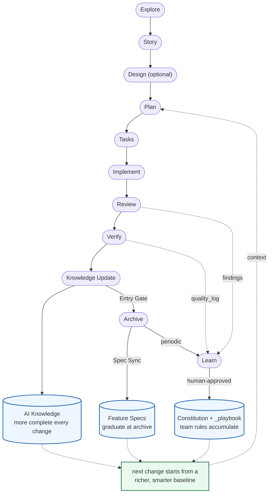

# Prospec

<div align="center">

[](LICENSE)
[](https://www.typescriptlang.org/)
[](tests/)
[](https://nodejs.org/)
[](https://pnpm.io/)

**Progressive Spec-Driven Development CLI**

*Empower AI agents with structured workflows for brownfield and greenfield projects*

[繁體中文](./README.zh-TW.md) • [Quickstart](#quickstart) • [Why Prospec?](#why-prospec) • [How it works](#how-it-works)

</div>

---

> **Note:** This project is a fork of [ci-yang/prospec](https://github.com/ci-yang/prospec).

## What is Prospec?

Prospec is a **Skills-driven Spec-Driven Development (SDD) toolkit** for AI coding agents. You drive day-to-day work through slash-command **Skills inside your agent** (Claude Code, Antigravity, Copilot, Codex); a thin **CLI** only bootstraps the project and regenerates Skills/Knowledge. The payoff: your agent follows a consistent `story → plan → tasks → implement → review → verify → archive` workflow, grounded in structured, version-controlled project knowledge.

Three pieces work together:

```
  You ⇄ AI agent
     │
     ├─ Skills .......... run the workflow:  story → plan → tasks →
     │                    implement → review → verify → archive
     │                        ▲
     │                        │ read & grow
     ├─ AI Knowledge .... structured project memory (modules, specs, lessons)
     │                        ▲
     │                        │ generated / regenerated by
     └─ CLI (prospec) ... bootstrap only:  init, agent sync, knowledge init
```

- **Skills** run the workflow inside your agent — the day-to-day surface.
- **AI Knowledge** is progressive project memory the Skills read and grow with each change.
- **CLI** is a one-time/occasional tool: it scaffolds the project and regenerates Skills + Knowledge — it is *not* in the runtime loop.

**Who is it for?** Developers using an AI coding agent who want repeatable, reviewable workflows on a new project (greenfield) or an existing codebase (brownfield).

## Why Prospec?

| Challenge | How Prospec helps |
|-----------|-------------------|
| AI doesn't know your codebase | `prospec knowledge init` + `/prospec-knowledge-generate` auto-scan and generate AI-readable docs |
| Context window limits | Progressive disclosure: load a summary first, details on-demand (70%+ token saving vs full-dump) |
| Inconsistent AI workflows | Structured Skills enforce `story → plan → tasks → implement → review → verify → archive` |
| Vendor lock-in | Works with 4+ AI CLIs; knowledge stored as universal Markdown |
| No design-to-code bridge | `/prospec-design` generates visual + interaction specs with MCP tool integration |
| Knowledge becomes stale | Archive's Entry Gate enforces a Knowledge Update every change |
| Verify passes but subtle bugs ship | `/prospec-review` — independent adversarial review between implement and verify |
| Lessons don't persist across sessions | `/prospec-learn` — recurring fixes promote (human-gated) into versioned team rules |

> Each row maps to a Skill or command below — see [AI Skills](#ai-skills) and [CLI Commands](#cli-commands).

---

## Quickstart

From zero to your first AI-driven change in about five minutes.

### Prerequisites

- **Node.js** >= 22.13.0
- An **AI CLI** (one or more): [Claude Code](https://docs.anthropic.com/claude/docs/claude-code) (recommended), [Antigravity CLI](https://antigravity.google/), [GitHub Copilot CLI](https://docs.github.com/copilot/github-copilot-in-the-cli), or [Codex CLI](https://developers.openai.com/codex/cli)

### 1. Install

Prospec is a **bootstrap/update CLI** — once `init` + `agent sync` have run, your agent works from the committed Skills and Knowledge (Markdown); the binary isn't needed again until you regenerate. So install it once, globally.

```bash
npm install -g github:benwu95/prospec     # or: pnpm add -g github:benwu95/prospec
prospec --help                            # verify
```

<details>
<summary>Other install options (npx, or pin per-project)</summary>

Prospec is an unpublished fork — npm/pnpm clones the repo, installs dev deps, and builds it via the `prepare` script.

Run on demand with npx (clones + builds each time):

```bash
npx github:benwu95/prospec init
npx github:benwu95/prospec agent sync
```

Pin the version per-project so re-running `agent sync` regenerates identical Skills across contributors — install as a devDependency:

```bash
npm install -D github:benwu95/prospec     # or: pnpm add -D github:benwu95/prospec
```

</details>

### 2. Bootstrap your project

```bash
cd my-project                 # a new or existing project
prospec init                  # → select AI assistants, choose doc language; creates .prospec.yaml + structure
prospec agent sync            # → generates per-agent config + Skills
```

`agent sync` writes **Claude Code** → `CLAUDE.md` + `.claude/skills/`; **Antigravity / Codex / Copilot** → `AGENTS.md` + `.agents/skills/`.

### 3. Run your first change (inside your AI agent)

```bash
/prospec-ff add-my-feature    # generate story → plan → tasks in one pass
/prospec-implement            # implement task-by-task (no commit yet)
/prospec-review               # adversarial review → fix loop
/prospec-verify               # validate; prompts you to commit at grade S/A
/prospec-archive              # archive + sync specs & knowledge
```

That's the full SDD loop. On an **existing codebase**, generate AI Knowledge first (`prospec knowledge init` → `/prospec-knowledge-generate`) so the agent understands your modules — the full walkthroughs are below.

<details>
<summary>Full greenfield &amp; brownfield walkthroughs</summary>

**Greenfield (new projects):**

```bash
# 1. Initialize project
mkdir my-project && cd my-project
prospec init --name my-project
# → Select AI assistants (interactive checkbox)
# → Choose the primary language for AI-generated documents (default: English,
#   or pass --language "Traditional Chinese (Taiwan)"); a [MUST] Language
#   Policy rule is seeded into CONSTITUTION.md — code and git commit
#   messages stay in English
# → Creates .prospec.yaml + directory structure

# 2. Sync AI agent config + generate Skills
prospec agent sync
# → Generates per-agent config + Skills for each selected assistant
#   Claude Code → CLAUDE.md + .claude/skills/; Antigravity / Codex / Copilot → AGENTS.md + .agents/skills/
# → Non-English language? Add native trigger words under `skill_triggers` in
#   .prospec.yaml (ask your AI agent to translate the English baselines), then
#   re-run agent sync — skills then match requests phrased in your language

# 3. Start developing with Skills (in your AI agent)
/prospec-new-story        # Create change story
/prospec-design           # Generate UI specs (optional)
/prospec-plan             # Generate implementation plan
/prospec-tasks            # Break down tasks
/prospec-implement        # Implement task-by-task (no commit yet)
/prospec-review           # Adversarial review → fix loop (critical-only auto-fix)
/prospec-verify           # Validate implementation; prompts you to commit at grade S/A
/prospec-archive          # Archive and sync specs
/prospec-learn            # (periodic) promote recurring lessons → team rules

# Or fast-forward
/prospec-ff               # Generate story → plan → tasks in one go
```

**Brownfield (existing projects):**

```bash
# 1. Initialize in existing project
cd existing-project
prospec init
# → Auto-detect tech stack
# → Select AI assistants
# → Choose the document language (default: English; --language to skip the prompt)

# 2. Sync AI config + generate Skills
prospec agent sync

# 3. Scan project and generate raw data
prospec knowledge init
# → Generates raw-scan.md + empty skeleton (_index.md, _conventions.md)

# 4. AI-driven module analysis (in your AI agent)
/prospec-knowledge-generate
# → AI reads raw-scan.md, decides module partitioning
# → Creates modules/*/README.md + fills _index.md

# 5. Develop with Skills
/prospec-explore          # Explore and clarify requirements
/prospec-ff add-feature   # Fast-forward to generate all artifacts
/prospec-implement        # Start coding (no commit yet)
/prospec-review           # Adversarial review → fix loop
/prospec-verify           # Validate against specs; prompts you to commit at grade S/A
/prospec-archive          # Archive + sync Feature Specs
```

</details>

---

## How it works

Prospec runs one linear flow, wrapped in two feedback loops that make it **compound** rather than merely repeat.



Every **Archive** enriches **AI Knowledge** (more complete with each change), and recurring lessons — review findings, the cross-stage `quality_log`, session corrections — promote, **only with human approval**, into an accumulating body of team rules (`Constitution` + `_playbook`). So the next change doesn't start from scratch; it starts from a richer, smarter baseline.

The flow is also **scale-aware**: a user-confirmed `quick` change skips the Plan stage entirely (`story → tasks`), with archive-time backstops — see [Right-Sized Process](#right-sized-process-scale).

### Core principles

Prospec enforces 6 principles over the assets it injects into your project — the generated Skills, configs, and directory structure:

1. **Progressive Disclosure First** — never load all info at once; index → details
2. **Spec is Source of Truth** — changes documented in specs before code
3. **Zero Startup Cost for Brownfield** — no need to document the entire codebase upfront
4. **AI Agent Agnostic** — works with any AI CLI via Markdown adapters
5. **User Controls the Rules** — Constitution is user-defined, the tool enforces
6. **Language Policy** — AI-generated docs in the language you choose at `prospec init` (default: English); code, technical terms, and git commit messages always in English

---

## AI Skills

Prospec generates 13 Skills that guide AI through the full SDD lifecycle:

| Skill | Slash Command | Description |
|-------|---------------|-------------|
| **Explore** | `/prospec-explore` | Think partner for requirement clarification |
| **New Story** | `/prospec-new-story` | Create structured change story |
| **Design** | `/prospec-design` | Generate visual + interaction specs (Generate/Extract modes) |
| **Plan** | `/prospec-plan` | Generate implementation plan + delta-spec |
| **Tasks** | `/prospec-tasks` | Break down into executable tasks |
| **Fast-Forward** | `/prospec-ff` | Generate story → plan → tasks in one go |
| **Implement** | `/prospec-implement` | Implement tasks one-by-one with MCP-first design reading |
| **Review** | `/prospec-review` | Adversarial review → fix loop; verifier-confirmed criticals auto-fixed, spec-aware lens |
| **Verify** | `/prospec-verify` | 5+1 dimension audit with quality grade (S/A/B/C/D); prompts commit at S/A |
| **Archive** | `/prospec-archive` | Archive changes + Spec Sync + Knowledge sync Entry Gate |
| **Learn** | `/prospec-learn` | Feedback promotion: recurring lessons → team `_playbook` / Constitution (auditable, human-gated) |
| **Knowledge Generate** | `/prospec-knowledge-generate` | AI-driven module analysis and knowledge creation |
| **Knowledge Update** | `/prospec-knowledge-update` | Incremental knowledge update from delta-spec |

### Quality Gates & Self-Improvement

Beyond the linear flow, every workflow Skill carries built-in quality machinery:

- **Output Contract** — each Skill self-reports `Met N/M | Overall: PASS|WARN|FAIL` against objective criteria, so you don't hand-check artifacts.
- **Entry / Exit gates** — a Skill checks preconditions before running (Entry) and Constitution compliance after (Exit); WARN/FAIL records persist to a cross-stage `quality_log` so an earlier stage's concern surfaces at the next.
- **Skill instruction quality** — per-phase gate checklists (finer-grained than the skill-level Entry/Exit gates); a status-aware **next-step handoff** at the end of each linear-flow Skill (plan→tasks→implement→review→verify→archive) (`Run <next-step> now? (Y/n)` — your Y is the trigger, never a silent auto-run); new-session detection of in-progress changes to resume; `/prospec-implement` re-anchors `Progress X/Y | Goal | Next` after each task; and `/prospec-explore` / `/prospec-knowledge-generate` warn when the Constitution is still substantively empty (its gates would otherwise be no-ops).
- **Executable Constitution** — rules carry RFC-2119 severity (MUST→FAIL / SHOULD→WARN / MAY→advisory); `/prospec-verify` grades against them.
- **Deterministic drift gate** — `prospec check` machine-verifies spec ↔ code ↔ knowledge referential integrity with zero tokens; `/prospec-verify` consumes its report at dev time and the scaffolded CI workflow enforces it on every PR.
- **Adversarial review** — `/prospec-review` sits between implement and verify: an independent fresh-context reviewer audits the whole change diff; only verifier-confirmed, drop-in criticals are auto-fixed, the rest escalate to you. The **commit boundary** is *after* verify reaches grade S/A, so implement + review + verify fixes land in one atomic commit (prospec prompts; it never auto-commits).
- **Feedback promotion** — every **Archive** auto-harvests a change's recurring lessons into a **version-controlled** ledger (`_lessons-ledger.md`); `/prospec-learn` then scores them with an explicit reproducible rule (frequency + impact modules) and — only with explicit human approval — promotes them into the team `_playbook.md` or the Constitution.

### Right-Sized Process (Scale)

Not every change deserves the full ceremony. At story time, `/prospec-new-story` (or `/prospec-ff`) assesses complexity against explicit criteria and proposes a scale — **you confirm before it is written** to `metadata.yaml`:

| Scale | What changes |
|-------|--------------|
| `quick` | Slim proposal (single story, no FR/SC enumeration), **plan phase skipped entirely** (`story → tasks`), no module-README loading; review/verify report their delta-spec dimensions as `not-applicable` (never a fake PASS) |
| `standard` (default; absent on existing changes) | The current concise flow — plan ≤ 120 lines |
| `full` | Complete architecture analysis — expanded Technical Summary, per-entry-point Call Chains |

Two honest backstops keep `quick` from becoming a spec-drift hole: a change expected to touch spec-covered behavior is **vetoed out of quick** at assessment time, and the `/prospec-archive` Entry Gate re-checks the **actual diff** — spec impact blocks archiving until a minimal Spec Impact section is added, and the knowledge-sync gate derives affected modules from diff paths instead of the absent delta-spec. Engineering discipline is not scaled down: TDD, adversarial review, and Constitution audits run at every scale.

Tasks also carry a **kind** marker (`[M]` manual, `[V]` verification, unmarked = code): completion rates count code tasks only, so an unchecked "run this command manually" reminder never blocks or distorts a gate.

<details>
<summary>Cache-Stable Prefix Ordering (advanced internals)</summary>

Every skill's Startup Loading section is ordered **static-first** so provider prompt caches
(Anthropic explicit `cache_control`, OpenAI/Gemini automatic prefix caching) can reuse the
longest possible prefix across triggers. Each loading item carries one of two markers:

- **`[STABLE]`** — changes only on `agent sync` or governance edits: the skill's own
  `references/` format specs, the Constitution, `_conventions.md`. These load first.
- **`[DYNAMIC]`** — changes per knowledge update, per change, or per trigger: `_index.md`
  (first after the cache boundary), module READMEs, `_playbook.md`, Feature/Product Specs,
  and `.prospec/changes/` artifacts. These load last.

The classification criterion is **cross-request prefix stability**, not "is it generated":
the entry config's Available Skills list is per-project fixed (it changes only when the
skill set changes), so it is `[STABLE]`. Extension authors adding skills must follow the
same ordering — static loads before the boundary, dynamic after — or they break the cache
prefix for every trigger. What the harness measures is the **prospec assembly pipeline**
(its corpus assembles knowledge files, not the skill templates themselves) — see Token
Measurement below. The template-level reorder takes effect at the agent deployment layer,
outside the harness's observable scope (a deliberate exclusion): its benefit follows from
the providers' documented prefix-caching semantics, not from a direct before/after measurement.

</details>

---

## CLI Commands

### Infrastructure Commands

| Command | Description |
|---------|-------------|
| `prospec init [options]` | Initialize Prospec project structure (`--language` sets the AI-generated document language; default English) |
| `prospec knowledge init [--depth <n>]` | Scan project and generate raw-scan.md + skeleton |
| `prospec agent sync [--cli <name>]` | Sync AI agent configs + generate Skills (reads `skill_triggers` from .prospec.yaml for native-language trigger words) |

> **Agent config layout** — `agent sync` writes each detected agent's entry config + Skills:
> - **Claude Code** → `CLAUDE.md` + `.claude/skills/`
> - **Antigravity / Codex / GitHub Copilot** → `AGENTS.md` + `.agents/skills/` (the shared [agents.md](https://agents.md) open standard; written once even when several are enabled)
>
> Upgrading from an older Prospec? After re-syncing, remove the now-unused `GEMINI.md`, `.gemini/skills/`, `.codex/skills/`, `.github/copilot-instructions.md`, and `.github/instructions/`.

### Change Management Commands

| Command | Description |
|---------|-------------|
| `prospec change story <name>` | Create change story (scaffold) |
| `prospec change plan [--change <name>] [--force]` | Generate implementation plan (scaffold); refuses to overwrite an existing plan/delta-spec unless `--force` |
| `prospec change tasks [--change <name>] [--force]` | Break down tasks (scaffold); refuses to overwrite an existing tasks.md unless `--force` |

> **Note**: These commands scaffold empty change artifacts. The Skills (`/prospec-new-story`, `/prospec-ff`, …) now create `.prospec/changes/<name>/` and its files directly, so the workflow doesn't call them — they remain available for manual or scripted scaffolding.

<details>
<summary>Token Measurement — make the token-efficiency claim verifiable</summary>

| Command | Description |
|---------|-------------|
| `pnpm measure:tokens [-- --provider <p>] [-- --budget <usd>]` | Run the offline benchmark: assemble full-dump / naive-rag / prospec contexts from the live repo and record real provider API usage (requires an API key; default budget US$10 per provider) |
| `prospec measure [--report <path>]` | Display the measurement report (read-only — never calls an API, never burns tokens) |

The harness makes the token-efficiency claim verifiable instead of asserted: for each corpus task
(`tests/fixtures/token-corpus/`, version-controlled task **descriptions** only — contexts are assembled
at run time) it sends each assembled context twice (cold + warm) and reads the provider's real `usage`.

**Agent → measured provider** (copilot/codex have no public benchmark API; they are measured via their
model provider, not the agent harness itself):

| Agent | Provider API | Default model |
|-------|-------------|---------------|
| claude | Anthropic | `claude-haiku-4-5` |
| codex, copilot | OpenAI | `gpt-4.1-mini` |
| antigravity | Google | `gemini-2.5-flash` |

**How to read the numbers (honest boundaries):**

- The efficiency claim is **input-token cost vs the full-dump baseline**; the naive-rag baseline is
  always shown alongside, where the margin is smaller. Output tokens are unaffected and listed honestly.
- **warm\*** numbers are synthetic cache hits (two back-to-back calls); production hit rates depend on
  whether triggers land within the provider's cache TTL. Providers also enforce a minimum cacheable
  prefix (e.g. 4,096 tokens on `claude-haiku-4-5`) — a small prospec assembly below that floor honestly
  records a 0% hit rate even though the mechanism works at production context sizes.
- Cache discount structures differ per provider (Anthropic explicit `cache_control`, OpenAI/Gemini
  automatic prefix caching) — numbers are **comparable only within the same provider**, never across
  providers or repo snapshots (the report records the git commit it measured).
- No thresholds, no CI gating: the report informs humans; it does not pass or fail anything.
- Any "token saving" figure quoted in this project must come from this harness — estimates are not data.

</details>

<details>
<summary>Drift Check (CI gate) — deterministic spec ↔ code ↔ knowledge integrity</summary>

| Command | Description |
|---------|-------------|
| `prospec check [--json] [--strict]` | Deterministic, zero-LLM drift check across spec ↔ code ↔ knowledge: dangling REQ references, broken markdown links, module-map-driven import direction, knowledge freshness (git commit timestamps, WARN-only), and kind-aware task completion. `--json` writes machine-readable `prospec-report.json`; `--strict` exits 1 on any FAIL (warn/skipped never affect the exit code) |
| `prospec check --init-ci` | Scaffold a supply-chain-hardened GitHub Actions gate (`.github/workflows/prospec-check.yml`): SHA-pinned actions, least-privilege permissions, report artifact upload, and a sticky PR comment posted from a job that never checks out source |

Honesty rules: an unavailable source degrades the check to `skipped` with an explicit reason —
never a fake PASS — and semantic spec↔code consistency stays with `/prospec-review` (the report
permanently marks it `not-checked`). `/prospec-verify` consumes the same report at dev time, so
the developer and the CI gate always see the same facts, token-free.

</details>

<details>
<summary>MCP Server — read-only project-truth server (any MCP agent)</summary>

| Command | Description |
|---------|-------------|
| `prospec mcp serve [--cwd <path>]` | Start a **read-only** MCP server on stdio — any MCP-capable agent (even one without Prospec Skills installed) can query the project's architecture truth, spec truth, dependency direction, promoted playbook, and knowledge freshness. `--cwd` pins the project root so one agent can run several project servers regardless of where it was launched |

**Resources** (re-read from disk on every request — clients always see current file state):

| URI | Content |
|-----|---------|
| `knowledge://index` | AI Knowledge module index (`_index.md`) |
| `knowledge://module/{name}` | One module's Recipe-First README |
| `knowledge://module-map` | Module boundaries + `depends_on` (`module-map.yaml`) |
| `knowledge://playbook` | Human-approved team lessons (`_playbook.md`) |
| `knowledge://health` | Per-module staleness + coverage — same pure function as `prospec check` |
| `spec://feature/{name}` | Feature specs (REQ source of truth); archived specs are excluded by the same rule `prospec check` uses |

**Tools**: `search_modules` (which module owns a concept — normalized term-OR match over the curated
index columns, so `drift checker` finds `drift-checker`) and `get_dependency_direction` (may `from`
import `to`? — answered from module-map `depends_on`, or the Constitution chain when no map exists;
the answer states which source it used).

**Registering** — point your agent's MCP config at `prospec mcp serve --cwd <project-root>`. `--cwd`
pins the project so the server resolves its `.prospec.yaml` no matter where the agent was launched —
which also lets one agent register several projects at once. Assumes the recommended global install
(`prospec` on PATH).

Claude Code:

```bash
claude mcp add project-name -- prospec mcp serve --cwd /path/to/project
```

Other agents — the same command in the agent's JSON MCP config:

```json
{
  "mcpServers": {
    "project-name": {
      "command": "prospec",
      "args": ["mcp", "serve", "--cwd", "/path/to/project"]
    }
  }
}
```

To serve several projects from any directory, register one entry per project — each with a unique
name and its own `--cwd` (Claude Code: add `-s user` so it's available everywhere):

```bash
claude mcp add -s user prospec-a -- prospec mcp serve --cwd /path/to/A
claude mcp add -s user prospec-b -- prospec mcp serve --cwd /path/to/B
```

Pinned prospec as a devDependency rather than installed globally? Route through `npx`: prefix the
Claude Code command (`… -- npx prospec mcp serve --cwd /path/to/project`), or in JSON set
`"command": "npx"` with `"prospec"` as the first arg (`["prospec", "mcp", "serve", "--cwd", "/path/to/project"]`).

Honest boundaries: the server is read-only (no tool or resource can modify files), serves one project
per process (the root given by `--cwd`), and is a pure add-on — no Skill or CLI command depends on it,
so everything works unchanged when it is not running. Transport is stdio only; HTTP/SSE is
deliberately not included in this version.

</details>

---

## Architecture

Prospec uses **Pragmatic Layered Architecture** for CLI development best practices:

```
src/
├── cli/          — Commander.js commands + formatters
├── services/     — Business logic (13 services)
├── lib/          — Pure utility functions (config, fs, logger, etc.)
├── types/        — Zod schemas + TypeScript types
└── templates/    — Handlebars templates (51 .hbs files)
    └── skills/   — 13 Skill templates + 18 reference templates
```

### Tech Stack

- **CLI Framework**: Commander.js 14 + @inquirer/prompts 8
- **Validation**: Zod 4
- **Templating**: Handlebars 4.7
- **File Scanning**: fast-glob 3.3
- **YAML**: eemeli/yaml 2.x (preserves comments)
- **Testing**: Vitest 4.0 + memfs
- **TypeScript**: 5.9

---

## Testing

```bash
# Run all tests (1039 tests)
pnpm test

# Watch mode
pnpm run test:watch

# Type check
pnpm run typecheck

# Lint
pnpm run lint

# End-to-end check: build, run `init` + `agent sync` in a throwaway
# project, and assert the generated Skills / system md are well-formed
pnpm run verify:skills
```

**Test Coverage**: 1039 tests across 4 categories:
- Unit tests (types + lib + services + cli): 518 tests
- Contract tests (CLI output + Skill format): 469 tests
- Integration tests: 17 tests
- E2E tests: 35 tests

`verify:skills` complements the suite with a real `init` + `agent sync` run, asserting agent-specific reference paths, no dangling references, canonical convention docs, `base_dir`-relative spec paths, and Copilot inlining.

---

## Project Structure

<details>
<summary>Directory layout after running <code>prospec init</code></summary>

```
your-project/
├── .prospec.yaml              # Prospec config
├── CLAUDE.md                  # Claude Code config (Layer 0, <100 lines)
├── AGENTS.md                  # Antigravity / Codex / Copilot config (agents.md standard)
├── {base_dir}/
│   ├── CONSTITUTION.md        # Project rules (user-defined)
│   ├── specs/
│   │   ├── product.md         # Product Spec (PRD entry point)
│   │   └── features/          # Living Feature Specs (accumulated)
│   └── ai-knowledge/
│       ├── _index.md          # Module index (Markdown table)
│       ├── _conventions.md    # Project conventions
│       ├── _playbook.md       # Team lessons promoted by /prospec-learn (human-gated)
│       ├── _lessons-ledger.md # Accumulating lessons ledger, auto-fed at Archive (version-controlled)
│       ├── raw-scan.md        # Auto-generated project scan data
│       ├── module-map.yaml    # Module dependencies
│       └── modules/
│           └── {module}/
│               └── README.md  # Module-specific docs
├── .prospec/                  # Change management (not committed)
│   ├── changes/
│   │   └── {change-name}/
│   │       ├── proposal.md        # User Story + acceptance criteria
│   │       ├── design-spec.md     # Visual spec (optional, UI changes)
│   │       ├── interaction-spec.md # Interaction spec (optional)
│   │       ├── plan.md            # Implementation plan
│   │       ├── tasks.md           # Task breakdown (checkbox format)
│   │       ├── delta-spec.md      # Patch Spec (ADDED/MODIFIED/REMOVED)
│   │       └── metadata.yaml      # Change lifecycle metadata
│   └── archive/               # Archived completed changes
├── .claude/skills/            # Skills for Claude Code (one dir per skill)
│   ├── prospec-explore/
│   ├── prospec-new-story/
│   ├── prospec-design/
│   ├── prospec-plan/
│   ├── prospec-tasks/
│   ├── prospec-ff/
│   ├── prospec-implement/
│   ├── prospec-review/
│   ├── prospec-verify/
│   ├── prospec-archive/
│   ├── prospec-learn/
│   ├── prospec-knowledge-generate/
│   └── prospec-knowledge-update/
└── .agents/skills/            # Same skills, agents.md format (Antigravity / Codex / Copilot)
    └── prospec-*/
```

</details>

---

## Contributing

We welcome contributions! Please see [CONTRIBUTING.md](./CONTRIBUTING.md) for guidelines.

Development uses **pnpm** (Node 22.13+, pnpm 11+).

```bash
# Clone and install
git clone https://github.com/benwu95/prospec.git
cd prospec
pnpm install

# Run in dev mode
pnpm run dev

# Build
pnpm run build

# Test
pnpm test
```

<details>
<summary>Local install — test the <code>prospec</code> CLI globally</summary>

```bash
# First time: install deps, build, then register the bin globally
pnpm install && pnpm run build && pnpm add -g .

# After making changes, just rebuild — the global bin picks up the new dist/
pnpm run build

# Remove it when finished
pnpm uninstall -g prospec
```

> First-time global install needs `pnpm setup` run once (configures the global bin directory).
>
> The single lockfile is `pnpm-lock.yaml`; after changing dependencies run `pnpm install`
> and commit it. See [CONTRIBUTING.md](./CONTRIBUTING.md#dependency-management).

</details>

---

## License

MIT License - see [LICENSE](./LICENSE) for details.

## Acknowledgments

Prospec draws inspiration from:

- [OpenSpec](https://github.com/openspec-ai/openspec) — Delta Specs, Fast-Forward, Archive
- [Spec-Kit](https://github.com/anthropics/spec-kit) — Constitution validation
- [cc-sdd](https://github.com/kiro-ai/cc-sdd) — Steering analysis, template customization
- [BMAD](https://github.com/bmad-ai/bmad) — Analyst role (prospec-explore)

Prospec's unique contribution: **Skills-driven SDD with a thin CLI** — Skills run the workflow inside your AI agent; the CLI only bootstraps and regenerates. Plus **AI Knowledge as Context Engineering** — structured, versioned, progressive project memory for AI agents.

### See Also

`prospec-verify` and `prospec-review` adapt engineering heuristics (failure-recovery triage, and security / performance / maintainability lens criteria) from [addyosmani/agent-skills](https://github.com/addyosmani/agent-skills) (MIT) — vendored into prospec's own self-contained reference templates, so **no plugin install is required** for prospec to work. If you want the fuller standalone treatment, that plugin is worth a look as optional further reading: marketplace `addy-agent-skills`, plugin `agent-skills` (invocable as `agent-skills:*`). Attribution: see [THIRD-PARTY-NOTICES](./THIRD-PARTY-NOTICES).

## Links

- [AI Knowledge Index](./prospec/ai-knowledge/_index.md)
- [Feature Specs](./prospec/specs/features/)

---

<div align="center">

**Made with care for the AI-powered development community**

[Back to top](#prospec)

</div>
