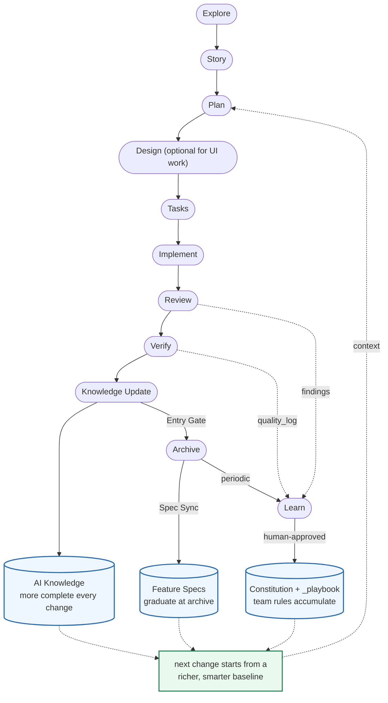
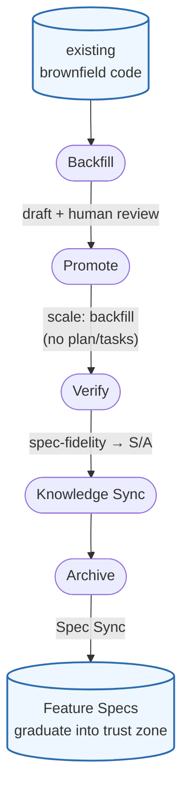

# Prospec

<div align="center">

[](LICENSE)
[](https://www.typescriptlang.org/)
[](tests/)
[](https://nodejs.org/)
[](https://pnpm.io/)

**Progressive Spec-Driven Development (SDD) toolkit for AI coding agents**

*Host-aware Skills · structured AI Knowledge · MCP server — for Claude Code, Copilot, Codex*

[繁體中文](./README.zh-TW.md) • [Quickstart](#quickstart) • [Why Prospec?](#why-prospec) • [How It Works](#how-it-works) • [AI Skills](#ai-skills) • [CLI Commands](#cli-commands)

**This project is a fork of [ci-yang/prospec](https://github.com/ci-yang/prospec)**

</div>

---

## Table of Contents

- [What is Prospec?](#what-is-prospec)
- [Why Prospec?](#why-prospec)
- [What's new in 2.0](#whats-new-in-20)
  - [Upgrade from 1.3](#upgrade-from-13)
- [Quickstart](#quickstart)
  - [Prerequisites](#prerequisites)
  - [1. Install](#1-install)
  - [2. Bootstrap your project](#2-bootstrap-your-project)
  - [3. Run Your First Change](#3-run-your-first-change-inside-your-ai-agent)
- [How It Works](#how-it-works)
  - [Skill ↔ CLI Cooperation Model](#skill--cli-cooperation-model)
  - [What is enforced, and by what](#what-is-enforced-and-by-what)
  - [Core Principles](#core-principles)
- [AI Skills](#ai-skills)
  - [Available Skills Inventory](#ai-skills)
  - [Quality Gates & Self-Improvement](#quality-gates--self-improvement)
  - [Right-Sized Process (Scale)](#right-sized-process-scale)
- [CLI Commands](#cli-commands) — full detail in [CLI Reference](./reference/cli-reference.md)
- [Configuration](#configuration) — the keys you tune, in [CLI Reference](./reference/cli-reference.md#configuration)
- [Advanced Workflows](#advanced-workflows)
  - [Backfill: Bringing Brownfield Code into the Trust Zone](#backfill-bringing-brownfield-code-into-the-trust-zone)
  - [Upgrading Prospec](#upgrading-prospec)
- [Architecture & Development](#architecture)
  - [System Architecture](#architecture)
  - [Testing](#testing)
  - [Contributing](#contributing)
- [License & Acknowledgements](#license)

---

## What is Prospec?

Prospec is a **CLI-first Spec-Driven Development (SDD) toolkit** for AI coding agents. You drive day-to-day work through host-aware **Skills inside your agent** (Claude Code, Antigravity, Copilot, Codex); every **deterministic operation** they perform — scaffolding, status transitions, quality-log writes, spec sync, grading — runs in the **`prospec` CLI** (a required standalone executable), so the same repo state always produces the same bytes. Skills keep the judgment: interviews, prose, reviews, verdicts. Your agent then follows one consistent `story → plan → design → tasks → implement → review → verify → knowledge-update → archive` workflow, grounded in structured, version-controlled project knowledge, with the nondeterministic parts kept out of the bookkeeping. Design is conditional on UI scope; the scale-aware exceptions are called out below.

Three pieces work together:

```
  You ⇄ AI agent
     │
     ├─ Skills .......... run the workflow:  story → plan → design → tasks →
     │                    implement → review → verify → knowledge-update → archive
     │                        ▲
     │                        │ read & grow
     ├─ AI Knowledge .... structured project memory (modules, specs, lessons)
     │                        ▲
     │                        │ generated / regenerated by
     └─ CLI (prospec) ... executes every deterministic step:  scaffolds, status
                          transitions, quality-log writes, drift checks, grading, spec sync
```

- **Skills** run the workflow's JUDGMENT inside your agent — interviews, prose, reviews, verdicts — the day-to-day surface.
- **AI Knowledge** is progressive project memory the Skills read and grow with each change.
- **CLI** is a required standalone executable IN the runtime loop: every deterministic operation the Skills need — bootstrap, scaffolds, lifecycle transitions, structured records, drift checks, grading, archive sync — runs as code, byte-reproducibly.

**Who is it for?** Developers using an AI coding agent who want repeatable, reviewable workflows on a new project (greenfield) or an existing codebase (brownfield).

## Why Prospec?

| Challenge | How Prospec helps |
|-----------|-------------------|
| AI doesn't know your codebase | `prospec knowledge init` + `prospec-knowledge-generate` auto-scan and generate AI-readable docs |
| Context window limits | Progressive disclosure: load a summary first, details on demand; verify the impact on your own sessions with `prospec measure` |
| Inconsistent AI workflows | Structured Skills enforce `story → plan → design → tasks → implement → review → verify → knowledge-update → archive` with explicit conditional branches |
| Vendor lock-in | Works with 4+ AI CLIs; knowledge stored as universal Markdown |
| No design-to-code bridge | `prospec-design` generates visual + interaction specs with MCP tool integration |
| Knowledge becomes stale | The verify S/A commit prompt folds a Knowledge Update into the feature commit; the archive Entry Gate re-confirms it as a backstop |
| Verify passes but subtle bugs ship | `prospec-review` — independent adversarial review between implement and verify |
| Lessons don't persist across sessions | `prospec-learn` — recurring fixes promote (human-gated) into versioned team rules |

> Each row maps to a Skill or command below — see [AI Skills](#ai-skills) and [CLI Commands](#cli-commands).

---

## What's new in 2.0

Prospec 2.0 turns SDD from a guided sequence into a **gated, resumable pipeline**: Skills retain judgment, while the CLI owns state transitions, evidence, and spec landing.

| Capability | What changes in 2.0 |
|------------|---------------------|
| **Stronger planning** | Independent architecture and task verifiers check layering, blast radius, reuse, REQ traceability, task ordering, and TDD closure before implementation. Full-scale plans can compare multiple candidate architectures; standard plans must state the simpler alternative. |
| **Gated, resumable execution** | `prospec status` routes the next station and names its entry gate. Station instructions are reloaded at every transition; state-changing commands refuse illegal transitions instead of relying on prose discipline. Design is conditional, Knowledge Update is a formal station, and quick/backfill routes remain explicit. A `verified` change whose latest grade is B/C/D is routed back to verify, and a plan or tasks station whose recorded verifier result is FAIL is routed back to itself. Archive and verify gates are adjudicated per change: a sibling change's missing evidence never blocks the target (the shared whole-tree evidence digest still does). |
| **Self-correcting quality** | Drift can draft a bounded follow-up, review uses fresh-context verifier loops and circuit breakers, Verify records judgment provenance, and Archive checks requirement landing fidelity before the trust zone changes. Recurring corrections can graduate through the human-approved learning pipeline. |

### Upgrade from 1.3

Upgrade an existing 1.3 project in this order:

1. Update the standalone binary (or your pinned GitHub devDependency) to 2.0.
2. Run `prospec upgrade` in the project. The CLI records the installed version, re-syncs agent assets, refreshes the deterministic scan, creates only missing init docs, and reports format/trigger gaps.
3. Invoke the bare `prospec-upgrade` Skill using your host's syntax. Review and approve each proposed curated-document migration; authored content is not silently overwritten.
4. Review these behavior boundaries before resuming work:
   - Explicit Skill syntax is host-specific (`/` for Claude Code and Copilot, `$` for Codex, bare name/browser selection for Antigravity); shared prose and automation use the bare `prospec-<name>` identity.
   - Lifecycle commands enforce more entry gates and may refuse shortcuts that 1.3 accepted. Use `prospec status` as the resume point instead of editing lifecycle metadata by hand.
   - The standard post-Verify path is now `verify → knowledge-update → archive`; Knowledge changes join the same feature commit, while Feature Specs still graduate at Archive.
   - The L1 Knowledge entry point is `{base_dir}/index.md`. If a project still relies only on legacy `ai-knowledge/_index.md`, preserve its authored content in the root index before removing the orphaned file; the retired compatibility branch no longer performs that relocation.
5. Run `prospec status` and `prospec check --strict`, resolve newly enforced failures, then continue from the station reported by the CLI.

The major version signals **workflow-contract changes**, not a forced rewrite of your product code or existing Markdown specs. The upgrade path preserves current project choices and asks before judgment-based document edits; stricter refusals and host invocation syntax are the compatibility boundaries to plan for.

For the complete two-pass command behavior, see [Upgrading Prospec](#upgrading-prospec).

---

## Quickstart

From zero to your first AI-driven change in about five minutes.

### Prerequisites

- An **AI CLI** (one or more): [Claude Code](https://docs.anthropic.com/claude/docs/claude-code) (recommended), [Codex CLI](https://developers.openai.com/codex/cli), [GitHub Copilot CLI](https://docs.github.com/copilot/github-copilot-in-the-cli), or [Antigravity CLI](https://antigravity.google/)
- **Node.js** >= 22.13.0 (**not required** if using Option A Standalone Binary; only needed when using npm/pnpm/npx or developing from source)

### 1. Install

The `prospec` CLI is the **essential deterministic engine** driving the SDD workflow runtime loop. Skills running inside your AI Agent (e.g. `prospec-new-story`, `prospec-plan`, `prospec-verify`, `prospec-archive`) automatically invoke `prospec` commands under the hood for scaffolding, lifecycle status transitions, quality_log recording, drift validation, and Feature Spec synchronization.

Ensure the `prospec` executable is available on your system `PATH`:

**Option A: Standalone Binary (Recommended & No Node.js Required)**
For macOS and Linux, run the one-click installer script (installs to `~/.prospec/bin` and configures `PATH`):
```bash
curl -fsSL https://raw.githubusercontent.com/benwu95/prospec/main/install.sh | bash
```

For Windows, run the one-click PowerShell installer script:
```powershell
powershell -c "irm https://raw.githubusercontent.com/benwu95/prospec/main/install.ps1 | iex"
```

Both installers take the newest release by default. To pin a specific release, pass its tag (tags carry no `v` prefix) — as an argument on macOS/Linux, or via `PROSPEC_INSTALL_VERSION` when the script is piped into a shell that cannot forward arguments:
```bash
curl -fsSL https://raw.githubusercontent.com/benwu95/prospec/main/install.sh | bash -s -- 2.1.1
```
```powershell
$env:PROSPEC_INSTALL_VERSION = "2.1.1"
irm https://raw.githubusercontent.com/benwu95/prospec/main/install.ps1 | iex
```

Alternatively, download the precompiled binary manually from the [GitHub Releases](https://github.com/benwu95/prospec/releases) page and place it in your `PATH`:

- **Linux (x64)**: `prospec-linux-x64.tar.gz`
- **macOS (Apple Silicon)**: `prospec-macos-arm64.tar.gz`
- **macOS (Intel)**: `prospec-macos-x64.tar.gz`
- **Windows (x64)**: `prospec-windows-x64.zip`

**Option B: Pin as devDependency (Node.js projects)**
Install as a local project dependency:
```bash
npm install -D github:benwu95/prospec     # or: pnpm add -D github:benwu95/prospec
```

**Option C: Run on demand with npx (Node.js environments)**
Run one-off commands without global installation:
```bash
npx github:benwu95/prospec <command>
```

> [!WARNING]
> We **do not recommend** global installation via `npm install -g` because global compilation of an unpublished fork may fail depending on your local Node/build environment. Use **Option A Standalone Binary** instead.

### 2. Bootstrap your project

One command does the deterministic setup — it chains `init` + `agent sync`, skipping any step already done:

```bash
cd my-project                 # a new or existing project

prospec quickstart            # → select AI assistants, choose doc language; creates .prospec.yaml + per-agent config + Skills
```

`prospec quickstart` runs `agent sync`, which writes **Claude Code** → `CLAUDE.md` + `.claude/skills/`; **Antigravity / Codex / Copilot** → `AGENTS.md` + `.agents/skills/`. Then finish onboarding inside your AI agent:

```text
🤖 Run inside your AI Agent chat:
prospec-quickstart           # localize skill triggers, re-sync config, generate AI Knowledge
```

This one-time finisher is re-runnable and self-terminating; on an existing codebase it reads your modules into AI Knowledge so the agent understands them before your first change.

### Skill invocation

`prospec-<name>` is the canonical Skill identity. The spelling used to invoke a Skill manually belongs to the host, not to the Skill name:

| Host | Explicit invocation |
|------|---------------------|
| Claude Code | `/prospec-<name>` |
| Codex | `$prospec-<name>` |
| GitHub Copilot | `/prospec-<name>` |
| Antigravity | Mention the bare Skill name or select it from the Skills browser: `prospec-<name>` |

Use these forms only for explicit invocation. Skill descriptions and triggers still enable implicit discovery, so no workflow becomes manual-only.

### 3. Run your first change (inside your AI agent)

You don't have to remember the steps — **describe the change in plain language and the agent drives the gated SDD cascade**, pausing for scoping questions, a failed gate or circuit breaker, and final Tastemaker sign-off:

```text
🤖 Run inside your AI Agent chat:
You ▸ Ask prospec to add a dark-mode toggle

The agent picks up the request and runs prospec-ff:
  • asks a few scoping / acceptance questions — you answer in plain language
  • writes story → plan → tasks
  • as machine gates pass, continues autonomously:

  implement → review → verify → GRADE A
                           → knowledge update ✓
                           → Tastemaker sign-off (you inspect the diff + evidence)
                           → you approve the commit and archive ✓
```

In `prospec-ff` cascading mode, the next station starts automatically as machine gates pass. The cascade pauses only for clarification, a failed gate or circuit breaker, and final Tastemaker sign-off. At that boundary the agent presents the diff and evidence; it never commits, pushes, or archives without your explicit approval. Individual station Skills outside the cascade still end with a status-aware handoff, so you can drive the same flow one station at a time.

Prefer to drive each step yourself? Run them explicitly:

```text
🤖 Run inside your AI Agent chat:
prospec-explore                   # (optional) clarify the requirement first
prospec-new-story add-my-feature  # capture it as a structured story
prospec-plan                      # design the implementation (a `quick`-scale change skips this)
prospec-design                    # (optional after Plan) UI / interaction specs
prospec-tasks                     # break the plan into an ordered task checklist
#   ↑ collapse story → plan → tasks in one pass with: prospec-ff add-my-feature
prospec-implement                 # implement task-by-task (no commit yet)
prospec-review                    # adversarial review → fix loop
prospec-verify                    # validate; grade S/A opens the commit boundary
prospec-knowledge-update          # sync affected module Knowledge into the feature commit
prospec-archive                   # archive + graduate Feature Specs
prospec-learn                     # (periodic) promote recurring lessons → team rules
```

That's the full SDD loop. Because `prospec-quickstart` already seeded AI Knowledge, the agent starts from an understanding of your modules. The full greenfield &amp; brownfield walkthroughs below break down every step `prospec quickstart` automates.

<details>
<summary>Greenfield vs. brownfield bootstrap — what the two commands expand to</summary>

#### Greenfield (new projects)
`prospec quickstart` → `prospec-quickstart` is the whole bootstrap:

```bash
mkdir my-project && cd my-project
prospec quickstart --name my-project   # init + agent sync (interactive assistant + language selection)
# then, inside your AI agent:
prospec-quickstart                     # localize triggers · re-sync · generate AI Knowledge
```

Those two commands expand to:

```bash
# `prospec quickstart` runs:
prospec init --name my-project   # → select AI assistants (interactive checkbox)
                                 # → choose the doc language (default: English, or
                                 #   --language "Traditional Chinese (Taiwan)"); when it is
                                 #   non-English, also choose the trust-zone language
                                 #   (defaults to the same; --trust-zone-language skips the
                                 #   prompt). A [MUST] path-scoped Language Policy rule is
                                 #   seeded into CONSTITUTION.md from both; code and git
                                 #   commit messages stay in English
                                 # → creates .prospec.yaml + directory structure
prospec agent sync               # → per-agent config + Skills (Claude Code → CLAUDE.md +
                                 #   .claude/skills/; Antigravity / Codex / Copilot →
                                 #   AGENTS.md + .agents/skills/)

# `prospec-quickstart` then, inside your AI agent:
#   • non-English doc language? proposes native trigger words for `skill_triggers`
#     in .prospec.yaml and re-runs agent sync once you confirm — skills then match
#     requests phrased in your language
#   • prospec knowledge init → prospec-knowledge-generate (seeds AI Knowledge)
```

On a fresh repo, `prospec-knowledge-generate` produces a minimal Knowledge base that fills in as you ship changes. Then run your first change exactly as in step 3 above.

#### Brownfield (existing projects)
same two commands; `prospec-quickstart` reads your existing code into AI Knowledge:

```bash
cd existing-project
prospec quickstart                      # auto-detects tech stack; runs init + agent sync
# then, inside your AI agent:
prospec-quickstart                     # localize triggers · re-sync · knowledge init · prospec-knowledge-generate
```

Those two commands expand to:

```bash
# `prospec quickstart` runs:
prospec init          # → auto-detect tech stack; select AI assistants; choose doc
                      #   language (default: English; --language to skip the prompt) and,
                      #   if non-English, the trust-zone language (--trust-zone-language)
prospec agent sync    # → per-agent config + Skills

# `prospec-quickstart` then, inside your AI agent:
prospec knowledge init       # → generates raw-scan.md + empty skeletons (prospec/index.md, _conventions.md, module-map.yaml)
prospec-knowledge-generate  # → AI reads raw-scan.md, decides module partitioning,
                             #   creates modules/*/README.md + fills prospec/index.md
```

Here `knowledge init` reads your existing code, so `prospec-knowledge-generate` produces a rich Knowledge base up front. Then run your first change exactly as in step 3 above — the develop loop is identical to greenfield.

`knowledge init` captures *how* your code is structured, but brownfield modules usually still lack a Feature Spec describing *what* they do. Closing that WHAT-layer gap is its own first-class flow — see **[Backfill: bringing brownfield code into the trust zone](#backfill-bringing-brownfield-code-into-the-trust-zone)** below. It is not part of bootstrap, so run it whenever you choose.

</details>

> The full generated tree — every directory `prospec quickstart` and `prospec-quickstart` create —
> is in [CLI Reference — Generated project layout](./reference/cli-reference.md#generated-project-layout).

---

## How it works

Prospec runs one linear flow, wrapped in two feedback loops that make it **compound** rather than merely repeat.


```mermaid
flowchart TD
    E([Explore]) --> S([Story]) --> P([Plan]) --> D(["Design (optional for UI work)"]) --> T([Tasks]) --> I([Implement]) --> R([Review]) --> V([Verify]) --> KU([Knowledge Update]) -- Entry Gate --> A([Archive]) -- periodic --> L([Learn])

    V -. quality_log .-> L
    R -. findings .-> L
    L -- human-approved --> RULES[("Constitution + _playbook<br/>team rules accumulate")]

    KU --> AK[("AI Knowledge<br/>more complete every change")]
    A -- Spec Sync --> FS[("Feature Specs<br/>graduate at archive")]

    AK -.-> NEXT["next change starts from a<br/>richer, smarter baseline"]
    FS -.-> NEXT
    RULES -.-> NEXT
    NEXT -. context .-> P

    classDef asset fill:#eef7ff,stroke:#2b6cb0,stroke-width:2px;
    classDef gain fill:#e9f9ee,stroke:#2f855a,stroke-width:2px;
    class AK,FS,RULES asset;
    class NEXT gain;
```

Every **Archive** enriches **AI Knowledge** (more complete with each change), and recurring lessons — review findings, the cross-stage `quality_log`, session corrections — promote, **only with human approval**, into an accumulating body of team rules (`Constitution` + `_playbook`). So the next change doesn't start from scratch; it starts from a richer, smarter baseline.

The diagram shows the standard path. It is also **scale-aware**: Design runs only when UI scope is `full` or `partial`; a user-confirmed `quick` change skips Plan entirely (`story → tasks`); and brownfield backfill enters through `prospec-promote-backfill` before Verify rather than replaying the standard planning path. Archive-time gates remain the backstop — see [Right-Sized Process](#right-sized-process-scale) and [Backfill](#backfill-bringing-brownfield-code-into-the-trust-zone).

### Skill ↔ CLI Cooperation Model

Prospec includes a feature-rich CLI with 17+ top-level commands, but **developers rarely execute CLI commands directly**. Day-to-day SDD work is driven through host-aware **Skills** inside your AI Agent interface (`prospec-ff`, `prospec-implement`, `prospec-verify`, etc.).

The interaction between Skills and CLI follows a clear division of labor:

- **Skills (The Judgment Layer in AI Agent)**: Run inside your LLM context. They handle nondeterministic human/AI tasks — interviewing requirements, writing architectural prose, running adversarial reviews, evaluating WCAG/design guidelines, and assigning quality grades.
- **CLI (`prospec` - The Deterministic Execution Layer)**: Called by Skills under the hood via background subshell probes (`_cli-probe`). The CLI handles all byte-reproducible state mutations — creating change scaffolds, validating YAML metadata, updating lifecycle status transitions, recording structured quality logs, calculating drift reports, running mechanical spec sync, and archiving completed changes.

```
  User ⇄ AI Agent (Skills)
         │
         │  (1) Asks questions & guides SDD workflow
         │  (2) Executes high-level judgment (prose, review, code)
         ▼
  Skill Execution Loop
         │
         │  Under the hood: Skills call `prospec <command>`
         ▼
  `prospec` CLI (Deterministic Engine)
         │
         ├── Scaffolding (story / plan / tasks)
         ├── Lifecycle & Metadata (status / scale / progress)
         ├── Deterministic Audits & Grading (check / verify record / review merge)
         └── Knowledge & Spec Sync (archive / knowledge update / learn upsert)
```

**Why this separation matters:**
Delegating bookkeeping and state transitions to the CLI keeps LLM formatting errors (malformed YAML/JSON, broken frontmatter) out of the artifacts, makes state checks cost no model tokens, and makes the same repository state produce identical, byte-reproducible output.

### What is enforced, and by what

Three different things back the workflow's promises, and they are not interchangeable:

- **CLI-enforced (deterministic)** — artifact schemas, lifecycle transitions, gate refusals, drift
  checks, grade computation and spec landing. Same repo state, same bytes; gates are adjudicated
  per change, so a sibling change's missing evidence never blocks the target.
- **Skill-directed (procedural)** — the station gates, receipt requirements and stop conditions the
  Skills instruct an agent to follow. They bind an agent that follows its instructions; only the
  CLI's own refusals bind one that does not.
- **Model judgment (bounded)** — REQ intent versus code (verify 2/5), the adversarial review search,
  design consistency, and a `quick` change's Knowledge-impact review, whose spec impact is judged
  against the actual diff because that scale has no delta-spec. Quality here follows the tier you
  route to. Prospec measures that rather than assuming it — the bounded, fixed-scenario evaluation
  and its recorded limits live in [`scripts/workflow-eval/README.md`](scripts/workflow-eval/README.md)
  — so read a passing gate as evidence about that run, not as a reliability claim about models.

### Core principles

Prospec enforces 6 principles over the assets it injects into your project — the generated Skills, configs, and directory structure:

1. **Progressive Disclosure First** — never load all info at once; index → details
2. **Spec is Source of Truth** — changes documented in specs before code
3. **Zero Startup Cost for Brownfield** — no need to document the entire codebase upfront
4. **AI Agent Agnostic** — works with any AI CLI via Markdown adapters
5. **User Controls the Rules** — the Constitution is user-defined; the CLI lists its rules and severities mechanically, and verify's audit grades the change against them
6. **Language Policy** — change artifacts in the language you choose at `prospec init` (default: English); the trust zone (AI Knowledge base, Feature Specs, Constitution) in the language `trust_zone_language` sets (default: English); code, technical terms, and git commit messages always in English

---

## AI Skills

Prospec generates 17 Skills — 15 guide AI through the full SDD lifecycle, plus two periodic finishers: `prospec-quickstart` (onboarding) and `prospec-upgrade` (version upgrade):

| Skill | Canonical Skill | Description |
|-------|---------------|-------------|
| **Explore** | `prospec-explore` | Think partner for requirement clarification |
| **New Story** | `prospec-new-story` | Create structured change story |
| **Design** | `prospec-design` | Generate visual + interaction specs (Generate/Extract modes) |
| **Plan** | `prospec-plan` | Generate implementation plan + delta-spec |
| **Tasks** | `prospec-tasks` | Break down into executable tasks |
| **Fast-Forward** | `prospec-ff` | Generate story → plan → tasks in one go |
| **Implement** | `prospec-implement` | Implement tasks one-by-one with MCP-first design reading |
| **Review** | `prospec-review` | Adversarial review → fix loop; verifier-confirmed criticals auto-fixed, spec-aware lens |
| **Verify** | `prospec-verify` | 5+1 dimension audit with quality grade (S/A/B/C/D); prompts commit at S/A |
| **Archive** | `prospec-archive` | Archive changes + Spec Sync + Knowledge sync Entry Gate |
| **Learn** | `prospec-learn` | Feedback promotion: recurring lessons → team `_playbook` / Constitution (auditable, human-gated) |
| **Knowledge Generate** | `prospec-knowledge-generate` | AI-driven module analysis and knowledge creation |
| **Knowledge Update** | `prospec-knowledge-update` | Incremental knowledge update from delta-spec |
| **Backfill Spec** | `prospec-backfill-spec` | Reverse-extract a Feature Spec draft from existing brownfield code (stages a draft, never writes the trust zone) |
| **Promote Backfill** | `prospec-promote-backfill` | Formalize a reviewed backfill draft into the backfill change scaffold (proposal + delta-spec + metadata, `scale: backfill`, `status: implemented`; a light scale — no plan/tasks); never writes the trust zone |
| **Quickstart** | `prospec-quickstart` | After `prospec quickstart` runs init + agent sync, localize skill triggers into your artifact language, prepare the Knowledge scan, and chain into `prospec-knowledge-generate` to seed AI Knowledge; never writes the trust zone |
| **Upgrade** | `prospec-upgrade` | After `prospec upgrade` records the version, re-syncs agents, and back-fills missing init docs, work through the report's docs inventory: migrate drifted init-doc formats + enrich the docs it created, and localize triggers for newly-added skills (fill-missing only) — each with confirmation + a diff/content preview; never overwrites your authored content |

> [!NOTE]
> **Periodic Finisher Skills**: `prospec-quickstart` (runs once after `prospec quickstart`) and `prospec-upgrade` (runs during version upgrades after `prospec upgrade`) finish the judgment steps the CLI cannot handle deterministically. Both deploy to disk as Skills but are excluded from the always-loaded entry config; each deployed `SKILL.md`'s name and description still loads per session, so the saving is the entry-config listing, not the skill metadata.

### Quality Gates & Self-Improvement

Beyond the linear flow, every workflow Skill carries built-in quality machinery:

- **Output Contract** — each Skill self-reports `Met N/M | Overall: PASS|WARN|FAIL` against objective criteria, so you don't hand-check artifacts.
- **Entry / Exit gates** — a Skill checks preconditions before running (Entry) and Constitution compliance after (Exit); WARN/FAIL records persist to a cross-stage `quality_log` so an earlier stage's concern surfaces at the next.
- **Skill instruction quality** — per-phase gate checklists (finer-grained than the skill-level Entry/Exit gates); outside the `prospec-ff` cascade, each linear-flow Skill (plan→tasks→implement→review→verify→archive) ends with a status-aware **next-step handoff**; new-session detection of in-progress changes to resume; `prospec-implement` re-anchors `Progress X/Y | Goal | Next` after each task; and `prospec-explore` / `prospec-knowledge-generate` warn when the Constitution is still substantively empty (its gates would otherwise be no-ops).
- **Executable Constitution** — rules carry RFC-2119 severity (MUST→FAIL / SHOULD→WARN / MAY→advisory); `prospec-verify` grades against them.
- **Deterministic drift gate** — `prospec check` machine-verifies spec ↔ code ↔ knowledge referential integrity with zero tokens; `prospec-verify` consumes its report at dev time and the scaffolded CI workflow enforces it on every PR. With an optional `feature-map.yaml` (feature→module index, bootstrapped at archive) it adds two governance checks: REQ-prefix legality (WARN) and the feature→module edge (FAIL).
- **Adversarial review** — `prospec-review` sits between implement and verify: an independent fresh-context reviewer audits the whole change diff; only verifier-confirmed, drop-in criticals are auto-fixed, the rest escalate to you. The **commit boundary** is *after* verify reaches grade S/A, so implement + review + verify fixes land in one atomic commit (prospec prompts; it never auto-commits).
- **Feedback promotion** — every **Archive** auto-harvests a change's recurring lessons into a **version-controlled** ledger (`_lessons-ledger.md`); `prospec-learn` then scores them with an explicit reproducible rule (frequency + impact modules) and — only with explicit human approval — promotes them into the team `_playbook.md` or the Constitution. Before each collection it **sweeps both files for entries the project has outgrown** — a rule some gate now enforces, one whose subject is gone, or one that contradicts the Constitution — and surfaces each with its evidence for human retirement; expiry retires in place (a ledger row keeps every counter, a playbook id is never reused), so the audit trail survives the cleanup.

### Right-Sized Process (Scale)

Not every change deserves the full ceremony. At story time, `prospec-new-story` (or `prospec-ff`) assesses complexity against explicit criteria and proposes a scale — **you confirm before it is written** to `metadata.yaml`:

| Scale | What changes |
|-------|--------------|
| `quick` | Slim proposal (single story, no FR/SC enumeration), **plan phase skipped entirely** (`story → tasks`), no module-README loading; review/verify report their delta-spec dimensions as `not-applicable` (never a fake PASS) |
| `standard` (default; absent on existing changes) | The current concise flow — plan ≤ 120 lines, closing with a required **Simpler Alternative** section (a materially simpler alternative or an explicit concession, plus a files/lines change-surface estimate) |
| `full` | Complete architecture analysis — expanded Technical Summary, per-entry-point Call Chains, Best-of-N candidate tournament (its recorded non-selected candidates stand in for Simpler Alternative) |

Two honest backstops keep `quick` from becoming a spec-drift hole: a change expected to touch spec-covered behavior is **vetoed out of quick** at assessment time, and the `prospec-archive` Entry Gate re-checks the **actual diff** — spec impact blocks archiving until a minimal Spec Impact section is added, and the knowledge-sync gate derives affected modules from diff paths instead of the absent delta-spec. Forward-change scales keep TDD, adversarial review, and Constitution audits; proven backfill has a separate fidelity contract where code review is optional.

Tasks also carry a **kind** marker (`[M]` manual, `[V]` verification, unmarked = code): completion rates count code tasks only, so an unchecked "run this command manually" reminder never blocks or distorts a gate.

<details>
<summary>Cache-Stable Prefix Ordering (advanced internals)</summary>

Every skill's Startup Loading section is ordered **static-first** so provider prompt caches
(Anthropic explicit `cache_control`, OpenAI/Gemini automatic prefix caching) can reuse the
longest possible prefix across triggers. Each loading item carries one of two markers:

- **`[STABLE]`** — changes only on `agent sync` or governance edits: startup-needed
  `references/` format specs, the Constitution, `_conventions.md`. These load first.
  (Phase-specific format specs in `ff` / `plan` / `archive` are instead read **per-phase
  on-demand** — off the stable prefix, so an early abort never pays for a later phase's format.)
- **`[DYNAMIC]`** — changes per knowledge update, per change, or per trigger: `prospec/index.md`
  (first after the cache boundary), module READMEs, `_playbook.md`, Feature/Product Specs,
  and `.prospec/changes/` artifacts. These load last.

The classification criterion is **cross-request prefix stability**, not "is it generated":
the entry config's Available Skills list is per-project fixed (it changes only when the
skill set changes), so it is `[STABLE]`. Extension authors adding skills must follow the
same ordering — static loads before the boundary, dynamic after — or they break the cache
prefix for every trigger. What the harness measures is the **prospec assembly pipeline**
(its corpus assembles knowledge files, not the skill templates themselves) — see
[Token Measurement](./reference/cli-reference.md#token-measurement). The template-level reorder takes effect at the agent deployment layer,
outside the harness's observable scope (a deliberate exclusion): its benefit follows from
the providers' documented prefix-caching semantics, not from a direct before/after measurement.

</details>

---

## CLI Commands

Prospec ships 17+ top-level commands, but **developers rarely run them directly** — day-to-day SDD
work goes through the Skills above, which call the CLI for every deterministic mutation. The full
per-command reference (flags, exit codes, output shapes, MCP server, drift check and token
measurement) lives in **[CLI Reference — CLI Commands](./reference/cli-reference.md#cli-commands)**.

The few command details a reader most often needs from here:

- **`prospec validate <kind> <file>`** — validates one artifact against its schema; `<kind>` is one of
  `slug`, `backfill-draft`, `promote-scaffold`, `design-spec`, `module-readme`.
- **`prospec change log --skill <skill> --verifier-report <file>`** — records a planning verifier's own
  report; a `FLAWS` verdict maps to `result: FAIL`. The gate is **per-change**: a sibling change's
  stale evidence never blocks this one. (`prospec status` is what prefixes its routing reason with a
  `[CODE]` marker.)
- **`prospec check --record-tests`** — records the suite run (`snapshot-v2` fingerprint over the
  `repository-inputs-v2` scope, `change-and-restore` detection) so verify 5/5 is a machine verdict.
- **CI gate** — `prospec check --strict` runs from `.github/workflows/prospec-check.yml`; the drift
  check's per-check contract, exit codes and JSON report shape are in the reference.

### MCP server

- **`prospec mcp serve [--cwd <path>]`** — starts a **read-only** MCP server on stdio, so any
  MCP-capable agent (even one with no Prospec Skills installed) can query the project's architecture
  truth, spec truth, dependency direction, promoted playbook and knowledge freshness. `--cwd` pins
  the project root, so one agent can serve several projects regardless of where it was launched.
- **Registering** — point the agent's MCP config at `prospec mcp serve --cwd <project-root>`:
  Claude Code `claude mcp add project-name -- prospec mcp serve --cwd /path/to/project`; Copilot and
  Codex take the same command in their own MCP config file. Per-agent config paths, multi-project
  setups and the `npx` form are in
  **[CLI Reference — MCP server](./reference/cli-reference.md#mcp-server)**.
- **`prospec config example`** — prints the complete annotated `.prospec.yaml` reference with example
  values, which is the fastest way to see a field's shape before setting it.
- **`prospec agent triggers [--write <file>]`** — prints a ready-to-translate `skill_triggers` + `skill_exclusions`
  scaffold, and writes it back with `--write`.

## Configuration

`.prospec.yaml` holds the project's language, agents, token budgets and test command. The keys you
are most likely to tune, with their shapes and defaults, are in
**[CLI Reference — Configuration](./reference/cli-reference.md#configuration)**; the schema in
`src/types/config.ts` is what actually validates the file.

## Advanced Workflows

### Customizing Module READMEs (Project Section Extensions)

By default, every module README follows the canonical Recipe-First structure (`## Key Files`, `## Public API`, `## Dependencies`, `## Modification Guide`, `## Pitfalls`, and optional `## Ripple Effects` / `## Sub-Modules`) inside its generated block (`prospec:auto-start` ... `prospec:auto-end`).

On the first non-blank line after the title's one-line summary — blank lines may separate the two — and above that block, sits a format marker: `<!-- prospec:module-readme-format 2026-09-01 -->`. It names the compatible grammar release the file conforms to, not the date the document was last edited: clarifications and registered optional extensions keep the same date, while an incompatible change to marker semantics or the core section grammar earns a new one. [`_module-readme-conventions.md`](prospec/ai-knowledge/_module-readme-conventions.md) is the authority for both the marker and the structure, and `prospec validate module-readme <module>` grades a README against them.

To add project-specific custom sections (e.g. `## Team Ownership`, `## Security Rules`), register them in [`prospec/ai-knowledge/_module-readme-conventions.md`](prospec/ai-knowledge/_module-readme-conventions.md) inside its `prospec:user` block under `## Project Section Extensions`. This Markdown table is the **single authority** for custom sections (do not define them in `.prospec.yaml`):

| ID | Heading | Content | Applies To | Required | MCP Visibility | Content Format |
| --- | --- | --- | --- | --- | --- | --- |
| team-ownership | Team Ownership | Who owns this module and how to reach them | all | optional | included | field-table |
| security-rules | Security Rules | Security controls enforced in this module | auth,services | required | included | markdown |

- **`Content`**: One-line description of the section's purpose — what it is for and what belongs in it, so an agent knows how to fill it.
- **`Applies To`**: `all` or a comma-separated list of module names.
- **`Required`**: `required` (enforced during validation) or `optional`.
- **`Content Format`**:
  - `field-table`: Strict 2-column key-value table (`| Field | Value |`).
  - `markdown`: Freeform Markdown text.

In the target module's `modules/{module}/README.md`, implement the section within `<!-- prospec:user-start -->` and `<!-- prospec:user-end -->`:

```markdown
<!-- prospec:user-start -->
<!-- prospec:section-start team-ownership -->
## Team Ownership

| Field | Value |
| --- | --- |
| Owner | Platform Team |
| Slack | #platform-eng |
<!-- prospec:section-end team-ownership -->
<!-- prospec:user-end -->
```

Validate conformity at any time:
```bash
prospec validate module-readme <module-name>
```

### Backfill: Bringing Brownfield Code into the Trust Zone

Brownfield projects accumulate behavior that no Feature Spec describes. **Backfill** is a first-class, two-skill path that reverse-extracts that behavior from the code and graduates it into the spec trust zone (`prospec/specs/features/`) — and it **never writes the trust zone by hand** (archive stays the sole writer).


```mermaid
flowchart TD
    CODE[("existing<br/>brownfield code")] --> BF([Backfill]) -- "draft + human review" --> PR([Promote]) -- "scale: backfill<br/>(no plan/tasks)" --> V([Verify]) -- "spec-fidelity → S/A" --> K([Knowledge Sync]) --> A([Archive])

    A -- Spec Sync --> FS[("Feature Specs<br/>graduate into trust zone")]

    classDef asset fill:#eef7ff,stroke:#2b6cb0,stroke-width:2px;
    class CODE,FS asset;
```

1. **Extract** — `prospec-backfill-spec` reads the code (and tests, git history, docs) and stages a route-compatible `backfill-draft.md`; intent it cannot infer from code is marked `[NEEDS CLARIFICATION]`, never fabricated.
2. **Review** — resolve every `[NEEDS CLARIFICATION]` (the *So that* value, target role, ambiguous AC) and confirm the candidate feature slug. This is the human gate.
3. **Promote** — `prospec-promote-backfill` turns the reviewed draft into the change scaffold (proposal + delta-spec + metadata) marked `scale: backfill`, `status: implemented`. `backfill` is a **light scale** like `quick` — no hollow `plan.md`/`tasks.md`, because the code already exists.
4. **Verify** — `prospec-verify` grades **spec-fidelity** (each REQ's `file:line` must resolve), records pre-existing code-quality gaps (e.g. untested brownfield code) as informational tech debt, and only applies that relaxation when a `backfill-draft.md` proves provenance — so a faithful draft reaches S/A instead of being blocked by debt it merely documents, and the marker can't bypass quality gates for new code. By contract, code review is optional for proven backfill.
5. **Knowledge Sync** — update only the module READMEs named in `metadata.related_modules`, then stamp them with `prospec knowledge verify`; do not run REQ-prefix-driven `prospec-knowledge-update` for feature-slug REQ IDs.
6. **Archive** — `prospec-archive` graduates the requirements into `prospec/specs/features/{slug}.md`. That is the only step that writes the trust zone.

### Upgrading Prospec

When a new prospec version is available, update the binary first:

```bash
# If using standalone binary (recommended): re-run the install script
curl -fsSL https://raw.githubusercontent.com/benwu95/prospec/main/install.sh | bash

# If pinned as a project devDependency:
npm install -D github:benwu95/prospec     # or: pnpm add -D github:benwu95/prospec
```

Then upgrade existing projects in two seamless steps — a deterministic CLI pass followed by a consent-gated AI migration pass:

```bash
prospec upgrade                  # Step 1: CLI (zero-LLM) syncs infrastructure and audits docs inventory
```

```text
🤖 Run inside your AI Agent chat:
prospec-upgrade                 # Step 2: AI agent migrates drifted doc formats, enriches scaffolds, and localizes triggers (asks per change)
```

#### Step 1: `prospec upgrade` (CLI Deterministic Pass)
- **Version Tracking**: Merges the running prospec version into `.prospec.yaml` `version` in place, preserving existing comments and formatting.
- **Agent & Template Sync**: Re-runs `agent sync` to align all agent configurations and Skills with latest bundled templates.
- **Scanner Refresh**: Regenerates `ai-knowledge/raw-scan.md` using the updated scanner logic.
- **Backfill Missing Docs**: Creates newly introduced init files using baseline templates (skip-if-exists; never overwrites or mutates existing files).
- **Migration Report**: Outputs version deltas, a docs inventory listing present/missing files, and any skill trigger gaps.

#### Step 2: `prospec-upgrade` (AI Agent Judgment Pass)
- **Format Migration**: Compares existing files against the latest templates and proposes formatting upgrades, **asking for explicit confirmation per file** (never overwrites authored prose).
- **Scaffold Enrichment**: Populates newly backfilled baseline docs with real project context (e.g. `index.md` module table).
- **Trigger Localization**: Localizes missing trigger phrases for newly added skills into the project's configured `artifact_language`.
- **Final Sync**: Re-runs `agent sync` so all changes immediately take effect across all configured agents.

> [!TIP]
> - **Legacy File Cleanup**: If upgrading from an older pre-1.0 Prospec layout, remove the now-unused legacy files and directories after re-syncing: `GEMINI.md`, `.gemini/skills/`, `.codex/skills/`, `.github/copilot-instructions.md`, and `.github/instructions/`.
> - **Configuration Version & Triggers**: `.prospec.yaml` `version` tracks the prospec version the project last upgraded to. If you ever need to localize triggers after adding a skill, simply run `prospec agent sync` — it explicitly reports missing `skill_triggers` entries so you fill only the gaps.

---

## Architecture

Prospec uses **Pragmatic Layered Architecture** (`cli → services → lib → types`, with Handlebars
templates alongside). The layer-by-layer breakdown and the tech-stack list are in
**[CLI Reference — Architecture](./reference/cli-reference.md#architecture)**.

## Testing

```bash
# Run all tests (5186 total; 4 skipped)
pnpm test

# Watch mode
pnpm run test:watch

# Type check
pnpm run typecheck

# Lint
pnpm run lint
```

**Test Coverage**: 5186 total tests (5182 passed; 4 skipped) across 4 categories:
- Unit tests (types + lib + services + cli): 3731 tests
- Contract tests (CLI output + Skill format): 1243 tests
- Integration tests: 64 tests
- E2E tests: 148 tests

The suite includes a real `init` + `agent sync` generation contract (`tests/integration/skill-contract.test.ts`) asserting agent-specific reference paths, no dangling references, canonical convention docs, `base_dir`-relative spec paths, and `.agents` convergence.

**Keeping factual counts in sync** — the test totals and `.hbs` inventory quoted across the READMEs and `prospec/index.md` are machine-generated from a single source (vitest + the filesystem), not hand-edited:

```bash
# Rewrite every count in place to match the current suite/filesystem
pnpm counts

# Dry-run: report drift and exit 1 if any count is stale
pnpm counts:check
```

CI's `test` job runs the read-only form with `--from`, pointed at the JSON report `pnpm run test:coverage` writes in the step before it — so the gate costs no second suite run, and a stale count fails the PR. `--from` is read-only by construction: the rewrite mode refuses it, because nothing can tell a just-written report from yesterday's.

---

## Contributing

We welcome contributions! Please see [CONTRIBUTING.md](./CONTRIBUTING.md) for guidelines.

Development uses **pnpm** (Node 22.13+, pnpm 11+).

```bash
# Clone and install
git clone https://github.com/benwu95/prospec.git
cd prospec
pnpm install

# Run in dev mode (TypeScript watch build)
pnpm run dev

# Run local CLI directly without building (via tsx)
pnpm cli --help
pnpm cli status

# Build for production
pnpm run build

# Run unit & contract test suite
pnpm test

# Run quality checks & update factual counts in docs
pnpm typecheck
pnpm lint
pnpm counts          # Update factual counts in docs
pnpm counts:check    # Verify factual counts in docs are in sync
pnpm agents:check    # Verify generated artifacts (bundle + deployed skills) are current
pnpm knowledge:check # Verify each source-touched module bumped its last_verified
```

<details>
<summary>Local install — test the <code>prospec</code> CLI globally</summary>

```bash
# First time: install deps, build, then register the bin globally
pnpm install && pnpm run build && pnpm add -g .

# After making changes, just rebuild — the global bin picks up the new dist/
pnpm run build

# Remove it when finished
pnpm uninstall -g prospec
```

> [!NOTE]
> - First-time global install requires running `pnpm setup` once (to configure the global bin directory).
> - The sole lockfile is `pnpm-lock.yaml`; update dependencies with `pnpm install` and commit.
> - See [CONTRIBUTING.md](./CONTRIBUTING.md#dependency-management) for details.

</details>

---

## License

MIT License - see [LICENSE](./LICENSE) for details.

## Acknowledgments

Prospec is a fork of [ci-yang/prospec](https://github.com/ci-yang/prospec) by Ci Yang — the upstream project this codebase originates from.

Beyond that lineage, Prospec draws inspiration from:

- [OpenSpec](https://github.com/openspec-ai/openspec) — Delta Specs, Fast-Forward, Archive
- [Spec-Kit](https://github.com/anthropics/spec-kit) — Constitution validation
- [cc-sdd](https://github.com/kiro-ai/cc-sdd) — Steering analysis, template customization
- [BMAD](https://github.com/bmad-ai/bmad) — Analyst role (prospec-explore)

Prospec's unique contribution: **cli-first SDD with judgment-only Skills** — the CLI executes every deterministic operation (scaffolds, transitions, grading, spec sync) so it is reproducible and token-free, while Skills run the judgment inside your AI agent. Plus **AI Knowledge as Context Engineering** — structured, versioned, progressive project memory for AI agents.

### See Also

`prospec-verify` and `prospec-review` adapt engineering heuristics (failure-recovery triage, and security / performance / maintainability lens criteria) from [addyosmani/agent-skills](https://github.com/addyosmani/agent-skills) (MIT) — vendored into prospec's own self-contained reference templates, so **no plugin install is required** for prospec to work. If you want the fuller standalone treatment, that plugin is worth a look as optional further reading: marketplace `addy-agent-skills`, plugin `agent-skills` (invocable as `agent-skills:*`). Attribution: see [THIRD-PARTY-NOTICES](./THIRD-PARTY-NOTICES).

## Links

- [AI Knowledge Index](./prospec/index.md)
- [Feature Specs](./prospec/specs/features/)

---

<div align="center">

**Made with care for the AI-powered development community**

[Back to top](#prospec)

</div>
