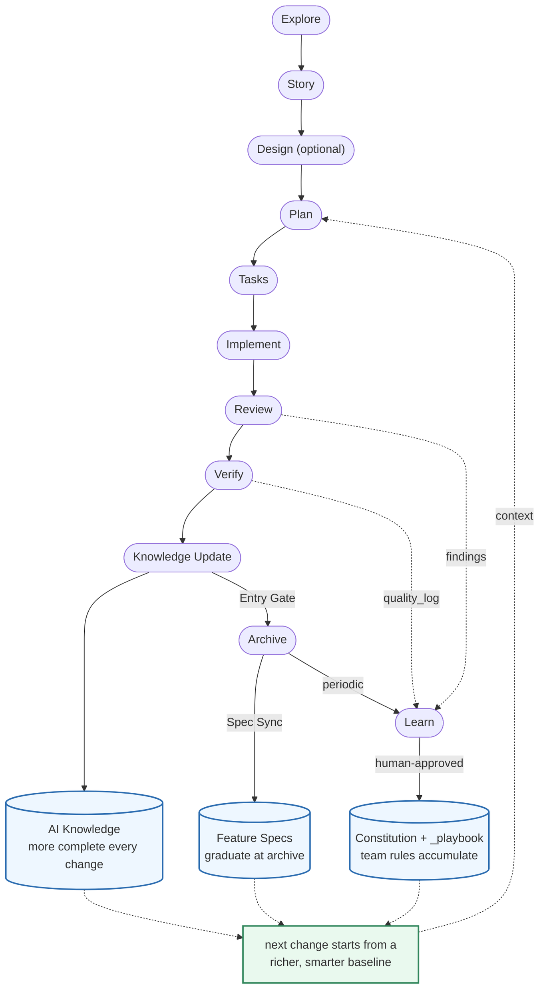
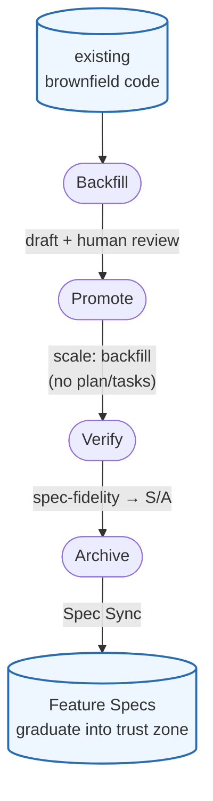

# Prospec

<div align="center">

[](LICENSE)
[](https://www.typescriptlang.org/)
[](tests/)
[](https://nodejs.org/)
[](https://pnpm.io/)

**Progressive Spec-Driven Development (SDD) toolkit for AI coding agents**

*Slash-command Skills · structured AI Knowledge · MCP server — for Claude Code, Copilot, Codex*

[繁體中文](./README.zh-TW.md) • [Quickstart](#quickstart) • [Why Prospec?](#why-prospec) • [How It Works](#how-it-works) • [AI Skills](#ai-skills) • [CLI Commands](#cli-commands)

**This project is a fork of [ci-yang/prospec](https://github.com/ci-yang/prospec)**

</div>

---

## Table of Contents

- [What is Prospec?](#what-is-prospec)
- [Why Prospec?](#why-prospec)
- [Quickstart](#quickstart)
  - [Prerequisites](#prerequisites)
  - [1. Installation](#1-installation)
  - [2. Bootstrap Project Scaffold](#2-bootstrap-project-scaffold)
  - [3. Run Your First Change](#3-run-your-first-change-inside-your-ai-agent)
- [How It Works](#how-it-works)
  - [Skill and CLI Collaboration Model](#skill-and-cli-collaboration-model-judgment-vs-deterministic-execution)
  - [Core Principles](#core-principles)
- [AI Skills](#ai-skills)
  - [Available Skills Inventory](#ai-skills)
  - [Quality Gates & Self-Improvement](#quality-gates-and-self-improvement)
  - [Scale-Aware Workflow (Scale)](#scale-aware-workflow-scale)
- [CLI Commands](#cli-commands)
  - [Infrastructure Commands](#infrastructure-commands)
  - [Change Management Commands](#change-management-commands)
  - [Drift Check (CI Gate)](#drift-check-ci-gate)
  - [Token Measurement](#token-measurement)
  - [MCP Server](#mcp-server)
- [Configuration](#configuration)
- [Advanced Workflows](#advanced-workflows)
  - [Backfill: Bringing Brownfield Code into the Trust Zone](#backfill-bringing-brownfield-code-into-the-trust-zone)
  - [Upgrading Prospec](#upgrading-prospec)
- [Architecture & Development](#architecture)
  - [System Architecture](#architecture)
  - [Testing](#testing)
  - [Contributing](#contributing)
- [License & Acknowledgements](#license)

---

## What is Prospec?

Prospec is a **CLI-first Spec-Driven Development (SDD) toolkit** for AI coding agents. You drive day-to-day work through slash-command **Skills inside your agent** (Claude Code, Antigravity, Copilot, Codex), and every **deterministic operation** those Skills perform — scaffolding, status transitions, quality-log writes, spec sync, grading — is executed by the **`prospec` CLI** (a required, standalone executable), so the same repo state always produces the same bytes. Skills keep the judgment: interviews, prose, reviews, verdicts. The payoff: your agent follows a consistent `story → plan → tasks → implement → review → verify → archive` workflow, grounded in structured, version-controlled project knowledge, with the nondeterministic LLM kept out of the bookkeeping.

Three pieces work together:

```
  You ⇄ AI agent
     │
     ├─ Skills .......... run the workflow:  story → plan → tasks →
     │                    implement → review → verify → archive
     │                        ▲
     │                        │ read & grow
     ├─ AI Knowledge .... structured project memory (modules, specs, lessons)
     │                        ▲
     │                        │ generated / regenerated by
     └─ CLI (prospec) ... executes every deterministic step:  scaffolds, status
                          transitions, quality-log writes, drift checks, grading, spec sync
```

- **Skills** run the workflow's JUDGMENT inside your agent — interviews, prose, reviews, verdicts — the day-to-day surface.
- **AI Knowledge** is progressive project memory the Skills read and grow with each change.
- **CLI** is a required standalone executable IN the runtime loop: every deterministic operation the Skills need — bootstrap, scaffolds, lifecycle transitions, structured records, drift checks, grading, archive sync — runs as code, byte-reproducibly.

**Who is it for?** Developers using an AI coding agent who want repeatable, reviewable workflows on a new project (greenfield) or an existing codebase (brownfield).

## Why Prospec?

| Challenge | How Prospec helps |
|-----------|-------------------|
| AI doesn't know your codebase | `prospec knowledge init` + `/prospec-knowledge-generate` auto-scan and generate AI-readable docs |
| Context window limits | Progressive disclosure: load a summary first, details on-demand (70%+ token saving vs full-dump) |
| Inconsistent AI workflows | Structured Skills enforce `story → plan → tasks → implement → review → verify → archive` |
| Vendor lock-in | Works with 4+ AI CLIs; knowledge stored as universal Markdown |
| No design-to-code bridge | `/prospec-design` generates visual + interaction specs with MCP tool integration |
| Knowledge becomes stale | The verify S/A commit prompt folds a Knowledge Update into the feature commit; the archive Entry Gate re-confirms it as a backstop |
| Verify passes but subtle bugs ship | `/prospec-review` — independent adversarial review between implement and verify |
| Lessons don't persist across sessions | `/prospec-learn` — recurring fixes promote (human-gated) into versioned team rules |

> Each row maps to a Skill or command below — see [AI Skills](#ai-skills) and [CLI Commands](#cli-commands).

---

## Quickstart

From zero to your first AI-driven change in about five minutes.

### Prerequisites

- An **AI CLI** (one or more): [Claude Code](https://docs.anthropic.com/claude/docs/claude-code) (recommended), [Codex CLI](https://developers.openai.com/codex/cli), [GitHub Copilot CLI](https://docs.github.com/copilot/github-copilot-in-the-cli), or [Antigravity CLI](https://antigravity.google/)
- **Node.js** >= 22.13.0 (**not required** if using Option A Standalone Binary; only needed when using npm/pnpm/npx or developing from source)

### 1. Install

The `prospec` CLI is the **essential deterministic engine** driving the SDD workflow runtime loop. Skills running inside your AI Agent (e.g. `/prospec-new-story`, `/prospec-plan`, `/prospec-verify`, `/prospec-archive`) automatically invoke `prospec` commands under the hood for scaffolding, lifecycle status transitions, quality_log recording, drift validation, and Feature Spec synchronization.

Ensure the `prospec` executable is available on your system `PATH`:

**Option A: Standalone Binary (Recommended & No Node.js Required)**
For macOS and Linux, run the one-click installer script (installs to `~/.prospec/bin` and configures `PATH`):
```bash
curl -fsSL https://raw.githubusercontent.com/benwu95/prospec/main/install.sh | bash
```

For Windows, run the one-click PowerShell installer script:
```powershell
powershell -c "irm https://raw.githubusercontent.com/benwu95/prospec/main/install.ps1 | iex"
```

Alternatively, download the precompiled binary manually from the [GitHub Releases](https://github.com/benwu95/prospec/releases) page and place it in your `PATH`:

- **Linux (x64)**: `prospec-linux-x64.tar.gz`
- **macOS (Apple Silicon)**: `prospec-macos-arm64.tar.gz`
- **macOS (Intel)**: `prospec-macos-x64.tar.gz`
- **Windows (x64)**: `prospec-windows-x64.zip`

**Option B: Pin as devDependency (Node.js projects)**
Install as a local project dependency:
```bash
npm install -D github:benwu95/prospec     # or: pnpm add -D github:benwu95/prospec
```

**Option C: Run on demand with npx (Node.js environments)**
Run one-off commands without global installation:
```bash
npx github:benwu95/prospec <command>
```

> [!WARNING]
> We **do not recommend** global installation via `npm install -g` because global compilation of an unpublished fork may fail depending on your local Node/build environment. Use **Option A Standalone Binary** instead.


### 2. Bootstrap your project

One command does the deterministic setup — it chains `init` + `agent sync`, skipping any step already done:

```bash
cd my-project                 # a new or existing project

prospec quickstart            # → select AI assistants, choose doc language; creates .prospec.yaml + per-agent config + Skills
```

`prospec quickstart` runs `agent sync`, which writes **Claude Code** → `CLAUDE.md` + `.claude/skills/`; **Antigravity / Codex / Copilot** → `AGENTS.md` + `.agents/skills/`. Then finish onboarding inside your AI agent:

```text
🤖 Run inside your AI Agent chat:
/prospec-quickstart           # localize skill triggers, re-sync config, generate AI Knowledge
```

This one-time finisher is re-runnable and self-terminating; on an existing codebase it reads your modules into AI Knowledge so the agent understands them before your first change.

### 3. Run your first change (inside your AI agent)

You don't have to remember the steps — **describe the change in plain language and the agent drives the SDD loop**, pausing only to ask you questions and to confirm each handoff:

```text
🤖 Run inside your AI Agent chat:
You ▸ Ask prospec to add a dark-mode toggle

The agent picks up the request and runs /prospec-ff:
  • asks a few scoping / acceptance questions — you answer in plain language
  • writes story → plan → tasks, then hands off at each stage:

  "Run /prospec-implement now? (Y/n)"             → Y
  implement → "Run /prospec-review now? (Y/n)"    → Y
  review    → "Run /prospec-verify now? (Y/n)"    → Y
  verify reaches grade A → prompts you to commit  → Y
         → "Run /prospec-archive now? (Y/n)"      → Y   ✓ archived
```

Every stage ends by telling you what's next and waiting for your `Y` — answer `n` to stop and the suggestion stays, so you can resume later without tracking where you left off. `/prospec-verify` is the commit boundary: at grade S/A it prompts you to commit (it never commits for you), then offers to archive.

Prefer to drive each step yourself? Run them explicitly:

```text
🤖 Run inside your AI Agent chat:
/prospec-explore                   # (optional) clarify the requirement first
/prospec-new-story add-my-feature  # capture it as a structured story
/prospec-design                    # (optional) UI / interaction specs
/prospec-plan                      # design the implementation (a `quick`-scale change skips this)
/prospec-tasks                     # break the plan into an ordered task checklist
#   ↑ collapse story → plan → tasks in one pass with: /prospec-ff add-my-feature
/prospec-implement                 # implement task-by-task (no commit yet)
/prospec-review                    # adversarial review → fix loop
/prospec-verify                    # validate; prompts you to commit at grade S/A
/prospec-archive                   # archive + sync specs & knowledge
/prospec-learn                     # (periodic) promote recurring lessons → team rules
```

That's the full SDD loop. Because `/prospec-quickstart` already seeded AI Knowledge, the agent starts from an understanding of your modules. The full greenfield &amp; brownfield walkthroughs below break down every step `prospec quickstart` automates.

<details>
<summary>Greenfield vs. brownfield bootstrap — what the two commands expand to</summary>

#### Greenfield (new projects)
`prospec quickstart` → `/prospec-quickstart` is the whole bootstrap:

```bash
mkdir my-project && cd my-project
prospec quickstart --name my-project   # init + agent sync (interactive assistant + language selection)
# then, inside your AI agent:
/prospec-quickstart                     # localize triggers · re-sync · generate AI Knowledge
```

Those two commands expand to:

```bash
# `prospec quickstart` runs:
prospec init --name my-project   # → select AI assistants (interactive checkbox)
                                 # → choose the doc language (default: English, or
                                 #   --language "Traditional Chinese (Taiwan)"); a [MUST]
                                 #   path-scoped Language Policy rule is seeded into
                                 #   CONSTITUTION.md — the trust zone, code, and git commit
                                 #   messages stay in English
                                 # → creates .prospec.yaml + directory structure
prospec agent sync               # → per-agent config + Skills (Claude Code → CLAUDE.md +
                                 #   .claude/skills/; Antigravity / Codex / Copilot →
                                 #   AGENTS.md + .agents/skills/)

# `/prospec-quickstart` then, inside your AI agent:
#   • non-English doc language? proposes native trigger words for `skill_triggers`
#     in .prospec.yaml and re-runs agent sync once you confirm — skills then match
#     requests phrased in your language
#   • prospec knowledge init → /prospec-knowledge-generate (seeds AI Knowledge)
```

On a fresh repo, `/prospec-knowledge-generate` produces a minimal Knowledge base that fills in as you ship changes. Then run your first change exactly as in step 3 above.

#### Brownfield (existing projects)
same two commands; `/prospec-quickstart` reads your existing code into AI Knowledge:

```bash
cd existing-project
prospec quickstart                      # auto-detects tech stack; runs init + agent sync
# then, inside your AI agent:
/prospec-quickstart                     # localize triggers · re-sync · knowledge init · /prospec-knowledge-generate
```

Those two commands expand to:

```bash
# `prospec quickstart` runs:
prospec init          # → auto-detect tech stack; select AI assistants; choose doc
                      #   language (default: English; --language to skip the prompt)
prospec agent sync    # → per-agent config + Skills

# `/prospec-quickstart` then, inside your AI agent:
prospec knowledge init       # → generates raw-scan.md + empty skeletons (prospec/index.md, _conventions.md, module-map.yaml)
/prospec-knowledge-generate  # → AI reads raw-scan.md, decides module partitioning,
                             #   creates modules/*/README.md + fills prospec/index.md
```

Here `knowledge init` reads your existing code, so `/prospec-knowledge-generate` produces a rich Knowledge base up front. Then run your first change exactly as in step 3 above — the develop loop is identical to greenfield.

`knowledge init` captures *how* your code is structured, but brownfield modules usually still lack a Feature Spec describing *what* they do. Closing that WHAT-layer gap is its own first-class flow — see **[Backfill: document existing code into the trust zone](#backfill-document-existing-code-into-the-trust-zone)** below. It is not part of bootstrap, so run it whenever you choose.

</details>

<details>
<summary>Directory layout after completing the Quickstart (<code>prospec quickstart</code> + <code>/prospec-quickstart</code>)</summary>

```
your-project/
├── .prospec.yaml              # Prospec config
├── CLAUDE.md                  # Claude Code config (Layer 0, <100 lines)
├── AGENTS.md                  # Antigravity / Codex / Copilot config (agents.md standard)
├── {base_dir}/
│   ├── README.md              # Short Prospec intro for this project's readers
│   ├── CONSTITUTION.md        # Project rules (user-defined)
│   ├── index.md               # AI Entry Point & Module index (Markdown table)
│   ├── specs/
│   │   ├── product.md         # Product Spec (PRD entry point)
│   │   └── features/          # Living Feature Specs (accumulated)
│   └── ai-knowledge/
│       ├── _conventions.md    # Project conventions
│       ├── _playbook.md       # Team lessons promoted by /prospec-learn (human-gated)
│       ├── _lessons-ledger.md # Accumulating lessons ledger, auto-fed at Archive (version-controlled)
│       ├── raw-scan.md        # Auto-generated project scan data
│       ├── module-map.yaml    # Module dependencies
│       ├── feature-map.yaml   # Feature→module index (optional; bootstrapped at Archive)
│       └── modules/
│           └── {module}/
│               └── README.md  # Module-specific docs
├── .prospec/                  # Change management (not committed)
│   ├── changes/
│   │   └── {change-name}/
│   │       ├── proposal.md        # User Story + acceptance criteria
│   │       ├── design-spec.md     # Visual spec (optional, UI changes)
│   │       ├── interaction-spec.md # Interaction spec (optional)
│   │       ├── plan.md            # Implementation plan
│   │       ├── tasks.md           # Task breakdown (checkbox format)
│   │       ├── delta-spec.md      # Patch Spec (ADDED/MODIFIED/REMOVED)
│   │       └── metadata.yaml      # Change lifecycle metadata
│   └── archive/               # Archived completed changes
├── .claude/skills/            # Skills for Claude Code (one dir per skill)
│   ├── prospec-explore/
│   ├── prospec-new-story/
│   ├── prospec-design/
│   ├── prospec-plan/
│   ├── prospec-tasks/
│   ├── prospec-ff/
│   ├── prospec-implement/
│   ├── prospec-review/
│   ├── prospec-verify/
│   ├── prospec-archive/
│   ├── prospec-learn/
│   ├── prospec-knowledge-generate/
│   ├── prospec-knowledge-update/
│   ├── prospec-backfill-spec/
│   ├── prospec-promote-backfill/
│   ├── prospec-quickstart/       # one-time onboarding finisher (on disk, excluded from entry config)
│   └── prospec-upgrade/          # version-upgrade finisher (on disk, excluded from entry config)
└── .agents/skills/            # Same skills, agents.md format (Antigravity / Codex / Copilot)
    └── prospec-*/
```

</details>

---

## How it works

Prospec runs one linear flow, wrapped in two feedback loops that make it **compound** rather than merely repeat.


```mermaid
flowchart TD
    E([Explore]) --> S([Story]) --> D(["Design (optional)"]) --> P([Plan]) --> T([Tasks]) --> I([Implement]) --> R([Review]) --> V([Verify]) --> KU([Knowledge Update]) -- Entry Gate --> A([Archive]) -- periodic --> L([Learn])

    V -. quality_log .-> L
    R -. findings .-> L
    L -- human-approved --> RULES[("Constitution + _playbook<br/>team rules accumulate")]

    KU --> AK[("AI Knowledge<br/>more complete every change")]
    A -- Spec Sync --> FS[("Feature Specs<br/>graduate at archive")]

    AK -.-> NEXT["next change starts from a<br/>richer, smarter baseline"]
    FS -.-> NEXT
    RULES -.-> NEXT
    NEXT -. context .-> P

    classDef asset fill:#eef7ff,stroke:#2b6cb0,stroke-width:2px;
    classDef gain fill:#e9f9ee,stroke:#2f855a,stroke-width:2px;
    class AK,FS,RULES asset;
    class NEXT gain;
```

Every **Archive** enriches **AI Knowledge** (more complete with each change), and recurring lessons — review findings, the cross-stage `quality_log`, session corrections — promote, **only with human approval**, into an accumulating body of team rules (`Constitution` + `_playbook`). So the next change doesn't start from scratch; it starts from a richer, smarter baseline.

The flow is also **scale-aware**: a user-confirmed `quick` change skips the Plan stage entirely (`story → tasks`), with archive-time backstops — see [Right-Sized Process](#right-sized-process-scale).

### Skill ↔ CLI Cooperation Model

Prospec includes a feature-rich CLI with 17+ top-level commands, but **developers rarely execute CLI commands directly**. Day-to-day SDD work is driven through slash-command **Skills** inside your AI Agent interface (`/prospec-ff`, `/prospec-implement`, `/prospec-verify`, etc.).

The interaction between Skills and CLI follows a clear division of labor:

- **Skills (The Judgment Layer in AI Agent)**: Run inside your LLM context. They handle nondeterministic human/AI tasks — interviewing requirements, writing architectural prose, running adversarial reviews, evaluating WCAG/design guidelines, and assigning quality grades.
- **CLI (`prospec` - The Deterministic Execution Layer)**: Called by Skills under the hood via background subshell probes (`_cli-probe`). The CLI handles all byte-reproducible state mutations — creating change scaffolds, validating YAML metadata, updating lifecycle status transitions, recording structured quality logs, calculating drift reports, running mechanical spec sync, and archiving completed changes.

```
  User ⇄ AI Agent (Slash-Command Skills)
         │
         │  (1) Asks questions & guides SDD workflow
         │  (2) Executes high-level judgment (prose, review, code)
         ▼
  Skill Execution Loop
         │
         │  Under the hood: Skills call `prospec <command>`
         ▼
  `prospec` CLI (Deterministic Engine)
         │
         ├── Scaffolding (story / plan / tasks)
         ├── Lifecycle & Metadata (status / scale / progress)
         ├── Deterministic Audits & Grading (check / verify record / review merge)
         └── Knowledge & Spec Sync (archive / knowledge update / learn upsert)
```

**Why this separation matters:**
By delegating all bookkeeping and state transitions to the CLI binary, Prospec eliminates LLM formatting errors (e.g. malformed YAML/JSON or broken frontmatter), guarantees zero-token state checks, and ensures that the exact same repository state always produces identical, byte-reproducible artifacts.

### Core principles

Prospec enforces 6 principles over the assets it injects into your project — the generated Skills, configs, and directory structure:

1. **Progressive Disclosure First** — never load all info at once; index → details
2. **Spec is Source of Truth** — changes documented in specs before code
3. **Zero Startup Cost for Brownfield** — no need to document the entire codebase upfront
4. **AI Agent Agnostic** — works with any AI CLI via Markdown adapters
5. **User Controls the Rules** — Constitution is user-defined, the tool enforces
6. **Language Policy** — change artifacts in the language you choose at `prospec init` (default: English); the trust zone (AI Knowledge base, Feature Specs, Constitution), code, technical terms, and git commit messages always in English

---

## AI Skills

Prospec generates 17 Skills — 15 guide AI through the full SDD lifecycle, plus two periodic finishers: `/prospec-quickstart` (onboarding) and `/prospec-upgrade` (version upgrade):

| Skill | Slash Command | Description |
|-------|---------------|-------------|
| **Explore** | `/prospec-explore` | Think partner for requirement clarification |
| **New Story** | `/prospec-new-story` | Create structured change story |
| **Design** | `/prospec-design` | Generate visual + interaction specs (Generate/Extract modes) |
| **Plan** | `/prospec-plan` | Generate implementation plan + delta-spec |
| **Tasks** | `/prospec-tasks` | Break down into executable tasks |
| **Fast-Forward** | `/prospec-ff` | Generate story → plan → tasks in one go |
| **Implement** | `/prospec-implement` | Implement tasks one-by-one with MCP-first design reading |
| **Review** | `/prospec-review` | Adversarial review → fix loop; verifier-confirmed criticals auto-fixed, spec-aware lens |
| **Verify** | `/prospec-verify` | 5+1 dimension audit with quality grade (S/A/B/C/D); prompts commit at S/A |
| **Archive** | `/prospec-archive` | Archive changes + Spec Sync + Knowledge sync Entry Gate |
| **Learn** | `/prospec-learn` | Feedback promotion: recurring lessons → team `_playbook` / Constitution (auditable, human-gated) |
| **Knowledge Generate** | `/prospec-knowledge-generate` | AI-driven module analysis and knowledge creation |
| **Knowledge Update** | `/prospec-knowledge-update` | Incremental knowledge update from delta-spec |
| **Backfill Spec** | `/prospec-backfill-spec` | Reverse-extract a Feature Spec draft from existing brownfield code (stages a draft, never writes the trust zone) |
| **Promote Backfill** | `/prospec-promote-backfill` | Formalize a reviewed backfill draft into the backfill change scaffold (proposal + delta-spec + metadata, `scale: backfill`, `status: implemented`; a light scale — no plan/tasks); never writes the trust zone |
| **Quickstart** | `/prospec-quickstart` | After `prospec quickstart` runs init + agent sync, localize skill triggers into your artifact language, prepare the Knowledge scan, and chain into `/prospec-knowledge-generate` to seed AI Knowledge; never writes the trust zone |
| **Upgrade** | `/prospec-upgrade` | After `prospec upgrade` records the version, re-syncs agents, and back-fills missing init docs, work through the report's docs inventory: migrate drifted init-doc formats + enrich the docs it created, and localize triggers for newly-added skills (fill-missing only) — each with confirmation + a diff/content preview; never overwrites your authored content |

> [!NOTE]
> **Periodic Finisher Skills**: `/prospec-quickstart` (runs once after `prospec quickstart`) and `/prospec-upgrade` (runs during version upgrades after `prospec upgrade`) finish the judgment steps the CLI cannot handle deterministically. Both deploy to disk as Skills but are excluded from active entry config, so they add zero ongoing token cost.

### Quality Gates & Self-Improvement

Beyond the linear flow, every workflow Skill carries built-in quality machinery:

- **Output Contract** — each Skill self-reports `Met N/M | Overall: PASS|WARN|FAIL` against objective criteria, so you don't hand-check artifacts.
- **Entry / Exit gates** — a Skill checks preconditions before running (Entry) and Constitution compliance after (Exit); WARN/FAIL records persist to a cross-stage `quality_log` so an earlier stage's concern surfaces at the next.
- **Skill instruction quality** — per-phase gate checklists (finer-grained than the skill-level Entry/Exit gates); a status-aware **next-step handoff** at the end of each linear-flow Skill (plan→tasks→implement→review→verify→archive) (`Run <next-step> now? (Y/n)` — your Y is the trigger, never a silent auto-run); new-session detection of in-progress changes to resume; `/prospec-implement` re-anchors `Progress X/Y | Goal | Next` after each task; and `/prospec-explore` / `/prospec-knowledge-generate` warn when the Constitution is still substantively empty (its gates would otherwise be no-ops).
- **Executable Constitution** — rules carry RFC-2119 severity (MUST→FAIL / SHOULD→WARN / MAY→advisory); `/prospec-verify` grades against them.
- **Deterministic drift gate** — `prospec check` machine-verifies spec ↔ code ↔ knowledge referential integrity with zero tokens; `/prospec-verify` consumes its report at dev time and the scaffolded CI workflow enforces it on every PR. With an optional `feature-map.yaml` (feature→module index, bootstrapped at archive) it adds two governance checks: REQ-prefix legality (WARN) and the feature→module edge (FAIL).
- **Adversarial review** — `/prospec-review` sits between implement and verify: an independent fresh-context reviewer audits the whole change diff; only verifier-confirmed, drop-in criticals are auto-fixed, the rest escalate to you. The **commit boundary** is *after* verify reaches grade S/A, so implement + review + verify fixes land in one atomic commit (prospec prompts; it never auto-commits).
- **Feedback promotion** — every **Archive** auto-harvests a change's recurring lessons into a **version-controlled** ledger (`_lessons-ledger.md`); `/prospec-learn` then scores them with an explicit reproducible rule (frequency + impact modules) and — only with explicit human approval — promotes them into the team `_playbook.md` or the Constitution. Before each collection it **sweeps both files for entries the project has outgrown** — a rule some gate now enforces, one whose subject is gone, or one that contradicts the Constitution — and surfaces each with its evidence for human retirement; expiry retires in place (a ledger row keeps every counter, a playbook id is never reused), so the audit trail survives the cleanup.

### Right-Sized Process (Scale)

Not every change deserves the full ceremony. At story time, `/prospec-new-story` (or `/prospec-ff`) assesses complexity against explicit criteria and proposes a scale — **you confirm before it is written** to `metadata.yaml`:

| Scale | What changes |
|-------|--------------|
| `quick` | Slim proposal (single story, no FR/SC enumeration), **plan phase skipped entirely** (`story → tasks`), no module-README loading; review/verify report their delta-spec dimensions as `not-applicable` (never a fake PASS) |
| `standard` (default; absent on existing changes) | The current concise flow — plan ≤ 120 lines, closing with a required **Simpler Alternative** section (a materially simpler alternative or an explicit concession, plus a files/lines change-surface estimate) |
| `full` | Complete architecture analysis — expanded Technical Summary, per-entry-point Call Chains, Best-of-N candidate tournament (its recorded non-selected candidates stand in for Simpler Alternative) |

Two honest backstops keep `quick` from becoming a spec-drift hole: a change expected to touch spec-covered behavior is **vetoed out of quick** at assessment time, and the `/prospec-archive` Entry Gate re-checks the **actual diff** — spec impact blocks archiving until a minimal Spec Impact section is added, and the knowledge-sync gate derives affected modules from diff paths instead of the absent delta-spec. Engineering discipline is not scaled down: TDD, adversarial review, and Constitution audits run at every scale.

Tasks also carry a **kind** marker (`[M]` manual, `[V]` verification, unmarked = code): completion rates count code tasks only, so an unchecked "run this command manually" reminder never blocks or distorts a gate.

<details>
<summary>Cache-Stable Prefix Ordering (advanced internals)</summary>

Every skill's Startup Loading section is ordered **static-first** so provider prompt caches
(Anthropic explicit `cache_control`, OpenAI/Gemini automatic prefix caching) can reuse the
longest possible prefix across triggers. Each loading item carries one of two markers:

- **`[STABLE]`** — changes only on `agent sync` or governance edits: startup-needed
  `references/` format specs, the Constitution, `_conventions.md`. These load first.
  (Phase-specific format specs in `ff` / `plan` / `archive` are instead read **per-phase
  on-demand** — off the stable prefix, so an early abort never pays for a later phase's format.)
- **`[DYNAMIC]`** — changes per knowledge update, per change, or per trigger: `prospec/index.md`
  (first after the cache boundary), module READMEs, `_playbook.md`, Feature/Product Specs,
  and `.prospec/changes/` artifacts. These load last.

The classification criterion is **cross-request prefix stability**, not "is it generated":
the entry config's Available Skills list is per-project fixed (it changes only when the
skill set changes), so it is `[STABLE]`. Extension authors adding skills must follow the
same ordering — static loads before the boundary, dynamic after — or they break the cache
prefix for every trigger. What the harness measures is the **prospec assembly pipeline**
(its corpus assembles knowledge files, not the skill templates themselves) — see Token
Measurement below. The template-level reorder takes effect at the agent deployment layer,
outside the harness's observable scope (a deliberate exclusion): its benefit follows from
the providers' documented prefix-caching semantics, not from a direct before/after measurement.

</details>

---

## CLI Commands

### Infrastructure Commands

| Command | Description |
|---------|-------------|
| `prospec quickstart [options]` | One-command onboarding: runs `init` + `agent sync`, then hands off to `/prospec-quickstart` |
| `prospec upgrade [--cwd <dir>]` | After a version bump: record version in `.prospec.yaml`, re-run `agent sync`, and create missing init docs |
| `prospec init [options]` | Initialize Prospec project structure (sets language and agents) |
| `prospec knowledge init [options]` | Static project scan to generate `raw-scan.md` and module boundary skeletons |
| `prospec knowledge update [options]` | Mechanical incremental knowledge sync from `delta-spec.md` into `module-map` and `index.md` |
| `prospec knowledge verify <modules>` | Stamp `last_verified` for named modules in `module-map.yaml` for CI staleness checks |
| `prospec agent sync [--cli <name>]` | Sync AI agent configs and generate Skills across configured harnesses |
| `prospec agent triggers [--write <file>]` | Print ready-to-translate `skill_triggers` scaffold and optionally write back |
| `prospec config example` | Print complete annotated `.prospec.yaml` reference with example values |
| `prospec print-template <path>` | Print raw content of bundled template (offline, node-free) |

#### Infrastructure Commands Breakdown

- **`prospec quickstart [options]`**
  - **Purpose**: Fast, streamlined onboarding by chaining `init` and `agent sync`.
  - **Behavior**: Automatically runs initialization steps (skipping completed ones), then prompts to trigger `/prospec-quickstart` in the AI agent for trigger localization and Knowledge generation.
  - **Options**: Accepts the same `--name`, `--agents`, and `--language` options as `init`.

- **`prospec upgrade [--cwd <dir>]`**
  - **Purpose**: Deterministic project and template upgrade following a Prospec version bump.
  - **Behavior**:
    - Updates the `version` field in `.prospec.yaml` (merged in place, preserving comments and formatting).
    - Re-runs `agent sync` to align agent configurations and Skill templates with the latest release.
    - Scaffolds any missing init-created files from templates (`skip-if-exists`, never overwriting or reordering existing files).
    - Prints a migration report with a docs inventory, handing off to `/prospec-upgrade` for consent-gated format migrations.

- **`prospec init [options]`**
  - **Purpose**: Initialize Prospec project structure and baseline configuration.
  - **Options**: `--language <lang>` (sets document language, default English), `--name <name>`, `--agents <list>`.

- **`prospec knowledge init [--depth <n>] [--dry-run] [--raw-scan-only]`**
  - **Purpose**: Statically scan project source code to generate structure snapshots and module skeletons.
  - **Behavior**:
    - Scans the repository to generate `raw-scan.md` and initial curated skeletons (`module-map.yaml`, `prospec/index.md`, `_conventions.md`, only if absent).
    - `--raw-scan-only`: Regenerates **only** `raw-scan.md` (deterministic, zero LLM, leaving curated files untouched) to refresh snapshots before `/prospec-knowledge-generate`.

- **`prospec knowledge update [--change <name>] [--module <m>...]`**
  - **Purpose**: Incrementally sync knowledge boundaries from a change's `delta-spec.md` or named modules.
  - **Behavior**:
    - Regenerates the `prospec/index.md` auto block from `module-map.yaml`.
    - Creates skeleton READMEs for genuinely new modules and adds deprecation banners for removed ones.
    - Never rewrites existing README content (preserving authored knowledge) and reports a `README content pending` worklist.

- **`prospec knowledge verify <module>...`**
  - **Purpose**: Stamp `last_verified` timestamp for named modules in `module-map.yaml`.
  - **Behavior**: Records when module knowledge was confirmed current against its source code; used by CI and `prospec check` to detect stale documentation.

- **`prospec agent sync [--cli <name>]`**
  - **Purpose**: Synchronize AI agent configurations and generate Skills.
  - **Behavior**:
    - Writes `CLAUDE.md` and `.claude/skills/` for Claude Code.
    - Writes shared `AGENTS.md` and `.agents/skills/` for Antigravity, Codex, and GitHub Copilot.
    - Injects localized trigger words from `.prospec.yaml` `skill_triggers`.
    - Only refreshes `prospec:auto` sections in entry configs, preserving whatever is written in `prospec:user`.

- **`prospec agent triggers [--write <file>]`**
  - **Purpose**: Generate a ready-to-translate `skill_triggers` scaffold for localization.
  - **Behavior**:
    - Lists unlocalized skills with their English baselines (from `SKILL_DEFINITIONS`).
    - `--write <file>`: Safely inserts only missing keys back into `.prospec.yaml` without overwriting existing entries.

- **`prospec config example`**
  - **Purpose**: Output a fully annotated `.prospec.yaml` reference with comments and example values.

- **`prospec print-template <path>`**
  - **Purpose**: Output raw bundled template contents without requiring Node.js runtime execution.

#### Agent Configuration Layout & Safety

`prospec agent sync` writes entry configs and Skills for each enabled agent:
- **Claude Code** → `CLAUDE.md` + `.claude/skills/`
- **Antigravity / Codex / GitHub Copilot** → `AGENTS.md` + `.agents/skills/` (shared [agents.md](https://agents.md) open standard; written once when multiple agents are enabled)

Skills whose workflow depends on the harness — today `/prospec-review` and `/prospec-verify` — state what it can do (`can_spawn_subagent` / `can_worktree` / `can_background`) directly instead of asking the agent to guess at runtime. Because one `.agents/skills/` copy serves several agents, it declares the **intersection** of their capabilities — never promising what one cannot do.

> [!NOTE]
> **Editing Safety**: Entry configs carry `prospec:auto` and `prospec:user` blocks. `agent sync` (and `init` on `AGENTS.md`) only refreshes the `auto` block and preserves whatever you write in the `user` block; existing hand-written `CLAUDE.md` / `AGENTS.md` files are migrated into the `user` block on first sync rather than overwritten.


#### Project-scan language support

`prospec knowledge init` (incl. `--raw-scan-only`) detects the following into `raw-scan.md`. Detection is deterministic (no LLM, no network) and best-effort; coverage differs by section:

| Language | Tech Stack | Dependencies | Entry Points | Config Files |
|----------|:---:|:---:|:---:|:---:|
| JavaScript / TypeScript | ✅ (+ framework) | ✅ `package.json` | ✅ | ✅ |
| Python | ✅ | ✅ `pyproject.toml` / `requirements.txt` | ✅ | ✅ |
| Go | ✅ | ✅ `go.mod` | ✅ | ✅ |
| Rust | ✅ | ✅ `Cargo.toml` | ✅ | ✅ |
| Java / Kotlin | ✅ Maven / Gradle | ✅ `pom.xml` ¹ | ✅ | ✅ |
| C# | ✅ | ✅ `*.csproj` | ✅ | ✅ |
| Ruby | ✅ | — ² | ✅ | ✅ |
| PHP | ✅ | ✅ `composer.json` | — | ✅ |
| C | ✅ ³ | ✅ `vcpkg.json` / `conanfile.txt` ⁴ | ✅ | ✅ |
| C++ | ✅ ³ | ✅ `vcpkg.json` / `conanfile.txt` ⁴ | ✅ | ✅ |
| Swift | ✅ `Package.swift` | — ⁵ | ✅ | ✅ |

¹ Java dependencies are read from Maven `pom.xml` only — the Gradle Groovy/Kotlin DSL is not statically parsed. ² Ruby dependencies are not parsed (`Gemfile` is a Ruby DSL). ³ C vs C++ is inferred from source-file extensions; set `tech_stack` in `.prospec.yaml` to override. ⁴ C/C++ dependencies are read from declarative manifests only — `CMakeLists.txt` and `conanfile.py` are imperative and not parsed. ⁵ Swift dependencies are not parsed (`Package.swift` is imperative Swift). Any unrecognized language still appears in the Directory Tree and File Stats sections — and, because an unlisted extension counts as source, its code directories stay OUT of Directories Without Source Files.

**Directories the scan cannot classify as code.** `raw-scan.md` also carries a `Directories Without Source Files` section: each topmost directory in which no file counts as source — the module detector requires a file to carry an extension AND for that extension not to be on its non-source denylist, so a directory whose only content is extensionless files (a `bin/` of scripts) lands here too. Root-level files belong to no directory and are never listed. It is a scan fact, not a detection verdict: a curated `module-map.yaml` (which detection always prefers) or the no-module fallback can still make such a directory a module. The section is the evidence `/prospec-knowledge-generate` weighs when deciding whether one of them — a `manifests/` of Kubernetes YAML, a `chapters/` of LaTeX — is really this project's substance and belongs in `module-map.yaml`.

**A language outside this table?** It still scans — the Directory Tree and File Stats sections are always populated, and `/prospec-knowledge-generate` reads the source directly. The Tech Stack line falls back to `unknown`; declare it authoritatively in `.prospec.yaml` `tech_stack` (free-form — it overrides auto-detection and is reported with `Source: config`):

```yaml
tech_stack:
  language: zig
  package_manager: zig build
```

Entry Points, Dependencies, and Config Files have no per-language override — they stay empty for an unrecognized language until detection patterns are added (the scan never invents them).

### Change Management Commands

#### Lifecycle & Scaffolding Commands

| Command | Description |
|---------|-------------|
| `prospec status` | Read-only check of in-flight changes, lifecycle station, next steps, and blocking gates; on a clean workspace, reports the drift report's state |
| `prospec change story <name> [options]` | Create change story scaffold (`proposal.md` + `metadata.yaml`) |
| `prospec change plan [--change <name>] [--force]` | Create technical implementation plan scaffold (`plan.md` + `delta-spec.md`) |
| `prospec change tasks [--change <name>] [--force]` | Create task checklist scaffold (`tasks.md`) |
| `prospec change auto-draft [options]` | Scaffold fix changes from drift findings (or an explicit `--target`) without hand-copying the report |
| `prospec spec show <feature> [options]` | Read-only targeted REQ or Story slice from Feature Specs for token efficiency |
| `prospec archive <name...> [--dry-run]` | Archive verified changes: move directory, generate summary, and mechanically sync specs |
| `prospec archive finalize <name> [--dry-run]` | Post-archive finalization: copy final summary to audit trail and reconcile spec counters |

#### State, Tracking & Validation Commands

| Command | Description |
|---------|-------------|
| `prospec change scale <scale> [--change <name>]` | Set complexity scale (`quick` / `standard` / `full` / `backfill`) |
| `prospec change status <to> [--change <name>]` | Forward-only lifecycle transition (refuses backward or invalid transitions) |
| `prospec change progress [options]` | Calculate code-task progress (excluding `[M]` / `[V]`) and flip checkboxes |
| `prospec change log [options]` | Append structured `quality_log` entry in `metadata.yaml` |
| `prospec review merge --findings <file> [options]` | Merge review JSON findings into cumulative `review.md` table |
| `prospec verify record [options]` | Compute S/A/B/C/D grade from machine/judgment dimensions and advance to verified |
| `prospec learn upsert --lesson <file> [options]` | Idempotent lesson ledger upsert and evaluate promotion rules |
| `prospec validate <kind> [target] [options]` | Machine validation of artifact structural integrity (exits 1 on failure) |

#### Change Management Commands Breakdown

- **`prospec status`**
  - **Purpose**: Read-only deterministic routing for all active in-flight changes.
  - **Key Details**:
    - Reports current lifecycle node, suggested next station, blocking gates, and specific reasons.
    - Supports scale-specific routes (`quick` skipping plan to tasks, `backfill` entering at promote).
    - Displays registered `issue` trackers; reports malformed metadata per change without crashing.
    - With nothing in flight, reads `prospec-report.json` and reports its STATE: how many findings `--auto-draft` would draft, or that the report is unreadable or was generated against different code (compared by `change_digest`). A report it cannot trust is reported as such, never as an absence of drift.

- **`prospec change story <name> [options]`**
  - **Purpose**: Scaffold a new change directory with `proposal.md` and `metadata.yaml` (`status: story`).
  - **Options**:
    - `--description <d>`: One-line summary of the change.
    - `--related-module <m>...`: Explicitly associate modules (overrides auto-matching).
    - `--issue <ref>`: Register associated Issue / Ticket tracking identifier.
    - `--introduced-by <c>`: Record introducing change source (for escaped-defect analysis).

- **`prospec change plan [--change <name>] [--force]`**
  - **Purpose**: Scaffold `plan.md` and `delta-spec.md`, advancing status to `plan`.
  - **Safety Rules**: Refuses to overwrite existing files unless `--force` is passed; refuses outright for scales where plans are forbidden (`quick` routes to `change tasks`, `backfill` to `/prospec-promote-backfill`).

- **`prospec change tasks [--change <name>] [--force]`**
  - **Purpose**: Scaffold `tasks.md`, advancing status to `tasks`.
  - **Key Details**: `quick` changes decompose directly from `proposal.md` (`story → tasks`); refuses to overwrite without `--force`; rejected for `backfill`.

- **`prospec spec show <feature> [--req <ids>] [--story <ids>]`**
  - **Purpose**: Read-only, targeted slice reading of Feature Specs (token-efficient reading).
  - **Key Details**:
    - `--req <ids>`: Quotes only specified requirement IDs (comma-separated or repeated).
    - `--story <ids>`: Quotes complete User Story blocks.
    - Prints full spec when no selector is given; exits 1 on unmatched selectors to prevent false "unspecified" assumptions.
    - Used by verify and archive stations to avoid loading entire multi-thousand-token specifications.

- **`prospec archive <name...> [--dry-run]`**
  - **Purpose**: Execute deterministic archiving mutations for verified changes.
  - **Behavior**:
    - Moves change directory to `.prospec/archive/{date}-{name}/`, generates summary scaffold, and sets `status: archived`.
    - Performs mechanical Feature Spec sync: merges delta-spec `**Spec:**` blocks into feature specs and emits two worklists on stderr (kept bodies requiring convergence, and replaced bodies omitting prior bullets).
    - Syncs `product.md` `## Feature Map` (refusing safely on ambiguous headers, unclosed code blocks, or missing directories).
    - `--dry-run`: Previews all planned file modifications without writing; exits 1 if change is not verified.

- **`prospec archive finalize <name> [--dry-run]`**
  - **Purpose**: Post-judgment archive finalization (runs after human summary edits and REQ convergence).
  - **Key Details**:
    - Copies finalized `summary.md` to `specs/_archived-history/` for version-controlled audit trails.
    - Reconciles `story_count` and `req_count` in feature spec frontmatter against final spec bodies.
    - Refuses to execute if `summary.md` is still an unmodified template scaffold.

- **`prospec change scale <quick|standard|full|backfill> [--change <name>]`**
  - **Purpose**: Write user-confirmed complexity scale to `metadata.yaml` (in-place edit preserving comments).

- **`prospec change status <to> [--change <name>]`**
  - **Purpose**: Forward-only lifecycle state advancement (refuses illegal jumps and lists valid targets).

- **`prospec change log --skill <station> --result <PASS|WARN|FAIL> [options]`**
  - **Purpose**: Append a structured `quality_log` entry in `metadata.yaml`.
  - **Options**: Supports `--warning <w>`, `--grade <g>`, `--dimension n=r`, `--criticals-found <n>` with canonical key ordering and automatic character escaping.

- **`prospec change progress [--complete <task>] [--change <name>]`**
  - **Purpose**: Track and update code-task progress in `tasks.md`.
  - **Key Details**:
    - Reports ratio (X/Y, automatically excluding `[M]` manual and `[V]` verification tasks) and next task.
    - `--complete <task>`: Toggles exactly one specified task checkbox.

- **`prospec review merge --findings <file> [--change <name>]`**
  - **Purpose**: Merge review round JSON findings into cumulative `review.md` table.
  - **Key Details**: Deduplicates by identity key, keeps maximum severity, preserves findings across rounds, and logs reproduction steps and evidence.

- **`prospec verify record --dimension <name>=<result>... | --dimensions <file> [options]`**
  - **Purpose**: Calculate verification grade (S/A/B/C/D) and record structured verification log.
  - **Key Details**: Machine dimensions are self-sourced from `prospec-report.json`, judgment dimensions from CLI flags or JSON; advances status to `verified` on S or A grade.

- **`prospec learn upsert --lesson <file> [--today <date>]`**
  - **Purpose**: Idempotently upsert lessons into `_lessons-ledger.md`.
  - **Key Details**: Evaluates `freq ≥ 3 ∧ modules ≥ 2` promotion rule for playbook promotion and checks playbook TTL validity.

- **`prospec validate <kind> [target] [--change <name>]`**
  - **Purpose**: Machine validation of artifact structural integrity (`slug`, `promote-scaffold`, `backfill-draft`, `design-spec`). Exits 1 on failure.

> [!IMPORTANT]
> **Deterministic Execution Layer**: These change management commands serve as the deterministic core of the workflow (issue #107). Skills (`/prospec-new-story`, `/prospec-ff`, etc.) delegate every scaffold, status transition, and audit record to the CLI rather than authoring raw bookkeeping artifacts. If the CLI binary is missing or below the version probe threshold, the Skill halts (STOP). All commands can also be run manually or scripted in CI/CD.

### MCP Server

A **read-only**, stdio MCP server that exposes the project's truth — architecture, specs, dependency direction, promoted playbook, and knowledge freshness — to any MCP-capable agent, even one without Prospec Skills installed.

| Command | Description |
|---------|-------------|
| `prospec mcp serve [--cwd <path>]` | Start a **read-only** MCP server on stdio — any MCP-capable agent (even one without Prospec Skills installed) can query the project's architecture truth, spec truth, dependency direction, promoted playbook, and knowledge freshness. `--cwd` pins the project root so one agent can run several project servers regardless of where it was launched |

**Resources** (re-read from disk on every request — clients always see current file state):

| URI | Content |
|-----|---------|
| `knowledge://index` | AI Knowledge module index (`prospec/index.md`) |
| `knowledge://module/{name}` | One module's Recipe-First README plus each sub-module linked from its `## Sub-Modules` section (the whole L2 module knowledge) |
| `knowledge://module-map` | Module boundaries + `depends_on` (`module-map.yaml`) |
| `knowledge://feature-map` | feature → module index + REQ prefixes (`feature-map.yaml`) |
| `knowledge://playbook` | Human-approved team lessons (`_playbook.md`) |
| `knowledge://health` | Per-module staleness + coverage — same pure function as `prospec check` |
| `spec://product` | Product spec — PRD entry point + feature map (`product.md`) |
| `spec://feature/{name}` | Feature specs (REQ source of truth); archived specs are excluded by the same rule `prospec check` uses |

**Tools**: `search_modules` (which module owns a concept — normalized term-OR match over the curated
index columns, so `drift checker` finds `drift-checker`), `get_dependency_direction` (may `from`
import `to`? — answered from module-map `depends_on`, or the Constitution chain when no map exists;
the answer states which source it used), and `get_spec_requirements` (quote just the requirements a
change touches, by REQ id or story, instead of reading a whole Feature Spec — the same narrow read
`prospec spec show` serves; a parameterized query is a tool because a resource template cannot carry
an optional one, and it refuses a call with no selector rather than answering with an empty set).

**Registering** — point your agent's MCP config at `prospec mcp serve --cwd <project-root>`. `--cwd`
pins the project so the server resolves its `.prospec.yaml` no matter where the agent was launched —
which also lets one agent register several projects at once. Assumes the recommended global install
(`prospec` on PATH).

Claude Code:

```bash
claude mcp add project-name -- prospec mcp serve --cwd /path/to/project
```

Other agents — the same command in the agent's JSON MCP config:

```json
{
  "mcpServers": {
    "project-name": {
      "command": "prospec",
      "args": ["mcp", "serve", "--cwd", "/path/to/project"]
    }
  }
}
```

To serve several projects from any directory, register one entry per project — each with a unique
name and its own `--cwd` (Claude Code: add `-s user` so it's available everywhere):

```bash
claude mcp add -s user prospec-a -- prospec mcp serve --cwd /path/to/A
claude mcp add -s user prospec-b -- prospec mcp serve --cwd /path/to/B
```

Pinned prospec as a devDependency rather than installed globally? Route through `npx`: prefix the
Claude Code command (`… -- npx prospec mcp serve --cwd /path/to/project`), or in JSON set
`"command": "npx"` with `"prospec"` as the first arg (`["prospec", "mcp", "serve", "--cwd", "/path/to/project"]`).

Honest boundaries: the server is read-only (no tool or resource can modify files), serves one project
per process (the root given by `--cwd`), and is a pure add-on — no Skill or CLI command depends on it,
so everything works unchanged when it is not running. Transport is stdio only; HTTP/SSE is
deliberately not included in this version.

### Drift Check (CI Gate)

| Command | Description |
|---------|-------------|
| `prospec check [--json] [--strict]` | Zero-LLM deterministic check: verify specs, code, dependencies, and knowledge integrity |
| `prospec check --record-tests [options]` | Run test suite and record command, exit code, and digest into `metadata.yaml` |
| `prospec check --record-review [options]` | Record code digest and `delta-spec.md` fingerprint as review baseline |
| `prospec check --escaped-defects [options]` | Report aggregate escaped-defect rates across lifecycle gates |
| `prospec check --init-ci` | Scaffold hardened GitHub Actions CI workflow (`.github/workflows/prospec-check.yml`) |
| `prospec check --auto-draft [--auto-draft-dry-run]` | After reporting, scaffold a fix change per finding group (never overwrites; a drafting failure never changes the check's own exit code, but combining the flag with a non-check mode is refused up front) |

#### Drift Check Commands Breakdown

- **`prospec check [--json] [--strict]`**
  - **Purpose**: Zero-token machine verification of reference integrity and architectural boundaries across spec ↔ code ↔ knowledge.
  - **Audit Dimensions**:
    - **Specs & Links**: Dangling REQ references, broken Markdown links, Feature Spec frontmatter count reconciliation (`story_count`/`req_count`).
    - **Architecture & Dependencies**: Import directions enforced by `module-map.yaml`, REQ-prefix legality (WARN), feature→module boundaries (FAIL).
    - **Knowledge Health**: Module freshness (`last_verified` vs source commit, WARN), token and line size budgets (`knowledge-size`, WARN), README declared resource counts (WARN).
    - **Review & Test Provenance**:
      - `review-provenance`: Implemented or verified changes must have a recorded review matching the current code.
      - `test-provenance`: Changes must have a recorded current, passing (green) test run.
      - `delta-spec-provenance`: Change's `delta-spec.md` fingerprint must match the recorded review baseline.
      - `delta-spec-landing-fidelity`: A MODIFIED delta-spec `**Spec:**` landing block must not drop an authored trust-zone `WHEN/THEN` bullet without declaring it under `**Dropped:**` (FAIL) — surfaces the loss at every check, sharing the archive write path's comparison, not only at archive after the commit.
    - **Governance**: RFC-2119 tags on Constitution principles (WARN), artifact language consistency (WARN), justification comments on budget overrides (WARN), canonical doc drift (`canonical-doc-drift`, WARN).
  - **Execution & Exit Codes**:
    - `--json`: Outputs machine-readable `prospec-report.json`.
    - `--strict`: Exits 1 on any FAIL (WARN and SKIPPED never affect exit codes). `--auto-draft` cannot change this: drafting runs after the report is written and a drafting failure is reported, never thrown.
    - `--auto-draft` is REFUSED (exit 1, nothing written) alongside `--init-ci` / `--record-review` / `--record-tests` / `--escaped-defects`, which all return before any drift check runs, and `--auto-draft-dry-run` is refused without `--auto-draft` — a flag that cannot be honoured is rejected rather than silently ignored.
    - Missing or unavailable sources gracefully degrade to `skipped` with explicit reasons, never fabricating a PASS.

- **`prospec change auto-draft [--from-report [file]] [--target <name>] [--reason <text>] [--check <id>] [--scale <scale>] [--issue <ref>] [--dry-run]`**
  - **Purpose**: Turn drift findings into change scaffolds so an agent can start fixing without transcribing the report. Also available as `prospec check --auto-draft`, which drafts from the run it just reported.
  - **Grouping**: One change per `<target>:<check>` pair, named `fix-<target>-<check>` — with a short stable suffix when the target does not survive slugging unchanged, so two different targets can never land on one directory. The target comes from `module-map.yaml` attribution and the configured `knowledge.base_path` / `paths.base_dir` — never a guessed path shape. A finding under a feature spec groups under that feature's name; one that maps to neither a module nor a feature groups under `general`. Only a name `module-map.yaml` declares is written to `related_modules` — a feature name and `general` are subjects, not modules.
  - **Scope**: two kinds of finding are not drafted — `knowledge-size` findings in the `headroom` (pressure) tier (budget pressure, not a violation), and findings whose `source_path` is under `.prospec/` (SDD process gates ON a change, so drafting one would create a change whose job is another change's paperwork). Nothing else is dropped.
  - **Safety**: Creation goes through the same service as `prospec change story`, so an existing change directory is skipped, never overwritten, and a run is idempotent. `--dry-run` reports what would be drafted and writes nothing at all (on `check` the flag is `--auto-draft-dry-run`, because `check`'s other writes are unaffected by it).
  - **Requires**: exactly one drift source. With none of `--from-report` / `--target` / `--reason` / `--check`, the command exits non-zero rather than reporting a clean verdict; combining a report source with an explicit target is refused rather than silently dropping one.

- **`prospec check --record-tests [--change <name>]`**
  - **Purpose**: Runs project test suite and records `{command, exit_code, digest, date}` in change's `metadata.yaml`.
  - **Key Details**:
    - Serves as the objective oracle for `/prospec-verify` test dimension, preventing agent hallucination.
    - Executed via argv directly without shell; degrades to `skipped` when unable to execute honestly.
    - Previously recorded non-zero exit codes remain FAIL even if command subsequently becomes unresolvable.

- **`prospec check --record-review [--change <name>]`**
  - **Purpose**: Records code digest and `delta-spec.md` fingerprint to satisfy `review-provenance` and `delta-spec-provenance`.

- **`prospec check --escaped-defects [--json]`**
  - **Purpose**: Aggregates escaped-defect metrics grouped by `introduced_by` (reporting mode, no findings, does not affect `--strict`).

- **`prospec check --init-ci`**
  - **Purpose**: Scaffolds supply-chain-hardened GitHub Actions CI gate (`.github/workflows/prospec-check.yml`) with SHA pinning, least privilege, and sticky PR comments.

Honesty rules: an unavailable source degrades the check to `skipped` with an explicit reason — never a fake PASS — and semantic spec↔code consistency stays with `/prospec-review` (the report permanently marks it `not-checked`). `/prospec-verify` consumes the same report at dev time, so the developer and the CI gate always see the same facts, token-free.

**Who decides what at verify** — the report is not advisory there. `/prospec-verify`'s task-completion, Knowledge and test dimensions are **adjudicated by this engine**: verify adopts each check's status verbatim and may not re-grade it, so those three verdicts are reproducible with no LLM involved. The dimensions with no mechanical oracle — delta-spec compliance and design consistency — stay probabilistic and are graded in **fresh context** (an independent reviewer that did not write the code), while the Constitution audit is split: severities and the rule list come from the machine inventory, judging a violation stays human/LLM work. When the engine cannot run, those machine dimensions are reported `not-adjudicated` (never PASS) and grade S becomes unreachable.

**Tuning the `knowledge-size` budgets** — `knowledge-size` grades **every load surface an agent actually reads**, not just the module knowledge: L1 files, module READMEs and sub-modules, Feature Specs and `product.md`, the load-on-demand governance files, and — only where your project holds the skill template sources — every deployed `SKILL.md` and its references — hand-authored skills included, since the harness loads those too. Each surface has its own threshold, overridable **per field** in `.prospec.yaml` `knowledge.token_budget`. Set only the fields you want to change; anything unset falls back to the default:

```yaml
# .prospec.yaml
knowledge:
  token_budget:
    l1_per_file: 1800               # max tokens per L1 file (index.md + each core convention)
    l2_per_module: 1000             # max tokens per module file (README and each sub-module)
    readme_max_lines: 100           # max lines per module file
    spec_per_file: 5000             # max tokens per Feature Spec (and product.md)
    demand_knowledge_per_file: 10000 # max tokens per load-on-demand knowledge file
    skill_per_file: 5000            # max tokens per generated SKILL.md
    reference_per_file: 2500        # max tokens per generated skill reference
    headroom: 0.85                  # ratio of the budget at which the pressure signal triggers (0.85 = 85%)
```

A freshly initialized project's `.prospec.yaml` carries no `token_budget` block, so every threshold resolves from the shipped default above; run `prospec config example` for the fully annotated block to copy the fields you want to change. Over-budget files only WARN (a pressure signal against silent regrowth — never a build breaker, and never affecting `--strict`'s exit code), and each finding names the convergence path for its surface rather than a generic "please compress": slice a Feature Spec under `specs/features/{feature}/`, run `/prospec-learn`'s Staleness Sweep on a governance file, extract a sub-module from an L2 file.

Two of these deserve their own note. **Feature Specs grow monotonically** — every archived change appends graduated REQs and nothing ever removes them — so the surface that dominates a mature project's load is the one that had no budget at all before; slices under `specs/features/{feature}/` are measured against the same `spec_per_file`, so splitting a spec cannot move it out of the budget's sight. **Skill files are measured only in authoring projects**, detected by the presence of the skill template sources: a project that merely consumes generated skills cannot act on a finding about one, and an unactionable WARN is exactly what this check exists to avoid.

<details>
<summary>Mutation testing (on-demand audit — NOT a gate)</summary>

| Command | Description |
|---------|-------------|
| `pnpm mutate <path>` | On-demand deep audit: run Stryker mutation testing and report mutation score and surviving mutants |

#### Mutation Testing Breakdown

- **`pnpm mutate <path>`**
  - **Purpose**: On-demand deep audit evaluating test suite effectiveness against subtle code mutations (not a CI gate).
  - **Characteristics & Cost**:
    - Execution cost is the product of static module-level mutants and the size of the dependent test suite.
    - `--ignoreStatic` provides substantial speedups for fast iteration but skips testing module-level constants.
    - Surviving mutants highlight potential test blind spots for human inspection.

</details>

### Token Measurement

| Command | Description |
|---------|-------------|
| `pnpm measure:tokens [options]` | Assemble contexts from live repo and record real provider API token usage and cost |
| `prospec measure [options]` | Parse local session logs for token measurements, or project context budget (zero API calls) |

#### Token Measurement Commands Breakdown

- **`pnpm measure:tokens [--provider <p>] [--budget <usd>] [--offline]`**
  - **Purpose**: Assembles full-dump / naive-rag / prospec contexts and measures real usage and cache hit rates via Provider APIs.
  - **Options**: `--provider` sets provider model; `--budget` sets cost cap (default US$10); `--offline` skips API calls and outputs char-based size estimate in `size-report.json`.

- **`prospec measure [--project-workflow <scale>] [--change <name>]`**
  Parses your local AI CLI session logs to display actual context usage and theoretical baseline savings. Also supports projecting the token floor for a workflow scale.

The harness makes the token-efficiency claim verifiable instead of asserted: for each corpus task (`tests/fixtures/token-corpus/`, version-controlled task **descriptions** only — contexts are assembled at run time) it sends each assembled context twice (cold + warm) and reads the provider's real `usage`.

**Agent → measured provider** (copilot/codex have no public benchmark API; they are measured via their model provider, not the agent harness itself):

| Agent | Provider API | Default model |
|-------|-------------|---------------|
| claude | Anthropic | `claude-haiku-4-5` |
| codex, copilot | OpenAI | `gpt-4.1-mini` |
| antigravity | Google | `gemini-2.5-flash` |

**How to read the numbers (honest boundaries):**

- The efficiency claim is **input-token cost vs the full-dump baseline**; the naive-rag baseline is always shown alongside, where the margin is smaller. Output tokens are unaffected and listed honestly.
- **warm\*** numbers are synthetic cache hits (two back-to-back calls); production hit rates depend on whether triggers land within the provider's cache TTL. Providers also enforce a minimum cacheable prefix (e.g. 4,096 tokens on `claude-haiku-4-5`) — a small prospec assembly below that floor honestly records a 0% hit rate even though the mechanism works at production context sizes.
- Cache discount structures differ per provider (Anthropic explicit `cache_control`, OpenAI/Gemini automatic prefix caching) — numbers are **comparable only within the same provider**, never across providers or repo snapshots (the report records the git commit it measured).
- No thresholds, no CI gating: the report informs humans; it does not pass or fail anything.
- Any "token saving" figure quoted in this project must come from this harness — estimates are not data.


---

## Configuration

Prospec can be configured via a `.prospec.yaml` file in the project root. This is the primary way to customize how AI Knowledge is generated and how the workflow operates.

Key configurations you can tweak:

- **`artifact_language`**: Sets the language for change artifacts under `.prospec/changes/` and their archived summaries (e.g. `Traditional Chinese (Taiwan)`). The trust zone — the AI Knowledge base, `specs/features/`, `specs/product.md`, `index.md`, `README.md`, `CONSTITUTION.md` — plus code, identifiers, technical terms, and git commit messages are always kept in English. `prospec init` seeds a path-scoped Language Policy rule into `CONSTITUTION.md` from these same paths, so the rule and your agent's entry config (`CLAUDE.md`/`AGENTS.md`) always state one scope.
- **`exclude`**: Glob patterns for directories to exclude from AI knowledge scanning. Defaults include node_modules, .git, and common build directories.
- **`agents`**: Specifies which AI agent configs to generate (`claude`, `antigravity`, `codex`, `copilot`).
- **`tech_stack`**: Overrides auto-detected tech stack (e.g., `language: zig`, `package_manager: zig build`).
- **`knowledge.strategy`**: Determines how the project is split into modules during knowledge generation (`auto`, `architecture`, `domain`, `package`).
- **`knowledge.token_budget`**: Controls the per-file token/line limits `knowledge-size` grades, one per load surface — L1 files, L2 module knowledge, Feature Specs, load-on-demand knowledge, and (in skill-authoring projects) every deployed skill and its references, hand-authored ones included.
- **`knowledge.generated_artifacts`**: Paths (repo-relative) of files your build generates into the source tree. `knowledge-health` ignores their commit timestamps, so regenerating a bundle no longer reports every module that "changed" as stale. Unset means nothing is excluded — the check has no built-in idea of what your build emits.
- **`knowledge.additional_core_conventions`**: Prospec's knowledge system loads `_conventions.md` (and `CONSTITUTION.md`) by default when the Agent starts. If you have other globally shared convention files (e.g., API guidelines, security rules) that you want to be pre-loaded as Core Conventions, you can list them here. These paths are relative to the `ai-knowledge/` directory.
- **`skill_triggers`**: Allows customizing the activation keywords for specific AI Skills to match your native language.

Example `.prospec.yaml` (for the full annotated reference of every field, run `prospec config example`):
```yaml
version: "1.0"
project:
  name: my-project
tech_stack:
  language: typescript
  package_manager: pnpm
paths:
  base_dir: prospec
artifact_language: Traditional Chinese (Taiwan)
exclude:
  - "*.env*"
  - "node_modules"
agents:
  - claude
  - antigravity
knowledge:
  base_path: prospec/ai-knowledge
  strategy: domain
  token_budget:
    l1_per_file: 1800
    l2_per_module: 1000
    readme_max_lines: 100
  additional_core_conventions:
    - my-custom-api-rules.md
skill_triggers:
  prospec-explore:
    - explore
    - 探索
```

---

## Advanced Workflows

### Backfill: Bringing Brownfield Code into the Trust Zone

Brownfield projects accumulate behavior that no Feature Spec describes. **Backfill** is a first-class, two-skill path that reverse-extracts that behavior from the code and graduates it into the spec trust zone (`prospec/specs/features/`) — and it **never writes the trust zone by hand** (archive stays the sole writer).


```mermaid
flowchart TD
    CODE[("existing<br/>brownfield code")] --> BF([Backfill]) -- "draft + human review" --> PR([Promote]) -- "scale: backfill<br/>(no plan/tasks)" --> V([Verify]) -- "spec-fidelity → S/A" --> A([Archive])

    A -- Spec Sync --> FS[("Feature Specs<br/>graduate into trust zone")]

    classDef asset fill:#eef7ff,stroke:#2b6cb0,stroke-width:2px;
    class CODE,FS asset;
```

1. **Extract** — `/prospec-backfill-spec` reads the code (and tests, git history, docs) and stages a route-compatible `backfill-draft.md`; intent it cannot infer from code is marked `[NEEDS CLARIFICATION]`, never fabricated.
2. **Review** — resolve every `[NEEDS CLARIFICATION]` (the *So that* value, target role, ambiguous AC) and confirm the candidate feature slug. This is the human gate.
3. **Promote** — `/prospec-promote-backfill` turns the reviewed draft into the change scaffold (proposal + delta-spec + metadata) marked `scale: backfill`, `status: implemented`. `backfill` is a **light scale** like `quick` — no hollow `plan.md`/`tasks.md`, because the code already exists.
4. **Verify** — `/prospec-verify` grades **spec-fidelity** (each REQ's `file:line` must resolve), records pre-existing code-quality gaps (e.g. untested brownfield code) as informational tech debt, and only applies that relaxation when a `backfill-draft.md` proves provenance — so a faithful draft reaches S/A instead of being blocked by debt it merely documents, and the marker can't bypass quality gates for new code.
5. **Archive** — `/prospec-archive` graduates the requirements into `prospec/specs/features/{slug}.md`. That is the only step that writes the trust zone.

### Upgrading Prospec

When a new prospec version is available, update the binary first:

```bash
# If using standalone binary (recommended): re-run the install script
curl -fsSL https://raw.githubusercontent.com/benwu95/prospec/main/install.sh | bash

# If pinned as a project devDependency:
npm install -D github:benwu95/prospec     # or: pnpm add -D github:benwu95/prospec
```

Then upgrade existing projects in two seamless steps — a deterministic CLI pass followed by a consent-gated AI migration pass:

```bash
prospec upgrade                  # Step 1: CLI (zero-LLM) syncs infrastructure and audits docs inventory
```

```text
🤖 Run inside your AI Agent chat:
/prospec-upgrade                 # Step 2: AI agent migrates drifted doc formats, enriches scaffolds, and localizes triggers (asks per change)
```

#### Step 1: `prospec upgrade` (CLI Deterministic Pass)
- **Version Tracking**: Merges the running prospec version into `.prospec.yaml` `version` in place, preserving existing comments and formatting.
- **Agent & Template Sync**: Re-runs `agent sync` to align all agent configurations and Skills with latest bundled templates.
- **Scanner Refresh**: Regenerates `ai-knowledge/raw-scan.md` using the updated scanner logic.
- **Backfill Missing Docs**: Creates newly introduced init files using baseline templates (skip-if-exists; never overwrites or mutates existing files).
- **Migration Report**: Outputs version deltas, a docs inventory listing present/missing files, and any skill trigger gaps.

#### Step 2: `/prospec-upgrade` (AI Agent Judgment Pass)
- **Format Migration**: Compares existing files against the latest templates and proposes formatting upgrades, **asking for explicit confirmation per file** (never overwrites authored prose).
- **Scaffold Enrichment**: Populates newly backfilled baseline docs with real project context (e.g. `index.md` module table).
- **Trigger Localization**: Localizes missing trigger phrases for newly added skills into the project's configured `artifact_language`.
- **Final Sync**: Re-runs `agent sync` so all changes immediately take effect across all configured agents.

> [!TIP]
> - **Legacy File Cleanup**: If upgrading from an older pre-1.0 Prospec layout, remove the now-unused legacy files and directories after re-syncing: `GEMINI.md`, `.gemini/skills/`, `.codex/skills/`, `.github/copilot-instructions.md`, and `.github/instructions/`.
> - **Configuration Version & Triggers**: `.prospec.yaml` `version` tracks the prospec version the project last upgraded to. If you ever need to localize triggers after adding a skill, simply run `prospec agent sync` — it explicitly reports missing `skill_triggers` entries so you fill only the gaps.

---

## Architecture

Prospec uses **Pragmatic Layered Architecture** for CLI development best practices:

```
src/
├── cli/          — Commander.js commands + formatters
├── services/     — Business logic (30 services)
├── lib/          — Pure utility functions (config, fs, logger, etc.)
├── types/        — Zod schemas + TypeScript types
└── templates/    — Handlebars templates (74 .hbs files)
    └── skills/   — 17 Skill templates + 28 reference templates
```

### Tech Stack

- **CLI Framework**: Commander.js 14 + @inquirer/prompts 8
- **Validation**: Zod 4
- **Templating**: Handlebars 4.7
- **File Scanning**: fast-glob 3.3
- **YAML**: eemeli/yaml 2.x (preserves comments)
- **Testing**: Vitest 4.0 + memfs
- **TypeScript**: 5.9

---

## Testing

```bash
# Run all tests (4224 tests)
pnpm test

# Watch mode
pnpm run test:watch

# Type check
pnpm run typecheck

# Lint
pnpm run lint
```

**Test Coverage**: 4224 tests across 4 categories:
- Unit tests (types + lib + services + cli): 3109 tests
- Contract tests (CLI output + Skill format): 965 tests
- Integration tests: 45 tests
- E2E tests: 105 tests

The suite includes a real `init` + `agent sync` generation contract (`tests/integration/skill-contract.test.ts`) asserting agent-specific reference paths, no dangling references, canonical convention docs, `base_dir`-relative spec paths, and `.agents` convergence.

**Keeping factual counts in sync** — the test totals and `.hbs` inventory quoted across the READMEs and `prospec/index.md` are machine-generated from a single source (vitest + the filesystem), not hand-edited:

```bash
# Rewrite every count in place to match the current suite/filesystem
pnpm counts

# Dry-run: report drift and exit 1 if any count is stale
pnpm counts:check
```

CI's `test` job runs the read-only form with `--from`, pointed at the JSON report `pnpm run test:coverage` writes in the step before it — so the gate costs no second suite run, and a stale count fails the PR. `--from` is read-only by construction: the rewrite mode refuses it, because nothing can tell a just-written report from yesterday's.

---

## Contributing

We welcome contributions! Please see [CONTRIBUTING.md](./CONTRIBUTING.md) for guidelines.

Development uses **pnpm** (Node 22.13+, pnpm 11+).

```bash
# Clone and install
git clone https://github.com/benwu95/prospec.git
cd prospec
pnpm install

# Run in dev mode (TypeScript watch build)
pnpm run dev

# Run local CLI directly without building (via tsx)
pnpm cli --help
pnpm cli status

# Build for production
pnpm run build

# Run unit & contract test suite
pnpm test

# Run quality checks & update factual counts in docs
pnpm typecheck
pnpm lint
pnpm counts          # Update factual counts in docs
pnpm counts:check    # Verify factual counts in docs are in sync
pnpm agents:check    # Verify generated artifacts (bundle + deployed skills) are current
pnpm knowledge:check # Verify each source-touched module bumped its last_verified
```

<details>
<summary>Local install — test the <code>prospec</code> CLI globally</summary>

```bash
# First time: install deps, build, then register the bin globally
pnpm install && pnpm run build && pnpm add -g .

# After making changes, just rebuild — the global bin picks up the new dist/
pnpm run build

# Remove it when finished
pnpm uninstall -g prospec
```

> [!NOTE]
> - First-time global install requires running `pnpm setup` once (to configure the global bin directory).
> - The sole lockfile is `pnpm-lock.yaml`; update dependencies with `pnpm install` and commit.
> - See [CONTRIBUTING.md](./CONTRIBUTING.md#dependency-management) for details.

</details>

---

## License

MIT License - see [LICENSE](./LICENSE) for details.

## Acknowledgments

Prospec is a fork of [ci-yang/prospec](https://github.com/ci-yang/prospec) by Ci Yang — the upstream project this codebase originates from.

Beyond that lineage, Prospec draws inspiration from:

- [OpenSpec](https://github.com/openspec-ai/openspec) — Delta Specs, Fast-Forward, Archive
- [Spec-Kit](https://github.com/anthropics/spec-kit) — Constitution validation
- [cc-sdd](https://github.com/kiro-ai/cc-sdd) — Steering analysis, template customization
- [BMAD](https://github.com/bmad-ai/bmad) — Analyst role (prospec-explore)

Prospec's unique contribution: **cli-first SDD with judgment-only Skills** — the CLI executes every deterministic operation (scaffolds, transitions, grading, spec sync) so it is reproducible and token-free, while Skills run the judgment inside your AI agent. Plus **AI Knowledge as Context Engineering** — structured, versioned, progressive project memory for AI agents.

### See Also

`prospec-verify` and `prospec-review` adapt engineering heuristics (failure-recovery triage, and security / performance / maintainability lens criteria) from [addyosmani/agent-skills](https://github.com/addyosmani/agent-skills) (MIT) — vendored into prospec's own self-contained reference templates, so **no plugin install is required** for prospec to work. If you want the fuller standalone treatment, that plugin is worth a look as optional further reading: marketplace `addy-agent-skills`, plugin `agent-skills` (invocable as `agent-skills:*`). Attribution: see [THIRD-PARTY-NOTICES](./THIRD-PARTY-NOTICES).

## Links

- [AI Knowledge Index](./prospec/index.md)
- [Feature Specs](./prospec/specs/features/)

---

<div align="center">

**Made with care for the AI-powered development community**

[Back to top](#prospec)

</div>
