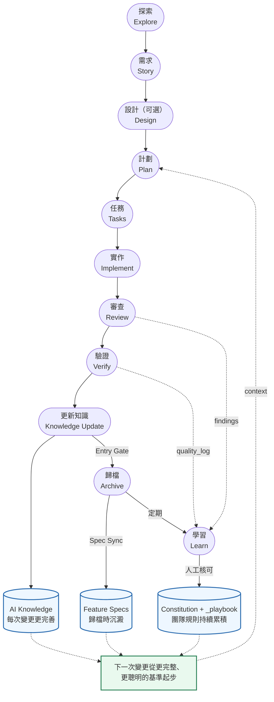
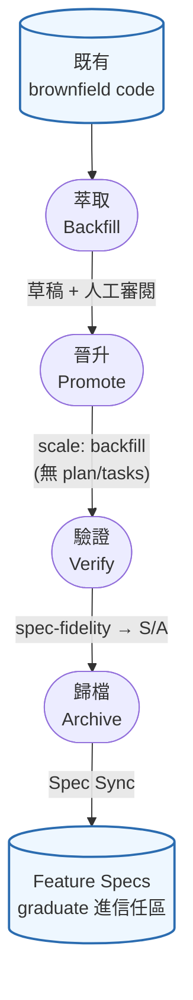

# Prospec

<div align="center">

[](LICENSE)
[](https://www.typescriptlang.org/)
[](tests/)
[](https://nodejs.org/)
[](https://pnpm.io/)

**為 AI coding agent 打造的漸進式規格驅動開發 (SDD) 工具組**

*Slash-command Skills · 結構化 AI Knowledge · MCP server — 支援 Claude Code、Copilot、Codex*

[English](./README.md) • [快速上手](#快速上手) • [為什麼選擇 Prospec？](#為什麼選擇-prospec) • [運作原理](#運作原理)

**本專案 fork 自 [ci-yang/prospec](https://github.com/ci-yang/prospec)**

</div>

---

## 什麼是 Prospec？

Prospec 是一套**以 Skills 為核心的規格驅動開發（SDD）工具組**，為 AI 編程 Agent 而設計。日常工作以 slash-command **Skills 在 Agent 內**驅動（Claude Code、Antigravity、Copilot、Codex）；輕量 **CLI** 只負責 bootstrap 專案並重新生成 Skills／Knowledge。成效：你的 Agent 遵循一致的 `story → plan → tasks → implement → review → verify → archive` 工作流，並立基於結構化、版控的專案知識。

三個元件協同運作：

```
  你 ⇄ AI agent
     │
     ├─ Skills .......... 執行工作流：story → plan → tasks →
     │                    implement → review → verify → archive
     │                        ▲
     │                        │ 讀取並擴充
     ├─ AI Knowledge .... 結構化的專案記憶（模組、規格、教訓）
     │                        ▲
     │                        │ 由此生成／重新生成
     └─ CLI (prospec) ... 僅負責 bootstrap：init、agent sync、knowledge init / re-scan structure
```

- **Skills** 在 Agent 內執行工作流 —— 日常操作面。
- **AI Knowledge** 是漸進式的專案記憶，Skills 讀取它、並隨每次變更擴充它。
- **CLI** 是一次性／偶爾使用的工具：建立專案骨架、重新生成 Skills + Knowledge —— **不在** runtime 迴圈內。

**適合誰？** 使用 AI 編程 Agent、希望在新專案（Greenfield）或既有程式碼庫（Brownfield）上獲得可重複、可審查工作流的開發者。

## 為什麼選擇 Prospec？

| 挑戰 | Prospec 如何解決 |
|------|------------------|
| AI 不了解你的程式碼庫 | `prospec knowledge init` + `/prospec-knowledge-generate` 自動掃描並生成 AI 可讀文件 |
| Context window 限制 | 漸進式揭露：先載入摘要，細節按需取用（vs full-dump 省 70%+ tokens） |
| AI 工作流不一致 | 結構化 Skills 強制執行 `story → plan → tasks → implement → review → verify → archive` |
| 供應商鎖定 | 支援 4+ AI CLI，知識儲存在通用 Markdown 格式 |
| 設計到程式碼斷裂 | `/prospec-design` 生成視覺 + 互動規格，整合 MCP 工具 |
| Knowledge 容易過時 | verify S/A commit prompt 把 Knowledge Update 折入 feature commit；archive Entry Gate 為 backstop 複核 |
| verify 過了仍出細微 bug | `/prospec-review` —— implement 與 verify 間的獨立對抗式審查 |
| 教訓無法跨 session 留存 | `/prospec-learn` —— 反覆出現的修正經人工核可晉升為版控的團隊規則 |

> 每一列都對應下方的某個 Skill 或命令 —— 見 [AI Skills](#ai-skills) 與 [CLI 命令](#cli-命令)。

---

## 快速上手

從零到第一個 AI 驅動變更，約五分鐘。

### 前置需求

- **Node.js** >= 22.13.0
- **AI CLI**（至少一個）：[Claude Code](https://docs.anthropic.com/claude/docs/claude-code)（推薦）、[Codex CLI](https://developers.openai.com/codex/cli)、[GitHub Copilot CLI](https://docs.github.com/copilot/github-copilot-in-the-cli) 或 [Antigravity CLI](https://antigravity.google/)

### 1. 安裝

Prospec 是 **bootstrap／update 用的 CLI** —— `prospec quickstart` 跑完後（它會串接 `init` + `agent sync`），你的 Agent 用的是已 commit 的 Skills 與 Knowledge（Markdown），除非要重新生成，否則不會再用到 binary。所以全域安裝一次即可。

```bash
npm install -g github:benwu95/prospec     # 或：pnpm add -g github:benwu95/prospec
prospec --help                            # 驗證
```

<details>
<summary>其他安裝方式（npx，或專案內固定版本）</summary>

Prospec 是尚未發佈的 fork —— npm/pnpm 會 clone repo、裝 dev deps，並透過 `prepare` script 自動 build。

用 npx 按需執行（每次 clone + build）：

```bash
npx github:benwu95/prospec quickstart
```

想在專案內固定版本，讓重跑 `agent sync` 時所有貢獻者都生成相同的 Skills——也讓下游開發者免全域安裝即可經 `pnpm exec` / `npx` 執行 deterministic 的 `prospec knowledge init --raw-scan-only`（由 `/prospec-knowledge-generate` 與 `/prospec-archive` 觸發以保持 `raw-scan.md` 最新）。**Node.js 專案**改裝成 devDependency（其他語言生態：以全域安裝為主）：

```bash
npm install -D github:benwu95/prospec     # 或：pnpm add -D github:benwu95/prospec
```

</details>

### 2. 建立專案骨架

一個指令完成 deterministic 的設定 —— 它會串接 `init` + `agent sync`，已完成的步驟自動跳過：

```bash
cd my-project                 # 新專案或既有專案
prospec quickstart            # → 選擇 AI Assistant、選擇文件語言；建立 .prospec.yaml + 各 agent config + Skills
```

`prospec quickstart` 會執行 `agent sync`，寫入 **Claude Code** → `CLAUDE.md` + `.claude/skills/`；**Antigravity / Codex / Copilot** → `AGENTS.md` + `.agents/skills/`。接著在你的 AI Agent 中完成收尾：

```bash
/prospec-quickstart           # 在地化 skill triggers、重新同步 config、生成 AI Knowledge
```

這個一次性收尾步驟可重複執行且會自我終止；在既有程式碼庫上，它會把你的模組讀進 AI Knowledge，讓 Agent 在你的第一個變更前就理解它們。

### 3. 跑你的第一個變更（在 AI Agent 中）

你不需要記得每一步 —— **用自然語言描述你要的變更，Agent 就會自己跑完整個 SDD 迴圈**，只在需要時停下來問你問題、並徵詢每次的交接：

```text
你 ▸ 用 prospec 幫我加一個深色模式切換

Agent 接手需求並執行 /prospec-ff：
  • 問幾個範圍 / 驗收問題 —— 你用自然語言回答
  • 寫出 story → plan → tasks，接著在每個階段交接：

  "Run /prospec-implement now? (Y/n)"             → Y
  implement → "Run /prospec-review now? (Y/n)"    → Y
  review    → "Run /prospec-verify now? (Y/n)"    → Y
  verify 達到 grade A → 提示你 commit              → Y
         → "Run /prospec-archive now? (Y/n)"      → Y   ✓ 已歸檔
```

每個階段結束時都會告訴你下一步、並等你按 `Y` —— 按 `n` 就停下、提示會保留，你可以稍後回來接續，不必記得自己進行到哪。`/prospec-verify` 是 commit 邊界：達 S/A 時它會提示你 commit（絕不替你 commit），接著才提議歸檔。

想自己逐步驅動？也可以明確執行：

```bash
/prospec-explore                   # （可選）先釐清需求
/prospec-new-story add-my-feature  # 把需求記錄成結構化 story
/prospec-design                    # （可選）UI / 互動規格
/prospec-plan                      # 設計實作（`quick` scale 的變更會跳過）
/prospec-tasks                     # 把計劃拆成有序的任務清單
#   ↑ 用 /prospec-ff add-my-feature 一次收合 story → plan → tasks
/prospec-implement                 # 逐項實作（先不 commit）
/prospec-review                    # 對抗式審查 → fix 迴圈
/prospec-verify                    # 驗證；達 S/A 後提示你 commit
/prospec-archive                   # 歸檔 + 同步規格與知識
/prospec-learn                     # （定期）把反覆出現的教訓晉升為團隊規則
```

這就是完整的 SDD 迴圈。由於 `/prospec-quickstart` 已經先生成了 AI Knowledge，Agent 一開始就理解你的模組。下方完整的 Greenfield 與 Brownfield 流程會逐步拆解 `prospec quickstart` 自動完成的每個步驟。

<details>
<summary>Greenfield 與 Brownfield 的 bootstrap 差異 —— 兩個指令展開後做了什麼</summary>

#### Greenfield（新專案）
`prospec quickstart` → `/prospec-quickstart` 就是完整的 bootstrap

```bash
mkdir my-project && cd my-project
prospec quickstart --name my-project   # init + agent sync（互動式選擇 assistant 與語言）
# 接著在你的 AI Agent 中：
/prospec-quickstart                     # 在地化 triggers · 重新同步 · 生成 AI Knowledge
```

這兩個指令展開後是：

```bash
# `prospec quickstart` 執行：
prospec init --name my-project   # → 選擇要啟用的 AI Assistant（互動式 checkbox）
                                 # → 選擇文件主要語言（預設英文，或用
                                 #   --language "Traditional Chinese (Taiwan)"）；[MUST]
                                 #   Language Policy 規則會寫入 CONSTITUTION.md —
                                 #   程式碼與 git commit message 一律維持英文
                                 # → 建立 .prospec.yaml + 目錄結構
prospec agent sync               # → 各 agent config + Skills（Claude Code → CLAUDE.md +
                                 #   .claude/skills/；Antigravity / Codex / Copilot →
                                 #   AGENTS.md + .agents/skills/）

# `/prospec-quickstart` 接著在你的 AI Agent 中：
#   • 文件語言非英文？它會為 .prospec.yaml 的 `skill_triggers` 提議母語觸發詞，
#     經你確認後重跑 agent sync —— skills 就能匹配你用母語描述的需求
#   • prospec knowledge init → /prospec-knowledge-generate（生成 AI Knowledge）
```

空專案上，`/prospec-knowledge-generate` 會產出一份最小的 Knowledge base，隨著你持續出貨變更逐步補完。接著就照上面步驟 3 跑你的第一個變更。

#### Brownfield（既有專案）
同樣兩個指令；`/prospec-quickstart` 會把你既有的程式碼讀進 AI Knowledge

```bash
cd existing-project
prospec quickstart                      # 自動偵測技術棧；執行 init + agent sync
# 接著在你的 AI Agent 中：
/prospec-quickstart                     # 在地化 triggers · 重新同步 · knowledge init · /prospec-knowledge-generate
```

這兩個指令展開後是：

```bash
# `prospec quickstart` 執行：
prospec init          # → 自動偵測技術棧；選擇 AI Assistant；選擇文件主要語言
                      #   （預設英文；--language 可跳過互動提示）
prospec agent sync    # → 各 agent config + Skills

# `/prospec-quickstart` 接著在你的 AI Agent 中：
prospec knowledge init       # → 生成 raw-scan.md + 空骨架（prospec/index.md、_conventions.md、module-map.yaml）
/prospec-knowledge-generate  # → AI 讀取 raw-scan.md，決定模組切割，
                             #   建立 modules/*/README.md + 填充 prospec/index.md
```

這裡的 `knowledge init` 會讀取你既有的程式碼，所以 `/prospec-knowledge-generate` 一開始就產出內容豐富的 Knowledge base。接著就照上面步驟 3 跑你的第一個變更 —— 開發迴圈與 Greenfield 完全相同。

`knowledge init` 捕捉的是程式碼*怎麼*組織，但 brownfield 模組通常仍缺少描述它*做什麼*的 Feature Spec。補上這個 WHAT 層缺口是一條獨立的一等流程 —— 見下方 **[Backfill：把既有程式碼納進信任區](#backfill把既有程式碼納進信任區)**。它不屬於 bootstrap，可在任何時候執行。

</details>

<details>
<summary>完成 Quickstart 後的目錄佈局（<code>prospec quickstart</code> + <code>/prospec-quickstart</code>）</summary>

```
your-project/
├── .prospec.yaml              # Prospec 配置
├── CLAUDE.md                  # Claude Code 配置（Layer 0，<100 行）
├── AGENTS.md                  # Antigravity / Codex / Copilot 配置（agents.md 標準）
├── {base_dir}/
│   ├── README.md              # 給本專案讀者的 Prospec 簡短說明
│   ├── CONSTITUTION.md        # 專案規則（使用者定義）
│   ├── index.md               # AI 進入點與模組索引（Markdown 表格）
│   ├── specs/
│   │   ├── product.md         # Product Spec（PRD 入口）
│   │   └── features/          # 活的 Feature Spec（累積）
│   └── ai-knowledge/
│       ├── _conventions.md    # 專案慣例
│       ├── _playbook.md       # /prospec-learn 晉升的團隊教訓（人工核可）
│       ├── _lessons-ledger.md # 累積的教訓 ledger，Archive 時自動 feed（版控）
│       ├── raw-scan.md        # 自動生成的專案掃描資料
│       ├── module-map.yaml    # 模組依賴關係
│       ├── feature-map.yaml   # Feature→module 索引（選配；archive 時 bootstrap）
│       └── modules/
│           └── {module}/
│               └── README.md  # 模組專屬文件
├── .prospec/                  # 變更管理（不 commit）
│   ├── changes/
│   │   └── {change-name}/
│   │       ├── proposal.md        # User Story + 驗收標準
│   │       ├── design-spec.md     # 視覺規格（可選，UI 變更時）
│   │       ├── interaction-spec.md # 互動規格（可選）
│   │       ├── plan.md            # 實作計劃
│   │       ├── tasks.md           # 任務拆解（checkbox 格式）
│   │       ├── delta-spec.md      # Patch Spec（ADDED/MODIFIED/REMOVED）
│   │       └── metadata.yaml      # 變更生命週期 metadata
│   └── archive/               # 已歸檔的完成變更
├── .claude/skills/            # Claude Code 的 Skills（每個 skill 一個目錄）
│   ├── prospec-explore/
│   ├── prospec-new-story/
│   ├── prospec-design/
│   ├── prospec-plan/
│   ├── prospec-tasks/
│   ├── prospec-ff/
│   ├── prospec-implement/
│   ├── prospec-review/
│   ├── prospec-verify/
│   ├── prospec-archive/
│   ├── prospec-learn/
│   ├── prospec-knowledge-generate/
│   ├── prospec-knowledge-update/
│   ├── prospec-backfill-spec/
│   ├── prospec-promote-backfill/
│   ├── prospec-quickstart/       # 一次性啟動收尾（部署於磁碟，排除於 entry config）
│   └── prospec-upgrade/          # 版本升級收尾（部署於磁碟，排除於 entry config）
└── .agents/skills/            # 同一組 skills，agents.md 格式（Antigravity / Codex / Copilot）
    └── prospec-*/
```

</details>

---

## 運作原理

Prospec 跑一條線性流程，外包兩條回饋迴圈，讓它**越用越好**，而非單純重複。



每次 **Archive** 都讓 **AI Knowledge** 更完善（隨每個變更累積），而反覆出現的教訓 —— review findings、跨階段 `quality_log`、session corrections —— 經**人工核可**晉升為持續累積的團隊規則（`Constitution` + `_playbook`）。所以下一次變更不從零開始，而是從更完整、更聰明的基準起步。

流程同時是 **scale-aware** 的：經使用者確認的 `quick` 變更會完全跳過 Plan 階段（`story → tasks`），並由 archive 時的 backstop 把關 —— 見[相稱流程](#相稱流程scale)。

### 核心原則

Prospec 強制執行 6 大核心原則，約束的對象是注入使用者專案的 prospec 資產 —— 生成的 Skills、配置與目錄結構：

1. **Progressive Disclosure First** — 永遠不要一次載入所有資訊；索引 → 細節
2. **Spec is Source of Truth** — 變更在寫程式碼前先記錄在規格中
3. **Zero Startup Cost for Brownfield** — 不需要預先文件化整個程式碼庫
4. **AI Agent Agnostic** — 透過 Markdown adapters 支援任何 AI CLI
5. **User Controls the Rules** — Constitution 由使用者定義，工具負責強制執行
6. **Language Policy** — AI 產出文件使用 `prospec init` 時選擇的語言（預設英文）；程式碼、專業術語與 git commit message 一律英文

---

## Backfill：把既有程式碼納進信任區

Brownfield 專案累積了大量「沒有 Feature Spec 描述」的行為。**Backfill** 是一條一等、雙 skill 的流程：從程式碼反向萃取這些行為，並把它 graduate 進規格信任區（`prospec/specs/features/`）—— 而且**從不手寫信任區**（archive 維持唯一寫入者）。



1. **萃取** —— `/prospec-backfill-spec` 讀程式碼（與 tests、git history、docs）、stage 一份 route-compatible 的 `backfill-draft.md`；無法從程式碼推得的 intent 標 `[NEEDS CLARIFICATION]`，絕不捏造。
2. **審閱** —— 解決每個 `[NEEDS CLARIFICATION]`（*So that* 價值、目標角色、模糊 AC），確認候選 feature slug。這是人工關卡。
3. **晉升** —— `/prospec-promote-backfill` 把審閱過的草稿展開為 change scaffold（proposal + delta-spec + metadata），標記 `scale: backfill`、`status: implemented`。`backfill` 是像 `quick` 的**輕量 scale** —— 不產空殼 `plan.md`/`tasks.md`，因為程式碼已存在。
4. **驗證** —— `/prospec-verify` 改評 **spec-fidelity**（每條 REQ 的 `file:line` 須成立），把既有程式碼品質落差（如未測的 brownfield code）記為 informational 技術債，且此降級僅在 `backfill-draft.md` 證明 provenance 時套用 —— 因此忠實的草稿能達 S/A、不被它只是「記錄」的技術債擋住，而 marker 也無法替新程式碼 bypass 品質 gate。
5. **歸檔** —— `/prospec-archive` 把需求 graduate 進 `prospec/specs/features/{slug}.md`。這是唯一會寫信任區的環節。

---

## 升級 Prospec

當有新版 prospec 時，重跑安裝以拉取最新（它是未發布的 GitHub fork，重跑會重新 clone + build 當前 commit）：

```bash
npm install -g github:benwu95/prospec     # 或：pnpm add -g github:benwu95/prospec
# 釘選成專案 devDependency：npm install -D github:benwu95/prospec
```

接著用兩步把既有專案帶到最新——先一個決定性的 CLI 步驟，再一個需同意的 AI 步驟：

```bash
prospec upgrade                  # CLI（zero-LLM）：記錄新版本、重新同步 agents + 建立缺少的 init 文件
```

```text
/prospec-upgrade                 # 在 AI agent 內：補齊已建文件 + 遷移漂移的 init 文件格式 + 在地化新 skill 觸發詞（每項變更前先問你）
```

- **`prospec upgrade`（CLI）** 在 `.prospec.yaml` `version` 記錄當前 prospec 版本（就地合併、保留你的註解與格式）、重跑 `agent sync` 讓各 agent 設定與 Skills 對齊最新模板、將決定性的 `raw-scan.md` 刷新到新版掃描器，並印出 migration report（版本差異；**docs inventory** 逐檔列出 `prospec init` 會建立的每份文件為 present 或 missing——清單與 init 本身用同一份 registry 推導，因此不可能漏列；接著在專案從未選擇語言時（例如由 pre-feature CLI 建立的專案）提示可設定 `artifact_language`，否則列出任何缺母語觸發詞的新 skill）。在互動式終端機中,它會像 `prospec init` 一樣逐一提示你填寫這些 nudge;piped/CI 執行——以及 `/prospec-upgrade` skill——會帶 `--no-interactive`,只取得報告。它會**補建任何缺少的 init 文件**，以 `prospec init` 所用的同一份模板 render（skip-if-exists）——因此新版 prospec 新增的文件不必重跑 `prospec init`（檔案存在後 init 會被擋）即可補上——但它**絕不覆寫或重排既有文件**：`CONSTITUTION.md`、`_conventions.md`、`prospec/index.md`、canonical convention docs 與 module README 皆逐位元不變（遷移既有文件格式是 skill 的工作；另一個寫入 `ai-knowledge/` 的只有可隨時重生的 `raw-scan.md`）。
- **`/prospec-upgrade`（Skill）** 完成 CLI 無法安全做的判斷工作：依 report 的 docs inventory 逐檔處理——對存在的文件對照最新模板、對任何**格式**落差提出更新；**補齊** CLI 剛補建、但需要 baseline 以上內容的文件（例如 `index.md` 的真實 modules table，或遷移舊 `_index.md` 的策展欄位）；並作為安全網，對任何仍標記 missing 的文件（補建失敗者）提議建立——**逐檔徵詢你的同意**（絕不覆寫你撰寫的內容）。接著依 `artifact_language` 為任何新 skill 在地化觸發詞（只補缺的），並重跑 `agent sync`。

> `.prospec.yaml` `version` 是專案上次升級到的 prospec 版本（舊的 `version: "1.0"` 視為過時、首次 `prospec upgrade` 時更新）。新增 skill 後想（重新）在地化觸發詞？直接重跑 `prospec agent sync` —— 它會具名列出任何缺 `skill_triggers` 條目的 skill，你只補缺口即可。永遠不需要刪除 `.prospec.yaml`。

---

## AI Skills

Prospec 生成 17 個 Skills —— 15 個涵蓋完整 SDD 生命週期，外加兩個週期性收尾：`/prospec-quickstart`（啟動）與 `/prospec-upgrade`（版本升級）：

| Skill | Slash Command | 說明 |
|-------|---------------|------|
| **探索** | `/prospec-explore` | 思考夥伴，協助釐清需求 |
| **新需求** | `/prospec-new-story` | 建立結構化的變更需求 |
| **設計** | `/prospec-design` | 生成視覺 + 互動規格（Generate/Extract 雙模式） |
| **計劃** | `/prospec-plan` | 生成實作計劃 + delta-spec |
| **任務** | `/prospec-tasks` | 拆分為可執行的任務 |
| **快速前進** | `/prospec-ff` | 一次生成 story → plan → tasks |
| **實作** | `/prospec-implement` | 逐項實作任務，MCP 優先讀取設計資料 |
| **審查** | `/prospec-review` | 對抗式審查 → fix 迴圈；經驗證確認的 critical 自動修，帶 spec-aware lens |
| **驗證** | `/prospec-verify` | 5+1 維度稽核，含品質等級（S/A/B/C/D）；達 S/A 後提示 commit |
| **歸檔** | `/prospec-archive` | 歸檔變更 + Spec Sync + Knowledge 同步 Entry Gate |
| **學習** | `/prospec-learn` | 回饋晉升：反覆出現的教訓 → 團隊 `_playbook` / Constitution（可審計、人工核可） |
| **知識生成** | `/prospec-knowledge-generate` | AI 驅動的模組分析與知識建立 |
| **知識更新** | `/prospec-knowledge-update` | 基於 delta-spec 的增量知識更新 |
| **回填規格** | `/prospec-backfill-spec` | 從既有 brownfield code 反向萃取 Feature Spec 草稿（僅 stage 草稿，絕不直寫信任區） |
| **晉升回填** | `/prospec-promote-backfill` | 把審閱過的回填草稿定型化為 backfill change scaffold（proposal + delta-spec + metadata、`scale: backfill`、`status: implemented`;輕量 scale —— 無 plan/tasks）；絕不直寫信任區 |
| **快速開始** | `/prospec-quickstart` | `prospec quickstart` 執行 init + agent sync 後，依 artifact language 在地化 skill 觸發詞、準備 Knowledge 掃描，並串接 `/prospec-knowledge-generate` 生成 AI Knowledge;絕不直寫信任區 |
| **升級** | `/prospec-upgrade` | `prospec upgrade` 記錄版本、重新同步 agents 並補建缺少的 init 文件後，依 report 的 docs inventory 逐檔處理：遷移漂移的 init 文件格式 + 補齊已建文件，並為新增 skill 補譯觸發詞（只補缺）—— 每步附確認 + diff／內容預覽；絕不覆寫你撰寫的內容 |

> **週期性收尾** —— `/prospec-quickstart`（`prospec quickstart` 後執行一次）與 `/prospec-upgrade`（版本升級時於 `prospec upgrade` 後執行）完成 CLI 無法決定性處理的判斷步驟。兩者皆以 Skill 形式部署於磁碟，但不列入常駐 entry config，因此不增加任何重複性 token 成本。

### 品質閘門與自我改進

除了線性流程，每個 workflow Skill 都內建品質機制：

- **Output Contract** — 每個 Skill 對客觀準則自評 `Met N/M | Overall: PASS|WARN|FAIL`，不必逐行檢查 artifact。
- **Entry / Exit gates** — Skill 啟動前檢查前置條件（Entry）、結束時比對 Constitution（Exit）；WARN/FAIL 記入跨階段 `quality_log`，讓前一階段的疑慮在下一階段被 surface。
- **Skill 指令品質** — 每個 numbered phase 帶自己的 gate checklist（比 skill 層 Entry/Exit gate 更細）；線性流程 Skill（plan→tasks→implement→review→verify→archive）結尾有 status-aware 的**下一步 handoff**（`Run <next-step> now? (Y/n)` —— 你的 Y 才是觸發、絕不靜默 auto-run）；新 session 偵測進行中的變更以接續；`/prospec-implement` 每完成一個 task 後重錨 `Progress X/Y | Goal | Next`；`/prospec-explore` 與 `/prospec-knowledge-generate` 在 Constitution 仍實質空白時提醒（否則其 gate 形同 no-op）。
- **可執行 Constitution** — 規則帶 RFC-2119 嚴重度（MUST→FAIL／SHOULD→WARN／MAY→資訊性），由 `/prospec-verify` 分級。
- **確定性 drift 閘門** — `prospec check` 以零 token 機器驗證 spec ↔ code ↔ knowledge 的指涉完整性；`/prospec-verify` 在開發期消費同一份報告，scaffold 出的 CI workflow 在每個 PR 強制執行。搭配選配的 `feature-map.yaml`（feature→module 索引，archive 時 bootstrap）再加兩條治理檢查：REQ-prefix 合法性（WARN）與 feature→module 邊（FAIL）。
- **對抗式審查** — `/prospec-review` 位於 implement 與 verify 之間：獨立 fresh-context reviewer 審整個 change diff；僅經驗證確認、可 drop-in 的 critical 自動修，其餘升級給人。**commit 邊界**在 verify 達 S/A **之後**，讓 implement + review + verify 的修正落入單一 atomic commit（prospec 提示、絕不自動 commit）。
- **回饋晉升** — 每個 **Archive** 都自動 harvest 該變更反覆出現的教訓進版控的 `_lessons-ledger.md`；`/prospec-learn` 以明文可重現準則（頻次 + 影響模組數）評分，**僅在顯式人工核可後**晉升進團隊 `_playbook.md` 或 Constitution。

### 相稱流程（Scale）

不是每個變更都值得完整儀式。story 階段由 `/prospec-new-story`（或 `/prospec-ff`）依明文判準評估複雜度並建議 scale —— **經你確認後**才寫入 `metadata.yaml`：

| Scale | 流程差異 |
|-------|---------|
| `quick` | 精簡 proposal（單 Story、免 FR/SC 枚舉）、**完全跳過 plan 階段**（`story → tasks`）、不載入模組 README；review/verify 的 delta-spec 維度標示 `not-applicable`（絕不偽裝 PASS） |
| `standard`（預設；既有變更無欄位即此級） | 現行精簡流程 —— plan ≤ 120 行 |
| `full` | 完整架構分析 —— 擴充 Technical Summary、逐進入點 Call Chain |

兩道誠實的 backstop 防止 `quick` 變成 spec drift 破口：評估階段就把「預期影響 spec-covered 行為」的變更**否決出 quick**；`/prospec-archive` Entry Gate 再以**實際 diff** 複核 —— 有 spec 影響即阻擋歸檔，直到補上極簡 Spec Impact 段落，knowledge-sync gate 則改由 diff 檔案路徑推導受影響模組（不依賴缺席的 delta-spec）。工程紀律不隨 scale 縮減：TDD、對抗式審查、Constitution 稽核在每個級別照常執行。

任務同時帶 **kind** 標記（`[M]` manual、`[V]` verification、無標記＝code）：完成率只計 code task，「手動跑個指令」之類未勾選的提醒不會卡住或扭曲任何 gate。

<details>
<summary>Cache 穩定前綴排序（進階內部機制）</summary>

每個 skill 的 Startup Loading 區段以**靜態優先**排序，讓 provider 的 prompt cache（Anthropic 顯式 `cache_control`、OpenAI/Gemini 自動 prefix caching）能跨觸發重用最長前綴。每個載入項帶兩種標注之一：

- **`[STABLE]`** — 僅在 `agent sync` 或治理變更時改動：啟動即需的 `references/` 格式規格、Constitution、`_conventions.md`。最先載入。（`ff` / `plan` / `archive` 的分階段格式規格改為**逐 phase on-demand** 讀取 —— 移出穩定前綴，中途 abort 就不必為後續 phase 的格式付出成本。）
- **`[DYNAMIC]`** — 隨 knowledge 更新、change 或每次觸發變動：`prospec/index.md`（cache boundary 後第一位）、模組 README、`_playbook.md`、Feature/Product Specs、`.prospec/changes/` artifacts。最後載入。

判準是**跨請求前綴穩定性**，不是「是否由模板生成」：entry config 的 Available Skills 列表每專案固定（只在 skill 集變動時改變），因此屬 `[STABLE]`。Extension 開發者新增 skill 須遵循同一排序 —— 靜態在 boundary 前、動態在後 —— 否則每次觸發都打破 cache 前綴。harness 量測的是 **prospec 組裝管線**（corpus 組裝的是 knowledge 檔案，非 skill 模板本身）—— 見下方 Token 量測。模板層重排的效果發生在 agent 部署層，不在 harness 可觀測範圍（deliberate exclusion）：其效益依據各 provider 文件化的 prefix-caching 語意推導，而非 before/after 直接量測。

</details>

---

## CLI 命令

### 基礎設施命令

| 命令 | 說明 |
|------|------|
| `prospec quickstart [options]` | 一鍵啟動：執行 `init` + `agent sync`（跳過已完成步驟），接著在 AI agent 內交棒給 `/prospec-quickstart` 做 trigger 在地化與 Knowledge 生成。`--name`/`--agents`/`--language` 選項同 `init` |
| `prospec upgrade [--cwd <dir>]` | prospec 版本升級後：在 `.prospec.yaml` 記錄 prospec `version`（就地合併、保留註解與格式）、重跑 `agent sync`、**建立任何缺少的 init 文件**（以其模板 render、skip-if-exists），並印出含 docs inventory + 本次建立清單的 migration report，接著交棒給 `/prospec-upgrade`。絕不覆寫既有文件 —— 格式遷移與補齊已建文件由需同意的 skill 處理 |
| `prospec init [options]` | 初始化 Prospec 專案結構（`--language` 設定 AI 產出文件語言，預設英文） |
| `prospec knowledge init [--depth <n>] [--dry-run] [--raw-scan-only]` | 掃描專案 → 生成 raw-scan.md + curated 骨架（module-map.yaml / prospec/index.md / _conventions.md，僅在缺檔時）。`--raw-scan-only` **僅**重新產生 raw-scan.md（deterministic、不使用 LLM），不碰 curated 檔 — 程式碼變動後或 `/prospec-knowledge-generate` 前執行以刷新結構快照 |
| `prospec agent sync [--cli <name>]` | 同步 AI Agent 配置 + 生成 Skills（讀取 .prospec.yaml 的 `skill_triggers` 注入母語觸發詞） |

> **Agent 配置佈局** — `agent sync` 為每個偵測到的 agent 生成 entry 配置 + Skills：
> - **Claude Code** → `CLAUDE.md` + `.claude/skills/`
> - **Antigravity / Codex / GitHub Copilot** → `AGENTS.md` + `.agents/skills/`（共用 [agents.md](https://agents.md) 開放標準；多者同時啟用時只寫一次）
>
> 你的編輯是安全的：entry 配置帶有 `prospec:auto` / `prospec:user` 區塊。`agent sync`（以及 `init` 對 `AGENTS.md`）只更新 auto 區塊，並保留你寫在 user 區塊的內容；既有的手寫 `CLAUDE.md` / `AGENTS.md` 會在首次 sync 時遷入 user 區塊，而非被覆蓋。
>
> 從舊版 Prospec 升級？重新 sync 後請移除不再使用的 `GEMINI.md`、`.gemini/skills/`、`.codex/skills/`、`.github/copilot-instructions.md` 與 `.github/instructions/`。

#### 進階設定 (Advanced Configuration)

Prospec 的知識系統會在 Agent 啟動時預設載入 `_conventions.md`（與 `CONSTITUTION.md`）。如果你有其他全域共用的規範檔（例如 API 規範、資安規範等）也希望能做為 Core Conventions 預設載入，可以在 `.prospec.yaml` 中加入 `additional_core_conventions`：

```yaml
knowledge:
  additional_core_conventions:
    - _api-conventions.md
    - _security-conventions.md
```

這些檔案路徑相對於 `ai-knowledge/` 目錄。加上此設定後，它們就會與 `_conventions.md` 一同被預先載入，成為 AI Agent 的全域核心指示。

#### 專案掃描支援語言

`prospec knowledge init`（含 `--raw-scan-only`）會將下列語言偵測進 `raw-scan.md`。偵測為 deterministic（不使用 LLM、不連網）且 best-effort，各區塊涵蓋程度不同：

| 語言 | Tech Stack | Dependencies | Entry Points | Config Files |
|------|:---:|:---:|:---:|:---:|
| JavaScript / TypeScript | ✅（含 framework） | ✅ `package.json` | ✅ | ✅ |
| Python | ✅ | ✅ `pyproject.toml` / `requirements.txt` | ✅ | ✅ |
| Go | ✅ | ✅ `go.mod` | ✅ | ✅ |
| Rust | ✅ | ✅ `Cargo.toml` | ✅ | ✅ |
| Java / Kotlin | ✅ Maven / Gradle | ✅ `pom.xml` ¹ | ✅ | ✅ |
| C# | ✅ | ✅ `*.csproj` | ✅ | ✅ |
| Ruby | ✅ | — ² | ✅ | ✅ |
| PHP | ✅ | ✅ `composer.json` | — | ✅ |
| C | ✅ ³ | ✅ `vcpkg.json` / `conanfile.txt` ⁴ | ✅ | ✅ |
| C++ | ✅ ³ | ✅ `vcpkg.json` / `conanfile.txt` ⁴ | ✅ | ✅ |
| Swift | ✅ `Package.swift` | — ⁵ | ✅ | ✅ |

¹ Java 依賴僅讀取 Maven `pom.xml`——Gradle 的 Groovy/Kotlin DSL 不做靜態解析。² Ruby 依賴不解析（`Gemfile` 為 Ruby DSL）。³ C 與 C++ 由原始碼副檔名推斷；可於 `.prospec.yaml` 設 `tech_stack` 覆寫。⁴ C/C++ 依賴僅讀宣告式 manifest——`CMakeLists.txt` 與 `conanfile.py` 為命令式、不解析。⁵ Swift 依賴不解析（`Package.swift` 為命令式 Swift）。未辨識的語言仍會出現在 Directory Tree 與 File Stats 區塊。

**表外的語言？** 仍會掃描——Directory Tree 與 File Stats 永遠有值，且 `/prospec-knowledge-generate` 會直接讀原始碼。Tech Stack 會落為 `unknown`；可於 `.prospec.yaml` 的 `tech_stack` 權威宣告（free-form——覆蓋自動偵測，並以 `Source: config` 呈現）：

```yaml
tech_stack:
  language: zig
  package_manager: zig build
```

Entry Points、Dependencies、Config Files 沒有逐語言覆寫機制——未加偵測 pattern 前，對未辨識語言維持空白（掃描不會自行捏造）。

### 變更管理命令

| 命令 | 說明 |
|------|------|
| `prospec change story <name>` | 建立變更需求（骨架） |
| `prospec change plan [--change <name>] [--force]` | 生成實作計劃（骨架）；除非加 `--force`，否則拒絕覆寫既有 plan/delta-spec |
| `prospec change tasks [--change <name>] [--force]` | 拆分任務清單（骨架）；除非加 `--force`，否則拒絕覆寫既有 tasks.md |

> **注意**：這些命令建立空的變更骨架。Skills（`/prospec-new-story`、`/prospec-ff` 等）現在會直接建立 `.prospec/changes/<name>/` 及其檔案，因此工作流程不會呼叫它們 —— 但它們仍保留供手動或腳本化建立骨架使用。

### MCP Server

以 stdio 啟動的**唯讀** MCP server，把專案真相 —— 架構、規格、依賴方向、已晉升 playbook 與知識新鮮度 —— 暴露給任何支援 MCP 的 agent，即使沒裝 Prospec Skills。

| 命令 | 說明 |
|------|------|
| `prospec mcp serve [--cwd <path>]` | 以 stdio 啟動**唯讀** MCP server —— 任何支援 MCP 的 agent（即使沒裝 Prospec Skills）都能查詢專案的架構真相、規格真相、依賴方向、已晉升 playbook 與知識新鮮度。`--cwd` 釘住專案根目錄，讓單一 agent 不論從何處啟動都能同時跑多個專案 server |

**Resources**（每次請求都重新讀檔 —— client 永遠看到當前檔案狀態）：

| URI | 內容 |
|-----|------|
| `knowledge://index` | AI Knowledge 模組索引（`prospec/index.md`） |
| `knowledge://module/{name}` | 單一模組的 Recipe-First README |
| `knowledge://module-map` | 模組邊界 + `depends_on`（`module-map.yaml`） |
| `knowledge://feature-map` | feature → module 索引 + REQ prefixes（`feature-map.yaml`） |
| `knowledge://playbook` | 人工核可的團隊 lessons（`_playbook.md`） |
| `knowledge://health` | 各模組 staleness + coverage —— 與 `prospec check` 同一份純函式 |
| `spec://product` | Product spec —— PRD 入口 + feature map（`product.md`） |
| `spec://feature/{name}` | Feature specs（REQ source of truth）；archived specs 以與 `prospec check` 同一條規則排除 |

**Tools**：`search_modules`（這個概念歸哪個模組 —— 對策展索引欄位做正規化 term-OR 比對，
查 `drift checker` 找得到 `drift-checker`）與 `get_dependency_direction`（`from` 可否 import `to`？
—— 依 module-map `depends_on` 回答，無 map 時用 Constitution 鏈，回應標明判定來源）。

**註冊方式** —— 把 agent 的 MCP 設定指向 `prospec mcp serve --cwd <專案根目錄>`。`--cwd` 釘住專案，
讓 server 不論 agent 從何處啟動都能解析到該專案的 `.prospec.yaml` —— 也因此單一 agent 能一次註冊多個
專案。假設採用推薦的全域安裝（`prospec` 已在 PATH 上）。

Claude Code：

```bash
claude mcp add project-name -- prospec mcp serve --cwd /path/to/project
```

其他 agent —— 在其 JSON MCP 設定中用同一個命令：

```json
{
  "mcpServers": {
    "project-name": {
      "command": "prospec",
      "args": ["mcp", "serve", "--cwd", "/path/to/project"]
    }
  }
}
```

要從任意目錄服務多個專案，就每個專案註冊一個 entry —— 各自取唯一名稱、帶自己的 `--cwd`
（Claude Code 加 `-s user` 讓它到處可用）：

```bash
claude mcp add -s user prospec-a -- prospec mcp serve --cwd /path/to/A
claude mcp add -s user prospec-b -- prospec mcp serve --cwd /path/to/B
```

若把 prospec 釘成 devDependency 而非全域安裝，則改經 `npx`：Claude Code 命令前綴 `npx`
（`… -- npx prospec mcp serve --cwd /path/to/project`），或在 JSON 把 `"command"` 設為 `"npx"`、
`"prospec"` 當第一個 arg（`["prospec", "mcp", "serve", "--cwd", "/path/to/project"]`）。

誠實邊界：server 為唯讀（沒有任何 tool/resource 能改檔案）、單進程服務單一專案（`--cwd` 指定的根目錄）、
且為純加值面 —— 沒有任何 Skill 或 CLI 命令依賴它，server 不在時一切照常。Transport 僅 stdio；HTTP/SSE
刻意不納入本版。

<details>
<summary>Token 量測 —— 讓 token 效率主張可驗證</summary>

| 命令 | 說明 |
|------|------|
| `pnpm measure:tokens [-- --provider <p>] [-- --budget <usd>] [-- --offline]` | 從活的 repo 組裝 full-dump / naive-rag / prospec 三種 context，記錄 provider API 真實 usage（需 API key；預設每 provider 上限 US$10）。`--offline` 跳過所有 provider 呼叫，改以字元數估算寫出 keyless **size 報告**（`size-report.json`）—— cache 行為與 $ 成本仍需 API key |
| `prospec measure [--report <path>] [--offline]` | 顯示量測報告（唯讀 —— 不呼叫 API、不燒 token）。`--offline` 改為顯示 keyless `size-report.json` size 估算 |

harness 讓 token 效率主張可驗證而非空口宣稱：對每個 corpus 任務（`tests/fixtures/token-corpus/`，只版控任務**描述**，context 於執行時組裝）將同一份 context 連送兩次（cold + warm）並讀取 provider 真實 `usage`。

**Agent → 量測 provider 對應**（copilot/codex 無公開 benchmark API，量測其模型來源而非 agent harness 本身）：

| Agent | Provider API | 預設 model |
|-------|-------------|-----------|
| claude | Anthropic | `claude-haiku-4-5` |
| codex、copilot | OpenAI | `gpt-4.1-mini` |
| antigravity | Google | `gemini-2.5-flash` |

**如何誠實解讀數字：**

- 效率主張 = **vs full-dump baseline 的 input-token 成本**；naive-rag baseline 一律並列（差距較小）。output token 不受影響、誠實列出。
- **warm\*** 為合成命中（連送兩次）；production 命中率取決於觸發是否落在 cache TTL 內。各 provider 另有最小可 cache 前綴（如 `claude-haiku-4-5` 為 4,096 tokens）——低於地板值的小型 prospec 組裝會誠實記錄 0% 命中率，機制在 production 規模的 context 下才生效。
- 各 provider 的 cache 折扣結構不同（Anthropic 顯式 `cache_control`、OpenAI/Gemini 自動 prefix caching）—— 數字**僅同 provider 內可比**，不可跨 provider 或跨 repo 快照（報告記錄量測當下的 git commit）。
- 不設門檻、不進 CI：報告供人解讀，不判定通過與否。
- 本專案任何「節省 token」數字只能引用本 harness 產出 —— 估算不是資料。

</details>

<details>
<summary>Drift 檢查（CI 閘門）—— 確定性 spec ↔ code ↔ knowledge 完整性</summary>

| 命令 | 說明 |
|------|------|
| `prospec check [--json] [--strict]` | 確定性、零 LLM 的 spec ↔ code ↔ knowledge drift 檢查：懸空 REQ 引用、失效 markdown 連結、module-map 驅動的 import 依賴方向、知識新鮮度（git commit 時間戳，恆 WARN 級）、kind-aware 任務完成率、README 宣告計數真實性（如「registers N resources」對照其指名的程式，恆 WARN 級）、knowledge-file 大小預算（index.md／core conventions／module README 對照其 token 與行數預算，恆 WARN 級），以及——`feature-map.yaml` 存在時——REQ-prefix 合法性（WARN）與 feature→module 邊（FAIL）。`--json` 輸出機器可讀的 `prospec-report.json`；`--strict` 在任一 FAIL 時 exit 1（warn/skipped 永不影響 exit code） |
| `prospec check --init-ci` | 生成 supply-chain 強化的 GitHub Actions 閘門（`.github/workflows/prospec-check.yml`）：action pin 完整 commit SHA、最小權限、報告 artifact 上傳、由不 checkout 原始碼的 job 貼 sticky PR comment |

誠實規則：料源不可用時檢項降級為 `skipped` 並附明確原因 —— 絕不偽裝 PASS；語意層的 spec↔code
一致性仍屬 `/prospec-review`（報告恆標 `not-checked`）。`/prospec-verify` 在開發期消費同一份報告，
開發者與 CI 閘門看到的永遠是同一份事實，且零 token。

**調整 `knowledge-size` 預算** —— token／行數門檻預設為 `l1_per_file: 1800`、`l2_per_module: 1000`、`readme_max_lines: 100`，可在 `.prospec.yaml` `knowledge.token_budget` **逐欄**覆寫。只設你要改的欄位，未設的回退預設：

```yaml
# .prospec.yaml
knowledge:
  token_budget:
    l1_per_file: 1800       # 每個 L1 檔（index.md + 各 core convention）的 token 上限
    l2_per_module: 1000     # 每個 module README 的 token 上限
    readme_max_lines: 100   # 每個 module README 的行數上限
```

`prospec init` 會把這三欄 seed 進新專案的 `.prospec.yaml`，一開始就顯式可調；刪掉的欄位回退預設。超標檔案只 WARN（防止無聲回彈的壓力訊號 —— 絕非 build breaker，也不影響 `--strict` 的 exit code）。

</details>

---

## 架構

Prospec 採用 **Pragmatic Layered Architecture**（務實分層架構）遵循 CLI 開發最佳實踐：

```
src/
├── cli/          — Commander.js 命令 + 格式化輸出
├── services/     — 業務邏輯（14 個 service）
├── lib/          — 純工具函數（config、fs、logger 等）
├── types/        — Zod schema + TypeScript 型別
└── templates/    — Handlebars 模板（61 個 .hbs 檔案）
    └── skills/   — 17 個 Skill 模板 + 19 個 reference 模板
```

### 技術棧

- **CLI 框架**：Commander.js 14 + @inquirer/prompts 8
- **驗證**：Zod 4
- **模板引擎**：Handlebars 4.7
- **檔案掃描**：fast-glob 3.3
- **YAML**：eemeli/yaml 2.x（保留 comment）
- **測試**：Vitest 4.0 + memfs
- **TypeScript**：5.9

---

## 測試

```bash
# 執行所有測試（2086 個測試）
pnpm test

# Watch 模式
pnpm run test:watch

# 型別檢查
pnpm run typecheck

# Lint
pnpm run lint
```

**測試覆蓋率**：2086 個測試橫跨 4 大類：
- Unit tests（types + lib + services + cli）：1362 tests
- Contract tests（CLI 輸出 + Skill 格式）：643 tests
- Integration tests：38 tests
- E2E tests：43 tests

測試套件內含真實 `init` + `agent sync` 生成契約（`tests/integration/skill-contract.test.ts`）：檢查 agent 專屬的 reference 路徑、無 dangling reference、canonical convention 文件、`base_dir` 相對的 spec 路徑，以及 antigravity/codex/copilot 收斂至 `.agents/skills` + `AGENTS.md`。

**保持事實計數同步** —— README 與 `prospec/index.md` 各處引用的測試計數與 `.hbs` inventory 由單一來源（vitest + 檔案系統）機器生成，不手動編輯：

```bash
# 就地把所有計數改寫為當前套件／檔案系統的真相
pnpm counts

# 唯讀：回報漂移，有任何過期計數則 exit 1（適合 CI）
pnpm counts:check
```

---

## 貢獻

我們歡迎貢獻！請參考 [CONTRIBUTING.md](./CONTRIBUTING.md) 了解指引。

開發使用 **pnpm**（Node 22.13+、pnpm 11+）。

```bash
# Clone 並安裝
git clone https://github.com/benwu95/prospec.git
cd prospec
pnpm install

# Dev 模式執行
pnpm run dev

# 建置
pnpm run build

# 測試
pnpm test
```

<details>
<summary>Local install —— 在本機全域測試 <code>prospec</code> CLI</summary>

```bash
# 首次：裝依賴、建置後將 bin 全域註冊
pnpm install && pnpm run build && pnpm add -g .

# 之後改動只需重新建置 — 全域 bin 會自動指向新的 dist/
pnpm run build

# 結束後移除
pnpm uninstall -g prospec
```

> 首次全域安裝需執行一次 `pnpm setup`（設定全域 bin 目錄）。
>
> 唯一的 lockfile 是 `pnpm-lock.yaml`；變更依賴後執行 `pnpm install` 並 commit。
> 詳見 [CONTRIBUTING.md](./CONTRIBUTING.md#dependency-management)。

</details>

---

## 授權

MIT License - 詳見 [LICENSE](./LICENSE)。

## 致謝

Prospec fork 自 Ci Yang 的 [ci-yang/prospec](https://github.com/ci-yang/prospec) — 本程式碼庫的上游來源。

除了這層淵源，Prospec 的設計靈感亦來自：

- [OpenSpec](https://github.com/openspec-ai/openspec) — Delta Specs、Fast-Forward、Archive
- [Spec-Kit](https://github.com/anthropics/spec-kit) — Constitution 驗證
- [cc-sdd](https://github.com/kiro-ai/cc-sdd) — Steering 分析、模板自訂
- [BMAD](https://github.com/bmad-ai/bmad) — Analyst 角色（prospec-explore）

Prospec 的獨特貢獻：**以 Skills 驅動 SDD、CLI 僅為薄層** — Skills 在 AI Agent 中執行工作流，CLI 只負責 bootstrap 與重新生成。加上 **AI Knowledge 即 Context Engineering** — 為 AI Agent 設計的結構化、版控、漸進式專案記憶系統。

### See Also（延伸閱讀）

`prospec-verify` 與 `prospec-review` 的工程啟發式（failure-recovery triage，以及 security / performance / maintainability lens 判準）改編自 [addyosmani/agent-skills](https://github.com/addyosmani/agent-skills)（MIT）— 已 vendor 進 prospec 自包含的 reference 模板，因此 **prospec 運作不需安裝任何 plugin**。若想要更完整的獨立版本，該 plugin 值得作為選用延伸閱讀：marketplace `addy-agent-skills`、plugin `agent-skills`（可用 `agent-skills:*` 觸發）。致謝詳見 [THIRD-PARTY-NOTICES](./THIRD-PARTY-NOTICES)。

## 連結

- [AI Knowledge 索引](./prospec/index.md)
- [Feature Specs](./prospec/specs/features/)

---

<div align="center">

**用心為 AI 驅動開發社群打造**

[回到頂端](#prospec)

</div>
