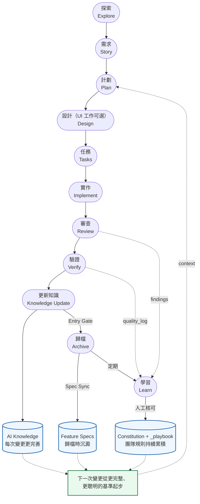
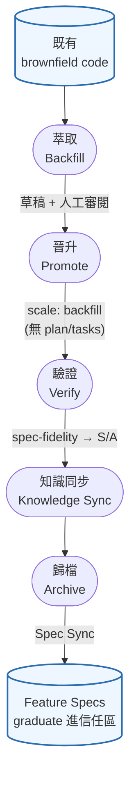

# Prospec

<div align="center">

[](LICENSE)
[](https://www.typescriptlang.org/)
[](tests/)
[](https://nodejs.org/)
[](https://pnpm.io/)

**為 AI coding agent 打造的漸進式規格驅動開發 (SDD) 工具組**

*Host-aware Skills · 結構化 AI Knowledge · MCP server — 支援 Claude Code、Copilot、Codex*

[English](./README.md) • [快速上手](#快速上手) • [為什麼選擇 Prospec？](#為什麼選擇-prospec) • [運作原理](#運作原理) • [AI Skills](#ai-skills) • [CLI 命令](#cli-命令)

**本專案 fork 自 [ci-yang/prospec](https://github.com/ci-yang/prospec)**

</div>

---

## 目錄

- [什麼是 Prospec？](#什麼是-prospec)
- [為什麼選擇 Prospec？](#為什麼選擇-prospec)
- [2.0 新功能](#20-新功能)
  - [從 1.3 升級](#從-13-升級)
- [快速上手](#快速上手)
  - [前置需求](#前置需求)
  - [1. 安裝](#1-安裝)
  - [2. 建立專案骨架](#2-建立專案骨架)
  - [3. 跑你的第一個變更](#3-跑你的第一個變更在-ai-agent-中)
- [運作原理](#運作原理)
  - [Skill 與 CLI 協同模式](#skill-與-cli-協同模式判斷面與確定性執行)
  - [誰在強制什麼](#誰在強制什麼)
  - [核心原則](#核心原則)
- [AI Skills](#ai-skills)
  - [17 個 Skills 清單](#ai-skills)
  - [品質閘門與自我改進](#品質閘門與自我改進)
  - [相稱流程 (Scale)](#相稱流程scale)
- [CLI 命令](#cli-命令) — 完整細節見 [CLI 參考](./reference/cli-reference.zh-TW.md)
- [設定 (Configuration)](#設定-configuration) — 最常調整的鍵見 [CLI 參考](./reference/cli-reference.zh-TW.md#設定-configuration)
- [進階工作流](#進階工作流)
  - [Backfill：把既有程式碼納進信任區](#backfill把既有程式碼納進信任區)
  - [升級 Prospec](#升級-prospec)
- [架構與開發](#架構)
  - [系統架構](#架構)
  - [測試](#測試)
  - [貢獻](#貢獻)
- [授權與致謝](#授權)

---

## 什麼是 Prospec？

Prospec 是一套 **CLI-first 的規格驅動開發（SDD）工具組**，為 AI coding agent 而設計。日常工作以 host-aware **Skills 在 Agent 內**驅動（Claude Code、Antigravity、Copilot、Codex）；Skills 執行的每一項**確定性操作**——scaffold、狀態轉換、quality-log 寫入、spec sync、評分——都在 **`prospec` CLI**（必裝的單一執行檔）內執行，同樣的 repo 狀態永遠產出相同的位元組。Skills 保留判斷面：訪談、prose、審查、裁決。你的 Agent 因此遵循一致的 `story → plan → design → tasks → implement → review → verify → knowledge-update → archive` 工作流，立基於結構化、版控的專案知識，不確定的部分被隔絕在簿記之外。Design 只在 UI scope 需要時執行；scale-aware 例外會在下文分開說明。

三個元件協同運作：

```
  你 ⇄ AI agent
     │
     ├─ Skills .......... 執行工作流：story → plan → design → tasks →
     │                    implement → review → verify → knowledge-update → archive
     │                        ▲
     │                        │ 讀取並擴充
     ├─ AI Knowledge .... 結構化的專案記憶（模組、規格、教訓）
     │                        ▲
     │                        │ 由此生成／重新生成
     └─ CLI (prospec) ... 執行所有確定性步驟：scaffold、狀態轉換、quality-log 寫入、
                          drift 檢查、評分、spec sync
```

- **Skills** 在 Agent 內執行工作流的**判斷面** —— 訪談、prose、審查、裁決 —— 日常操作面。
- **AI Knowledge** 是漸進式的專案記憶，Skills 讀取它、並隨每次變更擴充它。
- **CLI** 是必裝的單一執行檔，**就在** runtime 迴圈內：Skills 需要的每個確定性操作 —— bootstrap、scaffold、生命週期轉換、結構化記錄、drift 檢查、評分、封存同步 —— 都以程式執行、位元可重現。

**適合誰？** 使用 AI coding agent、希望在新專案（Greenfield）或既有程式碼庫（Brownfield）上獲得可重複、可審查工作流的開發者。

## 為什麼選擇 Prospec？

| 挑戰 | Prospec 如何解決 |
|------|------------------|
| AI 不了解你的程式碼庫 | `prospec knowledge init` + `prospec-knowledge-generate` 自動掃描並生成 AI 可讀文件 |
| Context window 限制 | 漸進式揭露：先載入摘要，細節按需取用；用 `prospec measure` 驗證你自己 session 的實際影響 |
| AI 工作流不一致 | 結構化 Skills 強制執行 `story → plan → design → tasks → implement → review → verify → knowledge-update → archive`，條件分支也明確可見 |
| 供應商鎖定 | 支援 4+ AI CLI，知識儲存在通用 Markdown 格式 |
| 設計到程式碼斷裂 | `prospec-design` 生成視覺 + 互動規格，整合 MCP 工具 |
| Knowledge 容易過時 | verify S/A commit prompt 把 Knowledge Update 折入 feature commit；archive Entry Gate 為 backstop 複核 |
| verify 過了仍出細微 bug | `prospec-review` —— implement 與 verify 間的獨立對抗式審查 |
| 教訓無法跨 session 留存 | `prospec-learn` —— 反覆出現的修正經人工核可晉升為版控的團隊規則 |

> 每一列都對應下方的某個 Skill 或命令 —— 見 [AI Skills](#ai-skills) 與 [CLI 命令](#cli-命令)。

---

## 2.0 新功能

Prospec 2.0 把 SDD 從一串引導步驟，提升為**受 gate 管理、可恢復的 pipeline**：Skills 保留判斷面，CLI 則負責狀態轉換、evidence 與 spec landing。

| 能力 | 2.0 的改變 |
|------|------------|
| **更強的規劃** | 獨立的 architecture verifier 與 task verifier 會在 implementation 前檢查 layering、blast radius、reuse、REQ traceability、task ordering 與 TDD closure。Full-scale plan 可比較多個 architecture candidates；standard plan 必須說明 simpler alternative。 |
| **受 gate 管理、可恢復的執行** | `prospec status` 會路由下一個 station，以 canonical Skill 身分作為 action、解析後的 skill 檔案作為 fallback，並列出 entry gate。每次 station transition 都重新載入指示——agent registry 宣告該 host 具備 skill 機制時就以該機制載入，其餘 host 一律讀檔；會改變狀態的 command 對非法 transition 直接拒絕，不再只靠 prose 約束；`implemented` 與每次 `review merge` 都要求由 `prospec check --record-tests` 記錄的 fresh green 測試 attempt（沒有測試命令的專案或已證明的 backfill 以 `tests: not-adjudicated` WARN 放行）。Design 是條件式 station、Knowledge Update 成為正式 station，quick/backfill 路徑也明確分開。最新 grade 為 B/C/D 的 `verified` change 會被導回 verify，recorded verifier 結果為 FAIL 的 plan／tasks 站會被導回該站。Archive 與 verify 的 gate 以單一 change 為對象裁決：sibling change 缺少的 evidence 不會擋住 target（共用的 whole-tree evidence digest 仍會） |
| **會自我修正的品質迴圈** | Drift 可建立有界的 follow-up draft；review 使用 fresh-context verifier loop 與 circuit breaker；Verify 記錄 judgment provenance；Archive 在改 trust zone 前檢查 requirement landing fidelity。反覆出現的 correction 可走 human-approved learning pipeline 晉升。 |

### 從 1.3 升級

既有的 1.3 專案依下列順序升級：

1. 把 standalone binary（或 pinned GitHub devDependency）更新到 2.0。
2. 在專案內執行 `prospec upgrade`。CLI 會記錄 installed version、重新同步 agent assets、刷新 deterministic scan、只建立缺少的 init docs，並回報 format/trigger gaps。
3. 依你的 host 語法明確呼叫 bare identity `prospec-upgrade`。逐項審閱並核可 curated-document migration；使用者撰寫的內容不會被靜默覆寫。
4. 恢復工作前，確認下列 behavior boundaries：
   - 明確呼叫 Skill 的語法由 host 決定（Claude Code 與 Copilot 使用 `/`、Codex 使用 `$`、Antigravity 使用 bare name 或 Skills browser）；共用 prose 與 automation 一律使用 bare `prospec-<name>` identity。
   - Lifecycle commands 現在會強制更多 entry gates，可能拒絕 1.3 曾接受的 shortcut。請用 `prospec status` 當恢復點，不要手動編輯 lifecycle metadata。
   - 標準 post-Verify 路徑改為 `verify → knowledge-update → archive`；Knowledge changes 與 feature commit 一起提交，Feature Specs 仍在 Archive 才畢業。
   - L1 Knowledge entry point 是 `{base_dir}/index.md`。若專案仍只依賴 legacy `ai-knowledge/_index.md`，請先把 authored content 保留到 root index，再移除 orphaned file；已退役的 compatibility branch 不再代為搬移。
5. 執行 `prospec status` 與 `prospec check --strict`，處理新 gate 揭露的失敗，再從 CLI 回報的 station 繼續。

Major version 表示 **workflow contract 有相容性邊界**，不是要求重寫產品程式碼或現有 Markdown specs。Upgrade path 會保留既有 project choices，且 judgment-based 文件修改都先詢問；需特別規劃的是更嚴格的拒絕行為與 host invocation syntax。

完整的兩段式 command 行為請見[升級 Prospec](#升級-prospec)。

---

## 快速上手

從零到第一個 AI 驅動變更，約五分鐘。

### 前置需求

- **AI CLI**（至少一個）：[Claude Code](https://docs.anthropic.com/claude/docs/claude-code)（推薦）、[Codex CLI](https://developers.openai.com/codex/cli)、[GitHub Copilot CLI](https://docs.github.com/copilot/github-copilot-in-the-cli) 或 [Antigravity CLI (agy)](https://antigravity.google/)
- **Node.js** >= 22.13.0（若採用**選項 A 獨立執行檔**則**免安裝 Node.js**；僅在使用 npm/pnpm/npx 或參與本專案開發時需要）

### 1. 安裝

`prospec` CLI 是日常 SDD 開發迴圈不可或缺的**核心確定性執行引擎**。AI Agent 內部的 Skills（例如 `prospec-new-story`、`prospec-plan`、`prospec-verify`、`prospec-archive` 等）在執行時，會在背景自動呼叫 `prospec` 指令來建立骨架、進行狀態轉換、記錄 quality_log、驗證 drift 與同步 Feature Spec。

因此，請確保系統 `PATH` 中可直接執行 `prospec`：

**選項 A：獨立執行檔 (Standalone Binary)（強烈推薦，免安裝 Node.js 執行期環境）**
對於 macOS 和 Linux，可執行一鍵安裝腳本（自動安裝至 `~/.prospec/bin` 並設定 `PATH`）：
```bash
curl -fsSL https://raw.githubusercontent.com/benwu95/prospec/main/install.sh | bash
```

對於 Windows，可執行一鍵 PowerShell 安裝腳本：
```powershell
powershell -c "irm https://raw.githubusercontent.com/benwu95/prospec/main/install.ps1 | iex"
```

兩個安裝腳本預設安裝最新 release。若要指定特定版本，傳入該 release 的 tag（tag 不帶 `v` 前綴）—— macOS/Linux 以參數傳入；當腳本以 pipe 方式執行、無法傳遞參數時（例如 PowerShell 的 `iex`），改用 `PROSPEC_INSTALL_VERSION` 環境變數：
```bash
curl -fsSL https://raw.githubusercontent.com/benwu95/prospec/main/install.sh | bash -s -- 2.1.1
```
```powershell
$env:PROSPEC_INSTALL_VERSION = "2.1.1"
irm https://raw.githubusercontent.com/benwu95/prospec/main/install.ps1 | iex
```

或者，您也可以手動自 [GitHub Releases](https://github.com/benwu95/prospec/releases) 頁面下載適用您平台的二進位檔，解壓後放置於系統 `PATH` 目錄下：

- **Linux (x64)**: `prospec-linux-x64.tar.gz`
- **macOS (Apple Silicon)**: `prospec-macos-arm64.tar.gz`
- **macOS (Intel)**: `prospec-macos-x64.tar.gz`
- **Windows (x64)**: `prospec-windows-x64.zip`

**選項 B：在專案內固定為開發期依賴 (devDependency)（Node.js 專案）**
作為專案本地依賴進行安裝：
```bash
npm install -D github:benwu95/prospec     # 或：pnpm add -D github:benwu95/prospec
```

**選項 C：使用 npx 執行單次命令（Node.js 環境）**
不需全域安裝即可執行單次指令：
```bash
npx github:benwu95/prospec <command>
```

> [!WARNING]
> 我們**不推薦**使用 `npm install -g` 進行全域安裝，因為非發布版分支 (unpublished fork) 的全域編譯可能會因為您本機的 Node/編譯環境不同而失敗。推薦優先使用**選項 A 獨立執行檔**。

### 2. 建立專案骨架

一個指令完成 deterministic 的設定 —— 它會串接 `init` + `agent sync`，已完成的步驟自動跳過：

```bash
cd my-project                 # 新專案或既有專案

prospec quickstart            # → 選擇 AI Assistant、選擇文件語言；建立 .prospec.yaml + 各 agent config + Skills
```

`prospec quickstart` 會執行 `agent sync`，寫入 **Claude Code** → `CLAUDE.md` + `.claude/skills/`；**Antigravity / Codex / Copilot** → `AGENTS.md` + `.agents/skills/`。接著在你的 AI Agent 中完成收尾：

```text
🤖 Run inside your AI Agent chat:
prospec-quickstart           # 在地化 skill triggers、重新同步 config、生成 AI Knowledge
```

這個一次性收尾步驟可重複執行且會自我終止；在既有程式碼庫上，它會把你的模組讀進 AI Knowledge，讓 Agent 在你的第一個變更前就理解它們。

### Skill 呼叫方式

`prospec-<name>` 是 canonical Skill identity。手動呼叫時使用的語法屬於 host，而不是 Skill 名稱本身：

| Host | 明確呼叫方式 |
|------|--------------|
| Claude Code | `/prospec-<name>` |
| Codex | `$prospec-<name>` |
| GitHub Copilot | `/prospec-<name>` |
| Antigravity | 以 bare Skill name 提及，或在 Skills browser 選取：`prospec-<name>` |

這些形式只用於明確呼叫；Skill 的 description 與 triggers 仍支援 implicit discovery，因此沒有任何 workflow 變成只能手動執行。

### 3. 跑你的第一個變更（在 AI Agent 中）

你不需要記得每一步 —— **用自然語言描述你要的變更，Agent 就會自己跑完整個有閘門的 SDD cascade**，只在範圍提問、gate 失敗或 circuit breaker，以及最後的 Tastemaker sign-off 停下：

```text
🤖 Run inside your AI Agent chat:
你 ▸ 請 prospec 幫我加一個深色模式切換

Agent 接手需求並執行 prospec-ff：
  • 問幾個範圍 / 驗收問題 —— 你用自然語言回答
  • 寫出 story → plan → tasks
  • machine gates 通過後自主繼續：

  implement → review → verify → GRADE A
                           → knowledge update ✓
                           → Tastemaker sign-off（你檢視 diff + evidence）
                           → 你核准 commit 與 archive ✓
```

在 `prospec-ff` cascading mode 中，machine gates 通過後會自動進入下一站。Cascade 只在需要釐清、gate 失敗或 circuit breaker，以及最後的 Tastemaker sign-off 停下。到達該邊界時，Agent 會呈現 diff 與 evidence；未經你的明確核准，絕不 commit、push 或 archive。Cascade 之外的個別 station Skills 仍會以 status-aware handoff 結束，因此你也能逐站驅動同一條流程。

想自己逐步驅動？也可以明確執行：

```text
🤖 Run inside your AI Agent chat:
prospec-explore                   # （可選）先釐清需求
prospec-new-story add-my-feature  # 把需求記錄成結構化 story
prospec-plan                      # 設計實作（`quick` scale 的變更會跳過）
prospec-design                    # （Plan 之後可選）UI / 互動規格
prospec-tasks                     # 把計劃拆成有序的任務清單
#   ↑ 用 prospec-ff add-my-feature 一次收合 story → plan → tasks
prospec-implement                 # 逐項實作（先不 commit）
prospec-review                    # 對抗式審查 → fix 迴圈
prospec-verify                    # 驗證；達 S/A 後開啟 commit 邊界
prospec-knowledge-update          # 同步受影響模組的 Knowledge 並折入 feature commit
prospec-archive                   # 歸檔 + 讓 Feature Specs 正式畢業
prospec-learn                     # （定期）把反覆出現的教訓晉升為團隊規則
```

這就是完整的 SDD 迴圈。由於 `prospec-quickstart` 已經先生成了 AI Knowledge，Agent 一開始就理解你的模組。下方完整的 Greenfield 與 Brownfield 流程會逐步拆解 `prospec quickstart` 自動完成的每個步驟。

<details>
<summary>Greenfield 與 Brownfield 的 bootstrap 差異 —— 兩個指令展開後做了什麼</summary>

#### Greenfield（新專案）
`prospec quickstart` → `prospec-quickstart` 就是完整的 bootstrap

```bash
mkdir my-project && cd my-project
prospec quickstart --name my-project   # init + agent sync（互動式選擇 assistant 與語言）
# 接著在你的 AI Agent 中：
prospec-quickstart                     # 在地化 triggers · 重新同步 · 生成 AI Knowledge
```

這兩個指令展開後是：

```bash
# `prospec quickstart` 執行：
prospec init --name my-project   # → 選擇要啟用的 AI Assistant（互動式 checkbox）
                                 # → 選擇文件主要語言（預設英文，或用
                                 #   --language "Traditional Chinese (Taiwan)"）；若非英文，
                                 #   接著選擇 trust zone 語言（預設同值；--trust-zone-language
                                 #   可跳過提示）。[MUST] 路徑式 Language Policy 規則會依
                                 #   兩者寫入 CONSTITUTION.md；程式碼與 git commit message
                                 #   一律維持英文
                                 # → 建立 .prospec.yaml + 目錄結構
prospec agent sync               # → 各 agent config + Skills（Claude Code → CLAUDE.md +
                                 #   .claude/skills/；Antigravity / Codex / Copilot →
                                 #   AGENTS.md + .agents/skills/）

# `prospec-quickstart` 接著在你的 AI Agent 中：
#   • 文件語言非英文？它會為 .prospec.yaml 的 `skill_triggers` 提議母語觸發詞，
#     經你確認後重跑 agent sync —— skills 就能匹配你用母語描述的需求
#   • prospec knowledge init → prospec-knowledge-generate（生成 AI Knowledge）
```

空專案上，`prospec-knowledge-generate` 會產出一份最小的 Knowledge base，隨著你持續出貨變更逐步補完。接著就照上面步驟 3 跑你的第一個變更。

#### Brownfield（既有專案）
同樣兩個指令；`prospec-quickstart` 會把你既有的程式碼讀進 AI Knowledge

```bash
cd existing-project
prospec quickstart                      # 自動偵測 Tech Stack；執行 init + agent sync
# 接著在你的 AI Agent 中：
prospec-quickstart                     # 在地化 triggers · 重新同步 · knowledge init · prospec-knowledge-generate
```

這兩個指令展開後是：

```bash
# `prospec quickstart` 執行：
prospec init          # → 自動偵測 Tech Stack；選擇 AI Assistant；選擇文件主要語言
                      #   （預設英文；--language 可跳過互動提示）；若非英文，再選擇
                      #   trust zone 語言（--trust-zone-language）
prospec agent sync    # → 各 agent config + Skills

# `prospec-quickstart` 接著在你的 AI Agent 中：
prospec knowledge init       # → 生成 raw-scan.md + 空骨架（prospec/index.md、_conventions.md、module-map.yaml）
prospec-knowledge-generate  # → AI 讀取 raw-scan.md，決定模組切割，
                             #   建立 modules/*/README.md + 填充 prospec/index.md
```

這裡的 `knowledge init` 會讀取你既有的程式碼，所以 `prospec-knowledge-generate` 一開始就產出內容豐富的 Knowledge base。接著就照上面步驟 3 跑你的第一個變更 —— 開發迴圈與 Greenfield 完全相同。

`knowledge init` 捕捉的是程式碼*怎麼*組織，但 brownfield 模組通常仍缺少描述它*做什麼*的 Feature Spec。補上這個 WHAT 層缺口是一條獨立的一等流程 —— 見下方 **[Backfill：把既有程式碼納進信任區](#backfill把既有程式碼納進信任區)**。它不屬於 bootstrap，可在任何時候執行。

</details>

> `prospec quickstart` 與 `prospec-quickstart` 產生的完整目錄樹，見
> [CLI 參考 — 產生的專案佈局](./reference/cli-reference.zh-TW.md#產生的專案佈局)。

---

## 運作原理

Prospec 跑一條線性流程，外包兩條回饋迴圈，讓它**越用越好**，而非單純重複。


```mermaid
flowchart TD
    E([探索<br/>Explore]) --> S([需求<br/>Story]) --> P([計劃<br/>Plan]) --> D(["設計（UI 工作可選）<br/>Design"]) --> T([任務<br/>Tasks]) --> I([實作<br/>Implement]) --> R([審查<br/>Review]) --> V([驗證<br/>Verify]) --> KU([更新知識<br/>Knowledge Update]) -- Entry Gate --> A([歸檔<br/>Archive]) -- 定期 --> L([學習<br/>Learn])

    V -. quality_log .-> L
    R -. findings .-> L
    L -- 人工核可 --> RULES[("Constitution + _playbook<br/>團隊規則持續累積")]

    KU --> AK[("AI Knowledge<br/>每次變更更完善")]
    A -- Spec Sync --> FS[("Feature Specs<br/>歸檔時沉澱")]

    AK -.-> NEXT["下一次變更從更完整、<br/>更聰明的基準起步"]
    FS -.-> NEXT
    RULES -.-> NEXT
    NEXT -. context .-> P

    classDef asset fill:#eef7ff,stroke:#2b6cb0,stroke-width:2px;
    classDef gain fill:#e9f9ee,stroke:#2f855a,stroke-width:2px;
    class AK,FS,RULES asset;
    class NEXT gain;
```

每次 **Archive** 都讓 **AI Knowledge** 更完善（隨每個變更累積），而反覆出現的教訓 —— review findings、跨階段 `quality_log`、session corrections —— 經**人工核可**晉升為持續累積的團隊規則（`Constitution` + `_playbook`）。所以下一次變更不從零開始，而是從更完整、更聰明的基準起步。

圖中顯示標準路徑。流程同時是 **scale-aware** 的：Design 只在 UI scope 為 `full` 或 `partial` 時執行；經使用者確認的 `quick` 變更完全跳過 Plan（`story → tasks`）；Brownfield backfill 則從 `prospec-promote-backfill` 進入 Verify，不重跑標準 planning path。Archive-time gates 仍是 backstop —— 見[相稱流程](#相稱流程scale)與[回填流程](#backfill把既有程式碼納進信任區)。

### Skill 與 CLI 協同模式：判斷面與確定性執行

Prospec 提供擁有 17+ 個頂層命令的豐富 CLI，但**開發者平時幾乎不需要手動輸入這些 CLI 指令**。日常的 SDD 開發流程主要是透過 AI Agent 介面中的 host-aware **Skills**（例如 `prospec-ff`、`prospec-implement`、`prospec-verify` 等）來驅動。

Skills 與 CLI 之間的互動遵循嚴格的職責分工：

- **Skills（Agent 內部的判斷面）**：在 LLM 上下文中執行。負責非確定性的思維與對話任務 —— 訪談需求、撰寫架構草案、執行對抗式審查、評估 UI/UX 規範以及給予品質分級。
- **CLI（`prospec` 確定性執行引擎）**：由 Skills 在背景透過指令探針（`_cli-probe`）自動呼叫。CLI 負責所有位元可重現的狀態變更 —— 建立變更骨架 (scaffolds)、驗證 YAML metadata、更新生命週期狀態轉換、寫入結構化 quality_log、計算 drift 報告、執行機械式 Spec Sync 以及歸檔已完成變更。

```
  使用者 ⇄ AI Agent (Skills)
           │
           │  (1) 提問與引導 SDD 開發流程
           │  (2) 執行高階判斷（撰寫文章、對抗審查、編寫程式碼）
           ▼
  Skill 執行迴圈
           │
           │  背景自動呼叫：Skills 執行 `prospec <command>`
           ▼
  `prospec` CLI (確定性執行引擎)
           │
           ├── 骨架建立（story / plan / tasks）
           ├── 生命週期與 Metadata（status / scale / progress）
           ├── 確定性稽核與評分（check / verify record / review merge）
           └── 知識與規格同步（archive / knowledge update / learn upsert）
```

**為什麼這種分離設計如此重要：**
把紀錄與狀態轉換交給 CLI，讓 LLM 的格式錯誤（格式不正確的 YAML/JSON、損壞的 frontmatter）進不了工件，讓狀態檢查不花模型 token，並讓相同的儲存庫狀態產出一致、位元可重現的產物。

### 誰在強制什麼

支撐這套工作流承諾的是三件不同的事，彼此不可互換：

- **CLI 強制（決定性）** — 工件 schema、生命週期轉換、閘門拒絕、drift 檢查、評分計算與 spec landing。
  同樣的 repo 狀態產出同樣的位元組；閘門以單一 change 為對象裁決，sibling change 缺少的證據不會擋住目標。
- **Skill 指示（程序性）** — Skills 指示 agent 遵循的站點閘門、receipt 要求與停止條件。它們約束「會遵循
  指示的 agent」；對不遵循的，只有 CLI 自己的拒絕能約束。
- **模型判斷（有界）** — REQ 意圖對照程式碼（verify 2/5）、對抗式審查的搜尋、design 一致性，以及
  `quick` 變更的 Knowledge 影響檢查——該 scale 沒有 delta-spec，其 spec 影響是對照實際 diff 判斷的。
  這一層的品質取決於你路由到的模型層級。Prospec 選擇量測而非假設——有界的固定情境評估與其記錄的限制
  見 [`scripts/workflow-eval/README.md`](scripts/workflow-eval/README.md)——所以請把「閘門通過」讀作
  關於那一次執行的證據，而不是對模型可靠度的普遍宣稱。

### 核心原則

Prospec 強制執行 6 大核心原則，約束的對象是注入使用者專案的 prospec 資產 —— 生成的 Skills、配置與目錄結構：

1. **Progressive Disclosure First** — 永遠不要一次載入所有資訊；索引 → 細節
2. **Spec is Source of Truth** — 變更在寫程式碼前先記錄在規格中
3. **Zero Startup Cost for Brownfield** — 不需要預先文件化整個程式碼庫
4. **AI Agent Agnostic** — 透過 Markdown adapters 支援任何 AI CLI
5. **User Controls the Rules** — Constitution 由使用者定義；CLI 機械地列出其規則與嚴重度，由 verify 的稽核依此為變更評分
6. **Language Policy** — 變更文件使用 `prospec init` 時選擇的語言（預設英文）；trust zone（AI Knowledge base、Feature Spec、Constitution）依 `trust_zone_language` 設定的語言（預設英文）；程式碼、專業術語與 git commit message 一律英文

---

## AI Skills

Prospec 生成 17 個 Skills —— 15 個涵蓋完整 SDD 生命週期，外加兩個週期性收尾：`prospec-quickstart`（啟動）與 `prospec-upgrade`（版本升級）：

| Skill | Canonical Skill | 說明 |
|-------|---------------|------|
| **探索** | `prospec-explore` | 思考夥伴，協助釐清需求 |
| **新需求** | `prospec-new-story` | 建立結構化的變更需求 |
| **設計** | `prospec-design` | 生成視覺 + 互動規格（Generate/Extract 雙模式） |
| **計劃** | `prospec-plan` | 生成實作計劃 + delta-spec |
| **任務** | `prospec-tasks` | 拆分為可執行的任務 |
| **快速前進** | `prospec-ff` | 一次生成 story → plan → tasks |
| **實作** | `prospec-implement` | 逐項實作任務，MCP 優先讀取設計資料 |
| **審查** | `prospec-review` | 對抗式審查 → fix 迴圈；經驗證確認的 critical 自動修，帶 spec-aware lens |
| **驗證** | `prospec-verify` | 5+1 維度稽核，含品質等級（S/A/B/C/D）；達 S/A 後提示 commit |
| **歸檔** | `prospec-archive` | 歸檔變更 + Spec Sync + Knowledge 同步 Entry Gate |
| **學習** | `prospec-learn` | 回饋晉升：反覆出現的教訓 → 團隊 `_playbook` / Constitution（可審計、人工核可） |
| **知識生成** | `prospec-knowledge-generate` | AI 驅動的模組分析與知識建立 |
| **知識更新** | `prospec-knowledge-update` | 基於 delta-spec 的增量知識更新 |
| **回填規格** | `prospec-backfill-spec` | 從既有 brownfield code 反向萃取 Feature Spec 草稿（僅 stage 草稿，絕不直寫信任區） |
| **晉升回填** | `prospec-promote-backfill` | 把審閱過的回填草稿定型化為 backfill change scaffold（proposal + delta-spec + metadata、`scale: backfill`、`status: implemented`;輕量 scale —— 無 plan/tasks）；絕不直寫信任區 |
| **快速開始** | `prospec-quickstart` | `prospec quickstart` 執行 init + agent sync 後，依 artifact language 在地化 skill 觸發詞、準備 Knowledge 掃描，並串接 `prospec-knowledge-generate` 生成 AI Knowledge;絕不直寫信任區 |
| **升級** | `prospec-upgrade` | `prospec upgrade` 記錄版本、重新同步 agents 並補建缺少的 init 檔案後，依 report 的 docs inventory 逐檔處理：遷移漂移的 init 檔案格式 + 補齊已建檔案，並為新增 skill 補譯觸發詞（只補缺）—— 每步附確認 + diff／內容預覽；絕不覆寫你撰寫的內容 |

> [!NOTE]
> **週期性收尾 Skills**：`prospec-quickstart`（`prospec quickstart` 後執行一次）與 `prospec-upgrade`（版本升級時於 `prospec upgrade` 後執行）完成 CLI 無法決定性處理的判斷步驟。兩者皆以 Skill 形式部署於磁碟，但不列入常駐 entry config；每份已部署 `SKILL.md` 的 name 與 description 仍會在每個 session 載入，省下的是 entry config 的列表，不是 skill metadata。

### 品質閘門與自我改進

除了線性流程，每個 workflow Skill 都內建品質機制：

- **Output Contract** — 每個 Skill 對客觀準則自評 `Met N/M | Overall: PASS|WARN|FAIL`，不必逐行檢查 artifact。
- **依 host 能力進站** — 生成的 entry config 與 cascade protocol 會依 host 宣告的 skill content lifecycle（`persistent-reattach`、`tool-output` 或 `unknown`，每個值在 agent registry 都有註明日期的出處）分岐。skill 機制能讓已載入內容存活的 host，會被指示以該機制調用、並於重入時重新調用該站 Skill；其餘 host 以及未宣告 lifecycle 的 host，一律先跑 `prospec status` 再讀該站 `SKILL.md`，然後才進 entry gates。兩條路徑都不豁免 gate，且載入站點指示不代表其 references 已抵達。
- **Station reference map** — `prospec status` 依 phase 顯示下一站的 references，包含條件式載入提示。共用 registry 驅動產生的 reference maps 與部署清單；`prospec check` 的 `skill-reference-map` 檢查可偵測缺檔與 phase 引用不符。修正來源後，執行 `prospec agent sync` 更新已部署的 Skills。詳見 [CLI 參考](reference/cli-reference.zh-TW.md)。
- **Entry / Exit gates** — Skill 啟動前檢查前置條件（Entry）、結束時比對 Constitution（Exit）；WARN/FAIL 記入跨階段 `quality_log`，讓前一階段的疑慮在下一階段被 surface。
- **Skill 指令品質** — 每個 numbered phase 帶自己的 gate checklist（比 skill 層 Entry/Exit gate 更細）；在 `prospec-ff` cascade 之外，線性流程 Skill（plan→tasks→implement→review→verify→archive）結尾有 status-aware 的**下一步 handoff**；新 session 偵測進行中的變更以接續；`prospec-implement` 每完成一個 task 後重錨 `Progress X/Y | Goal | Next`；`prospec-explore` 與 `prospec-knowledge-generate` 在 Constitution 仍實質空白時提醒（否則其 gate 形同 no-op）。
- **可執行 Constitution** — 規則帶 RFC-2119 嚴重度（MUST→FAIL／SHOULD→WARN／MAY→資訊性），由 `prospec-verify` 分級。
- **確定性 drift 閘門** — `prospec check` 以零 token 機器驗證 spec ↔ code ↔ knowledge 的指涉完整性；`prospec-verify` 在開發期消費同一份報告，scaffold 出的 CI workflow 在每個 PR 強制執行。搭配選配的 `feature-map.yaml`（feature→module 索引，archive 時 bootstrap）再加兩條治理檢查：REQ-prefix 合法性（WARN）與 feature→module 邊（FAIL）。
- **對抗式審查** — `prospec-review` 位於 implement 與 verify 之間：獨立 fresh-context reviewer 審整個 change diff；僅經驗證確認、可 drop-in 的 critical 自動修，其餘升級給人。**commit 邊界**在 verify 達 S/A **之後**，讓 implement + review + verify 的修正落入單一 atomic commit（prospec 提示、絕不自動 commit）。
- **回饋晉升** — 每個 **Archive** 都自動 harvest 該變更反覆出現的教訓進版控的 `_lessons-ledger.md`；`prospec-learn` 以明文可重現準則（頻次 + 影響模組數）評分，**僅在顯式人工核可後**晉升進團隊 `_playbook.md` 或 Constitution。每次收集前它還會**掃描兩份檔案裡專案已經長大而不再需要的條目** —— 規則已由某道閘門執行、規則的主體已不存在、或與 Constitution 互相矛盾 —— 並帶著證據交由人工退役；退役一律就地標記（ledger 列保留所有計數、playbook 編號永不重用），清理不會損及稽核軌跡。

### 相稱流程（Scale）

不是每個變更都值得完整儀式。story 階段由 `prospec-new-story`（或 `prospec-ff`）依明文判準評估複雜度並建議 scale —— **經你確認後**才寫入 `metadata.yaml`：

| Scale | 流程差異 |
|-------|---------|
| `quick` | 精簡 proposal（單 Story、免 FR/SC 枚舉）、**完全跳過 plan 階段**（`story → tasks`）、不載入模組 README；review/verify 的 delta-spec 維度標示 `not-applicable`（絕不偽裝 PASS） |
| `standard`（預設；既有變更無欄位即此級） | 現行精簡流程 —— plan ≤ 120 行，結尾必含 **Simpler Alternative** 段落（實質更簡單的替代方案或明文 concede，附檔數/行數變更表面估算） |
| `full` | 完整架構分析 —— 擴充 Technical Summary、逐進入點 Call Chain、Best-of-N 候選架構錦標賽（其非選中候選記錄替代 Simpler Alternative 段落） |

兩道誠實的 backstop 防止 `quick` 變成 spec drift 破口：評估階段就把「預期影響 spec-covered 行為」的變更**否決出 quick**；`prospec-archive` Entry Gate 再以**實際 diff** 複核 —— 有 spec 影響即阻擋歸檔，直到補上極簡 Spec Impact 段落，knowledge-sync gate 則改由 diff 檔案路徑推導受影響模組（不依賴缺席的 delta-spec）。Forward-change scales 保留 TDD、對抗式審查與 Constitution 稽核；proven backfill 採獨立 fidelity contract，code review 為 optional。

任務同時帶 **kind** 標記（`[M]` manual、`[V]` verification、無標記＝code）：完成率只計 code task，「手動跑個指令」之類未勾選的提醒不會卡住或扭曲任何 gate。

<details>
<summary>Cache 穩定前綴排序（進階內部機制）</summary>

每個 skill 的 Startup Loading 區段以**靜態優先**排序，讓 provider 的 prompt cache（Anthropic 顯式 `cache_control`、OpenAI/Gemini 自動 prefix caching）能跨觸發重用最長前綴。每個載入項帶兩種標注之一：

- **`[STABLE]`** — 僅在 `agent sync` 或治理變更時改動：啟動即需的 `references/` 格式規格、Constitution、`_conventions.md`。最先載入。（`ff` / `plan` / `archive` 的分階段格式規格改為**逐 phase on-demand** 讀取 —— 移出穩定前綴，中途 abort 就不必為後續 phase 的格式付出成本。）
- **`[DYNAMIC]`** — 隨 knowledge 更新、change 或每次觸發變動：`prospec/index.md`（cache boundary 後第一位）、模組 README、`_playbook.md`、Feature/Product Specs、`.prospec/changes/` artifacts。最後載入。

判準是**跨請求前綴穩定性**，不是「是否由範本生成」：entry config 的 Available Skills 列表每專案固定（只在 skill 集變動時改變），因此屬 `[STABLE]`。Extension 開發者新增 skill 須遵循同一排序 —— 靜態在 boundary 前、動態在後 —— 否則每次觸發都打破 cache 前綴。harness 量測的是 **prospec 組裝管線**（corpus 組裝的是 knowledge 檔案，非 skill 範本本身）—— 見 [Token 量測](./reference/cli-reference.zh-TW.md#token-量測)。範本層重排的效果發生在 agent 部署層，不在 harness 可觀測範圍（刻意排除在外）：其效益依據各 provider 文件化的 prefix-caching 語意推導，而非 before/after 直接量測。

</details>

---

## CLI 命令

Prospec 提供 17+ 個頂層命令，但**開發者很少直接執行**——日常 SDD 工作由上方的 Skills 驅動，由它們
呼叫 CLI 完成每一項決定性變更。完整的逐命令參考（旗標、exit code、輸出形狀、MCP server、drift
check 與 token 量測）在 **[CLI 參考 — CLI 命令](./reference/cli-reference.zh-TW.md#cli-命令)**。

讀者最常需要留在此處的幾項命令細節：

- **`prospec validate <kind> <file>`** — 依 schema 驗證單一工件；`<kind>` 為
  `slug`、`backfill-draft`、`promote-scaffold`、`design-spec`、`module-readme` 之一。
- **`prospec change story <name> --freeze-scenarios` / `--amend-scenarios`** — 將 `proposal.md` 的實質驗收場景凍結進 `metadata.yaml` 的基準（或以 `--reason` 與 `--expected-digest` 受控追加新修訂版）。進入 plan 與 tasks 均要求凍結基準；既有未凍結變更雖允許推進但會揭露限制（評級 S 不可達）。已 verified/archived 的變更執行凍結或修訂面臨終端拒絕。請注意基準 digest 與驗證上下文提供的是審計可追溯性，並非沙盒或權限隔離。
- **`prospec verify context --change <name>`** — 在評級前寫出確定性的 `verify-context.json`，固定規格、凍結基準、提案、程式碼快照與測試事實；由 `verify record` 在逐 REQ 評定時核對。
- **`prospec change log --skill <skill> --verifier-report <file>`** — 記錄 planning verifier 自己的
  報告；`FLAWS` 對應 `result: FAIL`。此閘門是 **per-change**：sibling change 的過期證據不會擋住
  這一個。（以 `[CODE]` 標示 CLI 自有判定的是 `prospec status` 的路由理由行。）
- **`prospec check --record-tests`** — 記錄測試執行（`snapshot-v2` fingerprint、`repository-inputs-v2`
  範圍、`change-and-restore` 偵測），讓 verify 5/5 成為機器判定。
- **CI 閘門** — `prospec check --strict` 由 `.github/workflows/prospec-check.yml` 執行；drift check 的
  逐項契約、exit code 與 JSON 報告形狀見參考文件。

### MCP server

- **`prospec mcp serve [--cwd <path>]`** — 以 stdio 啟動**唯讀** MCP server，讓任何支援 MCP 的 agent
  （即使沒安裝 Prospec Skills）都能查詢專案的架構真相、規格真相、依賴方向、已晉升 playbook 與知識
  新鮮度。`--cwd` 釘住專案根目錄，因此單一 agent 不論從何處啟動都能服務多個專案。
- **註冊方式** — 把 agent 的 MCP 設定指向 `prospec mcp serve --cwd <專案根目錄>`：Claude Code 用
  `claude mcp add project-name -- prospec mcp serve --cwd /path/to/project`；Copilot 與 Codex 在各自的
  MCP 設定檔填入同一條命令。逐 agent 的設定檔路徑、多專案設定與 `npx` 形式見
  **[CLI 參考 — MCP server](./reference/cli-reference.zh-TW.md#mcp-server)**。
- **`prospec config example`** — 印出完整帶註解的 `.prospec.yaml` 參考（含範例值），是設定某個欄位前
  最快確認其形狀的方式。
- **`prospec agent triggers [--write <file>]`** — 印出可直接翻譯的 `skill_triggers` 與 `skill_exclusions` 骨架，加 `--write`
  則寫回檔案。

## 設定 (Configuration)

`.prospec.yaml` 保存專案語言、agents、token 預算與測試命令。最常調整的鍵及其形狀與預設值見
**[CLI 參考 — 設定](./reference/cli-reference.zh-TW.md#設定-configuration)**；真正驗證這個檔案的是
`src/types/config.ts` 的 schema。

## 進階工作流

### 客製化 Module README（Project Section Extensions）

預設情況下，每個模組的 README 都遵循自動生成區塊（`prospec:auto-start` ... `prospec:auto-end`）內的 Recipe-First 正典結構（`## Key Files`、`## Public API`、`## Dependencies`、`## Modification Guide`、`## Pitfalls`，以及可選的 `## Ripple Effects` / `## Sub-Modules`）。

在標題的單行摘要之後第一個非空行（兩者之間可留空行）、該生成區塊之前，會有一行格式標記 —— `<!-- prospec:module-readme-format 2026-09-01 -->`。它標示的是該檔案所遵循的相容 grammar 版本，而非文件最後修改日期：補充說明與註冊的選用擴充 Section 不會改動此日期，唯有 marker 語意或核心 Section grammar 出現不相容變更才會換新日期。[`_module-readme-conventions.md`](prospec/ai-knowledge/_module-readme-conventions.md) 是 marker 與結構的共同權威，`prospec validate module-readme <module>` 即依此校驗 README。

若需要為專案擴充自訂 Section（如 `## Team Ownership`、`## Security Rules`），請直接在 [`prospec/ai-knowledge/_module-readme-conventions.md`](prospec/ai-knowledge/_module-readme-conventions.md) 的 `prospec:user` 區塊中的 `## Project Section Extensions` 註冊。此 Markdown 表格是擴充結構的**單一真相來源**（不需定義在 `.prospec.yaml`）：

| ID | Heading | Content | Applies To | Required | MCP Visibility | Content Format |
| --- | --- | --- | --- | --- | --- | --- |
| team-ownership | Team Ownership | 誰負責此模組、如何聯繫 | all | optional | included | field-table |
| security-rules | Security Rules | 此模組強制的安全控管 | auth,services | required | included | markdown |

- **`Content`**：一行描述此 Section 的用途——它是做什麼的、該放什麼內容，讓 agent 知道如何填寫。
- **`Applies To`**：`all` 或以逗號分隔的模組名稱（如 `auth,services`）。
- **`Required`**：`required`（驗證時強制檢查）或 `optional`。
- **`Content Format`**：
  - `field-table`：嚴格雙欄鍵值表（標題必須為 `| Field | Value |`）。
  - `markdown`：自由 Markdown 格式。

在對應模組的 `modules/{module}/README.md` 中，於 `<!-- prospec:user-start -->` 與 `<!-- prospec:user-end -->` 之間實作該區塊：

```markdown
<!-- prospec:user-start -->
<!-- prospec:section-start team-ownership -->
## Team Ownership

| Field | Value |
| --- | --- |
| Owner | Platform Team |
| Slack | #platform-eng |
<!-- prospec:section-end team-ownership -->
<!-- prospec:user-end -->
```

可隨時執行 CLI 指令驗證擴充格式：
```bash
prospec validate module-readme <module-name>
```

### Backfill：把既有程式碼納進信任區

Brownfield 專案累積了大量「沒有 Feature Spec 描述」的行為。**Backfill** 是一條一等、雙 skill 的流程：從程式碼反向萃取這些行為，並把它 graduate 進規格信任區（`prospec/specs/features/`）—— 而且**從不手寫信任區**（archive 維持唯一寫入者）。


```mermaid
flowchart TD
    CODE[("既有<br/>brownfield code")] --> BF([萃取<br/>Backfill]) -- "草稿 + 人工審閱" --> PR([晉升<br/>Promote]) -- "scale: backfill<br/>(無 plan/tasks)" --> V([驗證<br/>Verify]) -- "spec-fidelity → S/A" --> K([知識同步<br/>Knowledge Sync]) --> A([歸檔<br/>Archive])

    A -- Spec Sync --> FS[("Feature Specs<br/>graduate 進信任區")]

    classDef asset fill:#eef7ff,stroke:#2b6cb0,stroke-width:2px;
    class CODE,FS asset;
```

1. **萃取** —— `prospec-backfill-spec` 讀程式碼（與 tests、git history、docs）、stage 一份 route-compatible 的 `backfill-draft.md`；無法從程式碼推得的 intent 標 `[NEEDS CLARIFICATION]`，絕不捏造。
2. **審閱** —— 解決每個 `[NEEDS CLARIFICATION]`（*So that* 價值、目標角色、模糊 AC），確認候選 feature slug。這是人工關卡。
3. **晉升** —— `prospec-promote-backfill` 把審閱過的草稿展開為 change scaffold（proposal + delta-spec + metadata），標記 `scale: backfill`、`status: implemented`。`backfill` 是像 `quick` 的**輕量 scale** —— 不產空殼 `plan.md`/`tasks.md`，因為程式碼已存在。
4. **驗證** —— `prospec-verify` 改評 **spec-fidelity**（每條 REQ 的 `file:line` 須成立），把既有程式碼品質落差（如未測的 brownfield code）記為 informational 技術債，且此降級僅在 `backfill-draft.md` 證明 provenance 時套用 —— 因此忠實的草稿能達 S/A、不被它只是「記錄」的技術債擋住，而 marker 也無法替新程式碼 bypass 品質 gate。依 contract，proven backfill 的 code review 是 optional。
5. **Knowledge Sync** —— 只更新 `metadata.related_modules` 指定的 module READMEs，再用 `prospec knowledge verify` stamp；feature-slug REQ IDs 不執行 REQ-prefix-driven `prospec-knowledge-update`。
6. **歸檔** —— `prospec-archive` 把需求 graduate 進 `prospec/specs/features/{slug}.md`。這是唯一會寫信任區的環節。

### 升級 Prospec

當發布新版 prospec 時，先更新執行檔：

```bash
# 若使用獨立執行檔（推薦）：重新執行安裝腳本
curl -fsSL https://raw.githubusercontent.com/benwu95/prospec/main/install.sh | bash

# 若釘選為專案 devDependency：
npm install -D github:benwu95/prospec     # 或：pnpm add -D github:benwu95/prospec
```

接著透過兩步驟將既有專案平滑升級——先執行決定性的 CLI 指令，再由 AI Agent 進行語意遷移與確認：

```bash
prospec upgrade                  # 步驟 1：CLI（zero-LLM）自動同步基礎設施與盤點檔案
```

```text
🤖 Run inside your AI Agent chat:
prospec-upgrade                 # 步驟 2：AI Agent 依盤點報告遷移格式、補齊內容與在地化觸發詞（逐項徵詢確認）
```

#### 步驟 1：`prospec upgrade`（CLI 確定性處理）
- **版本記錄**：就地合併更新 `.prospec.yaml` 中的 `version` 欄位，完整保留使用者註解與排版。
- **Agent 與範本同步**：自動重跑 `agent sync`，將各 Agent 設定與 Skills 刷新至最新版範本。
- **重新掃描**：以最新掃描邏輯重新產生 `ai-knowledge/raw-scan.md`。
- **補建缺漏檔案**：以 `prospec init` 初始範本補建新版本新增的 init 檔案（採 skip-if-exists 策略，絕不覆寫或變更任何既有檔案內容）。
- **產出遷移報告**：輸出版本差異、文件庫存清單（docs inventory）以及新 Skill 觸發詞缺口。

#### 步驟 2：`prospec-upgrade`（AI Agent 判斷與遷移）
- **格式遷移**：依據 docs inventory 逐檔比對最新範本，若既有檔案格式漂移則提議更新，**逐檔徵詢使用者同意**（絕不擅自覆寫自訂內容）。
- **內容補齊**：為 CLI 剛補建的基礎檔案填入專案真實內容（例如 `index.md` 的模組表格）。
- **觸發詞在地化**：依專案的 `artifact_language` 為新增的 Skills 自動補齊在地化觸發詞（`skill_triggers`）。
- **二次同步**：完成調整後自動重跑 `agent sync`，確保所有 Agent 立即生效。

> [!TIP]
> - **舊版檔案清理**：若從早於 1.0 的舊版 Prospec 升級，完成升級同步後可手動清理不再使用的舊版檔案與目錄：`GEMINI.md`、`.gemini/skills/`、`.codex/skills/`、`.github/copilot-instructions.md` 與 `.github/instructions/`。
> - **設定檔版本與觸發詞**：`.prospec.yaml` 的 `version` 會記錄專案上次升級的版本。新增 Skill 後若想單獨檢查或在地化觸發詞，只需直接執行 `prospec agent sync`，系統會明確列出缺少的條目供填補，完全無需重新建立設定檔。

---

## 架構

Prospec 採用 **Pragmatic Layered Architecture**（`cli → services → lib → types`，Handlebars 模板並列）。
逐層拆解與技術棧清單見 **[CLI 參考 — 架構](./reference/cli-reference.zh-TW.md#架構)**。

## 測試

```bash
# 執行所有測試（共 6056 個；4 個略過）
pnpm test

# Watch 模式
pnpm run test:watch

# 型別檢查
pnpm run typecheck

# Lint
pnpm run lint
```

**測試覆蓋率**：共 6056 個測試（6052 個通過；4 個略過），橫跨 4 大類：
- Unit tests（types + lib + services + cli）：4404 tests
- Contract tests（CLI 輸出 + Skill 格式）：1362 tests
- Integration tests：121 tests
- E2E tests：169 tests

測試套件內含真實 `init` + `agent sync` 生成契約（`tests/integration/skill-contract.test.ts`）：檢查 agent 專屬的 reference 路徑、無 dangling reference、canonical convention 文件、`base_dir` 相對的 spec 路徑，以及 antigravity/codex/copilot 收斂至 `.agents/skills` + `AGENTS.md`。

**保持事實計數同步** —— README 與 `prospec/index.md` 各處引用的測試計數與 `.hbs` inventory 由單一來源（vitest + 檔案系統）機器生成，不手動編輯：

```bash
# 就地把所有計數改寫為當前套件／檔案系統的真相
pnpm counts

# 唯讀：回報漂移，有任何過期計數則 exit 1
pnpm counts:check
```

CI 的 `test` job 跑的是加上 `--from` 的唯讀形式，指向前一步 `pnpm run test:coverage` 寫出的 JSON 報告 —— 閘門因此不必重跑第二次套件，計數落後會讓 PR 轉紅。`--from` 依設計只能唯讀：改寫模式會直接拒絕它，因為沒有任何辦法分辨「剛寫出的報告」與「昨天的報告」。

---

## 貢獻

我們歡迎貢獻！請參考 [CONTRIBUTING.md](./CONTRIBUTING.md) 了解指引。

開發使用 **pnpm**（Node 22.13+、pnpm 11+）。

```bash
# Clone 並安裝
git clone https://github.com/benwu95/prospec.git
cd prospec
pnpm install

# Dev 模式執行（TypeScript watch）
pnpm run dev

# 直接執行本機 CLI（免事先建置，使用 tsx）
pnpm cli --help
pnpm cli status

# 建置正式版本
pnpm run build

# 執行單元與合約測試套件
pnpm test

# 程式碼品質與文件計數驗證
pnpm typecheck
pnpm lint
pnpm counts          # 自動更新文件中的事實計數
pnpm counts:check    # 驗證文件計數是否一致
pnpm agents:check    # 驗證生成工件（bundle ＋ 部署的 skills）是否為當前狀態
pnpm knowledge:check # 驗證每個 source 有變動的模組都更新了 last_verified
```

<details>
<summary>Local install —— 在本機全域測試 <code>prospec</code> CLI</summary>

```bash
# 首次：裝依賴、建置後將 bin 全域註冊
pnpm install && pnpm run build && pnpm add -g .

# 之後改動只需重新建置 — 全域 bin 會自動指向新的 dist/
pnpm run build

# 結束後移除
pnpm uninstall -g prospec
```

> [!NOTE]
> - 首次全域安裝需執行一次 `pnpm setup`（設定全域 bin 目錄）。
> - 唯一的 lockfile 是 `pnpm-lock.yaml`；變更依賴後請執行 `pnpm install` 並 commit。
> - 詳見 [CONTRIBUTING.md](./CONTRIBUTING.md#dependency-management)。

</details>

---

## 授權

MIT License - 詳見 [LICENSE](./LICENSE)。

## 致謝

Prospec fork 自 Ci Yang 的 [ci-yang/prospec](https://github.com/ci-yang/prospec) — 本程式碼庫的上游來源。

除了這層淵源，Prospec 的設計靈感亦來自：

- [OpenSpec](https://github.com/openspec-ai/openspec) — Delta Specs、Fast-Forward、Archive
- [Spec-Kit](https://github.com/anthropics/spec-kit) — Constitution 驗證
- [cc-sdd](https://github.com/kiro-ai/cc-sdd) — Steering 分析、範本自訂
- [BMAD](https://github.com/bmad-ai/bmad) — Analyst 角色（prospec-explore）

Prospec 的獨特貢獻：**cli-first SDD、Skills 只留判斷** — CLI 執行所有確定性操作（scaffold、轉換、評分、spec sync），可重現且零 token；Skills 在 AI Agent 中執行判斷面工作。加上 **AI Knowledge 即 Context Engineering** — 為 AI Agent 設計的結構化、版控、漸進式專案記憶系統。

### See Also（延伸閱讀）

`prospec-verify` 與 `prospec-review` 的工程啟發式（failure-recovery triage，以及 security / performance / maintainability lens 判準）改編自 [addyosmani/agent-skills](https://github.com/addyosmani/agent-skills)（MIT）— 已 vendor 進 prospec 自包含的 reference 範本，因此 **prospec 運作不需安裝任何外掛**。若想要更完整的獨立版本，該外掛值得作為選用延伸閱讀：marketplace `addy-agent-skills`、plugin `agent-skills`（可用 `agent-skills:*` 觸發）。致謝詳見 [THIRD-PARTY-NOTICES](./THIRD-PARTY-NOTICES)。

## 連結

- [AI Knowledge 索引](./prospec/index.md)
- [Feature Specs](./prospec/specs/features/)

---

<div align="center">

**用心為 AI 驅動開發社群打造**

[回到頂端](#prospec)

</div>
