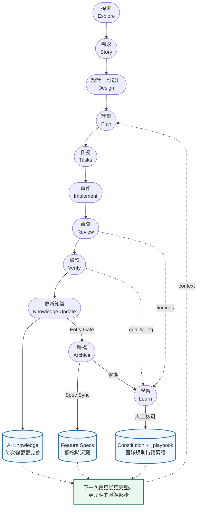
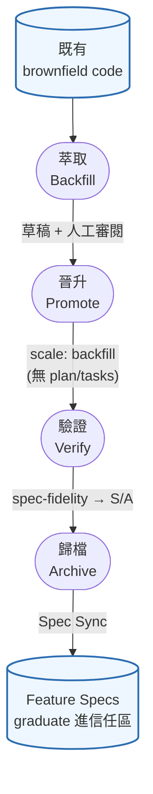

# Prospec

<div align="center">

[](LICENSE)
[](https://www.typescriptlang.org/)
[](tests/)
[](https://nodejs.org/)
[](https://pnpm.io/)

**為 AI coding agent 打造的漸進式規格驅動開發 (SDD) 工具組**

*Slash-command Skills · 結構化 AI Knowledge · MCP server — 支援 Claude Code、Copilot、Codex*

[English](./README.md) • [快速上手](#快速上手) • [為什麼選擇 Prospec？](#為什麼選擇-prospec) • [運作原理](#運作原理) • [AI Skills](#ai-skills) • [CLI 命令](#cli-命令)

**本專案 fork 自 [ci-yang/prospec](https://github.com/ci-yang/prospec)**

</div>

---

## 目錄

- [什麼是 Prospec？](#什麼是-prospec)
- [為什麼選擇 Prospec？](#為什麼選擇-prospec)
- [快速上手](#快速上手)
  - [前置需求](#前置需求)
  - [1. 安裝](#1-安裝)
  - [2. 建立專案骨架](#2-建立專案骨架)
  - [3. 跑你的第一個變更](#3-跑你的第一個變更在-ai-agent-中)
- [運作原理](#運作原理)
  - [Skill 與 CLI 協同模式](#skill-與-cli-協同模式判斷面與確定性執行)
  - [核心原則](#核心原則)
- [AI Skills](#ai-skills)
  - [17 個 Skills 清單](#ai-skills)
  - [品質閘門與自我改進](#品質閘門與自我改進)
  - [相稱流程 (Scale)](#相稱流程scale)
- [CLI 命令](#cli-命令)
  - [基礎設施命令](#基礎設施命令)
  - [變更管理命令](#變更管理命令)
  - [Drift 檢查（CI 閘門）](#drift-檢查ci-閘門)
  - [Token 量測](#token-量測)
  - [MCP Server](#mcp-server)
- [設定 (Configuration)](#設定-configuration)
- [進階工作流](#進階工作流)
  - [Backfill：把既有程式碼納進信任區](#backfill把既有程式碼納進信任區)
  - [升級 Prospec](#升級-prospec)
- [架構與開發](#架構)
  - [系統架構](#架構)
  - [測試](#測試)
  - [貢獻](#貢獻)
- [授權與致謝](#授權)

---

## 什麼是 Prospec？

Prospec 是一套 **CLI-first 的規格驅動開發（SDD）工具組**，為 AI coding agent 而設計。日常工作以 slash-command **Skills 在 Agent 內**驅動（Claude Code、Antigravity、Copilot、Codex），而 Skills 執行的每一項**確定性操作** —— scaffold、狀態轉換、quality-log 寫入、spec sync、評分 —— 都交由 **`prospec` CLI**（必裝的單一執行檔）執行，同樣的 repo 狀態永遠產出相同的位元組。Skills 保留判斷面：訪談、prose、審查、裁決。成效：你的 Agent 遵循一致的 `story → plan → tasks → implement → review → verify → archive` 工作流，立基於結構化、版控的專案知識，且 LLM 的不確定性被隔絕在簿記之外。

三個元件協同運作：

```
  你 ⇄ AI agent
     │
     ├─ Skills .......... 執行工作流：story → plan → tasks →
     │                    implement → review → verify → archive
     │                        ▲
     │                        │ 讀取並擴充
     ├─ AI Knowledge .... 結構化的專案記憶（模組、規格、教訓）
     │                        ▲
     │                        │ 由此生成／重新生成
     └─ CLI (prospec) ... 執行所有確定性步驟：scaffold、狀態轉換、quality-log 寫入、
                          drift 檢查、評分、spec sync
```

- **Skills** 在 Agent 內執行工作流的**判斷面** —— 訪談、prose、審查、裁決 —— 日常操作面。
- **AI Knowledge** 是漸進式的專案記憶，Skills 讀取它、並隨每次變更擴充它。
- **CLI** 是必裝的單一執行檔，**就在** runtime 迴圈內：Skills 需要的每個確定性操作 —— bootstrap、scaffold、生命週期轉換、結構化記錄、drift 檢查、評分、封存同步 —— 都以程式執行、位元可重現。

**適合誰？** 使用 AI coding agent、希望在新專案（Greenfield）或既有程式碼庫（Brownfield）上獲得可重複、可審查工作流的開發者。

## 為什麼選擇 Prospec？

| 挑戰 | Prospec 如何解決 |
|------|------------------|
| AI 不了解你的程式碼庫 | `prospec knowledge init` + `/prospec-knowledge-generate` 自動掃描並生成 AI 可讀文件 |
| Context window 限制 | 漸進式揭露：先載入摘要，細節按需取用（vs full-dump 省 70%+ tokens） |
| AI 工作流不一致 | 結構化 Skills 強制執行 `story → plan → tasks → implement → review → verify → archive` |
| 供應商鎖定 | 支援 4+ AI CLI，知識儲存在通用 Markdown 格式 |
| 設計到程式碼斷裂 | `/prospec-design` 生成視覺 + 互動規格，整合 MCP 工具 |
| Knowledge 容易過時 | verify S/A commit prompt 把 Knowledge Update 折入 feature commit；archive Entry Gate 為 backstop 複核 |
| verify 過了仍出細微 bug | `/prospec-review` —— implement 與 verify 間的獨立對抗式審查 |
| 教訓無法跨 session 留存 | `/prospec-learn` —— 反覆出現的修正經人工核可晉升為版控的團隊規則 |

> 每一列都對應下方的某個 Skill 或命令 —— 見 [AI Skills](#ai-skills) 與 [CLI 命令](#cli-命令)。

---

## 快速上手

從零到第一個 AI 驅動變更，約五分鐘。

### 前置需求

- **AI CLI**（至少一個）：[Claude Code](https://docs.anthropic.com/claude/docs/claude-code)（推薦）、[Codex CLI](https://developers.openai.com/codex/cli)、[GitHub Copilot CLI](https://docs.github.com/copilot/github-copilot-in-the-cli) 或 [Antigravity CLI (agy)](https://antigravity.google/)
- **Node.js** >= 22.13.0（若採用**選項 A 獨立執行檔**則**免安裝 Node.js**；僅在使用 npm/pnpm/npx 或參與本專案開發時需要）

### 1. 安裝

`prospec` CLI 是日常 SDD 開發迴圈不可或缺的**核心確定性執行引擎**。AI Agent 內部的 Skills（例如 `/prospec-new-story`、`/prospec-plan`、`/prospec-verify`、`/prospec-archive` 等）在執行時，會在背景自動呼叫 `prospec` 指令來建立骨架、進行狀態轉換、記錄 quality_log、驗證 drift 與同步 Feature Spec。

因此，請確保系統 `PATH` 中可直接執行 `prospec`：

**選項 A：獨立執行檔 (Standalone Binary)（強烈推薦，免安裝 Node.js 執行期環境）**
對於 macOS 和 Linux，可執行一鍵安裝腳本（自動安裝至 `~/.prospec/bin` 並設定 `PATH`）：
```bash
curl -fsSL https://raw.githubusercontent.com/benwu95/prospec/main/install.sh | bash
```

對於 Windows，可執行一鍵 PowerShell 安裝腳本：
```powershell
powershell -c "irm https://raw.githubusercontent.com/benwu95/prospec/main/install.ps1 | iex"
```

或者，您也可以手動自 [GitHub Releases](https://github.com/benwu95/prospec/releases) 頁面下載適用您平台的二進位檔，解壓後放置於系統 `PATH` 目錄下：

- **Linux (x64)**: `prospec-linux-x64.tar.gz`
- **macOS (Apple Silicon)**: `prospec-macos-arm64.tar.gz`
- **macOS (Intel)**: `prospec-macos-x64.tar.gz`
- **Windows (x64)**: `prospec-windows-x64.zip`

**選項 B：在專案內固定為開發期依賴 (devDependency)（Node.js 專案）**
作為專案本地依賴進行安裝：
```bash
npm install -D github:benwu95/prospec     # 或：pnpm add -D github:benwu95/prospec
```

**選項 C：使用 npx 執行單次命令（Node.js 環境）**
不需全域安裝即可執行單次指令：
```bash
npx github:benwu95/prospec <command>
```

> [!WARNING]
> 我們**不推薦**使用 `npm install -g` 進行全域安裝，因為非發布版分支 (unpublished fork) 的全域編譯可能會因為您本機的 Node/編譯環境不同而失敗。推薦優先使用**選項 A 獨立執行檔**。


### 2. 建立專案骨架

一個指令完成 deterministic 的設定 —— 它會串接 `init` + `agent sync`，已完成的步驟自動跳過：

```bash
cd my-project                 # 新專案或既有專案

prospec quickstart            # → 選擇 AI Assistant、選擇文件語言；建立 .prospec.yaml + 各 agent config + Skills
```

`prospec quickstart` 會執行 `agent sync`，寫入 **Claude Code** → `CLAUDE.md` + `.claude/skills/`；**Antigravity / Codex / Copilot** → `AGENTS.md` + `.agents/skills/`。接著在你的 AI Agent 中完成收尾：

```text
🤖 Run inside your AI Agent chat:
/prospec-quickstart           # 在地化 skill triggers、重新同步 config、生成 AI Knowledge
```

這個一次性收尾步驟可重複執行且會自我終止；在既有程式碼庫上，它會把你的模組讀進 AI Knowledge，讓 Agent 在你的第一個變更前就理解它們。

### 3. 跑你的第一個變更（在 AI Agent 中）

你不需要記得每一步 —— **用自然語言描述你要的變更，Agent 就會自己跑完整個 SDD 迴圈**，只在需要時停下來問你問題、並徵詢每次的交接：

```text
🤖 Run inside your AI Agent chat:
你 ▸ 請 prospec 幫我加一個深色模式切換

Agent 接手需求並執行 /prospec-ff：
  • 問幾個範圍 / 驗收問題 —— 你用自然語言回答
  • 寫出 story → plan → tasks，接著在每個階段交接：

  "Run /prospec-implement now? (Y/n)"             → Y
  implement → "Run /prospec-review now? (Y/n)"    → Y
  review    → "Run /prospec-verify now? (Y/n)"    → Y
  verify 達到 grade A → 提示你 commit              → Y
         → "Run /prospec-archive now? (Y/n)"      → Y   ✓ 已歸檔
```

每個階段結束時都會告訴你下一步、並等你按 `Y` —— 按 `n` 就停下、提示會保留，你可以稍後回來接續，不必記得自己進行到哪。`/prospec-verify` 是 commit 邊界：達 S/A 時它會提示你 commit（絕不替你 commit），接著才提議歸檔。

想自己逐步驅動？也可以明確執行：

```text
🤖 Run inside your AI Agent chat:
/prospec-explore                   # （可選）先釐清需求
/prospec-new-story add-my-feature  # 把需求記錄成結構化 story
/prospec-design                    # （可選）UI / 互動規格
/prospec-plan                      # 設計實作（`quick` scale 的變更會跳過）
/prospec-tasks                     # 把計劃拆成有序的任務清單
#   ↑ 用 /prospec-ff add-my-feature 一次收合 story → plan → tasks
/prospec-implement                 # 逐項實作（先不 commit）
/prospec-review                    # 對抗式審查 → fix 迴圈
/prospec-verify                    # 驗證；達 S/A 後提示你 commit
/prospec-archive                   # 歸檔 + 同步規格與知識
/prospec-learn                     # （定期）把反覆出現的教訓晉升為團隊規則
```

這就是完整的 SDD 迴圈。由於 `/prospec-quickstart` 已經先生成了 AI Knowledge，Agent 一開始就理解你的模組。下方完整的 Greenfield 與 Brownfield 流程會逐步拆解 `prospec quickstart` 自動完成的每個步驟。

<details>
<summary>Greenfield 與 Brownfield 的 bootstrap 差異 —— 兩個指令展開後做了什麼</summary>

#### Greenfield（新專案）
`prospec quickstart` → `/prospec-quickstart` 就是完整的 bootstrap

```bash
mkdir my-project && cd my-project
prospec quickstart --name my-project   # init + agent sync（互動式選擇 assistant 與語言）
# 接著在你的 AI Agent 中：
/prospec-quickstart                     # 在地化 triggers · 重新同步 · 生成 AI Knowledge
```

這兩個指令展開後是：

```bash
# `prospec quickstart` 執行：
prospec init --name my-project   # → 選擇要啟用的 AI Assistant（互動式 checkbox）
                                 # → 選擇文件主要語言（預設英文，或用
                                 #   --language "Traditional Chinese (Taiwan)"）；[MUST]
                                 #   路徑式 Language Policy 規則會寫入 CONSTITUTION.md —
                                 #   trust zone、程式碼與 git commit message 一律維持英文
                                 # → 建立 .prospec.yaml + 目錄結構
prospec agent sync               # → 各 agent config + Skills（Claude Code → CLAUDE.md +
                                 #   .claude/skills/；Antigravity / Codex / Copilot →
                                 #   AGENTS.md + .agents/skills/）

# `/prospec-quickstart` 接著在你的 AI Agent 中：
#   • 文件語言非英文？它會為 .prospec.yaml 的 `skill_triggers` 提議母語觸發詞，
#     經你確認後重跑 agent sync —— skills 就能匹配你用母語描述的需求
#   • prospec knowledge init → /prospec-knowledge-generate（生成 AI Knowledge）
```

空專案上，`/prospec-knowledge-generate` 會產出一份最小的 Knowledge base，隨著你持續出貨變更逐步補完。接著就照上面步驟 3 跑你的第一個變更。

#### Brownfield（既有專案）
同樣兩個指令；`/prospec-quickstart` 會把你既有的程式碼讀進 AI Knowledge

```bash
cd existing-project
prospec quickstart                      # 自動偵測 Tech Stack；執行 init + agent sync
# 接著在你的 AI Agent 中：
/prospec-quickstart                     # 在地化 triggers · 重新同步 · knowledge init · /prospec-knowledge-generate
```

這兩個指令展開後是：

```bash
# `prospec quickstart` 執行：
prospec init          # → 自動偵測 Tech Stack；選擇 AI Assistant；選擇文件主要語言
                      #   （預設英文；--language 可跳過互動提示）
prospec agent sync    # → 各 agent config + Skills

# `/prospec-quickstart` 接著在你的 AI Agent 中：
prospec knowledge init       # → 生成 raw-scan.md + 空骨架（prospec/index.md、_conventions.md、module-map.yaml）
/prospec-knowledge-generate  # → AI 讀取 raw-scan.md，決定模組切割，
                             #   建立 modules/*/README.md + 填充 prospec/index.md
```

這裡的 `knowledge init` 會讀取你既有的程式碼，所以 `/prospec-knowledge-generate` 一開始就產出內容豐富的 Knowledge base。接著就照上面步驟 3 跑你的第一個變更 —— 開發迴圈與 Greenfield 完全相同。

`knowledge init` 捕捉的是程式碼*怎麼*組織，但 brownfield 模組通常仍缺少描述它*做什麼*的 Feature Spec。補上這個 WHAT 層缺口是一條獨立的一等流程 —— 見下方 **[Backfill：把既有程式碼納進信任區](#backfill把既有程式碼納進信任區)**。它不屬於 bootstrap，可在任何時候執行。

</details>

<details>
<summary>完成 Quickstart 後的目錄佈局（<code>prospec quickstart</code> + <code>/prospec-quickstart</code>）</summary>

```
your-project/
├── .prospec.yaml              # Prospec 配置
├── CLAUDE.md                  # Claude Code 配置（Layer 0，<100 行）
├── AGENTS.md                  # Antigravity / Codex / Copilot 配置（agents.md 標準）
├── {base_dir}/
│   ├── README.md              # 給本專案讀者的 Prospec 簡短說明
│   ├── CONSTITUTION.md        # 專案規則（使用者定義）
│   ├── index.md               # AI 進入點與模組索引（Markdown 表格）
│   ├── specs/
│   │   ├── product.md         # Product Spec（PRD 入口）
│   │   └── features/          # 活的 Feature Spec（累積）
│   └── ai-knowledge/
│       ├── _conventions.md    # 專案慣例
│       ├── _playbook.md       # /prospec-learn 晉升的團隊教訓（人工核可）
│       ├── _lessons-ledger.md # 累積的教訓 ledger，Archive 時自動 feed（版控）
│       ├── raw-scan.md        # 自動生成的專案掃描資料
│       ├── module-map.yaml    # 模組依賴關係
│       ├── feature-map.yaml   # Feature→module 索引（選配；archive 時 bootstrap）
│       └── modules/
│           └── {module}/
│               └── README.md  # 模組專屬文件
├── .prospec/                  # 變更管理（不 commit）
│   ├── changes/
│   │   └── {change-name}/
│   │       ├── proposal.md        # User Story + 驗收標準
│   │       ├── design-spec.md     # 視覺規格（可選，UI 變更時）
│   │       ├── interaction-spec.md # 互動規格（可選）
│   │       ├── plan.md            # 實作計劃
│   │       ├── tasks.md           # 任務拆解（checkbox 格式）
│   │       ├── delta-spec.md      # Patch Spec（ADDED/MODIFIED/REMOVED）
│   │       └── metadata.yaml      # 變更生命週期 metadata
│   └── archive/               # 已歸檔的完成變更
├── .claude/skills/            # Claude Code 的 Skills（每個 skill 一個目錄）
│   ├── prospec-explore/
│   ├── prospec-new-story/
│   ├── prospec-design/
│   ├── prospec-plan/
│   ├── prospec-tasks/
│   ├── prospec-ff/
│   ├── prospec-implement/
│   ├── prospec-review/
│   ├── prospec-verify/
│   ├── prospec-archive/
│   ├── prospec-learn/
│   ├── prospec-knowledge-generate/
│   ├── prospec-knowledge-update/
│   ├── prospec-backfill-spec/
│   ├── prospec-promote-backfill/
│   ├── prospec-quickstart/       # 一次性啟動收尾（部署於磁碟，排除於 entry config）
│   └── prospec-upgrade/          # 版本升級收尾（部署於磁碟，排除於 entry config）
└── .agents/skills/            # 同一組 skills，agents.md 格式（Antigravity / Codex / Copilot）
    └── prospec-*/
```

</details>

---

## 運作原理

Prospec 跑一條線性流程，外包兩條回饋迴圈，讓它**越用越好**，而非單純重複。


```mermaid
flowchart TD
    E([探索<br/>Explore]) --> S([需求<br/>Story]) --> D(["設計（可選）<br/>Design"]) --> P([計劃<br/>Plan]) --> T([任務<br/>Tasks]) --> I([實作<br/>Implement]) --> R([審查<br/>Review]) --> V([驗證<br/>Verify]) --> KU([更新知識<br/>Knowledge Update]) -- Entry Gate --> A([歸檔<br/>Archive]) -- 定期 --> L([學習<br/>Learn])

    V -. quality_log .-> L
    R -. findings .-> L
    L -- 人工核可 --> RULES[("Constitution + _playbook<br/>團隊規則持續累積")]

    KU --> AK[("AI Knowledge<br/>每次變更更完善")]
    A -- Spec Sync --> FS[("Feature Specs<br/>歸檔時沉澱")]

    AK -.-> NEXT["下一次變更從更完整、<br/>更聰明的基準起步"]
    FS -.-> NEXT
    RULES -.-> NEXT
    NEXT -. context .-> P

    classDef asset fill:#eef7ff,stroke:#2b6cb0,stroke-width:2px;
    classDef gain fill:#e9f9ee,stroke:#2f855a,stroke-width:2px;
    class AK,FS,RULES asset;
    class NEXT gain;
```

每次 **Archive** 都讓 **AI Knowledge** 更完善（隨每個變更累積），而反覆出現的教訓 —— review findings、跨階段 `quality_log`、session corrections —— 經**人工核可**晉升為持續累積的團隊規則（`Constitution` + `_playbook`）。所以下一次變更不從零開始，而是從更完整、更聰明的基準起步。

流程同時是 **scale-aware** 的：經使用者確認的 `quick` 變更會完全跳過 Plan 階段（`story → tasks`），並由 archive 時的 backstop 把關 —— 見[相稱流程](#相稱流程scale)。

### Skill 與 CLI 協同模式：判斷面與確定性執行

Prospec 提供擁有 17+ 個頂層命令的豐富 CLI，但**開發者平時幾乎不需要手動輸入這些 CLI 指令**。日常的 SDD 開發流程主要是透過 AI Agent 介面中的 slash-command **Skills**（例如 `/prospec-ff`、`/prospec-implement`、`/prospec-verify` 等）來驅動。

Skills 與 CLI 之間的互動遵循嚴格的職責分工：

- **Skills（Agent 內部的判斷面）**：在 LLM 上下文中執行。負責非確定性的思維與對話任務 —— 訪談需求、撰寫架構草案、執行對抗式審查、評估 UI/UX 規範以及給予品質分級。
- **CLI（`prospec` 確定性執行引擎）**：由 Skills 在背景透過指令探針（`_cli-probe`）自動呼叫。CLI 負責所有位元可重現的狀態變更 —— 建立變更骨架 (scaffolds)、驗證 YAML metadata、更新生命週期狀態轉換、寫入結構化 quality_log、計算 drift 報告、執行機械式 Spec Sync 以及歸檔已完成變更。

```
  使用者 ⇄ AI Agent (Slash-Command Skills)
           │
           │  (1) 提問與引導 SDD 開發流程
           │  (2) 執行高階判斷（撰寫文章、對抗審查、編寫程式碼）
           ▼
  Skill 執行迴圈
           │
           │  背景自動呼叫：Skills 執行 `prospec <command>`
           ▼
  `prospec` CLI (確定性執行引擎)
           │
           ├── 骨架建立（story / plan / tasks）
           ├── 生命週期與 Metadata（status / scale / progress）
           ├── 確定性稽核與評分（check / verify record / review merge）
           └── 知識與規格同步（archive / knowledge update / learn upsert）
```

**為什麼這種分離設計如此重要：**
把所有的紀錄與狀態轉換交給 CLI 執行檔處理後，Prospec 徹底避免了 LLM 格式化錯誤（例如格式不正確的 YAML/JSON 或損壞的 frontmatter），保證了零 token 的狀態檢查，並確保相同的儲存庫狀態永遠產出完全一致、位元可重現的產物。

### 核心原則

Prospec 強制執行 6 大核心原則，約束的對象是注入使用者專案的 prospec 資產 —— 生成的 Skills、配置與目錄結構：

1. **Progressive Disclosure First** — 永遠不要一次載入所有資訊；索引 → 細節
2. **Spec is Source of Truth** — 變更在寫程式碼前先記錄在規格中
3. **Zero Startup Cost for Brownfield** — 不需要預先文件化整個程式碼庫
4. **AI Agent Agnostic** — 透過 Markdown adapters 支援任何 AI CLI
5. **User Controls the Rules** — Constitution 由使用者定義，工具負責強制執行
6. **Language Policy** — 變更文件使用 `prospec init` 時選擇的語言（預設英文）；trust zone（AI Knowledge base、Feature Spec、Constitution）、程式碼、專業術語與 git commit message 一律英文

---

## AI Skills

Prospec 生成 17 個 Skills —— 15 個涵蓋完整 SDD 生命週期，外加兩個週期性收尾：`/prospec-quickstart`（啟動）與 `/prospec-upgrade`（版本升級）：

| Skill | Slash Command | 說明 |
|-------|---------------|------|
| **探索** | `/prospec-explore` | 思考夥伴，協助釐清需求 |
| **新需求** | `/prospec-new-story` | 建立結構化的變更需求 |
| **設計** | `/prospec-design` | 生成視覺 + 互動規格（Generate/Extract 雙模式） |
| **計劃** | `/prospec-plan` | 生成實作計劃 + delta-spec |
| **任務** | `/prospec-tasks` | 拆分為可執行的任務 |
| **快速前進** | `/prospec-ff` | 一次生成 story → plan → tasks |
| **實作** | `/prospec-implement` | 逐項實作任務，MCP 優先讀取設計資料 |
| **審查** | `/prospec-review` | 對抗式審查 → fix 迴圈；經驗證確認的 critical 自動修，帶 spec-aware lens |
| **驗證** | `/prospec-verify` | 5+1 維度稽核，含品質等級（S/A/B/C/D）；達 S/A 後提示 commit |
| **歸檔** | `/prospec-archive` | 歸檔變更 + Spec Sync + Knowledge 同步 Entry Gate |
| **學習** | `/prospec-learn` | 回饋晉升：反覆出現的教訓 → 團隊 `_playbook` / Constitution（可審計、人工核可） |
| **知識生成** | `/prospec-knowledge-generate` | AI 驅動的模組分析與知識建立 |
| **知識更新** | `/prospec-knowledge-update` | 基於 delta-spec 的增量知識更新 |
| **回填規格** | `/prospec-backfill-spec` | 從既有 brownfield code 反向萃取 Feature Spec 草稿（僅 stage 草稿，絕不直寫信任區） |
| **晉升回填** | `/prospec-promote-backfill` | 把審閱過的回填草稿定型化為 backfill change scaffold（proposal + delta-spec + metadata、`scale: backfill`、`status: implemented`;輕量 scale —— 無 plan/tasks）；絕不直寫信任區 |
| **快速開始** | `/prospec-quickstart` | `prospec quickstart` 執行 init + agent sync 後，依 artifact language 在地化 skill 觸發詞、準備 Knowledge 掃描，並串接 `/prospec-knowledge-generate` 生成 AI Knowledge;絕不直寫信任區 |
| **升級** | `/prospec-upgrade` | `prospec upgrade` 記錄版本、重新同步 agents 並補建缺少的 init 檔案後，依 report 的 docs inventory 逐檔處理：遷移漂移的 init 檔案格式 + 補齊已建檔案，並為新增 skill 補譯觸發詞（只補缺）—— 每步附確認 + diff／內容預覽；絕不覆寫你撰寫的內容 |

> [!NOTE]
> **週期性收尾 Skills**：`/prospec-quickstart`（`prospec quickstart` 後執行一次）與 `/prospec-upgrade`（版本升級時於 `prospec upgrade` 後執行）完成 CLI 無法決定性處理的判斷步驟。兩者皆以 Skill 形式部署於磁碟，但不列入常駐 entry config，因此不增加任何重複性 token 成本。

### 品質閘門與自我改進

除了線性流程，每個 workflow Skill 都內建品質機制：

- **Output Contract** — 每個 Skill 對客觀準則自評 `Met N/M | Overall: PASS|WARN|FAIL`，不必逐行檢查 artifact。
- **Entry / Exit gates** — Skill 啟動前檢查前置條件（Entry）、結束時比對 Constitution（Exit）；WARN/FAIL 記入跨階段 `quality_log`，讓前一階段的疑慮在下一階段被 surface。
- **Skill 指令品質** — 每個 numbered phase 帶自己的 gate checklist（比 skill 層 Entry/Exit gate 更細）；線性流程 Skill（plan→tasks→implement→review→verify→archive）結尾有 status-aware 的**下一步 handoff**（`Run <next-step> now? (Y/n)` —— 你的 Y 才是觸發、絕不靜默 auto-run）；新 session 偵測進行中的變更以接續；`/prospec-implement` 每完成一個 task 後重錨 `Progress X/Y | Goal | Next`；`/prospec-explore` 與 `/prospec-knowledge-generate` 在 Constitution 仍實質空白時提醒（否則其 gate 形同 no-op）。
- **可執行 Constitution** — 規則帶 RFC-2119 嚴重度（MUST→FAIL／SHOULD→WARN／MAY→資訊性），由 `/prospec-verify` 分級。
- **確定性 drift 閘門** — `prospec check` 以零 token 機器驗證 spec ↔ code ↔ knowledge 的指涉完整性；`/prospec-verify` 在開發期消費同一份報告，scaffold 出的 CI workflow 在每個 PR 強制執行。搭配選配的 `feature-map.yaml`（feature→module 索引，archive 時 bootstrap）再加兩條治理檢查：REQ-prefix 合法性（WARN）與 feature→module 邊（FAIL）。
- **對抗式審查** — `/prospec-review` 位於 implement 與 verify 之間：獨立 fresh-context reviewer 審整個 change diff；僅經驗證確認、可 drop-in 的 critical 自動修，其餘升級給人。**commit 邊界**在 verify 達 S/A **之後**，讓 implement + review + verify 的修正落入單一 atomic commit（prospec 提示、絕不自動 commit）。
- **回饋晉升** — 每個 **Archive** 都自動 harvest 該變更反覆出現的教訓進版控的 `_lessons-ledger.md`；`/prospec-learn` 以明文可重現準則（頻次 + 影響模組數）評分，**僅在顯式人工核可後**晉升進團隊 `_playbook.md` 或 Constitution。每次收集前它還會**掃描兩份檔案裡專案已經長大而不再需要的條目** —— 規則已由某道閘門執行、規則的主體已不存在、或與 Constitution 互相矛盾 —— 並帶著證據交由人工退役；退役一律就地標記（ledger 列保留所有計數、playbook 編號永不重用），清理不會損及稽核軌跡。

### 相稱流程（Scale）

不是每個變更都值得完整儀式。story 階段由 `/prospec-new-story`（或 `/prospec-ff`）依明文判準評估複雜度並建議 scale —— **經你確認後**才寫入 `metadata.yaml`：

| Scale | 流程差異 |
|-------|---------|
| `quick` | 精簡 proposal（單 Story、免 FR/SC 枚舉）、**完全跳過 plan 階段**（`story → tasks`）、不載入模組 README；review/verify 的 delta-spec 維度標示 `not-applicable`（絕不偽裝 PASS） |
| `standard`（預設；既有變更無欄位即此級） | 現行精簡流程 —— plan ≤ 120 行 |
| `full` | 完整架構分析 —— 擴充 Technical Summary、逐進入點 Call Chain |

兩道誠實的 backstop 防止 `quick` 變成 spec drift 破口：評估階段就把「預期影響 spec-covered 行為」的變更**否決出 quick**；`/prospec-archive` Entry Gate 再以**實際 diff** 複核 —— 有 spec 影響即阻擋歸檔，直到補上極簡 Spec Impact 段落，knowledge-sync gate 則改由 diff 檔案路徑推導受影響模組（不依賴缺席的 delta-spec）。工程紀律不隨 scale 縮減：TDD、對抗式審查、Constitution 稽核在每個級別照常執行。

任務同時帶 **kind** 標記（`[M]` manual、`[V]` verification、無標記＝code）：完成率只計 code task，「手動跑個指令」之類未勾選的提醒不會卡住或扭曲任何 gate。

<details>
<summary>Cache 穩定前綴排序（進階內部機制）</summary>

每個 skill 的 Startup Loading 區段以**靜態優先**排序，讓 provider 的 prompt cache（Anthropic 顯式 `cache_control`、OpenAI/Gemini 自動 prefix caching）能跨觸發重用最長前綴。每個載入項帶兩種標注之一：

- **`[STABLE]`** — 僅在 `agent sync` 或治理變更時改動：啟動即需的 `references/` 格式規格、Constitution、`_conventions.md`。最先載入。（`ff` / `plan` / `archive` 的分階段格式規格改為**逐 phase on-demand** 讀取 —— 移出穩定前綴，中途 abort 就不必為後續 phase 的格式付出成本。）
- **`[DYNAMIC]`** — 隨 knowledge 更新、change 或每次觸發變動：`prospec/index.md`（cache boundary 後第一位）、模組 README、`_playbook.md`、Feature/Product Specs、`.prospec/changes/` artifacts。最後載入。

判準是**跨請求前綴穩定性**，不是「是否由範本生成」：entry config 的 Available Skills 列表每專案固定（只在 skill 集變動時改變），因此屬 `[STABLE]`。Extension 開發者新增 skill 須遵循同一排序 —— 靜態在 boundary 前、動態在後 —— 否則每次觸發都打破 cache 前綴。harness 量測的是 **prospec 組裝管線**（corpus 組裝的是 knowledge 檔案，非 skill 範本本身）—— 見下方 Token 量測。範本層重排的效果發生在 agent 部署層，不在 harness 可觀測範圍（刻意排除在外）：其效益依據各 provider 文件化的 prefix-caching 語意推導，而非 before/after 直接量測。

</details>

---

## CLI 命令

### 基礎設施命令

| 命令 | 說明 |
|------|------|
| `prospec quickstart [options]` | 一鍵啟動：執行 `init` + `agent sync`，並交棒給 Agent 內的 `/prospec-quickstart` |
| `prospec upgrade [--cwd <dir>]` | 版本升級後更新 `.prospec.yaml` 版本號、重跑 `agent sync` 並補建缺少的文件範本 |
| `prospec init [options]` | 初始化 Prospec 專案結構（可設定語言與支援的 Agent） |
| `prospec knowledge init [options]` | 靜態掃描專案原始碼，生成 `raw-scan.md` 與模組結構骨架 |
| `prospec knowledge update [options]` | 依 `delta-spec.md` 機械式同步模組邊界與 `index.md` auto 區塊 |
| `prospec knowledge verify <modules>` | 記錄模組的 `last_verified` 時間戳記，供 CI 判斷知識新鮮度 |
| `prospec agent sync [--cli <name>]` | 同步 Agent 配置與生成 Skills（支援多 Agent 規格） |
| `prospec agent triggers [--write <file>]` | 匯出待在地化的 `skill_triggers` 範本，支援回寫至 `.prospec.yaml` |
| `prospec config example` | 輸出完整且含逐欄註解的 `.prospec.yaml` 參考範例 |
| `prospec print-template <path>` | 輸出內建樣板原始內容（離線、免 Node.js 環境） |

#### 基礎設施命令詳解

- **`prospec quickstart [options]`**
  - **核心用途**：新專案快速引導，串接 `init` 與 `agent sync`。
  - **執行行為**：自動執行前置步驟並跳過已完成項目；完成後提示在 AI Agent 內執行 `/prospec-quickstart` 進行觸發詞在地化與知識庫生成。
  - **選項**：支援與 `init` 相同的 `--name`、`--agents`、`--language` 選項。

- **`prospec upgrade [--cwd <dir>]`**
  - **核心用途**：升級 Prospec 版本後進行確定性環境更新與檔案補齊。
  - **執行行為**：
    - 在 `.prospec.yaml` 中記錄新版本號（就地合併，保留既有註解與格式）。
    - 重新執行 `agent sync` 確保各 Agent 配置與 Skills 範本對齊最新版。
    - 自動補建缺少的初始文件（以範本渲染，採 skip-if-exists 策略，絕不覆寫或重排既有檔案）。
    - 輸出 migration report（含 docs inventory 清單），後續由 `/prospec-upgrade` Skill 接手需人工同意的格式收斂。

- **`prospec init [options]`**
  - **核心用途**：初始化 Prospec 專案結構。
  - **選項**：`--language <lang>`（設定 AI 產出文件語言，預設英文）、`--name <name>`、`--agents <list>`。

- **`prospec knowledge init [--depth <n>] [--dry-run] [--raw-scan-only]`**
  - **核心用途**：靜態掃描專案原始碼，生成專案結構快照與模組骨架。
  - **執行行為**：
    - 產生 `raw-scan.md` 及初版模組骨架（`module-map.yaml`、`prospec/index.md`、`_conventions.md`，僅在缺檔時建立）。
    - `--raw-scan-only`：僅重新產生 `raw-scan.md`（確定性掃描、不使用 LLM、不更動既有文件），用於程式碼變動後或 `/prospec-knowledge-generate` 前刷新結構快照。

- **`prospec knowledge update [--change <name>] [--module <m>...]`**
  - **核心用途**：依變更的 `delta-spec.md` 或指定模組進行機械式知識庫增量同步。
  - **執行行為**：
    - 依據 `module-map.yaml` 重新生成 `prospec/index.md` 的 auto 區塊。
    - 為全新模組建立 skeleton README，為已移除模組加上棄用標記。
    - 絕不重寫既有 README 內容（保留手寫知識），並於終端回報待人工撰寫清單（`README content pending`）。

- **`prospec knowledge verify <module>...`**
  - **核心用途**：為指定模組在 `module-map.yaml` 戳上 `last_verified` 時間戳記。
  - **執行行為**：記錄模組知識與原始碼確認一致的時間點；當模組 `src/**` 變動時作為 CI 與 `prospec check` 判斷 staleness 的依據。

- **`prospec agent sync [--cli <name>]`**
  - **核心用途**：同步各 AI Agent 設定檔並生成對應的 Skills。
  - **執行行為**：
    - Claude Code 寫入 `CLAUDE.md` 與 `.claude/skills/`。
    - Antigravity / Codex / GitHub Copilot 寫入共用的 `AGENTS.md` 與 `.agents/skills/`。
    - 讀取 `.prospec.yaml` 的 `skill_triggers` 注入母語觸發詞。
    - 僅更新 entry config 中的 `prospec:auto` 區塊，完整保留使用者於 `prospec:user` 的自訂內容。

- **`prospec agent triggers [--write <file>]`**
  - **核心用途**：輸出待翻譯的 `skill_triggers` 骨架以利在地化。
  - **執行行為**：
    - 列出尚未設定母語觸發詞的 Skill 及其英文基準（來自 `SKILL_DEFINITIONS`）。
    - `--write <file>`：僅將缺少的鍵值安全寫回 `.prospec.yaml`（保留註解與順序，寫入前經結構校驗，絕不覆寫既有條目）。

- **`prospec config example`**
  - **核心用途**：輸出完整且含逐欄註解的 `.prospec.yaml` 參考範例（未初始化專案亦可執行）。

- **`prospec print-template <path>`**
  - **核心用途**：輸出內建樣板的原始內容（離線、免 Node.js 環境即可讀取）。

#### Agent 配置佈局與安全機制

`prospec agent sync` 會為每個啟用的 AI Agent 生成專屬的 entry 配置與 Skills：
- **Claude Code** → `CLAUDE.md` + `.claude/skills/`
- **Antigravity / Codex / GitHub Copilot** → `AGENTS.md` + `.agents/skills/`（共用 [agents.md](https://agents.md) 開放標準；多者同時啟用時只寫一次）

工作流程取決於 harness 的 Skills（如 `/prospec-review` 與 `/prospec-verify`）會直接載明該 harness 的能力（`can_spawn_subagent` / `can_worktree` / `can_background`），而不是要求 agent 在執行期自行臆測。由於一份 `.agents/skills/` 副本服務多個 agent，它載明的是各 agent 能力的**交集**，絕不承諾其中任一個做不到的事。

> [!NOTE]
> **編輯安全性**：Entry 配置文件皆包含 `prospec:auto` 與 `prospec:user` 區塊。`agent sync`（以及 `init` 對 `AGENTS.md`）只會更新 `auto` 區塊，並完整保留你在 `user` 區塊手寫的內容；既有的手寫 `CLAUDE.md` / `AGENTS.md` 會在首次 sync 時自動遷入 `user` 區塊，而非被覆蓋。


#### 專案掃描支援語言

`prospec knowledge init`（含 `--raw-scan-only`）會將下列語言偵測進 `raw-scan.md`。偵測為 deterministic（不使用 LLM、不連網）且 best-effort，各區塊涵蓋程度不同：

| 語言 | Tech Stack | Dependencies | Entry Points | Config Files |
|------|:---:|:---:|:---:|:---:|
| JavaScript / TypeScript | ✅（含 framework） | ✅ `package.json` | ✅ | ✅ |
| Python | ✅ | ✅ `pyproject.toml` / `requirements.txt` | ✅ | ✅ |
| Go | ✅ | ✅ `go.mod` | ✅ | ✅ |
| Rust | ✅ | ✅ `Cargo.toml` | ✅ | ✅ |
| Java / Kotlin | ✅ Maven / Gradle | ✅ `pom.xml` ¹ | ✅ | ✅ |
| C# | ✅ | ✅ `*.csproj` | ✅ | ✅ |
| Ruby | ✅ | — ² | ✅ | ✅ |
| PHP | ✅ | ✅ `composer.json` | — | ✅ |
| C | ✅ ³ | ✅ `vcpkg.json` / `conanfile.txt` ⁴ | ✅ | ✅ |
| C++ | ✅ ³ | ✅ `vcpkg.json` / `conanfile.txt` ⁴ | ✅ | ✅ |
| Swift | ✅ `Package.swift` | — ⁵ | ✅ | ✅ |

¹ Java 依賴僅讀取 Maven `pom.xml`——Gradle 的 Groovy/Kotlin DSL 不做靜態解析。² Ruby 依賴不解析（`Gemfile` 為 Ruby DSL）。³ C 與 C++ 由原始碼副檔名推斷；可於 `.prospec.yaml` 設 `tech_stack` 覆寫。⁴ C/C++ 依賴僅讀宣告式 manifest——`CMakeLists.txt` 與 `conanfile.py` 為命令式、不解析。⁵ Swift 依賴不解析（`Package.swift` 為命令式 Swift）。未辨識的語言仍會出現在 Directory Tree 與 File Stats 區塊——且因為未列出的副檔名一律算原始碼，其程式碼目錄**不會**出現在 Directories Without Source Files。

**掃描無法判定為程式碼的目錄。** `raw-scan.md` 另有一個 `Directories Without Source Files` 區塊：列出沒有任何檔案算得上原始碼的最上層目錄，含檔案數與副檔名組成——module 偵測器要求檔案**有**副檔名、**且**該副檔名不在非原始碼拒絕清單上，因此只含無副檔名檔案的目錄（一整包腳本的 `bin/`）也會落在這裡。根目錄層級的檔案不屬於任何目錄，永遠不會被列出。它是掃描事實而非偵測判決：curated 的 `module-map.yaml`（偵測一律優先採用）或零結果退回，仍可能讓這類目錄成為 module。該區塊是 `/prospec-knowledge-generate` 判斷的依據——某個目錄（一整包 Kubernetes YAML 的 `manifests/`、一整本 LaTeX 的 `chapters/`）究竟是不是這個專案的本體、該不該寫進 `module-map.yaml`。

**表外的語言？** 仍會掃描——Directory Tree 與 File Stats 永遠有值，且 `/prospec-knowledge-generate` 會直接讀原始碼。Tech Stack 會落為 `unknown`；可於 `.prospec.yaml` 的 `tech_stack` 權威宣告（free-form——覆蓋自動偵測，並以 `Source: config` 呈現）：

```yaml
tech_stack:
  language: zig
  package_manager: zig build
```

Entry Points、Dependencies、Config Files 沒有逐語言覆寫機制——未加偵測 pattern 前，對未辨識語言維持空白（掃描不會自行捏造）。

### 變更管理命令

#### 生命週期與骨架指令

| 命令 | 說明 |
|------|------|
| `prospec status` | 唯讀查詢進行中變更的當前階段、建議下一步與阻擋閘門；工作區乾淨時回報漂移報告的狀態 |
| `prospec change story <name> [options]` | 建立變更需求骨架（`proposal.md` + `metadata.yaml`） |
| `prospec change plan [--change <name>] [--force]` | 建立技術實作計劃骨架（`plan.md` + `delta-spec.md`） |
| `prospec change tasks [--change <name>] [--force]` | 建立任務清單骨架（`tasks.md`） |
| `prospec change auto-draft [options]` | 從漂移 findings（或指定 `--target`）建立修復變更骨架，免去手動轉抄報告 |
| `prospec spec show <feature> [options]` | 唯讀且精確讀取 Feature Spec 的指定 REQ 或 Story 區段 |
| `prospec archive <name...> [--dry-run]` | 封存 verified 變更：搬移目錄、生成摘要並機械式同步 Feature Spec |
| `prospec archive finalize <name> [--dry-run]` | 歸檔後置完成步驟：複製 final summary 至歷史目錄並對帳 spec 計數 |

#### 狀態、追蹤與驗證輔助指令

| 命令 | 說明 |
|------|------|
| `prospec change scale <scale> [--change <name>]` | 設定複雜度規模（`quick` / `standard` / `full` / `backfill`） |
| `prospec change status <to> [--change <name>]` | 單向推進變更生命週期狀態（拒絕逆向或非法跳躍） |
| `prospec change progress [options]` | 計算任務進度（排除 `[M]` / `[V]`）並支援勾選指定任務 |
| `prospec change log [options]` | 在 `metadata.yaml` 追加結構化 `quality_log` 記錄 |
| `prospec review merge --findings <file> [options]` | 將審查 JSON 發現合併進累積 `review.md` 表格 |
| `prospec verify record [options]` | 彙整機器與判斷維度計算評級（S/A/B/C/D），達標時推進 verified |
| `prospec learn upsert --lesson <file> [options]` | 冪等寫入經驗帳本，依規則判定是否晉升 Playbook |
| `prospec validate <kind> [target] [options]` | 機械式驗證工件結構完整性（不符時 exit 1） |

#### 變更管理命令詳解

- **`prospec status`**
  - **核心用途**：唯讀查詢所有進行中變更的生命週期狀態與自動化路由建議。
  - **重點條列**：
    - 回報各變更的目前階段（node）、建議的下一個站點、阻擋的閘門（blocking gates）與具體理由。
    - 支援不同的 scale 路由（如 `quick` 跳過 plan 直接進入 tasks、`backfill` 路由至 promote 站）。
    - 呈現登記的 `issue` 參照；中繼資料格式錯誤會逐變更回報，絕不中斷整體執行。
    - 無任何進行中變更時，讀取 `prospec-report.json` 並回報其**狀態**：`--auto-draft` 會起草的 finding 數量，或該報告無法解析、或是對著不同的程式碼產生的（以 `change_digest` 比對）。無法信任的報告會如實回報，絕不當成「沒有漂移」。

- **`prospec change story <name> [options]`**
  - **核心用途**：建立新變更的目錄結構、`proposal.md` 骨架與 `metadata.yaml`（`status: story`）。
  - **選項與參數**：
    - `--description <d>`：變更的一行簡短描述。
    - `--related-module <m>...`：明確指定關聯模組（覆寫關鍵字自動比對）。
    - `--issue <ref>`：登記此變更對應的 Issue / Ticket 追蹤編號。
    - `--introduced-by <c>`：記錄引入此缺陷的變更來源（用於缺陷漏失率分析）。

- **`prospec change plan [--change <name>] [--force]`**
  - **核心用途**：建立 `plan.md` 與 `delta-spec.md` 骨架，並將狀態推進至 `plan`。
  - **防護規則**：若檔案已存在則拒絕覆寫（除非加上 `--force`）；禁止不允許 plan 的 scale（例如 `quick` 需改跑 `change tasks`，`backfill` 需使用 `/prospec-promote-backfill`）。

- **`prospec change tasks [--change <name>] [--force]`**
  - **核心用途**：建立 `tasks.md` 骨架，並將狀態推進至 `tasks`。
  - **重點條列**：`quick` 規模可直接從 `proposal.md` 拆解（`story → tasks`）；已存在檔案時拒絕覆寫（除非加上 `--force`）；`backfill` 禁止執行。

- **`prospec spec show <feature> [--req <ids>] [--story <ids>]`**
  - **核心用途**：唯讀且精確地讀取 Feature Spec 的指定需求區段（支援 Token 窄讀）。
  - **重點條列**：
    - `--req <ids>`：僅輸出指定的需求區段（支援逗號分隔或重複指定）。
    - `--story <ids>`：輸出指定 User Story 的完整區塊。
    - 未指定選擇器時輸出整份 Feature Spec；查詢不存在的 REQ 時會報錯退出（exit 1），避免誤判為未定義。
    - 供 Agent 於 verify 與 archive 階段針對性載入，避免一次載入數萬 Token 的無關規格。

- **`prospec archive <name...> [--dry-run]`**
  - **核心用途**：對已驗證（`verified`）的變更執行確定性歸檔與規格合併。
  - **執行行為**：
    - 搬移變更目錄至 `.prospec/archive/{date}-{name}/`，產生 `summary.md` 骨架並設定 `status: archived`。
    - 執行 Feature Spec 機械式同步：將 delta-spec 中的 `**Spec:**` 區塊合併進正式規格，並在 stderr 輸出兩份工作清單（保留原規格 body 的 REQ 清單，以及被取代且漏掉既有 `WHEN/THEN` 條點的清單）。
    - 同步 `product.md` 的 `## Feature Map` 區段（若遇近似標題、未閉合 code fence 或缺目錄則安全拒絕並提供修復指南；缺檔時自動 bootstrap）。
    - `--dry-run`：完整列出預定進行的所有 mutation 而不寫入磁碟；目標未達 verified 狀態時回報 refused（exit 1）。

- **`prospec archive finalize <name> [--dry-run]`**
  - **核心用途**：歸檔後置完成步驟（在人工收斂 `summary.md` 與規格文案後執行）。
  - **重點條列**：
    - 將最終版 `summary.md` 複製至 `specs/_archived-history/` 作為入版控的稽核軌跡。
    - 依據最新文本對帳並更新每份 feature spec 的 frontmatter `story_count` 與 `req_count`。
    - 若 `summary.md` 仍為未編輯的 scaffold 樣板則拒絕執行。

- **`prospec change scale <quick|standard|full|backfill> [--change <name>]`**
  - **核心用途**：設定變更的複雜度 scale，就地更新 `metadata.yaml` 並保留原有註解。

- **`prospec change status <to> [--change <name>]`**
  - **核心用途**：單向推進生命週期狀態（逆向或非法躍遷將被拒絕並列出合法目標）。

- **`prospec change log --skill <station> --result <PASS|WARN|FAIL> [options]`**
  - **核心用途**：在 `metadata.yaml` 追加一筆結構化的 `quality_log` 記錄。
  - **選項**：支援 `--warning <w>`、`--grade <g>`、`--dimension n=r`、`--criticals-found <n>` 等參數，確保欄位順序固定與字元自動跳脫。

- **`prospec change progress [--complete <task>] [--change <name>]`**
  - **核心用途**：計算與更新 `tasks.md` 的任務進度。
  - **重點條列**：
    - 回報任務進度比例（X/Y，自動排除 `[M]` 手動與 `[V]` 驗證任務）及下一項待辦任務。
    - `--complete <task>`：精確勾選指定的一項任務 checkbox。

- **`prospec review merge --findings <file> [--change <name>]`**
  - **核心用途**：將單輪審查的 JSON 發現合併至累積的 `review.md` 表格中。
  - **重點條列**：依識別碼去重、嚴重度取最大值、跨輪次保留記錄，自動填入重現方式（repro）與佐證（evidence），並輸出 critical 摘要與統計。

- **`prospec verify record --dimension <name>=<result>... | --dimensions <file> [options]`**
  - **核心用途**：計算驗證評級（S/A/B/C/D）並記錄結果。
  - **重點條列**：機械維度自讀 `prospec-report.json`，判斷維度由參數或 JSON 檔案傳入；評級達 S 或 A 時自動將狀態推進至 `status: verified`。

- **`prospec learn upsert --lesson <file> [--today <date>]`**
  - **核心用途**：向經驗帳本（`_lessons-ledger.md`）冪等寫入教訓記錄。
  - **重點條列**：依 `頻率 ≥ 3 且影響模組 ≥ 2` 規則自動評分是否晉升至 Playbook，並自動掃描 Playbook 條目的 TTL 狀態。

- **`prospec validate <kind> [target] [--change <name>]`**
  - **核心用途**：機械式校驗工件結構完整性（支援 `slug`、`promote-scaffold`、`backfill-draft`、`design-spec` 等）。校驗失敗時 exit 1。

> [!IMPORTANT]
> **確定性執行層**：上述變更管理命令即為工作流的確定性執行層（issue #107）。Skills（`/prospec-new-story`、`/prospec-ff` 等）的所有 scaffold、狀態轉換與記錄均透過呼叫 CLI 完成，不再由 LLM 自行產出格式易錯的產物；若 CLI 缺失或版本低於探針門檻時，各 Skill 會自動停止（STOP）。這些命令亦完全支援手動與 CI/CD 腳本呼叫。

### MCP Server

以 stdio 啟動的**唯讀** MCP server，把專案真相 —— 架構、規格、依賴方向、已晉升 playbook 與知識新鮮度 —— 暴露給任何支援 MCP 的 agent，即使沒裝 Prospec Skills。

| 命令 | 說明 |
|------|------|
| `prospec mcp serve [--cwd <path>]` | 以 stdio 啟動**唯讀** MCP server —— 任何支援 MCP 的 agent（即使沒裝 Prospec Skills）都能查詢專案的架構真相、規格真相、依賴方向、已晉升 playbook 與知識新鮮度。`--cwd` 釘住專案根目錄，讓單一 agent 不論從何處啟動都能同時跑多個專案 server |

**Resources**（每次請求都重新讀檔 —— client 永遠看到當前檔案狀態）：

| URI | 內容 |
|-----|------|
| `knowledge://index` | AI Knowledge 模組索引（`prospec/index.md`） |
| `knowledge://module/{name}` | 單一模組的 Recipe-First README，加上其 `## Sub-Modules` 區塊連結的每個 sub-module 檔（完整的 L2 模組知識） |
| `knowledge://module-map` | 模組邊界 + `depends_on`（`module-map.yaml`） |
| `knowledge://feature-map` | feature → module 索引 + REQ prefixes（`feature-map.yaml`） |
| `knowledge://playbook` | 人工核可的團隊 lessons（`_playbook.md`） |
| `knowledge://health` | 各模組 staleness + coverage —— 與 `prospec check` 同一份純函式 |
| `spec://product` | Product spec —— PRD 入口 + feature map（`product.md`） |
| `spec://feature/{name}` | Feature specs（REQ source of truth）；archived specs 以與 `prospec check` 同一條規則排除 |

**Tools**：`search_modules`（這個概念歸哪個模組 —— 對策展索引欄位做正規化 term-OR 比對，
查 `drift checker` 找得到 `drift-checker`）、`get_dependency_direction`（`from` 可否 import `to`？
—— 依 module-map `depends_on` 回答，無 map 時用 Constitution 鏈，回應標明判定來源），
以及 `get_spec_requirements`（只引出變更觸及的需求，依 REQ id 或 story，而非讀整份 Feature Spec ——
與 `prospec spec show` 同一個窄讀；帶參數的查詢做成 tool 是因為 resource template 無法承載選擇性
query，且無選擇器時它拒絕而非回空集合）。

**註冊方式** —— 把 agent 的 MCP 設定指向 `prospec mcp serve --cwd <專案根目錄>`。`--cwd` 釘住專案，
讓 server 不論 agent 從何處啟動都能解析到該專案的 `.prospec.yaml` —— 也因此單一 agent 能一次註冊多個
專案。假設採用推薦的全域安裝（`prospec` 已在 PATH 上）。

Claude Code：

```bash
claude mcp add project-name -- prospec mcp serve --cwd /path/to/project
```

其他 agent —— 在其 JSON MCP 設定中用同一個命令：

```json
{
  "mcpServers": {
    "project-name": {
      "command": "prospec",
      "args": ["mcp", "serve", "--cwd", "/path/to/project"]
    }
  }
}
```

要從任意目錄服務多個專案，就每個專案註冊一個 entry —— 各自取唯一名稱、帶自己的 `--cwd`
（Claude Code 加 `-s user` 讓它到處可用）：

```bash
claude mcp add -s user prospec-a -- prospec mcp serve --cwd /path/to/A
claude mcp add -s user prospec-b -- prospec mcp serve --cwd /path/to/B
```

若把 prospec 釘成 devDependency 而非全域安裝，則改經 `npx`：Claude Code 命令前綴 `npx`
（`… -- npx prospec mcp serve --cwd /path/to/project`），或在 JSON 把 `"command"` 設為 `"npx"`、
`"prospec"` 當第一個 arg（`["prospec", "mcp", "serve", "--cwd", "/path/to/project"]`）。

誠實邊界：server 為唯讀（沒有任何 tool/resource 能改檔案）、以單一程序服務單一專案（`--cwd` 指定的根目錄）、
且為純加值面 —— 沒有任何 Skill 或 CLI 命令依賴它，server 不在時一切照常。Transport 僅 stdio；HTTP/SSE
刻意不納入本版。

### Drift 檢查（CI 閘門）

| 命令 | 說明 |
|------|------|
| `prospec check [--json] [--strict]` | 零 LLM 確定性檢查：驗證規格、程式碼、依賴方向與知識庫完整性 |
| `prospec check --record-tests [options]` | 執行專案測試並將結果與退出碼記錄至變更的 `metadata.yaml` |
| `prospec check --record-review [options]` | 記錄程式碼 digest 與 `delta-spec.md` 指紋作為審查比對基準 |
| `prospec check --escaped-defects [options]` | 依 `introduced_by` 統計各階段閘門的缺陷漏失率報表 |
| `prospec check --init-ci` | 生成 GitHub Actions CI 閘門（`.github/workflows/prospec-check.yml`） |
| `prospec check --auto-draft [--auto-draft-dry-run]` | 報告產出後，依 finding 分組建立修復變更（絕不覆寫既有變更；起草失敗不改變 check 自身的退出碼，但與非檢查模式併用會在執行前被拒絕） |

#### Drift 檢查命令詳解

- **`prospec check [--json] [--strict]`**
  - **核心用途**：以零 Token 機器驗證 spec ↔ code ↔ knowledge 的指涉完整性與架構邊界。
  - **檢驗維度清單**：
    - **規格與連結**：懸空 REQ 引用、失效 Markdown 連結、Feature Spec frontmatter 計數對帳（`story_count`/`req_count`）。
    - **架構與依賴**：依 `module-map.yaml` 驗證 import 依賴方向、REQ-prefix 合法性（WARN）、feature→module 邊界（FAIL）。
    - **知識庫健康**：模組新鮮度（`last_verified` vs 原始碼 commit，WARN）、檔案 Token 與行數預算（`knowledge-size`，WARN）、README 宣告計數真實性（WARN）。
    - **審查與測試出處**：
      - `review-provenance`：已實作或已驗證的變更必須具備對應現行程式碼的 review 記錄。
      - `test-provenance`：變更必須具備最新且通過（綠燈）的測試記錄。
      - `delta-spec-provenance`：變更的 `delta-spec.md` 指紋必須與 review 基線一致（防止審查後私自修改規格）。
      - `delta-spec-landing-fidelity`：MODIFIED 的 delta-spec `**Spec:**` 落地區塊不得在未以 `**Dropped:**` 宣告的情況下丟棄信任區既有的 `WHEN/THEN` bullet（FAIL）——與 archive 寫入路徑共用同一份比對，在每次 check 就浮現遺失，而非等到 commit 之後的 archive。
    - **治理規範**：憲法原則 RFC-2119 標籤（WARN）、工件語言一致性（`artifact-language`，WARN）、Token 預算調高理由註解（WARN）、初始文件漂移（`canonical-doc-drift`，WARN）。
  - **執行選項與退出碼**：
    - `--json`：輸出機器可讀的 `prospec-report.json`。
    - `--strict`：任一檢項出現 FAIL 時以 exit 1 退出（WARN 與 SKIPPED 永不影響退出碼）。`--auto-draft` 無法改變這件事：起草在報告寫出之後才執行，起草失敗只會被回報、不會被拋出。
    - `--auto-draft` 與 `--init-ci` / `--record-review` / `--record-tests` / `--escaped-defects` 併用會被**拒絕**（exit 1、不寫入任何檔案），因為那四種模式都在漂移檢查執行前就返回；`--auto-draft-dry-run` 缺少 `--auto-draft` 時同樣被拒——無法被履行的旗標會被拒絕，而不是靜默忽略。
    - 料源不可用時自動降級為 `skipped` 並說明具體原因，絕不偽裝 PASS。

- **`prospec change auto-draft [--from-report [file]] [--target <name>] [--reason <text>] [--check <id>] [--scale <scale>] [--issue <ref>] [--dry-run]`**
  - **用途**：把漂移 findings 轉成變更骨架，讓 agent 不必轉抄報告即可著手修復。亦可透過 `prospec check --auto-draft` 直接就當次報告起草。
  - **分組**：每個 `<target>:<check>` 組合產生一個變更，命名為 `fix-<target>-<check>`——當 target 無法原樣通過 slug 化時附加一段穩定字尾，使兩個不同的 target 絕不會落到同一個目錄。target 來自 `module-map.yaml` 歸屬與專案設定的 `knowledge.base_path` / `paths.base_dir`，絕不猜測路徑形狀；位於 feature spec 底下的 finding 歸入該 feature 名稱，兩者都歸不到的才落入 `general`。只有 `module-map.yaml` 宣告過的名稱會寫進 `related_modules`——feature 名稱與 `general` 是主體，不是模組。
  - **範圍**：兩類 finding 不起草——`headroom`（壓力）層級的 `knowledge-size`（回報預算壓力而非違規），以及 `source_path` 位於 `.prospec/` 者（那是針對某個變更的 SDD 流程閘門，起草它等於建立一個「修別的變更的文書」的變更）。除此之外不丟棄任何 finding。
  - **安全性**：建立骨架走的是與 `prospec change story` 相同的服務，因此既有變更目錄只會被跳過、絕不覆寫，重複執行具冪等性。`--dry-run` 只回報將建立什麼、完全不寫入任何檔案（在 `check` 上旗標名為 `--auto-draft-dry-run`，因為 `check` 的其他寫入不受它影響）。
  - **前提**：必須有且僅有一個漂移來源。`--from-report` / `--target` / `--reason` / `--check` 全缺時，指令以非零碼結束，而不是回報一個乾淨的判定；報告來源與顯式 target 併用會被拒絕，而不是靜默丟棄其一。

- **`prospec check --record-tests [--change <name>]`**
  - **核心用途**：執行專案測試指令並將結果（指令、退出碼、digest、日期）寫入變更的 `metadata.yaml`。
  - **重點條列**：
    - 測試結果作為 `/prospec-verify` 測試維度的客觀裁決依據，防止 Agent 自陳虛報。
    - 指令直接經由 argv 執行（不經 shell）；無法執行時標記為 `skipped` 並說明原因。
    - 若先前已記錄非零退出碼（紅燈），即使事後指令變得無法解析仍判定為 FAIL（事實不被隱藏）。

- **`prospec check --record-review [--change <name>]`**
  - **核心用途**：記錄該變更的審查基線（程式碼 digest）與 `delta-spec.md` 指紋，供後續驗證 `review-provenance` 與 `delta-spec-provenance`。

- **`prospec check --escaped-defects [--json]`**
  - **核心用途**：依 `introduced_by` 欄位聚合各階段閘門的漏失缺陷率（報表模式，不產生 finding 也不影響 exit code）。

- **`prospec check --init-ci`**
  - **核心用途**：生成供應鏈強化的 GitHub Actions CI 閘門（`.github/workflows/prospec-check.yml`），採用完整 SHA 固定、最小權限原則與 PR sticky comment。

誠實規則：料源不可用時檢項降級為 `skipped` 並附明確原因 —— 絕不偽裝 PASS；語意層的 spec↔code 一致性仍屬 `/prospec-review`（報告恆標 `not-checked`）。`/prospec-verify` 在開發期消費同一份報告，開發者與 CI 閘門看到的永遠是同一份事實，且零 token。

**verify 由誰裁決** —— 在 verify 站，這份報告不是參考而是裁決。任務完成率、Knowledge、測試三個維度**由本引擎裁決**：verify 逐字採用各檢項狀態、不得改判，因此這三個判定在無 LLM 參與下即可重現。沒有機械 oracle 的兩個維度——delta-spec 合規與設計一致性——維持機率判斷，並在 **fresh context**（未寫過這段程式的獨立審查者）中評定；Constitution 稽核則對半拆分：嚴重度與規則清冊取自機器清冊，違反與否仍是人／LLM 的判斷。引擎無法執行時，機械維度標為 `not-adjudicated`（絕不 PASS），且 grade S 不可達。

**調整 `knowledge-size` 預算** —— `knowledge-size` 量的是**agent 實際會讀的每一個載入面**，不只模組知識：L1 檔、模組 README 與 sub-module、Feature Spec 與 `product.md`、load-on-demand 治理知識檔，以及——僅在專案本身持有 skill 樣板原始碼時——每一份已部署的 `SKILL.md` 與其 references —— 含手寫的 skill，因為 harness 同樣會載入它們。每個載入面有各自的門檻，可在 `.prospec.yaml` `knowledge.token_budget` **逐欄**覆寫。只設你要改的欄位，未設的回退預設：

```yaml
# .prospec.yaml
knowledge:
  token_budget:
    l1_per_file: 1800               # 每個 L1 檔（index.md + 各 core convention）的 token 上限
    l2_per_module: 1000             # 每個模組知識檔（README 與各 sub-module）的 token 上限
    readme_max_lines: 100           # 每個模組知識檔的行數上限
    spec_per_file: 5000             # 每份 Feature Spec（與 product.md）的 token 上限
    demand_knowledge_per_file: 10000 # 每個 load-on-demand 知識檔的 token 上限
    skill_per_file: 5000            # 每份生成的 SKILL.md 的 token 上限
    reference_per_file: 2500        # 每份生成的 skill reference 的 token 上限
    headroom: 0.85                  # 觸發壓力預警的預算水位比例（0.85 = 85%）
```

新初始化的專案，其 `.prospec.yaml` 不含 `token_budget` 區塊，因此每個門檻都回退到上面的 shipped default；要改哪幾欄，跑 `prospec config example` 取得完整逐欄註解的區塊再複製過去。超標檔案只 WARN（防止無聲回彈的壓力訊號 —— 絕非 build breaker，也不影響 `--strict` 的 exit code），且每則 finding 會指出該載入面的具名收斂路徑，而不是泛泛的「請壓縮」：Feature Spec 切到 `specs/features/{feature}/`、治理知識檔跑 `/prospec-learn` 的 Staleness Sweep、L2 檔抽出 sub-module。

其中兩項值得單獨說明。**Feature Spec 是單調成長的** —— 每次歸檔都會 append 畢業的 REQ，而沒有任何機制會移除 —— 所以在成熟專案裡支配載入量的那一層，正是先前完全沒有預算的那一層；切出來的 slice 以同一個 `spec_per_file` 量測，因此分割不可能把它移出預算視線。**skill 檔只在 authoring 專案量測**，以 skill 樣板原始碼是否存在來偵測：純消費生成 skill 的專案對這種 finding 無法行動，而「無法行動的 WARN」正是這個檢查存在要避免的東西。

<details>
<summary>隨選變異測試（Mutation Testing）</summary>

| 指令 | 說明 |
|------|------|
| `pnpm mutate <path>` | 隨選深度稽核：以 Stryker 對指定路徑執行變異測試並回報得分與存活 mutant |

#### 變異測試說明

- **`pnpm mutate <path>`**
  - **核心用途**：隨選深度稽核，評估測試套件對程式碼變異的捕捉能力（刻意不做 CI 閘門）。
  - **特性與成本**：
    - 成本取決於模組層級常數（static mutants）與依賴該模組的測試套件大小之乘積。
    - `--ignoreStatic` 可大幅加快執行速度（適用於快速迭代），但會略過模組層級的靜態變異測試。
    - 存活的 mutant 代表測試可能存在的盲點，需由工程師進行人工判斷。

</details>

### Token 量測

| 命令 | 說明 |
|------|------|
| `pnpm measure:tokens [options]` | 在活的 repo 上組裝三種 context，記錄 provider API 真實 Token 消耗與費用 |
| `prospec measure [options]` | 解析本地 session log 以呈現量測數據，或進行上下文預算投影（不呼叫 API、不消耗 Token） |

#### Token 量測命令詳解

- **`pnpm measure:tokens [--provider <p>] [--budget <usd>] [--offline]`**
  - **核心用途**：組裝 full-dump / naive-rag / prospec 三種 context，向 Provider API 發送並記錄真實 usage。
  - **選項**：`--provider` 指定模型來源；`--budget` 設定預算上限（預設 US$10）；`--offline` 跳過 API 呼叫，改以字元數估算輸出 `size-report.json`。

- **`prospec measure [--project-workflow <scale>] [--change <name>]`**
  解析本地 AI CLI 的 session logs，顯示實際 Token 消耗與相對於基線的節省比。亦支援單一變更的上下文預算投影。

harness 讓 token 效率主張可驗證而非空口宣稱：對每個 corpus 任務（`tests/fixtures/token-corpus/`，只版控任務**描述**，context 於執行時組裝）將同一份 context 連送兩次（cold + warm）並讀取 provider 真實 `usage`。

**Agent → 量測 provider 對應**（copilot/codex 無公開 benchmark API，量測其模型來源而非 agent harness 本身）：

| Agent | Provider API | 預設 model |
|-------|-------------|-----------|
| claude | Anthropic | `claude-haiku-4-5` |
| codex、copilot | OpenAI | `gpt-4.1-mini` |
| antigravity | Google | `gemini-2.5-flash` |

**如何誠實解讀數字：**

- 效率主張 = **vs full-dump baseline 的 input-token 成本**；naive-rag baseline 一律並列（差距較小）。output token 不受影響、誠實列出。
- **warm\*** 為合成命中（連送兩次）；production 命中率取決於觸發是否落在 cache TTL 內。各 provider 另有最小可 cache 前綴（如 `claude-haiku-4-5` 為 4,096 tokens）——低於地板值的小型 prospec 組裝會誠實記錄 0% 命中率，機制在 production 規模的 context 下才生效。
- 各 provider 的 cache 折扣結構不同（Anthropic 顯式 `cache_control`、OpenAI/Gemini 自動 prefix caching）—— 數字**僅同 provider 內可比**，不可跨 provider 或跨 repo 快照（報告記錄量測當下的 git commit）。
- 不設門檻、不進 CI：報告供人解讀，不判定通過與否。
- 本專案任何「節省 token」數字只能引用本 harness 產出 —— 估算不是資料。


---

## 設定 (Configuration)

Prospec 的核心設定檔為專案根目錄的 `.prospec.yaml`。這是客製化 AI Knowledge 生成方式以及工作流程的主要途徑。

你可以調整的關鍵設定包含：

- **`artifact_language`**：控制 `.prospec/changes/` 下的變更文件與其封存摘要所使用的語言（例如 `Traditional Chinese (Taiwan)`）。trust zone —— AI Knowledge base、`specs/features/`、`specs/product.md`、`index.md`、`README.md`、`CONSTITUTION.md` —— 以及程式碼、變數名稱、專業術語與 git commit message 將一律維持英文。`prospec init` 會以同一組路徑把路徑式的 Language Policy 規則寫入 `CONSTITUTION.md`，因此該規則與 agent entry config（`CLAUDE.md`/`AGENTS.md`）永遠陳述同一個範圍。
- **`exclude`**：設定在產生 AI Knowledge 時，要忽略掃描的目錄或檔案特徵（例如 `["*.env*", "node_modules"]`）。預設會排除 `.git` 與常見的編譯目錄。
- **`agents`**：指定專案要產生哪些 AI Agent 的設定檔（`claude`, `antigravity`, `codex`, `copilot`）。
- **`tech_stack`**：可手動覆寫自動偵測的技術堆疊（例如 `language: zig`, `package_manager: zig build`）。
- **`knowledge.strategy`**：決定在產生知識庫時，專案模組的切分策略（`auto`, `architecture`, `domain`, `package`）。
- **`knowledge.token_budget`**：控制 `knowledge-size` 逐檔評分的 token 數與行數上限，每個載入面各一個 —— L1 檔、L2 模組知識、Feature Spec、load-on-demand 知識，以及（在自行撰寫 skill 的專案）每一份已部署的 skill 與其 references，含手寫的。
- **`knowledge.generated_artifacts`**：由 build 產生、但會落在原始碼樹裡的檔案路徑（相對於 repo 根目錄）。`knowledge-health` 會忽略這些檔案的 commit 時間戳，因此重新產生 bundle 不再讓每個模組都被判定為 stale。未設定即不排除任何檔案 —— 這個檢查對「你的 build 會吐出什麼」沒有任何內建假設。
- **`knowledge.additional_core_conventions`**：Prospec 的知識系統會在 Agent 啟動時預設載入 `_conventions.md`（與 `CONSTITUTION.md`）。如果你有其他全域共用的規範檔案（例如 API 規範、資安規範等）也希望能做為 Core Conventions (L1) 強制預先載入，可以將相對於 `ai-knowledge/` 的檔名加在這裡。
- **`skill_triggers`**：允許客製化修改觸發特定 AI Skill 的關鍵字（可加入母語觸發詞）。

`.prospec.yaml` 範例（每個欄位的完整逐欄註解參考，執行 `prospec config example`）：
```yaml
version: "1.0"
project:
  name: my-project
tech_stack:
  language: typescript
  package_manager: pnpm
paths:
  base_dir: prospec
artifact_language: Traditional Chinese (Taiwan)
exclude:
  - "*.env*"
  - "node_modules"
agents:
  - claude
  - antigravity
knowledge:
  base_path: prospec/ai-knowledge
  strategy: domain
  token_budget:
    l1_per_file: 1800
    l2_per_module: 1000
    readme_max_lines: 100
  additional_core_conventions:
    - my-custom-api-rules.md
skill_triggers:
  prospec-explore:
    - explore
    - 探索
```

---

## 進階工作流

### Backfill：把既有程式碼納進信任區

Brownfield 專案累積了大量「沒有 Feature Spec 描述」的行為。**Backfill** 是一條一等、雙 skill 的流程：從程式碼反向萃取這些行為，並把它 graduate 進規格信任區（`prospec/specs/features/`）—— 而且**從不手寫信任區**（archive 維持唯一寫入者）。


```mermaid
flowchart TD
    CODE[("既有<br/>brownfield code")] --> BF([萃取<br/>Backfill]) -- "草稿 + 人工審閱" --> PR([晉升<br/>Promote]) -- "scale: backfill<br/>(無 plan/tasks)" --> V([驗證<br/>Verify]) -- "spec-fidelity → S/A" --> A([歸檔<br/>Archive])

    A -- Spec Sync --> FS[("Feature Specs<br/>graduate 進信任區")]

    classDef asset fill:#eef7ff,stroke:#2b6cb0,stroke-width:2px;
    class CODE,FS asset;
```

1. **萃取** —— `/prospec-backfill-spec` 讀程式碼（與 tests、git history、docs）、stage 一份 route-compatible 的 `backfill-draft.md`；無法從程式碼推得的 intent 標 `[NEEDS CLARIFICATION]`，絕不捏造。
2. **審閱** —— 解決每個 `[NEEDS CLARIFICATION]`（*So that* 價值、目標角色、模糊 AC），確認候選 feature slug。這是人工關卡。
3. **晉升** —— `/prospec-promote-backfill` 把審閱過的草稿展開為 change scaffold（proposal + delta-spec + metadata），標記 `scale: backfill`、`status: implemented`。`backfill` 是像 `quick` 的**輕量 scale** —— 不產空殼 `plan.md`/`tasks.md`，因為程式碼已存在。
4. **驗證** —— `/prospec-verify` 改評 **spec-fidelity**（每條 REQ 的 `file:line` 須成立），把既有程式碼品質落差（如未測的 brownfield code）記為 informational 技術債，且此降級僅在 `backfill-draft.md` 證明 provenance 時套用 —— 因此忠實的草稿能達 S/A、不被它只是「記錄」的技術債擋住，而 marker 也無法替新程式碼 bypass 品質 gate。
5. **歸檔** —— `/prospec-archive` 把需求 graduate 進 `prospec/specs/features/{slug}.md`。這是唯一會寫信任區的環節。

### 升級 Prospec

當發布新版 prospec 時，先更新執行檔：

```bash
# 若使用獨立執行檔（推薦）：重新執行安裝腳本
curl -fsSL https://raw.githubusercontent.com/benwu95/prospec/main/install.sh | bash

# 若釘選為專案 devDependency：
npm install -D github:benwu95/prospec     # 或：pnpm add -D github:benwu95/prospec
```

接著透過兩步驟將既有專案平滑升級——先執行決定性的 CLI 指令，再由 AI Agent 進行語意遷移與確認：

```bash
prospec upgrade                  # 步驟 1：CLI（zero-LLM）自動同步基礎設施與盤點檔案
```

```text
🤖 Run inside your AI Agent chat:
/prospec-upgrade                 # 步驟 2：AI Agent 依盤點報告遷移格式、補齊內容與在地化觸發詞（逐項徵詢確認）
```

#### 步驟 1：`prospec upgrade`（CLI 確定性處理）
- **版本記錄**：就地合併更新 `.prospec.yaml` 中的 `version` 欄位，完整保留使用者註解與排版。
- **Agent 與範本同步**：自動重跑 `agent sync`，將各 Agent 設定與 Skills 刷新至最新版範本。
- **重新掃描**：以最新掃描邏輯重新產生 `ai-knowledge/raw-scan.md`。
- **補建缺漏檔案**：以 `prospec init` 初始範本補建新版本新增的 init 檔案（採 skip-if-exists 策略，絕不覆寫或變更任何既有檔案內容）。
- **產出遷移報告**：輸出版本差異、文件庫存清單（docs inventory）以及新 Skill 觸發詞缺口。

#### 步驟 2：`/prospec-upgrade`（AI Agent 判斷與遷移）
- **格式遷移**：依據 docs inventory 逐檔比對最新範本，若既有檔案格式漂移則提議更新，**逐檔徵詢使用者同意**（絕不擅自覆寫自訂內容）。
- **內容補齊**：為 CLI 剛補建的基礎檔案填入專案真實內容（例如 `index.md` 的模組表格）。
- **觸發詞在地化**：依專案的 `artifact_language` 為新增的 Skills 自動補齊在地化觸發詞（`skill_triggers`）。
- **二次同步**：完成調整後自動重跑 `agent sync`，確保所有 Agent 立即生效。

> [!TIP]
> - **舊版檔案清理**：若從早於 1.0 的舊版 Prospec 升級，完成升級同步後可手動清理不再使用的舊版檔案與目錄：`GEMINI.md`、`.gemini/skills/`、`.codex/skills/`、`.github/copilot-instructions.md` 與 `.github/instructions/`。
> - **設定檔版本與觸發詞**：`.prospec.yaml` 的 `version` 會記錄專案上次升級的版本。新增 Skill 後若想單獨檢查或在地化觸發詞，只需直接執行 `prospec agent sync`，系統會明確列出缺少的條目供填補，完全無需重新建立設定檔。

---

## 架構

Prospec 採用 **Pragmatic Layered Architecture**（務實分層架構）遵循 CLI 開發最佳實踐：

```
src/
├── cli/          — Commander.js 命令 + 格式化輸出
├── services/     — 業務邏輯（30 個 service）
├── lib/          — 純工具函式（config、fs、logger 等）
├── types/        — Zod schema + TypeScript 型別
└── templates/    — Handlebars 範本（74 個 .hbs 檔案）
    └── skills/   — 17 個 Skill 範本 + 28 個 reference 範本
```

### Tech Stack

- **CLI 框架**：Commander.js 14 + @inquirer/prompts 8
- **驗證**：Zod 4
- **範本引擎**：Handlebars 4.7
- **檔案掃描**：fast-glob 3.3
- **YAML**：eemeli/yaml 2.x（保留 comment）
- **測試**：Vitest 4.0 + memfs
- **TypeScript**：5.9

---

## 測試

```bash
# 執行所有測試（4105 個測試）
pnpm test

# Watch 模式
pnpm run test:watch

# 型別檢查
pnpm run typecheck

# Lint
pnpm run lint
```

**測試覆蓋率**：4105 個測試橫跨 4 大類：
- Unit tests（types + lib + services + cli）：3068 tests
- Contract tests（CLI 輸出 + Skill 格式）：895 tests
- Integration tests：45 tests
- E2E tests：97 tests

測試套件內含真實 `init` + `agent sync` 生成契約（`tests/integration/skill-contract.test.ts`）：檢查 agent 專屬的 reference 路徑、無 dangling reference、canonical convention 文件、`base_dir` 相對的 spec 路徑，以及 antigravity/codex/copilot 收斂至 `.agents/skills` + `AGENTS.md`。

**保持事實計數同步** —— README 與 `prospec/index.md` 各處引用的測試計數與 `.hbs` inventory 由單一來源（vitest + 檔案系統）機器生成，不手動編輯：

```bash
# 就地把所有計數改寫為當前套件／檔案系統的真相
pnpm counts

# 唯讀：回報漂移，有任何過期計數則 exit 1
pnpm counts:check
```

CI 的 `test` job 跑的是加上 `--from` 的唯讀形式，指向前一步 `pnpm run test:coverage` 寫出的 JSON 報告 —— 閘門因此不必重跑第二次套件，計數落後會讓 PR 轉紅。`--from` 依設計只能唯讀：改寫模式會直接拒絕它，因為沒有任何辦法分辨「剛寫出的報告」與「昨天的報告」。

---

## 貢獻

我們歡迎貢獻！請參考 [CONTRIBUTING.md](./CONTRIBUTING.md) 了解指引。

開發使用 **pnpm**（Node 22.13+、pnpm 11+）。

```bash
# Clone 並安裝
git clone https://github.com/benwu95/prospec.git
cd prospec
pnpm install

# Dev 模式執行（TypeScript watch）
pnpm run dev

# 直接執行本機 CLI（免事先建置，使用 tsx）
pnpm cli --help
pnpm cli status

# 建置正式版本
pnpm run build

# 執行單元與合約測試套件
pnpm test

# 程式碼品質與文件計數驗證
pnpm typecheck
pnpm lint
pnpm counts          # 自動更新文件中的事實計數
pnpm counts:check    # 驗證文件計數是否一致
pnpm agents:check    # 驗證生成工件（bundle ＋ 部署的 skills）是否為當前狀態
pnpm knowledge:check # 驗證每個 source 有變動的模組都更新了 last_verified
```

<details>
<summary>Local install —— 在本機全域測試 <code>prospec</code> CLI</summary>

```bash
# 首次：裝依賴、建置後將 bin 全域註冊
pnpm install && pnpm run build && pnpm add -g .

# 之後改動只需重新建置 — 全域 bin 會自動指向新的 dist/
pnpm run build

# 結束後移除
pnpm uninstall -g prospec
```

> [!NOTE]
> - 首次全域安裝需執行一次 `pnpm setup`（設定全域 bin 目錄）。
> - 唯一的 lockfile 是 `pnpm-lock.yaml`；變更依賴後請執行 `pnpm install` 並 commit。
> - 詳見 [CONTRIBUTING.md](./CONTRIBUTING.md#dependency-management)。

</details>

---

## 授權

MIT License - 詳見 [LICENSE](./LICENSE)。

## 致謝

Prospec fork 自 Ci Yang 的 [ci-yang/prospec](https://github.com/ci-yang/prospec) — 本程式碼庫的上游來源。

除了這層淵源，Prospec 的設計靈感亦來自：

- [OpenSpec](https://github.com/openspec-ai/openspec) — Delta Specs、Fast-Forward、Archive
- [Spec-Kit](https://github.com/anthropics/spec-kit) — Constitution 驗證
- [cc-sdd](https://github.com/kiro-ai/cc-sdd) — Steering 分析、範本自訂
- [BMAD](https://github.com/bmad-ai/bmad) — Analyst 角色（prospec-explore）

Prospec 的獨特貢獻：**cli-first SDD、Skills 只留判斷** — CLI 執行所有確定性操作（scaffold、轉換、評分、spec sync），可重現且零 token；Skills 在 AI Agent 中執行判斷面工作。加上 **AI Knowledge 即 Context Engineering** — 為 AI Agent 設計的結構化、版控、漸進式專案記憶系統。

### See Also（延伸閱讀）

`prospec-verify` 與 `prospec-review` 的工程啟發式（failure-recovery triage，以及 security / performance / maintainability lens 判準）改編自 [addyosmani/agent-skills](https://github.com/addyosmani/agent-skills)（MIT）— 已 vendor 進 prospec 自包含的 reference 範本，因此 **prospec 運作不需安裝任何外掛**。若想要更完整的獨立版本，該外掛值得作為選用延伸閱讀：marketplace `addy-agent-skills`、plugin `agent-skills`（可用 `agent-skills:*` 觸發）。致謝詳見 [THIRD-PARTY-NOTICES](./THIRD-PARTY-NOTICES)。

## 連結

- [AI Knowledge 索引](./prospec/index.md)
- [Feature Specs](./prospec/specs/features/)

---

<div align="center">

**用心為 AI 驅動開發社群打造**

[回到頂端](#prospec)

</div>
