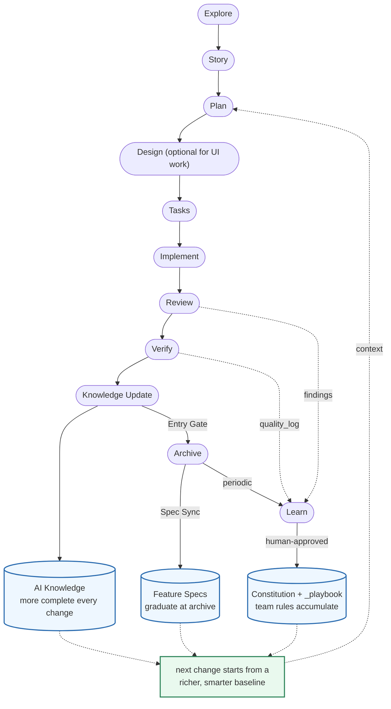

# How it works
[繁體中文](./how-it-works.zh-TW.md) • [Documentation](../README.md)

Prospec runs one linear flow, wrapped in two feedback loops that make it **compound** rather than merely repeat.



Every **Archive** enriches **AI Knowledge** (more complete with each change), and recurring lessons — review findings, the cross-stage `quality_log`, session corrections — promote, **only with human approval**, into an accumulating body of team rules (`Constitution` + `_playbook`). So the next change doesn't start from scratch; it starts from a richer, smarter baseline.

The diagram shows the standard path. It is also **scale-aware**: Design runs only when UI scope is `full` or `partial`; a user-confirmed `quick` change skips Plan entirely (`story → tasks`); and brownfield backfill enters through `prospec-promote-backfill` before Verify rather than replaying the standard planning path. Archive-time gates remain the backstop — see [Right-Sized Process](./workflow.md#right-sized-process-scale) and [Backfill](../guides/backfill.md#backfill-bringing-brownfield-code-into-the-trust-zone).

## Skill ↔ CLI Cooperation Model

Prospec includes a feature-rich CLI with 17+ top-level commands, but **developers rarely execute CLI commands directly**. Day-to-day SDD work is driven through host-aware **Skills** inside your AI Agent interface (`prospec-ff`, `prospec-implement`, `prospec-verify`, etc.).

The interaction between Skills and CLI follows a clear division of labor:

- **Skills (The Judgment Layer in AI Agent)**: Run inside your LLM context. They handle nondeterministic human/AI tasks — interviewing requirements, writing architectural prose, running adversarial reviews, evaluating WCAG/design guidelines, and assigning quality grades.
- **CLI (`prospec` - The Deterministic Execution Layer)**: Called by Skills under the hood via background subshell probes (`_cli-probe`). The CLI handles all byte-reproducible state mutations — creating change scaffolds, validating YAML metadata, updating lifecycle status transitions, recording structured quality logs, calculating drift reports, running mechanical spec sync, and archiving completed changes.

```
  User ⇄ AI Agent (Skills)
         │
         │  (1) Asks questions & guides SDD workflow
         │  (2) Executes high-level judgment (prose, review, code)
         ▼
  Skill Execution Loop
         │
         │  Under the hood: Skills call `prospec <command>`
         ▼
  `prospec` CLI (Deterministic Engine)
         │
         ├── Scaffolding (story / plan / tasks)
         ├── Lifecycle & Metadata (status / scale / progress)
         ├── Deterministic Audits & Grading (check / verify record / review merge)
         └── Knowledge & Spec Sync (archive / knowledge update / learn upsert)
```

**Why this separation matters:**
Delegating bookkeeping and state transitions to the CLI keeps LLM formatting errors (malformed YAML/JSON, broken frontmatter) out of the artifacts, makes state checks cost no model tokens, and makes the same repository state produce identical, byte-reproducible output.

## What is enforced, and by what

Three different things back the workflow's promises, and they are not interchangeable:

- **CLI-enforced (deterministic)** — artifact schemas, lifecycle transitions, gate refusals, drift
  checks, grade computation and spec landing. Same repo state, same bytes; gates are adjudicated
  per change, so a sibling change's missing evidence never blocks the target.
- **Skill-directed (procedural)** — the station gates, receipt requirements and stop conditions the
  Skills instruct an agent to follow. They bind an agent that follows its instructions; only the
  CLI's own refusals bind one that does not.
- **Model judgment (bounded)** — REQ intent versus code (verify 2/5), the adversarial review search,
  design consistency, and a `quick` change's Knowledge-impact review, whose spec impact is judged
  against the actual diff because that scale has no delta-spec. Quality here follows the tier you
  route to. Prospec measures that rather than assuming it — the bounded, fixed-scenario evaluation
  and its recorded limits live in [`scripts/workflow-eval/README.md`](../../scripts/workflow-eval/README.md)
  — so read a passing gate as evidence about that run, not as a reliability claim about models.

## Core principles

Prospec enforces 6 principles over the assets it injects into your project — the generated Skills, configs, and directory structure:

1. **Progressive Disclosure First** — never load all info at once; index → details
2. **Spec is Source of Truth** — changes documented in specs before code
3. **Zero Startup Cost for Brownfield** — no need to document the entire codebase upfront
4. **AI Agent Agnostic** — works with any AI CLI via Markdown adapters
5. **User Controls the Rules** — the Constitution is user-defined; the CLI lists its rules and severities mechanically, and verify's audit grades the change against them
6. **Language Policy** — change artifacts in the language you choose at `prospec init` (default: English); the trust zone (AI Knowledge base, Feature Specs, Constitution) in the language `trust_zone_language` sets (default: English); code, technical terms, and git commit messages always in English
