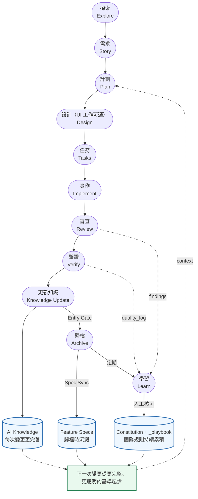

# 運作原理

Prospec 跑一條線性流程，外包兩條回饋迴圈，讓它**越用越好**，而非單純重複。



每次 **Archive** 都讓 **AI Knowledge** 更完善（隨每個變更累積），而反覆出現的教訓 —— review findings、跨階段 `quality_log`、session corrections —— 經**人工核可**晉升為持續累積的團隊規則（`Constitution` + `_playbook`）。所以下一次變更不從零開始，而是從更完整、更聰明的基準起步。

圖中顯示標準路徑。流程同時是 **scale-aware** 的：Design 只在 UI scope 為 `full` 或 `partial` 時執行；經使用者確認的 `quick` 變更完全跳過 Plan（`story → tasks`）；Brownfield backfill 則從 `prospec-promote-backfill` 進入 Verify，不重跑標準 planning path。Archive-time gates 仍是 backstop —— 見[相稱流程](./workflow.zh-TW.md#相稱流程scale)與[回填流程](../guides/backfill.zh-TW.md#backfill把既有程式碼納進信任區)。

## Skill 與 CLI 協同模式：判斷面與確定性執行

Prospec 提供擁有 17+ 個頂層命令的豐富 CLI，但**開發者平時幾乎不需要手動輸入這些 CLI 指令**。日常的 SDD 開發流程主要是透過 AI Agent 介面中的 host-aware **Skills**（例如 `prospec-ff`、`prospec-implement`、`prospec-verify` 等）來驅動。

Skills 與 CLI 之間的互動遵循嚴格的職責分工：

- **Skills（Agent 內部的判斷面）**：在 LLM 上下文中執行。負責非確定性的思維與對話任務 —— 訪談需求、撰寫架構草案、執行對抗式審查、評估 UI/UX 規範以及給予品質分級。
- **CLI（`prospec` 確定性執行引擎）**：由 Skills 在背景透過指令探針（`_cli-probe`）自動呼叫。CLI 負責所有位元可重現的狀態變更 —— 建立變更骨架 (scaffolds)、驗證 YAML metadata、更新生命週期狀態轉換、寫入結構化 quality_log、計算 drift 報告、執行機械式 Spec Sync 以及歸檔已完成變更。

```
  使用者 ⇄ AI Agent (Skills)
           │
           │  (1) 提問與引導 SDD 開發流程
           │  (2) 執行高階判斷（撰寫文章、對抗審查、編寫程式碼）
           ▼
  Skill 執行迴圈
           │
           │  背景自動呼叫：Skills 執行 `prospec <command>`
           ▼
  `prospec` CLI (確定性執行引擎)
           │
           ├── 骨架建立（story / plan / tasks）
           ├── 生命週期與 Metadata（status / scale / progress）
           ├── 確定性稽核與評分（check / verify record / review merge）
           └── 知識與規格同步（archive / knowledge update / learn upsert）
```

**為什麼這種分離設計如此重要：**
把紀錄與狀態轉換交給 CLI，讓 LLM 的格式錯誤（格式不正確的 YAML/JSON、損壞的 frontmatter）進不了工件，讓狀態檢查不花模型 token，並讓相同的儲存庫狀態產出一致、位元可重現的產物。

## 誰在強制什麼

支撐這套工作流承諾的是三件不同的事，彼此不可互換：

- **CLI 強制（決定性）** — 工件 schema、生命週期轉換、閘門拒絕、drift 檢查、評分計算與 spec landing。
  同樣的 repo 狀態產出同樣的位元組；閘門以單一 change 為對象裁決，sibling change 缺少的證據不會擋住目標。
- **Skill 指示（程序性）** — Skills 指示 agent 遵循的站點閘門、receipt 要求與停止條件。它們約束「會遵循
  指示的 agent」；對不遵循的，只有 CLI 自己的拒絕能約束。
- **模型判斷（有界）** — REQ 意圖對照程式碼（verify 2/5）、對抗式審查的搜尋、design 一致性，以及
  `quick` 變更的 Knowledge 影響檢查——該 scale 沒有 delta-spec，其 spec 影響是對照實際 diff 判斷的。
  這一層的品質取決於你路由到的模型層級。Prospec 選擇量測而非假設——有界的固定情境評估與其記錄的限制
  見 [`scripts/workflow-eval/README.md`](../../scripts/workflow-eval/README.md)——所以請把「閘門通過」讀作
  關於那一次執行的證據，而不是對模型可靠度的普遍宣稱。

## 核心原則

Prospec 強制執行 6 大核心原則，約束的對象是注入使用者專案的 prospec 資產 —— 生成的 Skills、配置與目錄結構：

1. **Progressive Disclosure First** — 永遠不要一次載入所有資訊；索引 → 細節
2. **Spec is Source of Truth** — 變更在寫程式碼前先記錄在規格中
3. **Zero Startup Cost for Brownfield** — 不需要預先文件化整個程式碼庫
4. **AI Agent Agnostic** — 透過 Markdown adapters 支援任何 AI CLI
5. **User Controls the Rules** — Constitution 由使用者定義；CLI 機械地列出其規則與嚴重度，由 verify 的稽核依此為變更評分
6. **Language Policy** — 變更文件使用 `prospec init` 時選擇的語言（預設英文）；trust zone（AI Knowledge base、Feature Spec、Constitution）依 `trust_zone_language` 設定的語言（預設英文）；程式碼、專業術語與 git commit message 一律英文
