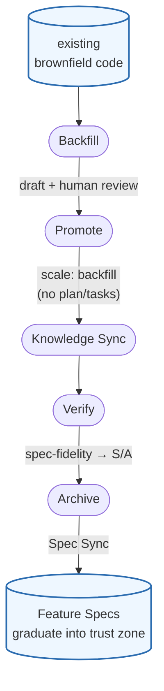

# Backfill: Bringing Brownfield Code into the Trust Zone
[Documentation](../README.md) • [繁體中文](./backfill.zh-TW.md)

Brownfield projects accumulate behavior that no Feature Spec describes. **Backfill** is a first-class, two-skill path that reverse-extracts that behavior from the code and graduates it into the spec trust zone (`prospec/specs/features/`) — and it **never writes the trust zone by hand** (archive stays the sole writer).

1. **Extract** — `prospec-backfill-spec` reads the code (and tests, git history, docs) and stages a route-compatible `backfill-draft.md`; intent it cannot infer from code is marked `[NEEDS CLARIFICATION]`, never fabricated.
2. **Review** — resolve every `[NEEDS CLARIFICATION]` (the *So that* value, target role, ambiguous AC) and confirm the candidate feature slug. This is the human gate.
3. **Promote** — `prospec-promote-backfill` turns the reviewed draft into the change scaffold (proposal + delta-spec + metadata) marked `scale: backfill`, `status: implemented`. `backfill` is a **light scale** like `quick` — no hollow `plan.md`/`tasks.md`, because the code already exists.
4. **Knowledge Sync** — run `prospec knowledge update --change <name>` (it mints no module for a feature-slug REQ ID). Update the READMEs of the modules `prospec knowledge update --change` reports ∪ `metadata.related_modules`, then stamp them with `prospec knowledge verify`. Complete this preparation before final validation.
5. **Final Verify** — `prospec-verify` grades **spec-fidelity** (each REQ's `file:line` must resolve), records pre-existing code-quality gaps (e.g. untested brownfield code) as informational tech debt, and only applies that relaxation when a `backfill-draft.md` proves provenance — so a faithful draft reaches S/A instead of being blocked by debt it merely documents, and the marker can't bypass quality gates for new code. By contract, code review is optional for proven backfill. S/A confirms the prepared inputs; a later effective-input edit requires renewed validation.
6. **Archive** — `prospec-archive` graduates the requirements into `prospec/specs/features/{slug}.md`. That is the only step that writes the trust zone.
