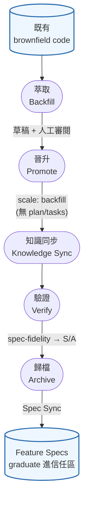

# Backfill：把既有程式碼納進信任區
[文件](../README.zh-TW.md) • [English](./backfill.md)

Brownfield 專案累積了大量「沒有 Feature Spec 描述」的行為。**Backfill** 是一條一等、雙 skill 的流程：從程式碼反向萃取這些行為，並把它 graduate 進規格信任區（`prospec/specs/features/`）—— 而且**從不手寫信任區**（archive 維持唯一寫入者）。

1. **萃取** —— `prospec-backfill-spec` 讀程式碼（與 tests、git history、docs）、stage 一份 route-compatible 的 `backfill-draft.md`；無法從程式碼推得的 intent 標 `[NEEDS CLARIFICATION]`，絕不捏造。
2. **審閱** —— 解決每個 `[NEEDS CLARIFICATION]`（*So that* 價值、目標角色、模糊 AC），確認候選 feature slug。這是人工關卡。
3. **晉升** —— `prospec-promote-backfill` 把審閱過的草稿展開為 change scaffold（proposal + delta-spec + metadata），標記 `scale: backfill`、`status: implemented`。`backfill` 是像 `quick` 的**輕量 scale** —— 不產空殼 `plan.md`/`tasks.md`，因為程式碼已存在。
4. **Knowledge Sync** —— 執行 `prospec knowledge update --change <name>`（不會為 feature-slug REQ ID mint 任何 module）。更新`prospec knowledge update --change` 回報的 modules ∪ `metadata.related_modules` 的 READMEs，再用 `prospec knowledge verify` stamp。 這些準備須在最終驗證前完成。
5. **最終驗證** —— `prospec-verify` 改評 **spec-fidelity**（每條 REQ 的 `file:line` 須成立），把既有程式碼品質落差（如未測的 brownfield code）記為 informational 技術債，且此降級僅在 `backfill-draft.md` 證明 provenance 時套用 —— 因此忠實的草稿能達 S/A、不被它只是「記錄」的技術債擋住，而 marker 也無法替新程式碼 bypass 品質 gate。依 contract，proven backfill 的 code review 是 optional。 S/A 確認已準備的輸入；之後若有效輸入改動，須重新驗證。
6. **歸檔** —— `prospec-archive` 把需求 graduate 進 `prospec/specs/features/{slug}.md`。這是唯一會寫信任區的環節。
