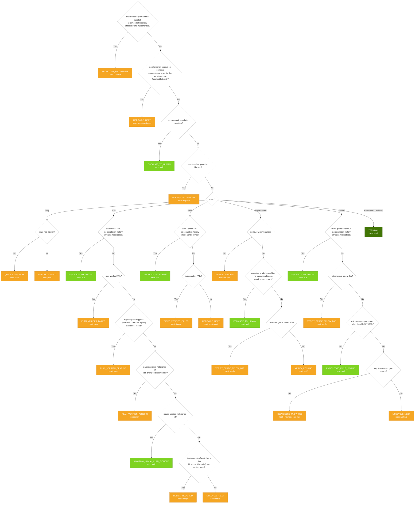
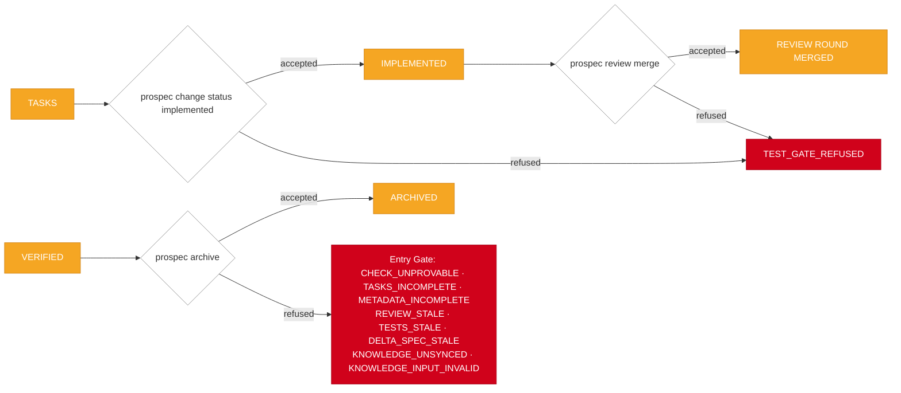

# Routing Flow

> How `routeChange` (`src/lib/status-router.ts`) places a change: the global rules first, then the branch for its status; within a scope the first rule whose condition holds decides. The ladder below is generated from `ROUTING_TABLE` — edit the table, then run `pnpm routing-flow`.

<!-- routing-flow:start -->

<!-- routing-flow:end -->

## Writer Gates

These refusals belong to the CLI command on each edge, not to a routing rule.

## Adding a Routing Decision

1. **Scope and position** — global (before any status) or the status's branch; a rule placed earlier takes every facts set both rules hold for.
2. **`label`** — the human reading of `when`; change both in the same edit.
3. **`code`** — a `WORKFLOW_REASON_CODES` member; a new code is appended there and to `frozen-registries.test.ts`'s exact list.
4. **`next`** — a station, or `null` for a human halt, whose code then belongs in `HUMAN_HALT_CODES` (`status-router-rules.test.ts`).
5. **Lifecycle prose** — `_status-lifecycle.md` and its shipped twin `src/templates/init/status-lifecycle.md.hbs` describe each code; update both alike.
6. **Diagram** — run `pnpm routing-flow`; `tests/contract/routing-flow.test.ts` fails until the region is redrawn.
7. **Tests** — add cases to `tests/unit/lib/status-router.test.ts`.
8. **A refusal at a CLI write is a writer gate, not a rule** — it belongs to that command (e.g. `lib/archive-gate.ts`).
