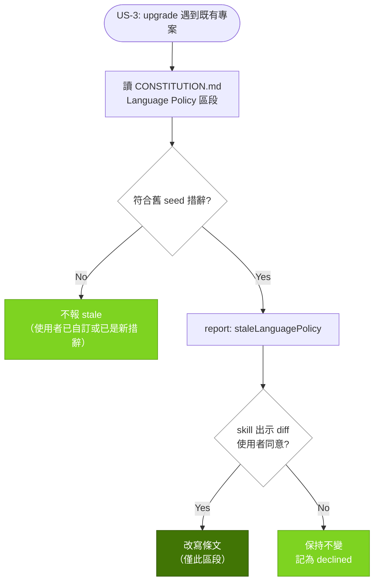

# align-language-policy-scope — 實作計畫

## Overview

`prospec init` 目前用兩個彼此不知道對方存在的來源描述同一條政策：`lib/constitution-rules.ts` 的 `languagePolicyRule(language)` 只吃語言字串、把「change artifacts and AI Knowledge」硬寫在描述裡；`templates/agent-configs/entry.md.hbs` 則硬寫「Knowledge base always remain in English」並自行列舉三個路徑。兩份文字都是手抄的，因此 issue #67 只改了其中一份就漂移至今。

策略是把**語言範圍變成資料**：新增 `lib/language-policy.ts` 的 `resolveLanguageScope(config, cwd)`，用既有的 `resolveBasePaths()` + `resolveArtifactLanguage()` 產出母語路徑集、英文路徑集與具名例外集；`languagePolicyRule(scope)` 與 `agent-sync` 的 template context 都從這一組資料渲染。散文措辭兩邊仍不同（一份是 `[MUST]` 規則、一份是 agent 指令），但**路徑集合同源**，並由 contract test 釘死兩份產出的路徑集字面相等 —— 這正是漂移唯一能發生的縫。既有專案則靠 `upgrade` 報告新增的 stale 訊號 + `/prospec-upgrade` 的 diff 徵詢步驟遷移，CLI 本身仍不碰 `CONSTITUTION.md`（維持 REQ-SETUP-019 的界線）。

## Technical Summary

> Auto-synthesized from AI Knowledge for this change's context

### Affected Module Overview

| Module | Core Responsibility | Key API | Dependencies |
|--------|-------------------|---------|--------------|
| types | Zod schemas + 型別契約 | `ConstitutionRule`（`constitution.ts`） | zod only |
| lib | 無狀態工具、條文產生、路徑解析 | `resolveBasePaths`/`resolveArtifactLanguage`（`config.ts`）、`languagePolicyRule`（`constitution-rules.ts`）、`buildInitDocContexts`（`init-docs.ts`） | types |
| services | 每指令一個 `execute()` | `agentSync.execute`（entry config context）、`upgrade.execute`（`buildReport`） | types, lib |
| cli | 薄 I/O 層 | `formatInitOutput`、`formatUpgradeOutput` | services, types, lib |
| templates | 純 `.hbs` 資源 | `agent-configs/entry.md.hbs`、`skills/prospec-upgrade.hbs`、`skills/references/promotion-format.hbs`、`references/config-example.yaml.hbs` | none |
| tests | 4 層測試 | `unit/lib/constitution-rules`、`contract/skill-format`、`unit/services/upgrade` | 全部 |

### Existing Patterns (from _conventions.md / module READMEs)

- **單一來源 helper（PB-006）**：`computeUnlocalizedSkills` 是既有先例 —— 同一份判定被 `agent-sync` hint 與 `agent triggers` 共用，本 change 對語言範圍複製同樣做法。
- **路徑解析一律走 `resolveBasePaths()`**，禁止硬寫 `prospec/ai-knowledge`（`lib` Pitfalls）。
- **contract test 必須 section-scoped 且 mutation-verified（PB-001）**，否則整檔 `toContain` 會給假綠。
- **範本變數不做編譯檢查**：key 拼錯會靜默產生空輸出（`templates` Pitfalls）→ 新增變數必須有 contract 斷言。
- **ledger 格式只在 `references/promotion-format.hbs`**（`templates` Pitfalls 的 single-source 契約）→ 描述語言例外寫這裡，不寫進 `prospec-learn.hbs`。

### Architecture Constraints (from Constitution)

- 相依方向 `cli → services → lib → types`：新 helper 落在 `lib`，`services/agent-sync` 與 `lib/init-docs` 都向下取用，無反向。
- TDD：每個公開函式先有紅測；`test:` commit 先於或同 commit 於 `feat:`。
- 使用者面向文件（root `README.md`）在同一 change 內更新（[SHOULD]）。
- 本 change 的 artifacts 用繁中，程式碼/識別字/commit message 英文。

## Affected Modules

| Module | Impact | Changes |
|--------|--------|---------|
| lib | High | 新增 `language-policy.ts`（`resolveLanguageScope` + `isSeededLanguagePolicyStale`）；`constitution-rules.ts` 的 `languagePolicyRule` 改吃 scope；`init-docs.ts` 傳入 scope |
| templates | High | `entry.md.hbs` 改由變數渲染路徑集；`prospec-upgrade.hbs` 新增 stale 條文步驟；`promotion-format.hbs` 補 ledger 描述語言例外；`config-example.yaml.hbs` 註解複核 |
| services | Medium | `agent-sync.service.ts` 注入 scope 變數；`upgrade.service.ts` 的 `buildReport` 增加 stale 訊號 |
| types | Low | `LanguageScope` 型別 |
| cli | Low | `init-output.ts` 語言措辭、`upgrade-output.ts` 印出 stale 訊號 |
| tests | High | scope 斷言、跨檔一致性 contract test（mutation-verified）、upgrade 偵測單元測試、skill contract 斷言 |

## Call Chain

```
prospec init
  → init.service.execute({ cwd, language })
  → buildInitDocContexts(config, cwd)                    [lib/init-docs]
  → resolveLanguageScope(config, cwd)                    [lib/language-policy — 單一來源]
      → resolveBasePaths(config, cwd) + resolveArtifactLanguage(config)   [lib/config]
  → languagePolicyRule(scope)                            [lib/constitution-rules]
  → renderTemplate('init/constitution.md.hbs', ctx)      [lib/template]
  → atomicWrite(<base_dir>/CONSTITUTION.md)              [skip-if-exists]

prospec agent sync
  → agentSync.execute({ cwd })
  → resolveLanguageScope(config, cwd)                    [同一 helper]
  → templateContext { language_scope_* }
  → renderTemplate('agent-configs/entry.md.hbs', ctx)
  → mergeManagedDoc(CLAUDE.md / AGENTS.md)               [保留 user block]

prospec upgrade
  → upgrade.service.execute({ cwd, interactive })
  → readFileIfExists(<base_dir>/CONSTITUTION.md)
  → isSeededLanguagePolicyStale(content)                 [lib/language-policy — 純判定]
  → buildReport(...) → UpgradeReport.staleLanguagePolicy
  → formatUpgradeOutput()                                [cli — 只報告，不寫檔]
  → /prospec-upgrade skill: 出示 diff → 徵詢 → 經同意才改寫
```

## User Story Flow Diagram



## Implementation Steps

1. **`types`：`LanguageScope` 契約**
   - `src/types/constitution.ts` 新增 `LanguageScope`：`language`、`nativePaths[]`、`englishPaths[]`、`namedExceptions[]`
   - 保持 `ConstitutionRule` 不變（附加型別，非破壞性）

2. **`lib/language-policy.ts`：單一來源（先寫紅測）**
   - `resolveLanguageScope(config, cwd)`：路徑一律由 `resolveBasePaths` 推導；母語集 = `.prospec/changes/**`、`.prospec/archive/**`、`<base_dir>/specs/_archived-history/**`；英文集 = `<base_dir>/CONSTITUTION.md`、`<base_dir>/README.md`、`<base_dir>/index.md`、`<base_dir>/specs/features/**`、`<knowledge>/**`
   - 具名例外集：`module-map.yaml` aliases + index Aliases 欄、`_lessons-ledger.md` description 欄、`_playbook.md` 逐字引用證據、`_glossary.md`（user-managed、語言自決）
   - `isSeededLanguagePolicyStale(content)`：只比對**未經修改的舊 seed 字串**（`All AI-generated documents (change artifacts and AI Knowledge)`）；使用者已改寫或已是新措辭 → false（避免誤判）
   - `formatPathList(paths)`：backtick 逗號串接，供兩邊渲染共用

3. **`lib/constitution-rules.ts`：條文改為路徑式**
   - `languagePolicyRule(scope: LanguageScope)`：description/check 由 scope 渲染；具名例外明列於條文
   - `artifact_language` 解析為 English 時輸出精簡單句（兩區同語言，不產生贅述）
   - `lib/init-docs.ts` 的 `buildInitDocContexts` 傳入 scope

4. **`templates/agent-configs/entry.md.hbs`：改由變數渲染**
   - 路徑集改用 context 變數（不再硬寫 `prospec/ai-knowledge`／`always remain in English`）
   - 具名例外**不進 L0**，只留一句指向 Constitution 條文（守住 REQ-AGNT-003 的 <100 行與 L0 token 成本）
   - `services/agent-sync.service.ts` 注入對應變數

5. **`upgrade` 偵測面**
   - `upgrade.service.ts`：`buildReport` 增加 `staleLanguagePolicy`（讀檔在 service、判定在 lib）；仍**不寫** `CONSTITUTION.md`
   - `cli/formatters/upgrade-output.ts`：多印一行訊號
   - `templates/skills/prospec-upgrade.hbs`：新增步驟（偵測 → diff → 徵詢 → 僅改該區段），並補進 Success Criteria／NEVER

6. **`promotion-format.hbs`：ledger 描述語言例外**
   - 把本 repo 手寫的「description 欄用原始糾正語言」宣告寫進範本，成為每個下游 ledger 的一部分

7. **文件與規格同步**
   - `README.md`（341/679）措辭收斂 + `README.zh-TW.md`（650）雙語同步；`init-output.ts:55` 措辭；`config-example.yaml.hbs:53-56` 複核
   - 本 repo `prospec/CONSTITUTION.md`：修掉「archived summaries 繁中」與「specs 英文」的同句對撞，補具名例外
   - `delta-spec.md` 的 11 條 REQ 於 archive 畢業（本 change 不動 module README 內的 REQ 引用）

8. **機械收尾**
   - `pnpm bundle`（改 `.hbs` 後必跑，bundled-templates 先於 FS）→ `pnpm counts` → `pnpm typecheck` → `pnpm test`

## Risk Assessment

| Risk | Impact | Mitigation |
|------|--------|------------|
| `entry.md.hbs` 變數拼錯 → 靜默空輸出 | High | 跨檔一致性 contract test 斷言渲染後的路徑集，mutation-verify（移除變數即紅） |
| `languagePolicyRule` 簽章變更破壞呼叫點 | Low | 全 repo 僅 `init-docs.ts` 一處呼叫；`pnpm typecheck` 涵蓋 tests |
| upgrade 誤判使用者自訂條文 → 亂提議改寫 | Medium | 只認未改動的舊 seed 字串；三種情境（舊 seed／已自訂／已新措辭）各有單元測試 |
| L0（entry config）膨脹 | Medium | 具名例外不進 L0；路徑集以精簡清單呈現，維持 <100 行 |
| 忘記 `pnpm bundle` → 下游拿到舊範本 | Medium | 列為明確 task，且 CI/contract test 讀 bundled 來源會抓到不一致 |
| 條文變長影響既有專案稽核解讀 | Low | 路徑式表述比原本的「AI-generated documents」更窄且可機械比對；英文專案走精簡單句 |
| REQ 未畢業前被 module README 引用 → drift FAIL | Low | 知識同步排在 verify S/A commit，REQ 於 archive 畢業（既有教訓） |
