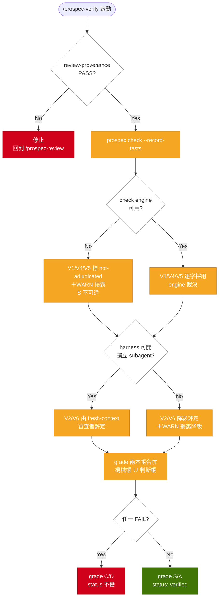

# Plan: split-verify-adjudication

## Overview

verify 目前把「有機械 oracle 的核對」與「只能判斷的評估」壓在同一個 agent、同一個 grade 裡。本案把六個維度按 oracle 有無分成兩本帳：V1／V4／V5 的裁決搬到 `prospec check`（agent 只轉述，不得改判），V2／V6 保持機率但強制 fresh context，V3 把已結構化的 RFC-2119 嚴重度與規則清冊機械化、違反判定仍由 agent 負責。

實作策略沿用專案既有的三段結構：**collector（全部 I/O，`lib/drift-sources.ts`）→ 純 evaluator（`lib/drift-checker.ts`）→ service 編排（`check.service.ts`）**，新增兩個 check id（`test-provenance`、`constitution-severity`，frozen 清單 11 → 13）。測試結果的機械化完全複製 `review-provenance` 的既成模式：副作用（跑測試）由旗標閘門的 `--record-tests` 執行並寫入 `metadata.yaml` `test_provenance`，純 check 路徑只讀紀錄比對 digest，因此 check 仍是零 LLM、可重跑、byte-identical。escaped-defect 聚合是 check 的第三種非 check 模式（沿用 `--init-ci` / `--record-review` 前例），輸出獨立的 `escaped-defect-report.json`。

## Technical Summary

> Auto-synthesized from AI Knowledge for this change's context

### Affected Module Overview

| Module | Core Responsibility | Key API | Dependencies |
|--------|-------------------|---------|--------------|
| types | Zod schemas + frozen registries | `DRIFT_CHECK_IDS`（frozen、僅追加）、`ChangeMetadataSchema`、`DIMENSION_RESULTS` | zod only |
| lib | 無狀態工具＋drift 引擎 | `runChecks`、`collect*`、`computeChangeDigest`、`resolveKnowledgeTokenBudget` | types |
| services | 一命令一 `execute()` | `check.service.execute`（`--json`／`--init-ci`／`--record-review` 旗標分支） | lib, types |
| cli | Commander 薄層 | `registerCheckCommand`、`formatCheckOutput` | services, lib, types |
| templates | Handlebars 資源 | `prospec-verify.hbs`、`prospec-review.hbs`、`references/*.hbs`、`init/status-lifecycle.md.hbs` | — |
| tests | 四層測試 | unit / contract / integration / e2e | all |

### Existing Patterns (from _conventions.md ＋ module READMEs)

- **collector／evaluator 分離**：所有 I/O 在 `drift-sources.ts`，evaluator 保持 I/O-free；source 不可用 → `{available:false, reason}` → `skipped`，永不假 PASS
- **frozen registry 僅追加**：`DRIFT_CHECK_IDS` 追加後，`runChecks` 的 `Record<DriftCheckId, CheckOutcome>` 窮盡性守衛會在漏接 evaluator 時編譯失敗
- **旗標閘門副作用**：`--json`／`--init-ci`／`--record-review` 是 check 的既有非純模式；純檢查路徑維持 read-only
- **metadata I/O 單一入口**：`lib/change-metadata.ts`（comment-preserving Document round-trip）；scanner 類讀取（drift-sources／archive）刻意寬鬆，回報壞紀錄而非丟錯
- **findings codepoint 排序**：`localeCompare` 會破壞跨機 byte-identity
- **config 解析集中在 `lib/config.ts`**（`resolveBasePaths`／`resolveKnowledgeTokenBudget` 前例；PB-006／PB-007：新消費者先找 canonical resolver）

### Architecture Constraints (from Constitution)

- 依賴方向 `cli → services → lib → types`（[SHOULD]）——新 lib 檔案只能 import types／lib，不得反向
- TDD（[MUST]）：`test:` commit 先於或伴隨 `feat:`；coverage ≥ 80%
- 變更 user-facing surface（新 CLI 旗標、check 清單）須同變更更新 root `README.md`（[SHOULD]），並依 house rule 同步 `README.zh-TW.md`
- Language Policy（[MUST]）：change artifact 繁中；程式碼、trust zone、commit message 英文

## Affected Modules

| Module | Impact | Changes |
|--------|--------|---------|
| types | High | `DRIFT_CHECK_IDS` +2（11→13）、報告新增 `constitution` 區段、`test_provenance` metadata 欄位、dimension 詞彙 +`not-adjudicated` 與 `adjudicator`、新 `escaped-defect.ts` 報表 schema、config `tech_stack.test_command` |
| lib | High | 新 `constitution-parser.ts`、`escaped-defects.ts`、`test-runner.ts`；`config.ts` 加 `resolveTestCommand`；`drift-sources.ts` 加三個 collector；`drift-checker.ts` 加兩個 evaluator |
| services | Medium | `check.service` 注入新 collector、新增 `--record-tests` 與 `--escaped-defects` 兩個旗標分支 |
| cli | Medium | `check` 命令兩個新旗標；formatter 輸出新 check 與 escaped-defect 報表摘要 |
| templates | High | `prospec-verify.hbs` 維度裁決重寫、`prospec-review.hbs` 去重疊、`references/drift-report-format`＋`metadata-format` 契約更新、`init/status-lifecycle.md.hbs` 閘門敘述同步 |
| tests | High | evaluator／collector 單元、報告契約（frozen 13）、skill 契約（裁決者標記、fresh context、邊界句唯一性）、service 整合、CLI e2e |

## Call Chain

```
prospec check --record-tests [--change <name>]
  → registerCheckCommand.action(options)                          [cli: 解析旗標]
  → check.service.execute({ recordTests: true, change })          [services: 編排]
  → resolveChange(cwd, explicit, quiet, msg)                      [services: 既有共用選取器]
  → lib/config.resolveTestCommand(config, cwd)                    [lib: canonical resolver；無指令 → null → 誠實 skip]
  → lib/test-runner.runTestCommand(cwd, argv, timeoutMs)          [lib: spawnSync（shell:false）→ {exit_code, timed_out}]
  → lib/drift-sources.computeChangeDigest(cwd)                    [lib: 既有 digest，重用不重寫]
  → lib/change-metadata.readChangeMetadata → doc.set('test_provenance') → writeChangeMetadataDoc
  → formatCheckOutput({ kind: 'record-tests', ... })              [cli: stdout]
```

```
prospec check --escaped-defects [--json]
  → registerCheckCommand.action(options)                          [cli]
  → check.service.execute({ escapedDefects: true, json })         [services]
  → lib/drift-sources.collectQualityLedger(cwd)                   [lib: 唯一 I/O——列舉 .prospec/changes/* ＋ .prospec/archive/*]
  → lib/escaped-defects.aggregateEscapedDefects(source)           [lib: 純函式——per-gate passed／escaped／rate ＋ unresolved refs]
  → EscapedDefectReportSchema.safeParse                           [types: 契約驗證]
  → lib/fs-utils.atomicWrite(escaped-defect-report.json)          [--json 時才寫檔]
  → formatEscapedDefectOutput(report, logLevel)                   [cli: 樣本為 0 時輸出「no registered samples」]
```

```
prospec check [--json]        （純路徑，新增兩個 check）
  → check.service.execute({ json })
  → collectTestProvenance(cwd)          ─┐
  → collectConstitutionRules(paths)      ├→ lib/drift-checker.runChecks(inputs)
  → （既有 9 個 collector）              ─┘     → evaluateTestProvenance      → check id: test-provenance   (fail-class)
                                              → evaluateConstitutionSeverity → check id: constitution-severity (warn-class)
                                              → structural.constitution = { rules: [...] }
  → DriftReportSchema.safeParse → atomicWrite(prospec-report.json)
```

```
/prospec-verify（站別流程，非程式碼呼叫鏈）
  → Entry Gate: prospec check --json → review-provenance（既有，blocking）
  → 記錄測試事實: prospec check --record-tests
  → 取事實: prospec check --json → 讀 prospec-report.json
      V1 ← structural.checks[task-completion]        [machine：逐字採用]
      V4 ← structural.knowledge_health + checks[knowledge-health]  [machine]
      V5 ← structural.checks[test-provenance]        [machine]
      V3 ← structural.constitution.rules[]（清冊＋嚴重度）[machine 部分] ＋ 違反判定 [judgment]
      V2／V6 → fresh-context 獨立審查者               [judgment]
  → grade 兩本帳合併 → S/A 才寫 status: verified
```

## User Story Flow Diagram

### US-1 ＋ US-3: 維度裁決路由與 grade 合併



## Implementation Steps

1. **types 契約先行（frozen 追加，向後相容）**
   - `drift-report.ts`：`DRIFT_CHECK_IDS` 追加 `test-provenance`／`constitution-severity`（11→13，僅追加不重排）；新增 `ConstitutionRuleInventorySchema`（`name`／`severity: MUST|SHOULD|MAY|null`／`has_verify_hint`／`line`）並掛在 `structural.constitution`（optional，鏡像 `knowledge_health` 前例）
   - `change.ts`：新增 `TestProvenanceSchema`（`command`／`exit_code`／`digest`／`date`）；`DIMENSION_RESULTS` 追加 `not-adjudicated`；`QualityDimensionSchema` 追加 optional `adjudicator: 'machine' | 'judgment'`
   - 新 `escaped-defect.ts`：`EscapedDefectReportSchema`（`gates[]{gate, passed, escaped, escaped_rate}`／`samples[]`／`unresolved_references[]`／`sample_count`）＋ `ESCAPED_DEFECT_REPORT_FILENAME`
   - `config.ts`：`tech_stack` 追加 optional `test_command`
   - **不**把 `test_provenance` 加進 `REQUIRED_METADATA_FIELDS`（既有 archived change 不得回溯 fail——open question 定案）

2. **lib：Constitution 解析與 severity check**
   - 新 `constitution-parser.ts`：`parseConstitutionRules(markdown)` 解析 `## Principles` 下的 `### [MUST] Name` 標題與 `**Verify**:` 提示；fence-aware（重用 drift-sources 既有的 fenced-block 跳過邏輯，不手抄——PB-006）
   - `drift-sources.ts`：`collectConstitutionRules(constitutionPath)`（I/O；檔案不存在 → `{available:false, reason}`）
   - `drift-checker.ts`：`evaluateConstitutionSeverity`（warn-class；每條未標 RFC-2119 的 principle 一個 finding；回傳 `constitution` 區段供 `runChecks` 組裝，鏡像 `knowledgeHealth` 的 `CheckOutcome` 擴充）

3. **lib：測試事實機械化**
   - `config.ts` 加 `resolveTestCommand(config, cwd)`：優先 `tech_stack.test_command`，否則在 package.json 有 `scripts.test` 時回退 `<package_manager> test`，都沒有 → `null`
   - 新 `test-runner.ts`：`runTestCommand(cwd, argv, timeoutMs)` 以 `spawnSync(argv[0], argv.slice(1), { shell: false })` 執行（**不支援 shell 語法**——刻意排除，避免 shell 注入面；PB-003 明示排除），超時回 `{ timed_out: true }` 且不寫紀錄
   - `drift-sources.ts`：`collectTestProvenance(cwd)`（列舉 change 的 status／scale／`test_provenance` ＋ `computeChangeDigest` 現值；重用既有 digest 與 `gitCapture`）
   - `drift-checker.ts`：`evaluateTestProvenance`（fail-class；`status: implemented` 才適用；無紀錄 → fail、digest 不符 → fail「stale」、`exit_code !== 0` → fail；backfill 寬待逐分支且以 `backfill-draft.md` 為前提，已記錄的失敗絕不豁免；source 不可用 → skipped）

4. **lib：escaped-defect 聚合**
   - `drift-sources.ts`：`collectQualityLedger(cwd)`——同時列舉 `.prospec/changes/*` 與 `.prospec/archive/*`（archive 目錄不存在時在 source 上標明，誠實揭露而非假裝完整）
   - 新 `escaped-defects.ts`：`aggregateEscapedDefects(source)` 純函式——對每個帶 `introduced_by` 的 change，反查被指認 change 的 `quality_log`，凡在其上記過 PASS 的 gate 各 +1 escaped；`passed` 為該 gate 的 PASS 總數；`sample_count === 0` 時 gates 一律不計算 rate（誠實輸出無樣本，不輸出 0%）；`introduced_by` 指向不存在的 change → `unresolved_references`

5. **services：check.service 三處擴充**
   - 純路徑注入 `collectTestProvenance`／`collectConstitutionRules`（Constitution 路徑由既有 `resolveBasePaths` 給出，不自行組路徑——PB-007）
   - `--record-tests` 分支：`resolveChange` → `resolveTestCommand` → `runTestCommand` → `computeChangeDigest` → comment-preserving 寫入 `test_provenance`；無測試指令／非 git／超時 → `{ recorded: false, reason }` 誠實 skip
   - `--escaped-defects` 分支：collector → aggregator → schema 驗證 →（`--json` 時）`atomicWrite`

6. **cli：旗標與輸出**
   - `check` 命令追加 `--record-tests`／`--escaped-defects`（沿用既有 `--change`）；新 Result kind 走 `formatCheckOutput` 分派，escaped-defect 報表用新 formatter
   - 所有 repo 來源字串經 `sanitizeTerminal()`（PB-007 既有 invariant）；`--strict` 語意不變（僅 FAIL → exit 1）

7. **templates：verify 重寫、review 去重疊、reference 與 shipped 模板同步**
   - `prospec-verify.hbs`：每個維度標 `[machine]`／`[judgment]` 與其裁決者；機械維度「逐字採用 engine 裁決、不得改判」寫入 NEVER；engine 不可用 → `not-adjudicated`＋WARN、S 不可達；V3 逐條對 `constitution.rules[]` 表態（表態數 ≥ 清冊數）；V2／V6 強制 fresh context ＋ harness 降級揭露；grade 兩本帳合併規則；`quality_log` `dimensions[]` 寫 `adjudicator`
   - `prospec-review.hbs`：移除與 verify 重疊的敘述，只留單行指向；review／verify 職責邊界句**只在 verify 出現一次**
   - `references/drift-report-format.md.hbs`：記錄兩個新 check、`constitution` 區段、escaped-defect 報表形狀；`references/metadata-format.md.hbs`：`test_provenance` 併入 canonical 欄位順序（`review_provenance` 之後、`introduced_by` 之前）＋ dimension 詞彙與 `adjudicator`
   - `init/status-lifecycle.md.hbs` ＋ 專案自身 `prospec/ai-knowledge/_status-lifecycle.md`：`implemented → verified` 閘門敘述改為「機械維度由 check engine 裁決」；確認 `getSkillReferences` 的 reference map 涵蓋新／改動 reference（共用 ref 用軟指向避 dangling）

8. **tests 四層 ＋ 文件同步**
   - unit：兩個 evaluator（各含 pass／fail 各分支／exempt／skipped）、`parseConstitutionRules`（fence-aware／未標籤／無 principles）、`aggregateEscapedDefects`（無樣本／未解析參照／per-gate rate）、`resolveTestCommand`、`runTestCommand`（exit code／超時）、三個 collector fixture
   - contract：frozen 13（`drift-report.test.ts` 計數 11→13＋清單）、skipped-never-PASS 覆蓋 13 個 check、verify 模板 section-scoped 斷言（裁決者標記／不得改判 NEVER／fresh context／`not-adjudicated`）、**邊界句在 review＋verify 兩份模板中出現次數 === 1**、metadata-format 記錄 `test_provenance`
   - integration／e2e：`check.service` 注入、`--record-tests` 寫入 metadata、`--escaped-defects` 產出報表、CLI 旗標；每個新斷言類別 mutation-verify（PB-001）
   - 文件：root `README.md` 的 check 清單枚舉 ＋ 新旗標（PB-009）並同步 `README.zh-TW.md`；`pnpm counts` 重導測試計數；module README 的 `(N files)` 摘要行（PB-004）

## Risk Assessment

| Risk | Impact | Mitigation |
|------|--------|------------|
| `test-provenance` 為 fail-class，在途 change 未記錄測試會讓 CI `--strict` 紅燈 | High | 完全對齊 `review-provenance` 既有語意：只對 `status: implemented` ∧ 非 backfill 生效。commit 邊界在 verify S/A（此時 status 已是 `verified`），故落地的 commit 不會被自身檢查擋住——這是既有前例已驗證的行為，非新風險 |
| 在 `check` 內 spawn 子行程破壞「零副作用、可重跑」的引擎性格 | High | 副作用嚴格旗標閘門（`--record-tests` 才跑），純路徑仍只讀檔；argv 白空格切分、`shell: false`（不支援 shell 語法並明示排除）、超時上限、失敗不寫半筆紀錄 |
| grade 定義變更可能讓 engine 不可用的專案卡死無法 `verified` | High | 引入 `not-adjudicated` 而非硬擋：記 WARN、S 不可達、A 仍可達（≤2 WARN）。取捨理由：完全不記會讓「可重現」的宣稱造假；硬擋會讓未安裝 CLI 的下游專案無法出貨 |
| 新增 metadata 欄位使既有 archived change 回溯 fail | Medium | `test_provenance` 不進 `REQUIRED_METADATA_FIELDS`；驗收含「既有 archived change 全數通過 `prospec check`」（SC-006），實作後對整個 repo 實跑 |
| frozen registry 追加後漏接 evaluator | Medium | `Record<DriftCheckId, CheckOutcome>` 窮盡性守衛編譯期擋住；契約測試計數 11→13 同步 |
| 「職責敘述無重疊」是散文不變式，無機械守衛 | Medium | 以契約測試把邊界句釘成「跨兩份模板出現次數 === 1」，並 mutation-verify（把句子複製到 review 應轉紅） |
| escaped-defect 樣本主要在 gitignore 的 `.prospec/archive/` | Medium | source 明示 archive 是否存在；無樣本時輸出「no registered samples」而非 0%（PB-003 刻意排除措辭）；報表定位為本機／維護者工具，不進 CI 閘門 |
| 文件多處手維護計數與枚舉（README check 清單、module README `(N files)`、feature spec `req_count`） | Medium | PB-009／PB-004 已列入 Step 8 檢查清單；`pnpm counts` 只覆蓋測試與樣板計數，其餘同 commit 手動重導 |
| Constitution parser 誤判散文標題 | Low | 只掃 `## Principles` 區段內的 `###` 標題、fence-aware；無標籤 → 記為 `null` 而非猜測；`parseConstitutionRules` 對自由散文 Constitution 仍給出清冊（向後相容） |

**Layering check（Constitution [SHOULD] `cli → services → lib → types`）**：新增的三個 lib 檔案只 import `types` 與 `lib`（`test-runner` 不 import services；`escaped-defects` 為純函式）；collector 全部留在 `drift-sources.ts`（I/O 單一落點）；`resolveTestCommand` 放在既有 canonical resolver `lib/config.ts` 而非 service，避免 service→service 耦合。呼叫鏈四條均未見層級跳越或反向依賴，無 layering 違規。

**知識預算（review 期決定，已登記為 REQ-TYPES-069）**：本變更的文件成長把 `_status-lifecycle.md`（L1）與 lib／types 兩份 module README（L2）推過既有預算。經擁有者決定在 `.prospec.yaml` 逐欄上調為 2000／1500，shipped 預設不變；`knowledge-size` 轉 PASS 來自預算放寬而非知識縮減，此點在 delta-spec 明文揭露。

**Knowledge check（Phase 7）**：Brownfield 模式，已讀 types／lib／services／cli 四份 module README ＋ `_playbook.md`（PB-001／003／004／006／007／008／009 相關條目）＋ feature spec `drift-detection.md`／`sdd-workflow.md`；Technical Summary 已合成 — PASS。
