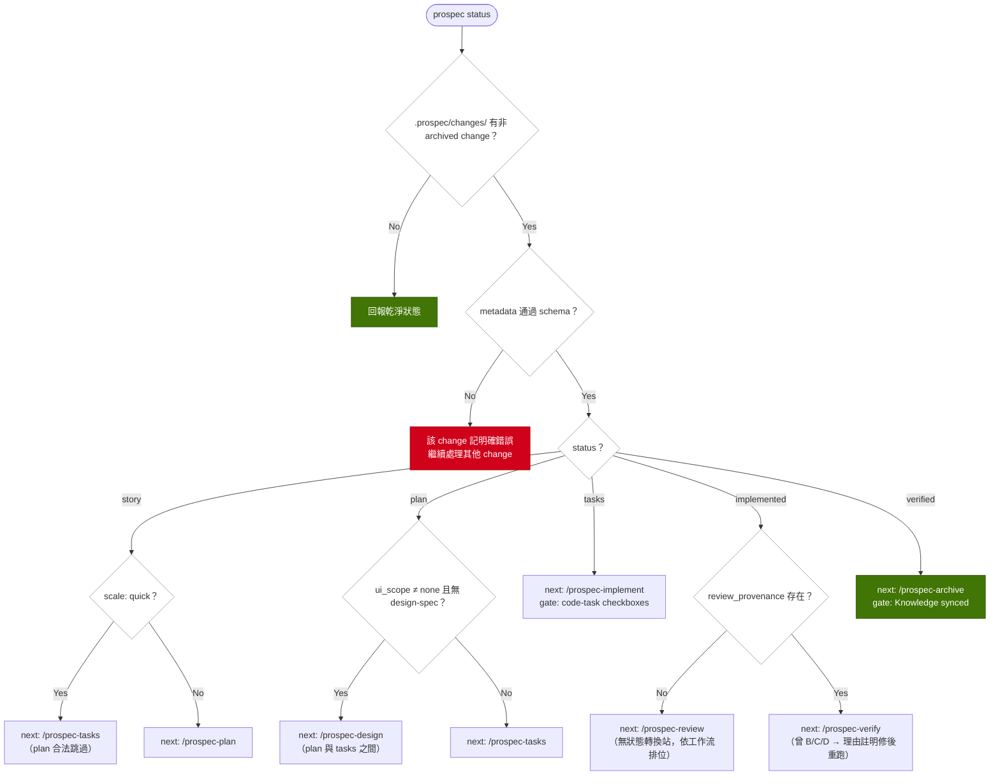

# Plan: add-status-router

## Overview

SDD 狀態機（`_status-lifecycle.md`）定義完整，但站序推導由 agent 依 CLAUDE.md 散文執行——機率性、不可測試、常駐佔 L0 token。本變更新增唯讀命令 `prospec status`：掃描 `.prospec/changes/`，對每個非 archived change 算出 (current node, next node, blocking gates, 理由)，並把 entry config 的 Session Start 散文改為一行命令指向。

策略：依 drift engine 先例拆「純評估器 + 收集器」。路由規則是 I/O-free 純函式（lib），facts 收集與掃描在 service 層，CLI 薄層委派。規則編碼依 PB-002：站表從 `_status-lifecycle.md` 逐字複製，再逐站稽核 false-block/false-pass（quick 無 plan.md、backfill 無 plan/tasks 皆屬常態，不得誤判）。

## Technical Summary

> Auto-synthesized from AI Knowledge for this change's context

### Affected Module Overview
| Module | Core Responsibility | Key API | Dependencies |
|--------|-------------------|---------|--------------|
| types | Zod schemas、frozen registries | `CHANGE_STATUSES`/`CHANGE_SCALES`/`isStatusBefore`（change.ts） | zod only |
| lib | 無狀態工具、drift engine（純評估器先例） | `readChangeMetadata`（唯一 schema 驗證讀取口）、`parseTaskLine`（task 文法唯一來源） | types |
| services | 每命令一個 `execute()` | `check.service`（read-only 掃描先例）、`resolveChange` | types, lib |
| cli | 薄 I/O：14 command files + 17 formatters | `registerXxxCommand`/`formatXxxOutput`/`resolveLogLevel` | types, lib, services |
| templates | 64 `.hbs`；`agent-configs/entry.md.hbs` 是 CLAUDE.md/AGENTS.md 唯一來源 | `renderTemplate`；改 shipped `.hbs` 須 `pnpm bundle` → 從 source sync | — |

### Existing Patterns (from _conventions.md)
- Service Pattern：`execute(options): Promise<Result>`；Command Pattern：`registerXxxCommand(program)`；成功 stdout、錯誤 stderr
- 錯誤繼承 `ProspecError`（code + suggestion）；drift 評估器 I/O-free、findings codepoint-sorted；scanner 報告壞記錄而非 throw（drift-sources 先例）
- 測試 memfs + AAA；4 層金字塔；contract assertion 依 PB-001（section-scoped、mutation-verified）

### Architecture Constraints (from Constitution)
- 依賴方向 `cli → services → lib → types`，不得逆向/循環（SHOULD）
- TDD：test 先行或同 commit，覆蓋率 ≥ 80%（MUST）；README-documented surface 變更須同變更更新 root README（SHOULD）

## Affected Modules

| Module | Impact | Changes |
|--------|--------|---------|
| types | Medium | 站序常數 + StatusReport/ChangeRouteEntry 契約（change.ts 或新 status.ts） |
| lib | High | 新 `status-router.ts` 純路由評估器（編碼 `_status-lifecycle.md` 全部規則） |
| services | High | 新 `status.service.ts`：掃描 + facts 收集 + 逐 change 容錯 |
| cli | Medium | 新 `commands/status.ts` + `formatters/status-output.ts`，index.ts 註冊（14→15） |
| templates | Medium | `entry.md.hbs` Session Start 段落改指向；兩份 status-lifecycle 補一行「executable copy」指向 |
| tests | High | unit（router/service/formatter）+ contract（entry config）+ e2e（`prospec status`） |

## Call Chain

```
prospec status
  → cli/commands/status.ts        statusAction(opts)                    [parse flags only]
  → services/status.service.ts    execute({ cwd, logLevel })            [orchestration]
      ├─ scan .prospec/changes/（readdir sort；缺目錄 → 乾淨狀態）
      ├─ lib/change-metadata.ts   readChangeMetadata(dir)               [逐 change try/catch → error entry，不中斷]
      ├─ facts：plan/tasks/design-spec 存在性、lib/task-markers parseTaskLine（code-task 完成度）、
      │        proposal.md ui_scope、metadata review_provenance / quality_log（verify grade）
      └─ lib/status-router.ts     routeChange(facts): ChangeRoute       [pure，I/O-free]
  → cli/formatters/status-output.ts formatStatusOutput(result, logLevel) [stdout；sanitizeTerminal]
```

分層檢查：cli → services → lib → types，無逆向；唯讀命令，零寫入、零 side effect。entry.md.hbs 走既有 agent sync 渲染鏈，無新增 runtime 鏈。

## User Story Flow (US-1)



（`scale: backfill` 由 promote-backfill 直接進 `implemented`，router 判定為合法入口、缺 plan/tasks 屬常態——併入 d3 implemented 分支處理。）

## Implementation Steps

1. **types：路由契約**——站序常數（含 design/review/learn 無狀態轉換站排位）與 `StatusReport`/`ChangeRouteEntry`（current/next/blockingGates/reasons/error）型別；沿用 `CHANGE_STATUSES`/`CHANGE_SCALES`，不新增 status 值。
2. **lib/status-router.ts：純評估器**——`routeChange(facts)` 編碼 `_status-lifecycle.md` 全部邊與 gate：quick 的 story→tasks、backfill 的 implemented 入口（非跳站）、design（ui_scope≠none，plan 與 tasks 之間）、review（review_provenance 判已做）、verify B/C/D 停留理由、archive 的 Knowledge-sync gate 宣告。PB-002 逐站稽核：quick/backfill 缺 plan.md/tasks.md 不得 false-block，空 facts 不得 false-pass。
3. **services/status.service.ts**——掃描（缺 `.prospec/changes/` → 乾淨狀態）、逐 change `readChangeMetadata` try/catch（壞記錄 → 指名 error entry，不中斷、不靜默略過）、收集 facts（檔案存在性、`parseTaskLine` 完成度、ui_scope、provenance/quality_log）、呼叫 router 組 `StatusResult`。
4. **cli**——`commands/status.ts`（`registerStatusCommand`）+ `formatters/status-output.ts`（自由字串過 `sanitizeTerminal`）；`index.ts` 註冊。TDD：先寫 router/service 測試再實作。
5. **templates**——`entry.md.hbs` Session Start 改為：執行 `prospec status` 取得 in-progress changes 與建議下一站；CLI 不可用時退回 `_status-lifecycle.md` 手動推導（一行 fallback）。兩份 status-lifecycle（`init/status-lifecycle.md.hbs` + `prospec/ai-knowledge/_status-lifecycle.md`）各補一行「executable router = `prospec status`」。`pnpm bundle` → `npx tsx src/cli/index.ts agent sync`；比對 Session Start 前後 token 淨減。
6. **tests**——unit：router 全狀態 × 全 scale 矩陣（backfill 入口、quick 跳站、B/C/D、design/review 排位）、service（memfs：多 change、invalid metadata、空目錄）、formatter；contract：entry config 含 `prospec status` 指向且不含散文推導規則（負向斷言，PB-001 mutation-verify）、更新 REQ-TESTS-026 的 session-detection 斷言；e2e：真實 CLI 跑 `prospec status`。
7. **docs 同步**——root `README.md`/`README.zh-TW.md` 命令清單補 `status`（雙語同步）；`pnpm counts`；cli/services/lib/types 模組 README 檔數與命令數（14→15）於 verify S/A commit 一併同步。本機對 46 個 `.prospec/archive/` change 回溯執行 router 驗證站序一致（SC-001，驗證證據記入 verify）。

## Risk Assessment

| Risk | Impact | Mitigation |
|------|--------|------------|
| router 編碼與 `_status-lifecycle.md` 日後漂移（規則雙源） | High | 兩份 lifecycle 文件補「executable copy」指向行；fixture 測試逐站釘住；文件 Rules 節已要求改狀態須同步每個 consumer |
| quick/backfill 缺 artifact 被誤判（false-block/false-pass） | High | PB-002 逐站稽核 + 全狀態×全 scale 矩陣測試釘住 |
| 既有 session-detection contract 斷言（REQ-TESTS-026）未同步而 false-green | Medium | 同 commit 更新斷言：正向釘 `prospec status` 指向、負向釘散文已移除；mutation-verify |
| 忘 `pnpm bundle` 致部署舊模板 | Medium | Step 5 明列兩步；既有 byte-sync contract guard 會轉紅 |
| 下游環境 CLI 不可用時 Session Start 斷路 | Low | 保留一行 fallback 指向 `_status-lifecycle.md`；仍淨減 |
| README/模組 README 計數漂移（PB-004 家族） | Low | `pnpm counts` + 手動重導檔數；verify S/A commit 一併同步 |

Knowledge check：Brownfield ✓、6 個相關模組 README 已讀 ✓、Technical Summary 已合成 ✓、既有 Feature Specs（sdd-workflow US-19 / agent-integration）已核 ✓ —— PASS。
