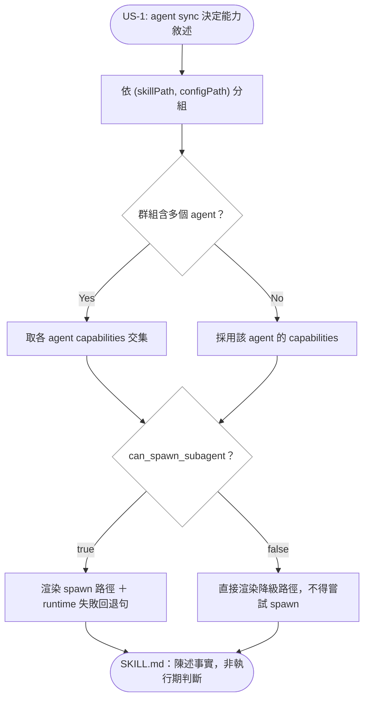

# Implementation Plan: add-harness-capability-flags

## Overview

把「執行 harness 有什麼能力」從各 skill 的自然語言判斷，改成 per-agent registry 的宣告式旗標：`AgentConfig` 新增 `capabilities`，`agent-sync` 在渲染 SKILL.md 時把旗標注入 render context，模板以 `{{#if}}` 在**同步時**解析成事實敘述。生成物因此只陳述「本 harness 有／沒有這個能力，降級要做什麼」，不再要求執行期的 agent 自行判斷能力。

關鍵設計取捨有三。其一，旗標描述的是**平台能力**而非**當下可用性**，所以 `true` 分支仍必須導向同一條降級路徑作為 runtime 失敗的回退——否則平台宣稱有能力但當下被停用時，SKILL.md 會完全沒有指引。其二，`.agents/skills` + `AGENTS.md` 由 codex/copilot/antigravity **三家共用同一組輸出檔**，能力值一旦不一致，現行分組邏輯會讓最後一個 agent 的值靜默覆蓋另外兩者，因此共用群組必須取**交集**（保守降級）。其三，降級措辭的共同底線（絕不靜默跳過、必須揭露走了哪條路）抽成共用 partial，各站只透過 partial 參數提供自己的降級動作，杜絕兩站措辭再次漂移。

## Technical Summary

> Auto-synthesized from AI Knowledge for this change's context

### Affected Module Overview

| Module | Core Responsibility | Key API | Dependencies |
|--------|-------------------|---------|--------------|
| types | Zod schemas + 凍結 registry（leaf） | `AgentConfig` / `AGENT_CONFIGS` / `SKILL_DEFINITIONS` | zod only |
| services | 一 command 一 `execute()` | `agent-sync.service.execute()` | lib, types |
| templates | 純 `.hbs` 資源 | `skills/prospec-*.hbs`、`skills/_*.hbs` partials | none |
| tests | 4 層 Vitest | `tests/contract/skill-format.test.ts` | 全部 |

### Existing Patterns (from _conventions.md / module READMEs)

- **per-agent registry 旗標先例**：`surfacesSkillFrontmatter` 已是 `AgentConfig` 旗標 → entry config render context（`agent-sync.service.ts:373`）；本變更沿用同一模式，但注入點是 skill render context（今天不存在）
- **partial 單一來源**：`_cli-probe` / `_next-step-handoff` / `_output-summary-note` 已由 `lib/template.ts` `ensureBuiltinPartials()` 註冊，並有「單一來源 ＋ 展開位元同步」契約測試（PB-006）
- **types 可放極小純函式**：`isStatusBefore`（`types/change.ts`）為先例，交集函式與 registry 同檔即可

### Architecture Constraints (from Constitution)

- 依賴方向 `cli → services → lib → types`（[SHOULD]）：交集函式放 types（leaf，純函式），services 匯入，方向不逆
- TDD（[MUST]）：契約測試先紅——現有 `spawn a sub-agent` / `Harness degradation` 字面斷言會因模板改寫變紅，須同批重寫為兩分支各自斷言
- 變更工件繁中、trust zone 與模板英文（[MUST]）：所有 `.hbs` 一律英文

## Affected Modules

| Module | Impact | Changes |
|--------|--------|---------|
| types | High | `HarnessCapabilities` 介面、`AgentConfig.capabilities`、4 個 agent 的值＋來源註記、`intersectCapabilities()` |
| templates | High | 新增 `skills/_harness-capabilities.hbs`；改寫 `prospec-review.hbs`、`prospec-verify.hbs` 兩個消費點 |
| services | Medium | `agent-sync.service.ts` 分組保留全部 `AgentConfig`、取交集、注入 skill render context |
| lib | Low | `template.ts` 註冊新 partial |
| tests | Medium | 契約測試（per-agent 差異、無自判句式、partial 單一來源）＋ `intersectCapabilities` 單元測試＋ agent-sync 注入測試 |

## Call Chain

```
prospec agent sync
  → cli/commands/agent.ts: syncCommand(options)                      [thin I/O]
  → services/agent-sync.service.ts: execute({ cwd, agents })         [orchestration]
      → groups: Map<`${skillPath}\n${configPath}`, AgentConfig[]>    [共用輸出偵測]
      → types/skill.ts: intersectCapabilities(configs)               [純函式・保守降級]
      → syncAgent(agentConfig, ctx + harnessCapabilityContext(caps))
          → syncSkillsDirSkills(...)                                 [per-skill render]
              → lib/template.ts: renderTemplate('skills/prospec-review.hbs', ctx)
                  → partial `harness-capabilities`(degraded_action)  [共用降級契約]
              → lib/fs-utils.ts: atomicWrite(SKILL.md)               [side effect]
```

## User Story Flow



## Implementation Steps

1. **契約測試先紅（RED）**
   - 新增：能力值不同的兩個 agent 渲染 `prospec-review.hbs` 內容必須有差異；生成物不得出現 `If the execution harness cannot spawn` 類自判句式；`true` 分支必須含 runtime 回退指示
   - 新增：`intersectCapabilities` 對不一致輸入回傳交集
   - 改寫既有 `degrades on harnesses without sub-agents` 與 verify `requires fresh context for 2/5 and 6` 兩案，改為 section-scoped 雙分支斷言

2. **types：定義旗標與交集**
   - `HarnessCapabilities { canSpawnSubagent; canWorktree; canBackground }`；`AgentConfig.capabilities` 必填
   - 四個 agent 填值並逐項附**來源＋查證日期**註記（PB-003：claim ⊆ evidence）
   - `intersectCapabilities(configs)` — 逐旗標 AND

3. **lib/templates：共用 partial**
   - 新增 `src/templates/skills/_harness-capabilities.hbs`：一行 machine-greppable 能力宣告 ＋ 依 `can_spawn_subagent` 分支的降級敘述 ＋「絕不靜默跳過、必須揭露」底線；降級動作由 `degraded_action` partial 參數帶入
   - `lib/template.ts` `ensureBuiltinPartials()` 註冊 `harness-capabilities`

4. **services：注入 render context**
   - 分組結構改存全部 `AgentConfig`，以 `intersectCapabilities` 求值
   - `syncAgent` / `syncSkillsDirSkills` 接受能力並展開為 `can_spawn_subagent` / `can_worktree` / `can_background` render keys

5. **templates：兩個消費站點改寫**
   - `prospec-review.hbs` `### Harness Degradation` → `{{> harness-capabilities degraded_action="…"}}`
   - `prospec-verify.hbs` 2/5 的 harness 段落 → 同一 partial（第二消費者）；維度 6 維持指向 2/5 的交叉引用，不複製第二份

6. **部署與計數同步**
   - `pnpm bundle` → `npx tsx src/cli/index.ts agent sync`（templates pitfall：`pnpm exec prospec` 會部署已發行模板）
   - `pnpm counts` 重導 `.hbs` / partial 計數（65→66、6→7）；同步 templates/types/services/tests 四個 module README

## Risk Assessment

| Risk | Impact | Mitigation |
|------|--------|------------|
| 既有契約測試以字面字串釘住舊散文，改模板即變紅 | High | Step 1 先改測試（RED），雙分支各自 section-scoped 斷言並 mutation-verify（PB-001） |
| 三個 agent 共用 `.agents/skills`，能力不一致時值被靜默覆蓋 | High | `intersectCapabilities` 保守降級＋構造不一致輸入的專屬單元測試（SC-004） |
| 平台有能力但 runtime 不可用時生成物無指引 | Medium | `true` 分支必帶 runtime 回退句，契約測試斷言其存在 |
| `can_worktree` / `can_background` 無消費者，淪為未驗證宣稱 | Medium | registry 逐值附來源＋日期註記；delta-spec 明列「宣告位、今日無消費者」並記入 Open Questions |
| 改 `.hbs` 未 `pnpm bundle` → bundled-templates-sync 測試紅或部署舊模板 | Medium | Step 6 固定兩步序列，納入 tasks 檢查項 |
| 新增 `.hbs` 造成 README/index 計數漂移 | Low | 同一 feature commit 執行 `pnpm counts`（PB-004） |

## Knowledge Quality Gate

PASS — Brownfield（6 模組）；已讀 types/services/templates/tests 四個 module README ＋ `_playbook.md` 相關條目（PB-001/003/004/006/007/011）；已核對既有 Feature Spec（`sdd-workflow.md` US-13 AC4、REQ-TEMPLATES-066、REQ-TEMPLATES-155）與 `types/skill.ts` 既有旗標先例；Technical Summary 已綜整。

## Constitution Check (site-specific: dependency/layering)

PASS — Call Chain 為 `cli → services → types(pure) → lib/template → fs`，無跨層直呼、無下層反向匯入。`intersectCapabilities` 置於 leaf 的 types，services 單向匯入；模板為純資源、不參與依賴圖。
