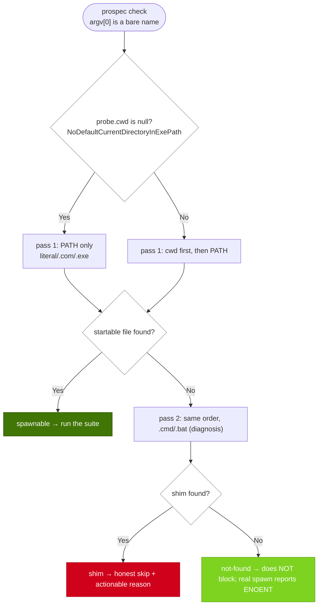

# Implementation Plan: add-windows-smoke-ci

## Overview

`test-provenance` 在 Windows 上的行為（`.cmd` shim → 誠實 skip）只有「我們對 Windows 的模型」在跑，真機從未執行；同一個模型已被對抗式 review 抓出三次偏差（PATHEXT、cwd-first、quoted PATH），每一次的後果都是 fail-class 閘門在能正常工作的機器上反向變成 skip。

策略分兩層且刻意可獨立交付：**修模型**（`classifyExecutable` 對齊 libuv `src/win/process.c` 實際規則，全部以注入的 `ExecutableProbe` 在 POSIX 上驗證）＋**建裁決者**（獨立 `windows-smoke` job，`continue-on-error: true` 起步，只跑 shim 相關兩個測試檔與一次真實的 `check --record-tests` fixture）。關鍵設計決定：cwd 進入 probe 而非另開參數（維持單一注入縫），且以 `cwd: string | null` 同時表達 `NeedCurrentDirectoryForExePathW` 的守衛——null 代表「不搜尋 current directory」，讓 `classifyExecutable` 保持純函式、不讀環境。

## Technical Summary

> Auto-synthesized from AI Knowledge for this change's context

### Affected Module Overview

| Module | Core Responsibility | Key API | Dependencies |
|--------|-------------------|---------|--------------|
| lib | 唯一執行專案命令的地方（flag-gated、`shell: false`） | `classifyExecutable`, `defaultExecutableProbe`, `unspawnableReason`, `runTestCommand` | types |
| tests | 4 層 vitest 套件；平台注入證決策、`runIf(win32)` 證真機 | 無 export | 全部 source modules |
| services | `check --record-tests` 寫入路徑（本 change 不改邏輯，只被 fixture 執行） | `check.service.execute` | types, lib |

### Existing Patterns (from module README)

- 注入縫優先於環境讀取：`ExecutableProbe` 的存在理由就是讓 win32 分支在 POSIX 可證；新規則一律走同一縫
- collector 回 `{available:false, reason}`；命令不可執行屬 `command_unavailable_reason`，不得吃掉已記錄事實
- 平台差異類斷言必須 mutation-verify（PB-001）；git/spawn-bound 測試檔宣告 file 級 `vi.setConfig({testTimeout: 30_000})`（PB-010）

### Architecture Constraints (from Constitution)

- 依賴方向 `cli → services → lib → types`：修正全部落在 `lib`，不新增反向 import
- TDD：每條新規則先寫注入式失敗測試，並附還原舊實作即紅的 mutation pin
- Atomic commits：模型修正、CI job、真機測試分開 commit

## Affected Modules

| Module | Impact | Changes |
|--------|--------|---------|
| lib | High | `ExecutableProbe` 新增 `cwd: string \| null`；PATH 切分改引號感知；`classifyExecutable` 兩個 pass 皆先搜 cwd |
| tests | High | 三類新注入斷言＋`runIf(win32)` 補兩個真機佈局；既有 probe literal 補 `cwd` |
| services | Low | `collectTestProvenance` 的預設 probe 改帶其 `cwd` 參數（呼叫端行為修正，非邏輯改寫） |
| （非模組）`.github/workflows/ci.yml` | Medium | 新增獨立 `windows-smoke` job；既有 `test`／`comment` job 零改動 |
| （非模組）`scripts/` | Medium | 新增 `windows-smoke-record-tests.ts`：跨平台建暫存 git fixture、實跑 `check --record-tests`、斷言 `test-provenance` 非 FAIL |

## Call Chain

```
prospec check --record-tests --change <name>          [記錄路徑]
  → cli/commands/check.ts → check.service.execute({ recordTests })
  → recordTestProvenance(cwd, config, change)          [orchestration]
  → resolveTestCommand(config, cwd)                    [lib/config]
  → runTestCommand(cwd, command)                       [lib/test-runner — 唯一 spawn 點]
      → defaultExecutableProbe(process.env, process.platform, cwd)   ★ spawn cwd 貫穿至 probe
      → classifyExecutable(bin, probe)  → [probe.cwd, ...pathDirs] × ['', '.com', '.exe']
      → describeUnspawnable(...)  → 非 null 則 pre-spawn 拒絕，不 spawnSync
  → computeChangeDigest(cwd) → writeChangeMetadata(post-run digest)

prospec check                                         [純檢查路徑]
  → collectTestProvenance(cwd, testCommand, digest, probe=defaultExecutableProbe(env, platform, cwd))
  → unspawnableReason(...) → command_unavailable_reason
  → evaluateTestProvenance(...) → skipped + reason（已記錄的非零 exit 仍先 FAIL）
```

## User Story Flow Diagram

### US-2: bare name 在 Windows 上的判定流程



## Implementation Steps

1. **RED：注入式測試先行（US-2）**
   - cwd 有 `mytool.exe`、PATH 只有 `mytool.cmd` → 期望 `spawnable`
   - quoted PATH entry 內有真 `.exe`、他處有同名 `.cmd` → 期望 `spawnable`；另一條 entry 內含 `;` 不被切開
   - `NoDefaultCurrentDirectoryInExePath` 已定義 → `defaultExecutableProbe().cwd === null`，cwd 不入搜尋
   - 既有 `ExecutableProbe` literal 補 `cwd`（typecheck 涵蓋 `tests/`，缺欄位編譯即失敗）

2. **GREEN：`lib/test-runner.ts` 對齊 libuv**
   - `ExecutableProbe` 新增必填 `cwd: string | null`（null＝不搜 current directory）
   - `defaultExecutableProbe(env, platform, cwd = process.cwd())`：env 內有 `NoDefaultCurrentDirectoryInExePath` 時回 `cwd: null`
   - win32 PATH 切分改引號感知：引號區段到配對引號才結束（內含 `;` 不切），再剝除首尾各一個引號字元
   - `classifyExecutable` 兩個 pass 的搜尋目錄改為 `[probe.cwd, ...pathDirs]`（僅 bare name 適用；已是路徑者不變）
   - 呼叫端貫穿 spawn cwd：`runTestCommand` 與 `collectTestProvenance` 的預設 probe 帶入各自的 `cwd` 參數

3. **真機裁決案例（US-3）**
   - `describe.runIf(win32)` 內以 `copyFileSync(process.execPath, …)` 造唯一命名的真實 `.exe`
   - 案例 A：cwd 放該 exe、PATH 無同名 → 斷言真 spawn 得到指定 exit code 且判定 `spawnable`
   - 案例 B：暫時把該目錄以 quoted entry 塞進 `process.env.PATH`（測後還原）→ 斷言判定與真 spawn 一致

4. **fixture 腳本（US-1 的可執行證據）**
   - `scripts/windows-smoke-record-tests.ts`：暫存目錄 `git init` ＋ `.prospec.yaml` ＋ 帶 test script 的 `package.json` ＋ 一個 `status: implemented` 的 change
   - 依序跑 `node dist/cli/index.js check --record-tests --change smoke` 與 `check --json`，原樣印出兩段輸出
   - 讀 `prospec-report.json` 取 `test-provenance`：`pass`／`skipped` 放行，`fail` 以非零 exit 結束（移除 `continue-on-error` 後即成閘門）
   - 先在 macOS 上跑通（走「成功記錄」分支），再交由 Windows runner 走 shim 分支

5. **`ci.yml` 新增 `windows-smoke` job**
   - `runs-on: windows-latest`、`continue-on-error: true`、與既有 `test` job 並列且零共用（不產 artifact、不觸碰 sticky comment 接線）
   - steps：checkout → pnpm/action-setup → setup-node(22, cache pnpm) → install → build → `pnpm exec vitest run tests/unit/lib/test-runner.test.ts tests/unit/services/check.service.test.ts` → `pnpm exec tsx scripts/windows-smoke-record-tests.ts`

6. **推 PR、觀測、逐條列舉首跑失敗（US-1 收尾）**
   - 確認 CI log 中 `runTestCommand on a real Windows host` 有非零通過數（SC-001）
   - 與 shim 無關的失敗逐條記錄結論（修／已知限制／降級），寫入 verify 產出與 issue #101

## Risk Assessment

| Risk | Impact | Mitigation |
|------|--------|------------|
| libuv 模型第三次仍與真機不符（例如 spawn cwd 並非搜尋起點） | High | 真機 runIf 案例即裁決者且刻意可能轉紅；模型直接引 `src/win/process.c` 原碼而非記憶；首跑 `continue-on-error` 容錯 |
| pass 2 納入 cwd 擴大 false shim block | Medium | 僅診斷用（pass 1 全找不到才進入）；`not-found` 依舊不阻擋；新增 mutation pin 界定範圍 |
| Windows 首跑噴出大量與 shim 無關的失敗 | Medium（預期代價） | 範圍收窄至兩個測試檔＋fixture；`continue-on-error: true`；失敗清單外顯而非長期靜音 |
| 改動波及既有 `test`／`comment` job（jq／artifact 名稱／sticky comment） | High | 獨立 job、不共用 artifact 與 shell 假設；SC-004 以 diff 驗證既有 job 零改動 |
| `ExecutableProbe` 新增必填欄位破壞既有 literal | Low | `pnpm typecheck` 涵蓋 `tests/`，缺欄位編譯期即現，不會靜默 |
| fixture 腳本在 Windows 的路徑／CRLF 差異 | Medium | 一律 `path.join`／`process.execPath`；先在 POSIX 跑通再上 Windows；失敗即列入首跑清單 |
