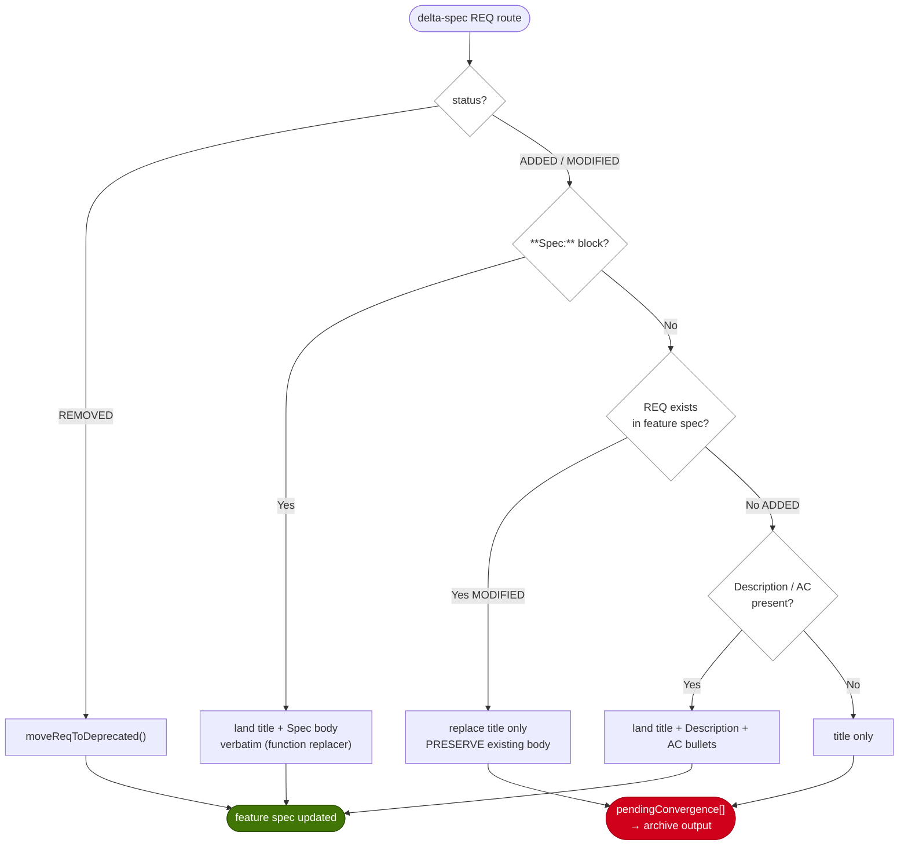

# Implementation Plan: fix-cli-first-regressions

## Overview

三個缺陷同源：CLI 接手機械步驟時，輸入契約沒把「原本靠人補齊的資訊」納進來。archive 的 spec-sync 只從 delta-spec 讀 REQ 的 h3 標題（`extractFeatureRoutes` 丟掉 body），合併時卻以標題整段取代既有 REQ 區塊 → 信任區掉字（現存 12 個 body-less REQ 就是殘骸）。`pnpm counts` 只維護生成檔（`index.md`、模組 README）不維護來源（`module-map.yaml` 的 description），而 `prospec knowledge update` 的 auto block 是從 module-map 重生 → 一重生就回退（現況：index 2,775 vs map 2,773）。移除 `prospec knowledge generate` 後，`knowledge.service.ts` 全檔與 `cli/formatters/knowledge-output.ts` 失去 runtime consumer，但 ai-knowledge feature spec 仍以該死指令描述行為。

策略：三條互不相依的修復線，各自 RED→GREEN，分別成 commit。US-1 把 delta-spec 的 REQ body 納入 `FeatureRoute`，並確立「有 `**Spec:**` 落地區塊才取代 body，沒有就原樣保留並回報」的非破壞性契約；US-2 讓 counts 的 occurrence 支援 YAML 欄位級目標（以 node range 做外科式改寫、不重新序列化整份 YAML，避免 reflow churn），再以「`index.md` auto block == render(module-map)」guard test 釘住回歸；US-3 刪孤兒碼並把受影響的 REQ 改述到真正宿主。既有 12 個 body-less REQ 不在本輪補寫，改以「集合相等」debt ledger 測試凍住（新增洞紅燈、修好也要同步刪清單，單向遞減）。

## Technical Summary

> Auto-synthesized from AI Knowledge for this change's context

### Affected Module Overview

| Module | Core Responsibility | Key API | Dependencies |
|--------|--------------------|---------|--------------|
| services | 每指令一個 `execute()`；archive 負責 spec-sync/product/feature-map | `syncToFeatureSpecs`、`extractFeatureRoutes`（private）、`collectAllModules`、`updateIndex` | lib, types |
| cli | 薄 I/O 層：parse → service → formatter | `formatArchiveOutput`、`formatKnowledgeOutput`（待刪） | services |
| lib | 無狀態工具；index-table 單一來源 helper | `buildIndexTable`/`buildIndexRow`、`parseIndexModules`、`parseYamlDocument`、`atomicWrite` | types |
| templates | 純資源；skill 與 reference 的 `.hbs` | `references/delta-spec-format.hbs`、`references/feature-spec-format.hbs` | — |
| tests | 4 層測試金字塔 | unit / contract / integration / e2e | 全模組 |
| scripts/counts（repo-internal，不在 module-map） | `pnpm counts` 白名單式計數改寫 | `COUNT_REGISTRY`、`applyCounts`、`syncCounts` | src/lib/fs-utils |

### Existing Patterns (from _conventions.md)

- Service Pattern：`execute(options) → Promise<Result>`；Result 改動須連動 CLI formatter 與單元測試
- File Write Pattern：一律 `atomicWrite()`，禁止 `fs.writeFileSync()`
- 替換信任區文字時使用 **function replacer**，讓 `$&`／`$1` 逐字落地（archive 既有防護）
- Content Regeneration：`prospec:auto-*` 區塊由系統覆寫、`prospec:user-*` 保留
- PB-006（已晉升 playbook）：同一邏輯不得在平行站點各複製一份 → guard test 必須復用 `collectAllModules` + `buildIndexRow`，不得自己再投影一份 module-map→row 的 mapping

### Architecture Constraints (from Constitution)

- 依賴方向 `cli → services → lib → types`；`scripts/` 可讀 `src/lib`（既有作法），但不得反向
- TDD：每個 FR 先有紅燈測試；覆蓋率 ≥ 80%
- Atomic Commits：三條修復線各自一個 commit，不混提
- Language Policy：`.prospec/changes/**` 繁中；`prospec/specs/**`、`prospec/ai-knowledge/**` 英文

## Affected Modules

| Module | Impact | Changes |
|--------|--------|---------|
| services | High | `archive.service.ts`：`FeatureRoute` 增 body 欄位、parser 擷取 body、`mergeRequirementInPlace` 改為非破壞性、`ArchiveResult` 增待收斂回報；刪除 `knowledge.service.ts` |
| cli | Medium | archive formatter 輸出待收斂 REQ 清單；刪除 `formatters/knowledge-output.ts` |
| templates | Medium | `delta-spec-format.hbs` 新增 `**Spec:**` 落地區塊契約；`archive-format.hbs`／archive skill 說明待收斂回報 |
| tests | High | 三組回歸測試（spec-sync 保 body、index==render(module-map)、body-less debt ledger）＋刪除孤兒測試＋contract 檔案清單更新 |
| lib | Low | 不改行為；guard test 復用既有 helper |
| scripts/counts | High | occurrence 新增 YAML 欄位級目標與 node-range 改寫器；registry 納入 module-map 計數 |

## Call Chain

`prospec archive <name>`（US-1 主入口）

```
prospec archive fix-cli-first-regressions
  → cli/commands/archive.ts               [parse; 名稱必填]
  → services/archive.service.execute({ names, dryRun })      [orchestration]
  → readFeatureRoutes(artifactsDir) → extractFeatureRoutes(deltaContent)
        [新增：擷取每個 REQ 的 body 與 **Spec:** 區塊 → FeatureRoute.specBody / rawBody]
  → syncToFeatureSpecs(archiveDir, featuresPath, dryRun)
      ├─ moveReqToDeprecated(content, route)                 [REMOVED，不變]
      └─ mergeRequirementInPlace(content, route)             [改為非破壞性]
            → landBody(route) | preserveExistingBody(content, reqId)
  → lib/fs-utils.atomicWrite(specFile)                       [dryRun 時短路]
  → ArchiveResult.pendingConvergence[]                        [回報，不落盤]
  → cli/formatters/archive-output.formatArchiveOutput(result) [stderr/stdout 分流]
```

`pnpm counts`（US-2 主入口）

```
pnpm counts
  → scripts/sync-counts.ts main()
  → counts/sync.buildTruth(repoRoot, gatherTestCounts())     [vitest + fs-glob]
  → counts/sync.syncCounts({ repoRoot, check, truth })
      ├─ counts/rewrite.applyCounts(content, resolved, doc)          [markdown：逐行]
      └─ counts/yaml-field.applyYamlFieldCounts(source, resolved, doc)  [新增：YAML 欄位級]
            → parseYamlDocument(source) → 定位 modules[i].description 的 range
            → 以 logical↔raw offset map 只改寫數字 span（不重新序列化整份文件）
  → src/lib/fs-utils.atomicWrite(doc)
```

`prospec knowledge update`（US-2 回歸點，本輪不改行為）

```
prospec knowledge update --change <name>
  → services/knowledge-update.executeForChange()
  → backfillCuratedFromIndex(existingIndex, moduleMap)       [no-clobber 遷移]
  → collectAllModules(result, moduleMapPath) → IndexRowModule[]
  → updateIndex(modules, opts) → lib/index-table.buildIndexTable(modules)
  → replaceAutoBlock(existingContent, autoBlock) → atomicWrite(index.md)
      [guard test 走同一條鏈：render(module-map) 必須等於 index.md 現有 auto block 表格]
```

## User Story Flow

US-1：spec-sync 合併單一 REQ 的決策流



## Implementation Steps

1. **US-1 RED：釘住掉字**（tests/unit/services/archive-*.test.ts）
   - fixture：既有 feature spec（含 body 的 REQ、最後一個 h4 緊接 h2、含 `$&` 的敘述）＋ delta-spec（MODIFIED 無 Spec 區塊、MODIFIED 有 Spec 區塊、ADDED 有 Description/AC、ADDED 空白）
   - 斷言：合併後每個既有 REQ 的 body 行數 ≥ 合併前；有 Spec 區塊者落地全文；`pendingConvergence` 列出未取代者
   - 此時應全紅（現況只落標題）

2. **US-1 GREEN：非破壞性合併**
   - `FeatureRoute` 增 `specBody?: string`／`descriptionBody?: string`；`extractFeatureRoutes` 擷取 h3 以下至下一個 heading／`---` 的 body，並解析 `**Spec:**`、`**Description:**`、`**Acceptance Criteria:**` 三個區塊
   - `mergeRequirementInPlace`：MODIFIED 有 Spec → 取代標題＋body；無 Spec → 只換標題行、保留既有 body 並回報；ADDED → 落地 Spec 或 Description＋AC bullets
   - `ArchiveResult` 增 `pendingConvergence: Array<{ feature, reqId, reason }>`；dryRun 同樣產出（不落盤）
   - CLI formatter 印出待收斂清單（`sanitizeTerminal()`）

3. **US-1 契約與文件**
   - `references/delta-spec-format.hbs`：新增 `**Spec:**` 區塊定義（MODIFIED 必附、ADDED 選附）＋「CLI 只落地 spec 形式全文，缺少時保留既有 body 並回報」說明
   - `archive-format.hbs`／`prospec-archive` skill：graduation 階段讀 `pendingConvergence` 收斂
   - contract test 釘住新段落（section-scoped、mutation-verified）＋ `pnpm bundle`（bundled-templates 先於 FS）

4. **US-1 debt ledger guard**
   - 新測試：掃 `prospec/specs/features/*.md` 的 body-less REQ 集合，斷言「正好等於」12 個具名 legacy 清單（新增→紅、修好→須同步刪清單）

5. **US-2 RED：counts 分裂**
   - guard test：`collectAllModules` + `buildIndexRow` 逐列重建 vs `index.md` auto block 現有列 → 現況應紅（2,775 vs 2,773）
   - counts 單元測試：module-map description 跨行時仍能定位並改寫；改寫後其餘位元不變（no reflow）

6. **US-2 GREEN：YAML 欄位級 occurrence**
   - `CountOccurrence` 增 `yamlField?: { path: 'modules[].description'; module: string }`（或等價的定位描述）
   - 新增 `scripts/counts/yaml-field.ts`：`parseYamlDocument` 定位 scalar node range → 建 logical↔raw offset map → 只改寫數字 span
   - `COUNT_REGISTRY` 為 tests.\* 與 templates.hbs.\* 各補 module-map occurrence；`syncCounts` 依 doc 副檔名分流至對應改寫器
   - 跑 `pnpm counts` 讓 module-map 與 index 收斂

7. **US-3：刪孤兒碼與 spec 手術**
   - 確認 `knowledge/module-readme.hbs`、`index.md.hbs` 仍有其他 consumer（knowledge-update／init）後，刪 `src/services/knowledge.service.ts`、`src/cli/formatters/knowledge-output.ts`、`tests/unit/services/knowledge.service.test.ts`、`tests/unit/cli/knowledge-output.test.ts`
   - 更新 `tests/contract/knowledge-format.test.ts` 檔案清單、`prospec/ai-knowledge/modules/services/README.md`／`templates/README.md` 的敘述（改指真正宿主）
   - delta-spec 登記 ai-knowledge 受影響 REQ（MODIFIED／REMOVED），US 場景文字於 archive graduation 階段收斂

8. **收尾驗證**
   - `pnpm typecheck`、`pnpm lint`、`pnpm test`、`pnpm counts`（測試數變動 → 重導計數）、`npx tsx src/cli/index.ts check`
   - 移除 `planning/backlog.md` 的 BUG-002/003/004 三列（FR-011）

## Risk Assessment

| Risk | Impact | Mitigation |
|------|--------|------------|
| YAML 寫回導致整份 module-map reflow（實測 `parseDocument().toString()` 有 10 行改變寬度） | High | 不用 Document 序列化；以 node range 做外科式數字替換，並用「其餘位元不變」測試釘住 |
| `**Spec:**` 落地全文含 `$`-序列被當替換模式展開 | High | 沿用 function replacer；測試以含 `$&` 的 body 驗證逐字落地 |
| body 邊界判定吃到下一節（h2／`---`／檔尾） | High | 沿用既有邊界規則並補「最後一個 h4 緊接 h2」與「檔尾」兩個回歸案例 |
| 刪 `knowledge.service.ts` 連帶讓 `.hbs` 或 lib helper 變孤兒（`deriveKeyExports`、`buildIndexTemplateContext`） | Medium | 刪前逐一 grep consumer；有孤兒則一併處置或明確留存理由（trade-off：留著純資源比留死程式碼便宜） |
| debt ledger 具名清單腐化（有人修好卻沒更新清單） | Medium | 用「集合相等」而非「數量上限」：兩個方向都紅，強迫同步；清單旁註記 follow-up 意圖 |
| 三條線混在一個 change，review／verify 範圍變大 | Medium | 各線獨立 commit、獨立測試檔；verify 依 US 分維度評 |
| `ArchiveResult` 增欄位破壞既有 formatter 契約測試 | Low | 新欄位為 additive；formatter 測試同步更新，dry-run 預測一致性由既有 replay 測試覆蓋 |
| trade-off：MODIFIED 缺 Spec 時「保留舊 body」會讓 spec 暫時落後於實作 | Medium | 以 `pendingConvergence` 讓落差可見（archive 輸出＋skill graduation 讀取），比靜默掉字可稽核 |

## Knowledge Quality Gate

Brownfield（6 模組有 README）；已讀 services／cli／lib／templates／tests README 與 `_conventions.md`、`_diagram-conventions.md`、`_playbook` PB-006；Feature Spec 已比對 `sdd-workflow`（US-6 archive）與 `ai-knowledge`（US-302/303/340/350/354）→ PASS。
