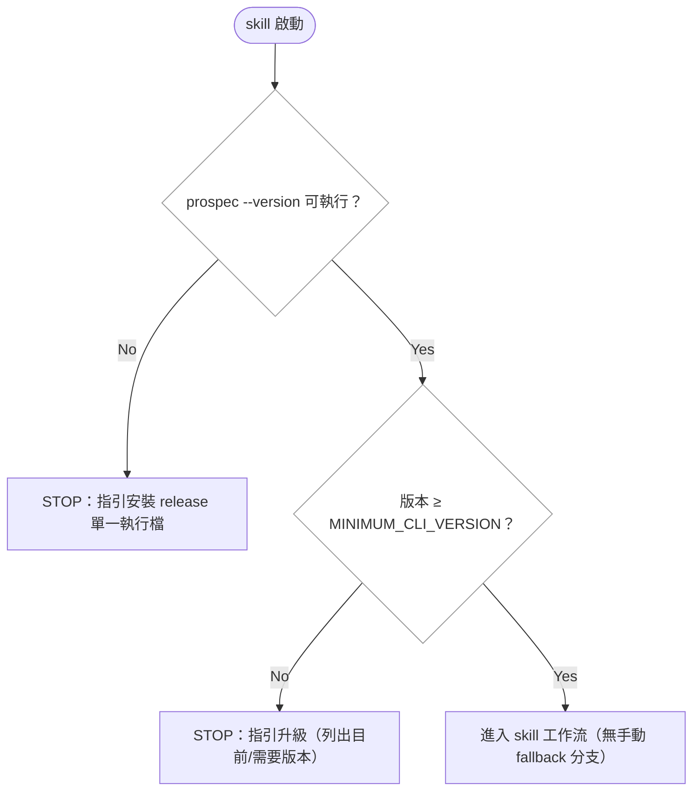

# restore-cli-first — 實作計畫

## Overview

本變更反轉 2026-02 `skill-autonomy`（REQ-AGNT-012）確立的 skill-first 方向：當時讓 skill 直接建檔、手寫 metadata.yaml、自行執行確定性操作，CLI 退為可選。實務證明 LLM 手工模擬 `change story/plan/tasks`、status 轉換、quality_log 序列化等既有語義帶來不確定性與 token 浪費。issue #98 的 `prospec archive`（REQ-CLI-024/REQ-TEMPLATES-159）已示範正確分工：**判斷（prose、審查、裁決）留在 skill，變換與落盤（scaffold、序列化、合併、計數、複製）交給 CLI**。本變更把這個分工推廣到全部 17 個 skill。

實作策略分四層推進：(1) `lib` 新增純函式引擎（verify 評分決策表、review 合併、ledger upsert、artifact 結構驗證）；(2) `services` 新增/擴充 `execute()`（含接上孤兒 `knowledge-update.service`）；(3) `cli` 佈線新指令；(4) `templates` 改寫 17 個 skill＋共用必裝探針 partial＋entry config，同步契約測試與文件。CLI 姿態由 optional 翻轉為 required：統一 quickstart 式探針（不可用即 STOP 指引安裝，無手動 fallback），並移除 verify 的「engine-unavailability 三形態 WARN 豁免」——該豁免存在的唯一理由（CLI-less 專案不被評分卡死）在 CLI 必裝後消失。

## Technical Summary

> Auto-synthesized from AI Knowledge for this change's context（Brownfield：6 modules）

### Affected Module Overview

| Module | Core Responsibility | Key API | Dependencies |
|--------|-------------------|---------|--------------|
| types | Zod schemas、錯誤、凍結 registry | `ChangeMetadataSchema`/`isStatusBefore`、`SKILL_DEFINITIONS`、`VERIFY_GRADES` | zod only |
| lib | 無狀態工具與純引擎 | `change-metadata`(sole metadata I/O)、`yaml-utils`、`task-markers`、`status-router`、`content-merger` | types |
| services | 一指令一 `execute()` | `change-*`、`knowledge-update`(孤兒)、`archive`、`check`、`agent-triggers` | types, lib |
| cli | 薄 I/O 層 | `registerXxxCommand` + `formatXxxOutput`；`INIT_COMMANDS` 豁免名單 | types, lib, services |
| templates | 64 個 `.hbs` 資源 | 17 skills＋5 partials＋references＋`entry.md.hbs` | —（純資源） |
| tests | 4 層測試 | `skill-format`/`skill-contract`/`bundled-templates-sync`/e2e | all |

### Existing Patterns (from _conventions.md / module READMEs)

- 指令三件套：`commands/{name}.ts`（parse→call→format）＋ `formatters/{name}-output.ts` ＋ `services/{name}.service.ts` 的 `execute(options) → Result`
- metadata I/O 一律走 `lib/change-metadata`（schema 驗證、絕不 re-cast `doc.toJS()`）；status 前進限 `isStatusBefore` forward-only
- 檔案寫入一律 `atomicWrite()`；含使用者區塊者用 `ContentMerger`；YAML 就地編輯用 `yaml-utils` `mergeIntoDocument`（保註解）
- 純引擎（evaluator）I/O-free 放 lib，collectors/orchestration 放 services（drift engine 先例）
- 改 shipped `.hbs` 兩步：`pnpm bundle` → `npx tsx src/cli/index.ts agent sync`（絕不用 `pnpm exec prospec`）
- 單一來源契約：task 文法只在 `task-markers.ts`；ledger 格式只在 `references/promotion-format.hbs`；review/verify 分工敘述只在 `prospec-verify.hbs`

### Architecture Constraints (from Constitution)

- 依賴方向 `cli → services → lib → types`，無反向/循環
- TDD：測試先行或同 commit；coverage ≥ 80%
- Atomic commits by feature；commit 訊息英文
- README-documented surface 變更須同 change 更新 root README（[SHOULD]）

## Affected Modules

| Module | Impact | Changes |
|--------|--------|---------|
| cli | High | 新增 `change log`/`change status`/`change progress`/`knowledge update`/`review merge`/`verify record`/`learn upsert`/`validate` 指令＋formatters；`agent triggers --write`；`archive finalize` 後置子指令；移除 deprecated `knowledge generate` |
| services | High | 縮限接上 `knowledge-update.service`（index/module-map/deprecation；既有模組 README 不重生）；新增 change-log/change-status/change-progress/review-merge/verify-record/learn/validate services；`agent-triggers` 寫回模式；`archive.service` 新增 finalize（`_archived-history` 複製、frontmatter 計數對帳）＋模組推導唯讀輸出 |
| lib | Medium | 新增純引擎：verify 評分決策表、review 表合併（identity key 簿記/嚴重度取最大）、lessons-ledger keyed upsert＋計分、artifact 結構驗證（章節/NC 計數與位置/slug/信任區防護）；復用既有 `task-markers`/`yaml-utils`/`status-router`/`change-metadata` |
| types | Medium | 新指令 Result/輸入契約、`MINIMUM_CLI_VERSION` 探針常數、quality_log 條目建構型別補強 |
| templates | High | 新共用 partial `_cli-probe.hbs`（必裝探針）；17 個 skill 委派改寫；`entry.md.hbs` 移除 fallback；`references/metadata-format.hbs` 改「CLI 寫入、skill 讀取」；verify 移除三形態豁免敘述 |
| tests | High | 新指令 unit/contract/e2e；`skill-format`/`skill-contract`/`bundled-templates-sync`/loading-baseline 更新；`pnpm counts` 重跑 |

## Call Chain

新指令全部遵循同一分層鏈（cli 薄層 → service orchestration → lib 純引擎/I-O 原語）。逐一列出主要進入點：

```
prospec change log --skill <station> --result <R> [...]
  → registerChangeLogCommand.action(opts)
  → changeLogService.execute({change, entry})            [orchestration]
  → lib/change-metadata.readChangeMetadata(dir)          [schema-validated read]
  → buildQualityLogEntry(entry)                          [純建構：固定鍵序、站點選用鍵]
  → lib/change-metadata.writeChangeMetadataObject(doc)   [comment-preserving atomic write]

prospec change status <to>
  → changeStatusService.execute({change, to})
  → lib/change-metadata.readChangeMetadata(dir)
  → types/change.isStatusBefore(from, to)                [forward-only 驗證；違規 → ProspecError＋合法轉換清單]
  → lib/change-metadata.writeChangeMetadataObject(doc)

prospec change progress [--complete <n>]
  → changeProgressService.execute({change, complete})
  → lib/task-markers.parseTaskLines(tasks.md)            [code-task 分母文法唯一來源]
  → flipCheckbox(line)                                   [純字串變換]
  → lib/fs-utils.atomicWrite(tasks.md)；回報 X/Y＋next task

prospec knowledge update [--change <name>]
  → knowledgeUpdateService.execute(options)              [縮限佈線：安全子集，非原樣]
  → parseDeltaSpec → updateIndex / updateModuleMap(add/remove) / markModuleDeprecated
      [updateModuleReadme 僅限「README 不存在」的新模組建 skeleton；既有模組 README 一律不重生 —
       skeleton 再生會經 mergeContent 蓋掉 auto block 內的 LLM 知識（2026-07-05 archive
       解耦此 service 的根因）；README 內容更新是判斷，明文留在 skill]

prospec review merge --findings <json>
  → reviewMergeService.execute({change, findings})
  → lib/review-merge.mergeFindings(existing, incoming)   [純簿記：以 finding identity key 合併、
      severity max、跨輪保留；跨輪行號漂移下「同一 finding」的識別是語意判斷 —
      由 LLM 在 findings JSON 以 id/supersedes 提供，CLI 不做語意比對]
  → atomicWrite(review.md)

prospec verify record --dimension <name=result>…（僅 judgment 維度 2/5、3/5、6）[--warnings…]
  → verifyRecordService.execute({change, judgmentDims, warnings})
  → 自讀 prospec-report.json＋metadata test_provenance    [machine 維度（1/5、4/5、5/5）由 CLI
      直接取自報告與記錄，不接受 LLM 轉述；報告缺失 → 拒絕並指引先跑 check]
  → lib/verify-grade.computeGrade(allDims, warnings)     [純決策表：S/A/B/C/D；WARN 預算，無豁免類]
  → buildQualityLogEntry({grade, dimensions})
  → writeChangeMetadataObject；grade ∈ {S,A} → isStatusBefore 前進 status: verified

prospec learn upsert --lesson <json>
  → learnService.execute({lesson})
  → lib/lessons-ledger.upsertLesson(ledger, lesson)      [純引擎：決定論 key、frequency 遞增、source_changes 聯集]
  → lib/lessons-ledger.scoreLessons(ledger)              [freq≥3 ∧ modules≥2 → suggest，含 audit 字串]
  → atomicWrite(_lessons-ledger.md)

prospec validate <kind> [path]
  → validateService.execute({kind, path})
  → lib/artifact-validators：
      slug／promote-scaffold — 完整機器判定（isSafeResourceName、檔案存在性、metadata 形狀、
        信任區 git status 防護）
      backfill-draft／design-spec — 結構子集：必要章節、route-compatible 標頭、
        [NEEDS CLARIFICATION] 原始計數與位置清單、feature-map 集合差（兩集合皆機器可得時）
      [>50% 比率的 story-level 分母＋heuristic-WHY 豁免分類、design 元件集合自 proposal
       散文的萃取是語意判斷 — 明文留在 skill；CLI 只回報結構事實]
  → formatValidateOutput（機器判定 PASS/FAIL＋findings）

prospec agent triggers --write
  → agentTriggersService.execute({write: true})
  → lib/yaml-utils（snapshot → mergeIntoDocument 最小就地編輯 → 回讀驗證 → 失敗還原）
  → atomicWrite(.prospec.yaml)
```

`archive` 擴充改為**後置子指令** `prospec archive finalize <name>`，而非塞進既有單次呼叫：skill 的實際順序是 CLI scaffold summary → LLM 以 Phase 2 prose **覆寫** summary → Phase 3.5 REQ 語意 graduation 之後才數最終 spec 文本。因此 `_archived-history/{YYYY-MM-DD}-{name}.md` 複製與 feature spec frontmatter `story_count`/`req_count` 對帳必須在判斷步驟**之後**執行——`finalize` 承接這兩個寫入點（同樣支援 `--dry-run` planned mutations）。affected-modules 推導（REQ 前綴/feature-map/related_modules）為唯讀查詢，掛在 archive 報告輸出（dry-run 報告或獨立旗標，實作時定），供 Entry Gate 與 knowledge 同步引用。

## User Story Flow Diagram

### US-3: CLI required 探針（所有 skill 共用 partial）



## Implementation Steps

1. **types：契約先行**
   - 新指令 Result 介面與輸入 Zod shapes；`MINIMUM_CLI_VERSION` 常數（隨本版本）
   - quality_log 條目建構的 strict 型別（`NewQualityLogEntry`，沿 `NewChangeMetadata` 先例）
   - 錯誤子類：`CliVersionError`、`InvalidTransitionError`（含 `suggestion`）

2. **lib：純引擎（TDD，I/O-free）**
   - `verify-grade.ts`：S/A/B/C/D 決策表（移除三形態豁免——全部 WARN 計入預算）
   - `review-merge.ts`：findings 合併（Location key、severity max、跨輪保留）
   - `lessons-ledger.ts`：ledger parse/upsert/score（格式真相仍在 `references/promotion-format.hbs`，parser 對其測試）
   - `artifact-validators.ts`：章節存在、route-compatible 標頭、`[NEEDS CLARIFICATION]` 原始計數與位置、slug（復用 `isSafeResourceName`）、feature-map 集合差、信任區路徑防護——比率豁免分類與 design 元件集合萃取是判斷，不進 lib
   - `change-metadata.ts` 補 `appendQualityLog(doc, entry)` helper

3. **services＋cli：change 生命週期寫入面**
   - `change-log`/`change-status`/`change-progress` services＋commands＋formatters
   - 冪等語義：`change log` 純附加；`change status` forward-only；`change progress` 對已勾選項 no-op

4. **services＋cli：知識與設定寫入面**
   - `knowledge update` 縮限佈線（含 `--change` 經 `change-resolver`）：先調整 service——`updateModuleReadme` 僅在 README 不存在時建 skeleton、coordinator 對 MODIFIED 模組跳過 README 重生（unit test pin 既有檔位元不變）——再佈線；移除 deprecated `knowledge generate` 指令
   - `agent triggers --write`（輸入＝翻譯完成的 scaffold；snapshot/最小就地編輯/回讀驗證/還原）

5. **services＋cli：站點引擎面**
   - `review merge`（合併鍵＝LLM 提供的 finding identity）、`verify record`（machine 維度自讀報告與 test_provenance，僅收 judgment 裁決）、`learn upsert`（以 key 為輸入邊界）、`validate <kind>`（slug/promote 完整、backfill/design 結構子集）services＋commands＋formatters
   - `archive.service` 新增後置 `finalize` 子指令（`_archived-history` 複製＋frontmatter 計數對帳，支援 dry-run）；affected-modules 推導以唯讀輸出供 skill 引用

6. **templates：委派改寫與必裝探針**
   - 新 partial `_cli-probe.hbs`（探針＋STOP 語義單一來源）；全 17 skill 的 Startup/Entry Gate 引用
   - new-story/plan/tasks/ff/implement：scaffold/status/quality_log/進度改為指令呼叫；knowledge-update Phase 3 機械部分（index/module-map/deprecation）→ `knowledge update`，README 內容更新明文留 skill；review/verify/learn → 對應指令；design/backfill/promote → `validate` 結構子集（比率豁免分類與元件集合萃取明文留 skill）；archive 殘餘手動項 → `archive finalize`
   - 刪除全部「If the CLI is unavailable / fall back」措辭（含 verify 三形態豁免敘述、entry.md.hbs Session Start fallback、knowledge-generate/archive 解析階梯）
   - `references/metadata-format.hbs` 改寫為「CLI 寫入、skill 讀取」的讀者視角

7. **tests＋counts＋bundle**
   - 新引擎 unit（決定論：固定輸入位元一致）；新指令 unit＋e2e；contract 更新（skill-format 探針單一來源、無 fallback 措辭斷言、bundled-templates-sync、loading baseline）
   - `pnpm bundle`＋`npx tsx src/cli/index.ts agent sync`＋`pnpm counts`

8. **docs：定位反轉**
   - README.md＋README.zh-TW.md：「Skills-driven thin CLI」→ cli-first 敘事；指令清單補新指令；刪 L540「Skills now create ... directly」
   - `planning/backlog.md` 職責矩陣反轉；標記 #107 對應項

## Open Questions 決議（proposal 攜入）

- **`prospec knowledge generate`（deprecated）**：**移除**。cli-first 下 CLI 只承載確定性操作；README/index 的內容生成是 LLM 判斷，永遠屬於 skill——保留一個棄用殘根與新架構敘事矛盾。若 specs 存在對應 REQ，graduation 時列 REMOVED。
- **指令命名**：`change log`／`change status`／`change progress`／`knowledge update`／`agent triggers --write`／`review merge`／`verify record`／`learn upsert`／`validate <kind>`／`archive finalize`（沿 Commander 既有 group 慣例；review/verify/learn 為新頂層 group，與 skill 站點同名對齊）。
- **CLI 與判斷的邊界（本次修訂定案）**：README 內容更新、review finding 身分識別、backfill >50% 守門的豁免分類、design 元件集合萃取——四者為語意判斷，**明文不委派**；CLI 承接其外圍的全部機械簿記與結構事實回報。

## Risk Assessment

| Risk | Impact | Mitigation |
|------|--------|------------|
| 契約測試大面積連動（skill-format 700 條、loading baseline 81 項） | High | 逐 skill 分 commit；每步 `pnpm vitest run tests/contract/`；措辭變更集中在探針 partial 單一來源，降低重複斷言修改 |
| 全域舊版 binary（0.5.6）缺新指令 → 使用者困惑 | High | `MINIMUM_CLI_VERSION` 探針含明確升級指引；README 記載版本需求；trade-off：不做舊版容忍（required 姿態的代價，接受） |
| 一次全做 diff 巨大，review/verify 負擔重 | High | 依 Implementation Steps 分層 atomic commits（types→lib→services/cli→templates→tests→docs）；`/prospec-review` 分輪審查 |
| `bundled-templates.ts` 與 `.hbs` 失同步 | Medium | 每次模板變更後 `pnpm bundle`；`bundled-templates-sync` 契約測試把關 |
| `knowledge update` 誤重生既有模組 README（skeleton 蓋掉 auto block 知識） | High | service 硬限制：`updateModuleReadme` 僅於 README 不存在時建檔；coordinator 對 MODIFIED 模組跳過 README；unit test pin 既有檔位元不變 |
| `archive finalize` 在 prose 覆寫/graduation 前誤跑 → 複製到 scaffold、對帳到舊文本 | Medium | finalize 前置檢查：summary 仍為 scaffold 樣板時拒絕並提示；skill 措辭把 finalize 固定排在 Phase 3.5 之後 |
| verify 豁免移除使 CLI-less 專案永遠到不了 verified | Medium | 刻意接受——CLI 已是必須檔案，豁免的服務對象不再存在；探針在 verify 之前就 STOP，不會走到評分 |
| ledger/review 合併引擎與既有手寫產物格式不相容 | Medium | parser 以 `promotion-format.hbs`／review.md 既有欄位為契約測試基準；對現存 `_lessons-ledger.md` 實檔做整合測試 |
| 移除 `knowledge generate` 破壞既有使用者腳本 | Low | 已 deprecated 且 README 導向 skill；release notes 標註 breaking |

## 依賴方向檢核（Phase 3 site-specific）

新增碼全部順向：`cli/commands/*` → `services/*.service` → `lib/*`（純引擎）→ `types/*`。lib 新引擎 I/O-free（drift evaluator 先例）；services 持有全部 I/O；templates 為純資源。無反向 import。**PASS**
