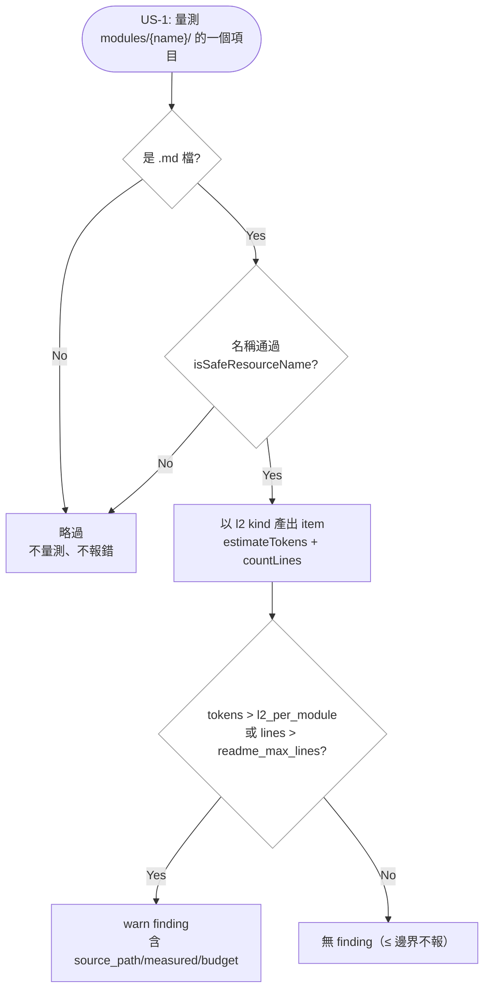

# Implementation Plan: enforce-sub-module-budget

## Overview

慣例宣稱 sub-module 檔與 README 同預算，但 `collectKnowledgeSize` 的 L2 只量 `modules/<name>/README.md`。
抽取因此變成把知識移出量測範圍：WARN 消失是因為量不到，不是因為變小。本變更先讓 sub-module 進入
量測，再以 templates（1797/1800，PB-011 第三度）的第一次真實抽取自我 dogfood。

策略是把改動壓在 collector 與純評估器的邊界內：`collectKnowledgeSize` 由「讀一個 README」改為
「列舉模組目錄下每個 `.md`」，evaluator 對 README 與 sub-module 套用同一組 `l2_per_module` /
`readme_max_lines`，不新增 `KnowledgeSizeKind` 值（見設計決定 1）。knowledge-health 的 staleness 改比
「README 與其 sub-module 的最新 commit」，並以 additive optional 欄位讓判定可從報告重現。

### 設計決定

1. **不新增 `l2-sub` kind**：evaluator 對兩者套同一預算，新增 kind 會讓對外的 `KnowledgeSizeKind`
   多一個沒有行為差異的值，逼每個下游消費者處理它；finding 已含 `source_path` 足以辨識。
2. **knowledge-health 加欄位而非改語意**：`last_readme_commit` 維持「README 自己的 commit」，另加
   optional `last_sub_module_commit`，stale 改比兩者的較新者。若改 `last_readme_commit` 的語意，
   欄位名會說謊，讀報告的人也無法重現判定。凍結契約只做加法，既有鍵順序與語意不動。
3. **MCP 與 `mcp-readme-counts` 維持 README-only**：`MCP_RESOURCE_URIS` 是 append-only 凍結集合，
   新增 sub-module 資源自成一個 story；本變更未搬動任何 MCP 計數宣稱，且 README 的 `## Sub-Modules`
   連結已讓 sub-module 的存在對 MCP 消費者可見。理由記入 delta-spec 的 Reason，不留未言明的缺口。
4. **抽取邊界以「規則的主體」為準**：subject 是 skill 撰寫／部署契約者移出，subject 是模板渲染機制
   或非 skill 模板（init/knowledge/change/agent-configs）者留在 README。

## Technical Summary

> Auto-synthesized from AI Knowledge for this change's context

### Affected Module Overview

| Module | Core Responsibility | Key API | Dependencies |
|--------|--------------------|---------|--------------|
| lib | drift collectors（全部 I/O）＋純評估器 | `collectKnowledgeSize` / `collectKnowledgeHealth` / `runChecks` | types |
| types | 凍結的 drift report 契約 | `DriftReportSchema`、`knowledge_health` | zod only |
| tests | collector/evaluator 覆蓋 | `pnpm test` | 全部原始模組 |
| templates | 出貨的 init 慣例文件 | `init/module-readme-conventions.md.hbs` | — |

### Existing Patterns (from _conventions.md)

- collector 只做 I/O，來源不可得時回 `{available:false, reason}`；評估器為純函式，findings 以 codepoint 排序
- 目錄走訪一律經 `isSafeResourceName`，讀取一律 realpath-contained（`readContainedFile`）
- item 的 `source_path` 一律 posix 正規化

### Architecture Constraints (from Constitution)

- 相依方向 `cli → services → lib → types`：collector 不得上引 services
- TDD：測試先於或伴隨實作；覆蓋率 ≥ 80%
- 變更工件繁中；信任區（知識庫／feature spec／index）與 commit message 英文

## Affected Modules

| Module | Impact | Changes |
|--------|--------|---------|
| lib | High | `drift-sources.ts` 兩個 collector：knowledge-size 列舉 sub-module、knowledge-health 取最新知識 commit；`drift-checker.ts` 的 stale 判定改用新欄位 |
| types | Low | `drift-report.ts` 的 `knowledge_health.modules[]` 加 optional `last_sub_module_commit` |
| tests | Medium | 兩個 collector 的新場景（含非 `.md`／不安全名稱／無 sub-module 的零差異）＋ evaluator 斷言 |
| templates | Low | `init/module-readme-conventions.md.hbs` 措辭：sub-module 預算由 `knowledge-size` 機器強制 |
| docs（信任區，非模組） | High | 抽出 `modules/templates/skill-authoring.md` ＋ README `## Sub-Modules`；正典 `_module-readme-conventions.md` 同步；`specs/features/ai-knowledge.md` 校正過期預算敘述 |

## Call Chain

```
prospec check
  → check.service.execute(options)                                [orchestration]
  → collectKnowledgeSize(cwd, baseDir, knowledgePath, budget)     [I/O: readdir modules/*, readModuleReadme + readContainedFile]
  → collectKnowledgeHealth(cwd, knowledgePath, moduleMap)         [I/O: git log — src paths, README, sub-module siblings]
  → runChecks(inputs)                                             [pure dispatch]
  → evaluateKnowledgeSize(src) / evaluateKnowledgeHealth(src)      [pure verdicts]
  → formatCheckOutput(report, logLevel)                           [cli，僅輸出]
```

## User Story Flow Diagram



## Implementation Steps

1. **RED — collector 場景測試**
   - `tests/unit/lib/drift-sources.*`：README ＋ 超預算 sub-module、只有 README（與現況零差異）、非 `.md`／子目錄、不安全名稱
   - knowledge-health：src → README → 只改 sub-module 的三段 commit fixture
2. **GREEN — knowledge-size 列舉 sub-module**
   - `collectKnowledgeSize` 改為列舉 `modules/<name>/` 下的 `.md`；README 走 `readModuleReadme`，sub-module 走 `readContainedFile`；kind 維持 `l2`
3. **GREEN — knowledge-health 取最新知識 commit**
   - `types/drift-report.ts` 加 optional `last_sub_module_commit`；collector 對 sub-module 取 `gitLastCommit`；`evaluateKnowledgeHealth` 的 stale 改比 src 與兩者較新者
4. **抽取 skill-authoring.md**
   - 依設計決定 4 搬移 skill 撰寫／部署契約；README 於 auto block 內加 `## Sub-Modules` 連結；`index.md` / `module-map.yaml` 不動
5. **雙份副本與 spec 校正**
   - 正典 `_module-readme-conventions.md` ＋ 出貨 `init/module-readme-conventions.md.hbs` 同步措辭；`pnpm bundle` → `npx tsx src/cli/index.ts agent sync`
6. **驗證**
   - `pnpm test` / `typecheck` / `lint`、`pnpm counts:check`、`prospec check` 14/14 0 warn、SC-004 雙向 grep、新斷言 mutation-verify

## Risk Assessment

| Risk | Impact | Mitigation |
|------|--------|------------|
| 改動 `knowledge_health` 凍結契約破壞下游（Flywheel／MCP） | High | 只加 optional 欄位，既有鍵順序與語意不動；契約測試釘住欄位集合 |
| 搬移造成規則遺失或兩處重複 | High | SC-004 雙向 grep：README 0 命中、sub-module 各 1 命中 |
| 抽出的 sub-module 自身超預算 | Medium | 抽完立刻跑 `prospec check`；慣例要求再切一層，本變更只回報不自動處理 |
| 編輯出貨 `.hbs` 未經 bundle，部署落後於原始碼 | Medium | 步驟 5 固定兩步（`pnpm bundle` → 由 source 執行 agent sync） |
| sub-module 納入量測後其他模組浮現新 WARN | Low | 目前僅 templates 會有 sub-module；全跑 check 確認 |
