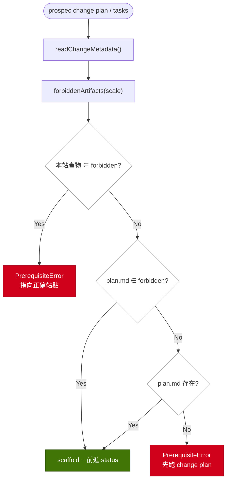

# Implementation Plan: mechanize-light-scale-gates

## Overview

`quick` 與 `backfill` 的工件契約散落在 `_status-lifecycle.md`、Feature Spec 與六個 skill 的散文裡，plan/tasks 兩個 CLI 站點各自用「有沒有 plan.md」這個代理條件做判斷，因此同時犯了 false-block（quick 被擋）與 false-pass（backfill 拿得到禁用工件）兩種錯 —— 正是 PB-002 從 `add-scale-adapter` 學到、卻只落在 skill 層的那條教訓。

策略是把契約從散文抽成一份可機讀的登記表：`types/change.ts` 新增 `SCALE_FORBIDDEN_ARTIFACTS`（四個 scale → 該 scale 契約禁止的工件），兩個 station service 一律問登記表而非猜 plan.md，`_status-lifecycle.md`（含 init 模板）以同一張矩陣作為人類可讀副本，契約測試釘住「文件矩陣 ≡ 登記表」的雙向集合相等。順帶補上 `validatePromoteScaffold` 從未檢查的 delta-spec.md。登記表是唯一來源（PB-006），拒絕訊息才由各站自行組裝。

## Technical Summary

> Auto-synthesized from AI Knowledge for this change's context

### Affected Module Overview

| Module | Core Responsibility | Key API | Dependencies |
|--------|--------------------|---------|--------------|
| types | Zod schemas、frozen registries | `CHANGE_SCALES`、`isStatusBefore` | zod only（leaf） |
| lib | 無狀態工具與 station engines | `validatePromoteScaffold`、`readChangeMetadata` | types |
| services | 一個 command 一個 `execute()` | `change-plan`/`change-tasks`/`validate.service` | types, lib |
| tests | 四層 Vitest 金字塔 | `pnpm test` | 全部 source |

### Existing Patterns (from _conventions.md)

- Service pattern：`execute(options) → Promise<Result>`；錯誤一律 `ProspecError` 子類帶 `code` + `suggestion`
- Refuse before writing（services Pitfalls）：檔案在拒絕路徑上必須位元不變
- metadata I/O 只走 `lib/change-metadata`，狀態前進只用 `isStatusBefore`
- 常數 UPPER_SNAKE_CASE、frozen registry 只可累加不可重排（types Pitfalls）

### Architecture Constraints (from Constitution)

- 依賴方向 `cli → services → lib → types`，登記表放在 leaf 才不製造反向匯入
- TDD：每條新語意先寫會在舊實作下轉紅的測試（PB-001 mutation-verify）
- `change plan`／`change tasks` 是 README 記載的表面 → 同一變更內同步 README（[SHOULD]）

## Affected Modules

| Module | Impact | Changes |
|--------|--------|---------|
| types | High | `SCALE_FORBIDDEN_ARTIFACTS` 登記表 + `forbiddenArtifacts(scale)` helper |
| lib | Medium | `validatePromoteScaffold` 新增必填 `hasDeltaSpec` 與缺檔 FAIL |
| services | High | plan/tasks 兩站改問登記表；`validate.service` 傳入 delta-spec 存在性 |
| tests | High | 兩站行為矩陣、validator 雙向、文件↔登記表契約、quick 端到端 integration |

## Call Chain

```
prospec change plan [--change N]
  → cli/commands/change-plan.ts registerChangePlanCommand()          [parse only]
  → services/change-plan.service.execute({change, force})            [orchestration]
  → services/change-resolver.resolveChange(cwd, name)
  → lib/change-metadata.readChangeMetadata(path, name) → {doc, metadata}
  → types/change.forbiddenArtifacts(metadata.scale) → readonly string[]
  → ┤ 'plan.md' ∈ forbidden → throw PrerequisiteError（不觸碰檔案）
    └ 否則 → lib/template.renderTemplate + lib/fs-utils.atomicWrite ×2
             → lib/change-metadata.writeChangeMetadataDoc(status: plan)
  → cli/formatters/change-plan-output.formatChangePlanOutput()

prospec change tasks [--change N]
  → cli/commands/change-tasks.ts → services/change-tasks.service.execute()
  → resolveChange → readChangeMetadata → forbiddenArtifacts(scale)
  → ┤ 'tasks.md' ∈ forbidden → throw PrerequisiteError（backfill）
    ├ 'plan.md' ∈ forbidden → 略過 plan.md 前置檢查（quick）
    └ 否則 → 既有 plan.md 前置檢查
  → tasks.md clobber 保護 → renderTemplate + atomicWrite
    → writeChangeMetadataDoc(status: tasks，forward-only)

prospec validate promote-scaffold --change N
  → cli/commands/validate.ts → services/validate.service.execute()
  → fs.existsSync(delta-spec.md) → lib/artifact-validators.validatePromoteScaffold({…hasDeltaSpec})
  → cli/formatters/validate-output
```

## User Story Flow

> US-1 + US-2：兩站共用同一個 scale 決策流（三個分支點、兩個終端狀態）



## Implementation Steps

1. **types 登記表（RED first）**
   - `tests/unit/types/change.test.ts`：四個 scale 的禁用集合、未標 scale 讀作 standard
   - `SCALE_FORBIDDEN_ARTIFACTS` 以 `satisfies Record<ChangeScale, readonly string[]>` 強制四值齊備 + `forbiddenArtifacts()`

2. **lib validator 補 delta-spec**
   - `artifact-validators.test.ts` 先加缺檔 FAIL／有檔 PASS 兩向測試
   - `PromoteScaffoldInputs.hasDeltaSpec` 設為必填（讓 tsc 抓出每個呼叫點）

3. **change-tasks 站**
   - 先加三條測試：quick 放行、backfill 專屬拒絕、非輕量仍拒絕
   - metadata 讀取提前到前置檢查之前；順序＝本站產物禁用 → plan.md 前置（可略過）→ clobber

4. **change-plan 站**
   - 先加測試：quick 指向 `change tasks`、backfill 指向 `/prospec-promote-backfill`、standard 不變
   - 同樣把 metadata 讀取提前；拒絕路徑不得寫入任何檔案

5. **validate.service 接線** — 傳入 `hasDeltaSpec: fs.existsSync(...)`，補 service 層測試

6. **文件矩陣（雙副本）** — `prospec/ai-knowledge/_status-lifecycle.md` 與 `src/templates/init/status-lifecycle.md.hbs` 新增 `## Light-scale artifact matrix` 表；README 的 `change plan`／`change tasks` 兩列補 scale 條件

7. **契約與端到端測試** — 擴充 `skill-format.test.ts` 的 scale-adapter 區塊：以 `lib/markdown-table` 解析兩份副本的矩陣，斷言與登記表雙向集合相等；`tests/integration` 補 quick `story → tasks` 全流程；逐條 mutation-verify

8. **知識同步與閘門** — 觸及的四個模組 README 據實更新、`pnpm counts`、`pnpm test`／`typecheck`／`lint`／`counts:check` 全綠

## Risk Assessment

| Risk | Impact | Mitigation |
|------|--------|------------|
| metadata 讀取提前改變錯誤優先序（無效 metadata 現在先拋） | Medium | 保持 `existsSync ? read : null` 形狀不變；補測試釘住「metadata.yaml 不存在時仍拋原本的 plan.md 前置錯誤」 |
| 契約測試解析散文而假綠（PB-001） | High | 矩陣改以表格承載並用 `findTable` 定位；每條新斷言逐一 mutation-verify（改表格格子須轉紅） |
| `hasDeltaSpec` 設必填破壞既有呼叫點 | Low | 刻意如此 —— `pnpm typecheck` 涵蓋 tests/ 會全部抓出 |
| 只修被點名的站而漏掉同族站（PB-007） | High | 依 PB-002 逐站走查 story/plan/design/tasks/implement/review/verify/archive 與 `prospec status`、`change progress`，在 review 前記錄結論 |
| `_status-lifecycle.md` 逼近 L1 預算（現 ~1996／2500 est tokens） | Low | 矩陣表控制在 ~150 tokens；若超標則壓縮既有散文而非稀釋（PB-011） |
| 既有 quick 變更已留下 plan.md，本變更不清理 | Low | proposal Edge Cases 明載為刻意排除；`validate promote-scaffold` 仍會如實 FAIL |

## PB-002 逐站走查結論（T24）

| 站點 / CLI 表面 | quick | backfill | 處置 |
|---|---|---|---|
| `change story` | 無工件前置 | 同左 | 無需變更 |
| `change plan` | **false-pass**：會產出契約禁止的 hollow plan | **false-pass**：plan.md 會讓自己的 validate 轉 FAIL | 本變更加登記表閘門 |
| `/prospec-design` | 路由不建議（已載於 lifecycle） | 不涉及 | 無需變更 |
| `change tasks` | **false-block**：無條件要 plan.md（issue #123） | 以錯誤理由被擋 | 本變更修正兩者 |
| `change progress` | tasks.md 存在，正常 | 建議把使用者導向會拒絕它的 tasks 站 | 本變更改為讀同一登記表 |
| `change status` | forward-only 允許 `story → tasks` | 允許 `story → implemented` | 無需變更（實測通過）|
| `review merge`／`check --record-review` | 無 plan／delta-spec 依賴 | 同左 | 無需變更 |
| `check` task-completion | tasks.md 存在 | 來源不可得時回 `skipped`，非假 PASS | 無需變更（已誠實）|
| `verify record` | 讀 `prospec-report.json` | 同左 | 無需變更 |
| `archive`／`finalize` | diff 導出模組＋spec-impact（skill 層） | 由 `related_modules`／feature-map 導出 | 無需變更 |
| `validate promote-scaffold` | 不適用 | **false-pass**：從未檢查 delta-spec.md，且自寫一份禁用集合 | 本變更補檢查並改讀登記表 |
| `knowledge update` | **建議死路**：缺 delta-spec 時叫使用者去跑 `change plan` | 不適用 | 本變更改讀登記表 |
| `prospec status`（router） | 路由到 `/prospec-tasks`（正確） | **路由錯**：`backfill` 卡在 `status: story` 時指向 `/prospec-plan` | quick 判斷改讀登記表；`backfill@story` 的目標站待裁決 |

> 走查更正（review 揪出，原表過於樂觀）：第一版此表寫「`prospec status` 無需變更（實測正確路由）」，但只測了 quick@story 與 backfill@implemented 兩格。`backfill` 停在 `status: story`（promote 流程被中斷即可產生）時 router 指向 `/prospec-plan` —— 該狀態在本變更**之前**就已違反契約（那時 `change plan` 會靜默產出 hollow plan.md），本變更把它變成大聲拒絕並指向 `/prospec-promote-backfill`。router 的 quick 判斷已改讀登記表（消掉第三份硬編碼），但 `backfill@story` 該路由到哪一站牽涉 `SDD_STATIONS` 是否新增 promote 站，屬架構決策，列為升級項目。

> 走查附記（PB-002 false-pass 掃描，非本變更範圍）：`REQ-TYPES-026` 仍寫 `CHANGE_SCALES` 為 `quick`/`standard`/`full` 三值，`backfill-promotion-path` 加入第四值時未同步該 REQ —— 信任區的既有事實漂移，刻意不在本變更修正（避免無關的 spec 變更），已於 review／archive 階段提報。

> Knowledge 檢查（一行）：PASS —— Brownfield 模式；types／lib／services／tests 四份 README（含 lib 的 drift-engine 子模組索引）與 `_conventions.md` 已讀，`sdd-workflow.md` 既有 REQ 已比對（REQ-CHNG-011、REQ-TEMPLATES-085/087 需 MODIFIED），PB-001/002/006/007/010/011 已納入步驟與風險。
