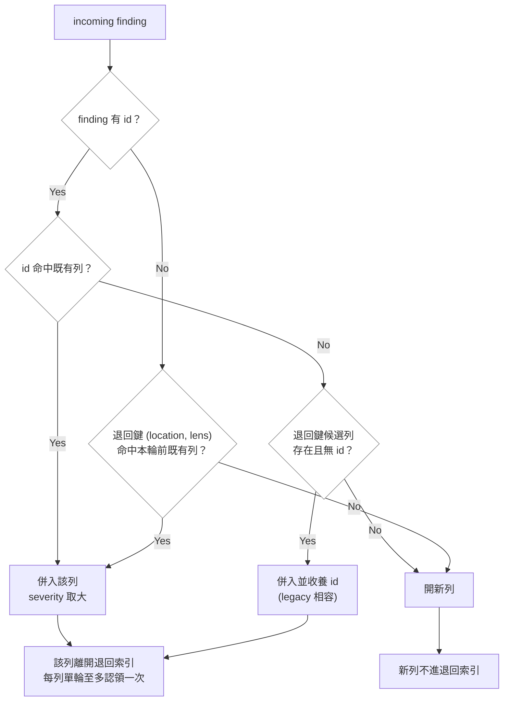

# Implementation Plan: restrict-identity-fallback

## Overview

`mergeFindings` 目前用 `??` 串接兩種身分來源：`byId` 查不到就無條件退回 `(location, lens)`。這讓「帶著全新 id 的發現」被當成既有列的更新，覆蓋原摘要並丟棄新 id —— 正是 REQ-CLI-028 禁止的「從 location 字串推斷身分」。

策略是把退回鍵從「id 查不到時的後備」改成「有明確資格條件的窄路徑」：帶 id 的 finding 只在候選列**本身沒有 id**（即 id 制度之前的手寫列）時才能經由退回鍵併入；無 id 的 finding 維持既有的 `(location, lens)` 比對。同時把退回索引限定為「本輪開始前既有的列」，並在被認領後移除該鍵，讓同一輪內共用 `(location, lens)` 的多個無 id finding 不再互相覆蓋。改動集中在單一 I/O-free 函式，service / CLI / 輸出格式皆不變。

## Technical Summary

> Auto-synthesized from AI Knowledge for this change's context

### Affected Module Overview

| Module | Core Responsibility | Key API | Dependencies |
|--------|-------------------|---------|--------------|
| lib | I/O-free station engines；`review-merge.ts` 負責身分合併、severity 取大、carry-forward | `mergeFindings` / `parseReviewRows` / `renderReviewDocument` | types |
| templates | 生成 skill 與其 references 的 Handlebars 來源 | `skills/references/review-format.hbs` | — |
| tests | 4 層測試金字塔；`tests/unit/lib/review-merge.test.ts` 為本次回歸防護 | vitest | 全層 |

### Existing Patterns (from _conventions.md)

- lib 為 stateless pure function；測試檔鏡射原始檔（`src/lib/x.ts` → `tests/unit/lib/x.test.ts`）
- Station engines「只決策、不重新推導政策」：`review-merge` 的既有不變式就是 never infers identity from a location string（lib README Pitfalls 已載明）
- 改既有 skill 的 `.hbs` 後必須 `pnpm bundle`，bundled-templates 先於 FS

### Architecture Constraints (from Constitution)

- TDD [MUST]：RED（issue #116 最小重現）→ GREEN → REFACTOR
- Language Policy [MUST]：delta-spec 的 `**Spec:**` 與 reference / feature spec 文字用英文，本地敘事用繁中
- 依賴方向 [SHOULD]：本次僅動 lib 葉層，不新增任何 import

## Affected Modules

| Module | Impact | Changes |
|--------|--------|---------|
| lib | High | `mergeFindings` 的身分解析改寫（唯一行為變更點） |
| templates | Low | `review-format.hbs` 的 Identity 段落補上「無 id 的代價」與同輪語意 |
| tests | Medium | 新增單元測試釘住三條識別路徑 + mutation 驗證 |

## Call Chain

```
prospec review merge --findings round.json [--change <name>]
  → registerReviewCommand().action(options)                    [cli：解析旗標]
  → review-merge.service.execute({change, findingsPath})       [orchestration：讀檔、Zod 驗證、寫檔]
  → parseReviewRows(existingContent)                           [lib：既有表 → ReviewRow[]]
  → mergeFindings(rows, findings)                              [lib：★ 本次唯一改動]
  → renderReviewDocument(existingContent, merged, changeName)  [lib：canonical 表 + 保留散文]
  → atomicWrite(reviewPath, …)                                 [side effect：單次原子寫入]
```

層級檢查：cli → services → lib → types 單向，改動只落在 lib 葉層，無跨層繞道、無 commit 前副作用。

## User Story Flow



## Implementation Steps

1. **RED：以 issue #116 最小重現寫失敗測試**
   - 既有 `F-8`（有 id）vs incoming `NEW-4`（同 location、同 lens）→ 期望兩列、兩個 id 都在
   - 同輪兩個無 id、同 `(location, lens)` → 期望兩列
   - 執行 `pnpm vitest run tests/unit/lib/review-merge.test.ts` 確認轉紅

2. **GREEN：改寫 `mergeFindings` 的身分解析**
   - 退回索引只由 `existing` 種入；本輪新增的列不寫回 `byFallback`
   - 帶 id：`byId` 命中優先；未命中時只在候選列無 id 時收養
   - 任何被認領的列離開退回索引；同鍵多列依表序排隊逐一取用；本輪以 id 點名的列在 location 比對前先被保留（後兩點由 review 三輪收斂補上）

3. **補齊路徑測試與既有測試回歸**
   - 補「既有列有 id + 無 id finding 仍併入」「同輪重用同一 id」「location 漂移時候選列不被消耗」
   - 確認既有 14 個測試零修改通過

4. **mutation 驗證**
   - 逐條 mutation 驗證後還原（PB-001 第 3 條）：最終施加 MA/MB/MC/MD/MG 於引擎、H0-H5 於 template
   - 於 review.md 記錄每個 mutation 名稱與它轉紅的測試，控制組須維持全綠

5. **同步文件與知識層**
   - `src/templates/skills/references/review-format.hbs` 的 Identity 條目補述新規則後 `pnpm bundle`
   - lib module README Pitfalls 的 `review-merge` 句子收斂為新不變式；`pnpm counts` 重導測試計數

6. **閘門**
   - `pnpm typecheck` + `pnpm lint` + `pnpm test` + `pnpm counts:check` 全綠，`prospec check --strict` 對照變更前無新增 FAIL（本專案無 `pnpm check` 這個 script）

## Risk Assessment

| Risk | Impact | Mitigation |
|------|--------|------------|
| 收緊條件誤傷 legacy 收養路徑（既有測試第 3 項） | High | 條件改掛在「候選列有無 id」而非「finding 有無 id」；既有測試零修改通過即為證據 |
| 同輪不再共用退回鍵導致 idempotence 破壞 | Medium | 保留「同一輪重複 merge 結果不變」測試；新列於下一輪由 `existing` 重新種入退回索引 |
| 測試寫成恆真式（改回舊實作仍綠） | High | PB-001：逐條 mutation 驗證並在 review 記錄施加的 mutation |
| `.hbs` 改了但未 `pnpm bundle`，安裝版仍舊文 | Medium | 步驟 5 明列 bundle；contract 測試比對 bundled 輸出 |

Knowledge Gate：Brownfield，已讀 lib / templates / tests README、`_conventions.md`、`_playbook.md`（PB-001/004/007/014/016）與 `sdd-workflow.md` 的 REQ-CLI-028 —— PASS。
