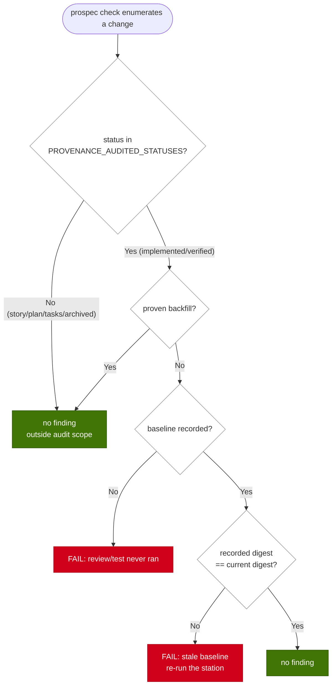

# Implementation Plan: extend-provenance-audit-scope

## Overview

兩道 provenance 閘門的狀態過濾寫死在 evaluator 裡（`c.status !== 'implemented'`），而 `/prospec-archive` 的 Entry Gate 只機器消費 `metadata-completeness`，於是 `verified → archived` 這段窗口無人稽核：拿到 grade S/A 之後改的程式碼可以完全不經 review 就把 REQ 畢業進信任區。

策略是把「受稽核狀態」從兩處字面常數升格為 `types/change.ts` 的單一登記表，並在信任區文件明列它——完全比照 `SCALE_FORBIDDEN_ARTIFACTS` 的既有落點與釘法（registry 在 `types`、表格在 `_status-lifecycle.md` 兩份副本、契約測試雙向集合相等）。`archived` 刻意不入表：bundle 已離開 `.prospec/changes/`，collector 列舉不到，這是不可稽核而非漏列，理由必須寫進 REQ。Entry Gate 則新增一條機器檢查條目，讓終端寫入點自己主張 review 對應最終程式碼。

## Technical Summary

> Auto-synthesized from AI Knowledge for this change's context

### Affected Module Overview

| Module | Core Responsibility | Key API | Dependencies |
|--------|---------------------|---------|--------------|
| types | 凍結登記表與 schema 的葉層 | `CHANGE_STATUSES`, `SCALE_FORBIDDEN_ARTIFACTS`, `DRIFT_CHECK_IDS` | zod only |
| lib | zero-LLM drift 引擎（collectors + pure evaluators） | `evaluateReviewProvenance`, `evaluateTestProvenance`, `computeChangeDigest` | types |
| templates | 產生所有 skill／init 文件的 `.hbs` 來源 | `prospec-archive.hbs`, `init/status-lifecycle.md.hbs` | — |
| tests | 4 層 vitest 套件（unit / contract / integration / e2e） | — | 全部 |

### Existing Patterns (from _conventions.md)

- **Registry + `satisfies` 守衛**：`SCALE_FORBIDDEN_ARTIFACTS` 用 `as const satisfies Record<ChangeScale, …>` 讓漏列成為編譯錯誤；本變更沿用 `satisfies readonly ChangeStatus[]`
- **executable copy 雙向釘法**：文件表格與程式碼登記表以契約測試集合相等比對（`skill-format.test.ts` 的 lifecycle 區塊已同時讀兩份副本）
- **collector／evaluator 分離**：I/O 全在 `drift-sources.ts`，判斷全在 `drift-checker.ts` 的純函式；本變更只動後者的過濾條件
- **frozen 註解即契約**：`DRIFT_CHECK_IDS` 的 per-id 註解被當成 registry 的真相來源，行為改了註解必須同步（types README Pitfalls 明載已兩次因此重開缺口）

### Architecture Constraints (from Constitution)

- 依賴方向 `cli → services → lib → types`：登記表落在葉層 `types`，`lib` 單向匯入
- TDD：測試先於實作，且新斷言須 mutation 驗證
- Language Policy：變更工件繁中，信任區（Feature Spec、`_status-lifecycle.md`、`_playbook.md`）與 `.hbs` 全英文

## Affected Modules

| Module | Impact | Changes |
|--------|--------|---------|
| types | High | 新增 `PROVENANCE_AUDITED_STATUSES` + `isProvenanceAudited()`；同步 `drift-report.ts` 兩處 per-id 註解 |
| lib | High | 兩個 evaluator 改讀登記表；doc comment 改述稽核範圍與 `archived` 免疫理由 |
| templates | Medium | `prospec-archive.hbs` Entry Gate 新條目；`init/status-lifecycle.md.hbs` 新增 Provenance audit scope 表 |
| tests | Medium | evaluator 雙向測試、契約集合相等測試、archive Entry Gate 格式契約 |

## Call Chain

```
prospec check
  → check.service.execute()
  → computeChangeDigest(cwd)                        [lib/drift-sources — 全樹指紋]
  → collectReviewProvenance(cwd, digest)            [lib/drift-sources — I/O]
  → collectTestProvenance(cwd, digest, cmd)         [lib/drift-sources — I/O]
  → runChecks({ reviewProvenance, testProvenance })  [lib/drift-checker]
      → evaluateReviewProvenance(src)               [pure]
          → isProvenanceAudited(c.status)           [types/change ← 新增]
      → evaluateTestProvenance(src)                 [pure]
          → isProvenanceAudited(c.status)           [types/change ← 新增]
```

`isProvenanceAudited` 是純述詞、無 I/O，落在葉層供兩個 evaluator 共用——單一來源，不是各自複製一份集合。

## User Story Flow Diagram

### US-1: provenance 稽核範圍涵蓋 verified



## Implementation Steps

1. **types：登記表與述詞（RED 先行）**
   - `tests/unit/types/change.test.ts` 加：登記表成員為 `CHANGE_STATUSES` 子集、不含 `archived`、`isProvenanceAudited` 對 `null`／未知字串／原型鍵（`constructor`）皆為 false
   - `src/types/change.ts` 緊鄰 `forbiddenArtifacts()` 加 `PROVENANCE_AUDITED_STATUSES` + `isProvenanceAudited()`；以 `Set` 而非物件查表（避免原型鍵誤判為 true）
2. **lib：兩個 evaluator 改讀登記表**
   - `tests/unit/lib/drift-checker.test.ts` 加雙向案例：`verified` × (recorded ≠ current) → FAIL、`verified` × (recorded == current) → 無 finding、`tasks` → 無 finding、`verified` + proven backfill → 豁免；test-provenance 另加 `verified` + recorded 非零 exit → 仍 FAIL（判序未動）
   - `src/lib/drift-checker.ts:353`／`:502` 換成 `if (!isProvenanceAudited(c.status)) continue;`，並改寫兩處 doc comment：明列受稽核狀態、`archived` 因 collector 列舉不到而免疫、verify 後的 feature commit 必須重刷 baseline
3. **types：同步 frozen 註解**
   - `src/types/drift-report.ts` 兩處 `Non-implemented changes are exempt` 改述為登記表範圍（該註解被當作 registry 的真相來源）
4. **templates：Entry Gate 與 lifecycle 表**
   - `src/templates/skills/prospec-archive.hbs` Entry Gate 新增機器檢查條目（比照 metadata-completeness 條目的語氣與 CLI-required 註記）
   - `src/templates/init/status-lifecycle.md.hbs` 與 `prospec/ai-knowledge/_status-lifecycle.md` 兩份副本同步新增 `## Provenance audit scope` 表（逐 status 標 Yes/No + 理由）
   - `pnpm bundle` 後 `npx tsx src/cli/index.ts agent sync`（bundled-templates 先於 FS；`pnpm exec prospec` 會誤用已安裝的舊執行檔）
5. **tests：契約釘法**
   - `tests/contract/skill-format.test.ts` lifecycle 區塊加雙向集合相等：兩份副本表格中標 Yes 的 status 集合 == `PROVENANCE_AUDITED_STATUSES`
   - 同檔加 archive Entry Gate 斷言（section-scoped，非全文 `toContain`）：Entry Gate 段落同時提及兩個 check id 且帶「FAIL → 不 archive」語意
6. **知識與教訓同步**
   - `_playbook.md` PB-016 guidance 補「該順序現已由閘門強制」；`modules/lib/drift-engine.md`、`modules/types/README.md`、`modules/tests/README.md` 據實更新
   - `pnpm counts` 重導計數；`pnpm typecheck` + `pnpm test` 全綠
7. **mutation 驗證**
   - `pnpm mutate src/types/change.ts`（`pnpm mutate -- <path>` 在 pnpm 11 永遠失敗，不要加 `--`）；並手動把登記表改回僅含 `implemented`，確認步驟 2 的紅向案例轉紅後還原

## Risk Assessment

| Risk | Impact | Mitigation |
|------|--------|------------|
| 本變更自己 verify 後 commit 會立刻讓兩份 baseline 轉 stale，`prospec check` 轉紅 | Medium | 那是誠實紅燈；照 PB-016 順序在 commit 後重刷 `--record-review` + `--record-tests`，並把這層關係寫進 PB-016 與 REQ |
| 契約測試解析 lifecycle 表格易脆 | Medium | 重用 `skill-format.test.ts` 既有的 light-scale matrix 解析法，section-scoped 且雙向集合相等（PB-001） |
| 改了 `.hbs` 卻沒重打 bundle，部署的 skill 仍是舊文 | Medium | 步驟 4 明列 `pnpm bundle` → `agent sync`；`bundled-templates-sync.test.ts` 會攔 |
| 稽核範圍放寬後，並行變更的 over-block 面積變大 | Low | 方向仍是 fail-closed（over-review 而非 fail-open），single in-flight 前提未動，於 REQ 明載 |
| 新斷言是假綠（bare `toContain` 命中別段） | Medium | 新斷言逐條 mutation 驗證，斷言限定在 Entry Gate／表格區段內 |
| **已實現的成本**：兩個知識檔超出預算，是本變更自己造成的 knowledge-size WARN | Low | 以 knowledge-size 自己的估算器（`Math.ceil(charLength/4)`，**字元非位元組**）實測：`_status-lifecycle.md` 基線 2420／餘裕 80 → 現 2805（超 305，增量 +385，其中 audit-scope 表 250、其餘 135 來自 review 輪次補上的 re-entry 與邊界散文）；`modules/tests/README.md` 基線 1798／餘裕 **2** → 現 1898（超 98）。兩檔的餘裕都遠小於必須加入的內容，壓縮後仍無法容納。已把新增壓到最緊；殘留 WARN **誠實揭露**，不造假、不刪真知識湊數（PB-011 的 never dilute）、也不為遮蓋自身成長而調高預算——knowledge-size 本就是刻意的 WARN-only 壓力訊號，這兩筆正是它要發出的訊號。結構解（lifecycle 閘門表抽成 on-demand 姊妹檔、tests 契約釘法清冊抽成 sub-module，`lib/drift-engine.md` 有先例）屬另案，不在 review 輪次中臨時動刀 |
| 重驗得 B/C/D 時 `status` 與 `metadata-completeness` 皆不反映新評級，archive 僅靠散文擋住 | Medium | 缺口為既有（`hasVerifyGrade` 是 `.some()`；本變更前 `verified` 根本不受稽核，三個訊號全綠），本變更只收窄它。四處文件明載該邊界；機械解（改讀最新一筆 `prospec-verify` 條目）影響所有已封存 metadata，屬另案 |
