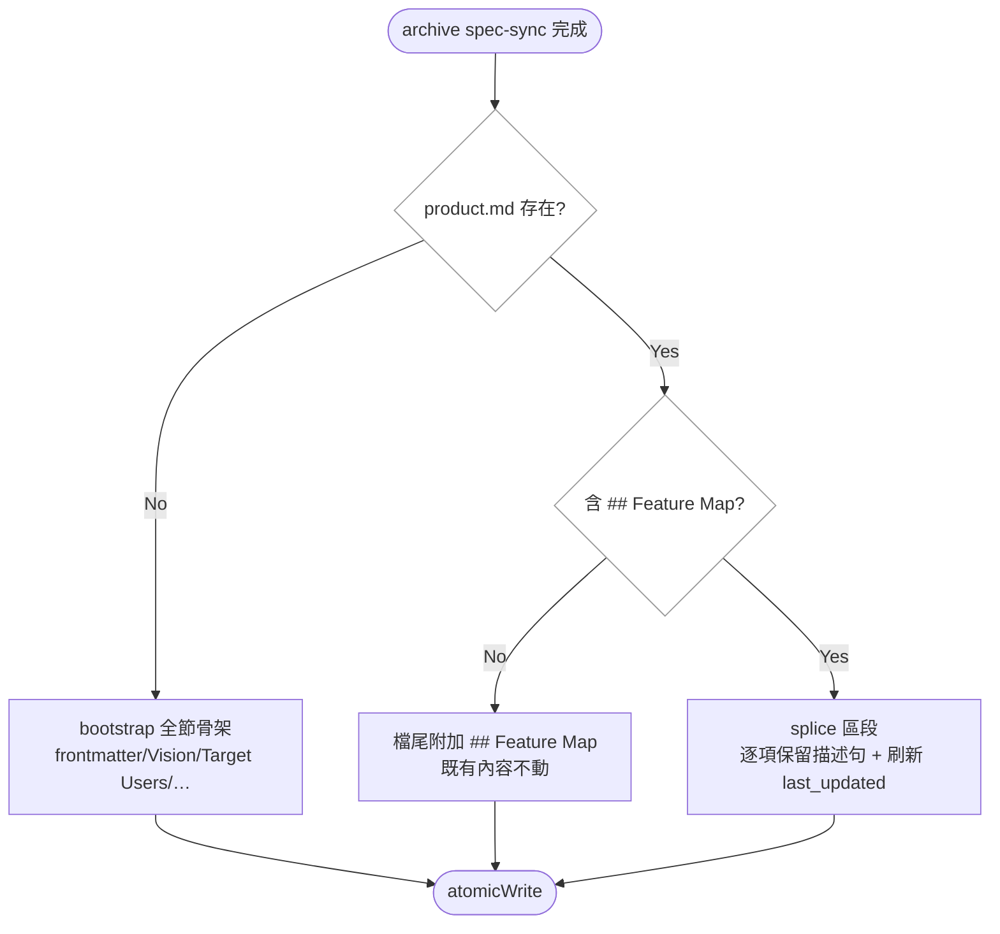

# Implementation Plan: stop-clobbering-product-spec

## Overview

`generateProductSpec` 是 archive 寫入策略裡唯一的整檔重生者：它從零組字串後 `atomicWrite` 覆蓋整個 `specs/product.md`，不讀磁碟上任何一行既有內容，因此把手工維護的 frontmatter 欄位、Vision、Target Users 與自訂章節無聲刪掉；而它產出的 1 節結構，又永遠無法滿足 archive skill 隨身出貨的 `product-spec-format` 所規定的 7 節。

實作策略是把它從「重生」改成與 co-located 姊妹一致的「有邊界的寫入」：既有檔案走 **splice**（只重寫 `## Feature Map` 到下一個 h2 之間的內容，並更新 frontmatter 的 `last_updated`），缺檔走 **bootstrap**（產出符合格式規範全部節的骨架）。兩者共用同一份 feature 掃描結果，而該掃描改用與 `syncFeatureMap` 相同的 `.sort()` + `isArchivedSpec` + `isSafeResourceName` 規則。關鍵設計決策有三：(1) 區段邊界一律在 `withoutFencedBlocks` 遮蔽後的行上判定，避免被 fenced code block 裡的 `## ` 誤導；(2) Feature Map 逐項以 slug（退回標題）比對，保留人工描述句，只換標題與連結；(3) frontmatter 所有權明文化 —— bootstrap 骨架含 `version: TBD` 佔位，之後 prospec 只再刷新 `last_updated`，`version`／`feature_count`／任何自訂鍵逐 byte 不再改寫。

## Technical Summary

> Auto-synthesized from AI Knowledge for this change's context

### Affected Module Overview

| Module | Core Responsibility | Key API | Dependencies |
|--------|-------------------|---------|--------------|
| services | archive + spec-sync 業務邏輯 | `generateProductSpec`、`execute()` 的 `planned` 規劃區塊 | lib, types |
| templates | 出貨用 `.hbs` 資源 | `skills/references/product-spec-format.hbs`、`skills/prospec-archive.hbs` | — |
| tests | 4 層測試套件 | `archive.service.test.ts`、`skill-format.test.ts` | 全層 |

### Existing Patterns (from _conventions.md)

- 有邊界的寫入：`syncFeatureMap` bootstrap-once + no-clobber、feature spec surgical merge（`mergeRequirementInPlace` NEVER blanks an authored body）—— 本變更讓 product.md 回到同一族
- 寫檔一律 `atomicWrite()`，含使用者區段者不得整檔重寫
- markdown 掃描的 fence 規則單一來源在 `lib/markdown-fences`（`withoutFencedBlocks`），不得自刻

### Architecture Constraints (from Constitution)

- 依賴方向 `cli → services → lib → types`：splice helper 留在 `archive.service.ts`，與 `mergeRequirementInPlace` 等姊妹 helper co-located，只向下用 lib（review 後新增的 `hasUnclosedFence` 落在 lib —— fence 規則的單一來源就在那裡，方向仍是 services → lib）
- TDD：每個 FR 先寫紅燈測試
- 出貨 `.hbs` 改動需 `pnpm bundle` + 由 source 跑 `agent sync`，否則部署的是舊模板

## Affected Modules

| Module | Impact | Changes |
|--------|--------|---------|
| services | High | `generateProductSpec` 改 splice/bootstrap；新增區段與條目解析 helper；dry-run detail 分流 |
| lib | Low | `markdown-fences` 新增 `hasUnclosedFence`（與 `withoutFencedBlocks` 共用單一 scanner），供 mask 不可信時降級 |
| templates | Medium | `product-spec-format.hbs` 補 frontmatter 所有權與生成器契約；`prospec-archive.hbs` Phase 3.6 措辭改為可誠實勾選 |
| tests | Medium | 新增格式規範↔bootstrap 契約測試；補 splice／保留／過濾／dry-run 單元測試 |

## Call Chain

```
prospec archive <name>
  → cli/commands/archive.ts                                    [parse only]
  → services/archive.service.execute(options)                  [orchestration]
  → syncToFeatureSpecs(...)                                    [既有，不動]
  → generateProductSpec(featuresPath, productSpecPath, name)   [本變更]
      → scanActiveFeatures(featuresPath)                       [sort + isArchivedSpec + isSafeResourceName]
      → fs.existsSync(productSpecPath) ? spliceProductSpec(existing, features, today)
                                        : bootstrapProductSpec(features, name, today)
      → spliceProductSpec → withoutFencedBlocks → 區段邊界 → parseFeatureMapEntries → renderFeatureMap
      → atomicWrite(productSpecPath, content)                  [唯一寫入點]
  → syncFeatureMap(...)                                        [既有，不動]
```

## User Story Flow Diagram



## Implementation Steps

1. **抽出 feature 掃描並對齊 `syncFeatureMap`**
   - `scanActiveFeatures()`：`.sort()` + `isArchivedSpec` + `isSafeResourceName` + frontmatter `status === 'active'`
   - 回傳 `{ slug, title }[]`，供 splice 與 bootstrap 共用

2. **實作 Feature Map 區段引擎**
   - `findSectionRange(lines, '## Feature Map')`：在 `withoutFencedBlocks` 遮蔽後的行上找 h2 起點與下一個 h2 終點
   - `parseFeatureMapEntries(regionText)`：以 `### ` 切塊，抓 `→ [features/{slug}.md]` 取 slug，其餘非連結行即人工描述句
   - `renderFeatureMap(features, existingBySlug)`：既有項目保留描述句、更新標題與連結；新項目寫 TBD 佔位；已消失的 feature 移除

3. **splice 路徑**
   - 既有檔案：替換區段；無 `## Feature Map` 節時檔尾附加
   - 只在 frontmatter 區塊（首個 `---`…`---`）內刷新 `last_updated`，其餘 byte 不動

4. **bootstrap 路徑**
   - 產出 `product` / `version: TBD` / `last_updated` frontmatter、`# {name} — TBD`、Vision、Target Users、Feature Map、Core User Stories Summary、Product Principles、Roadmap Overview 全節骨架

5. **dry-run detail 分流**
   - `execute()` 依 `fs.existsSync(productSpecPath)` 產生兩種 detail，splice 那條說出「只替換 Feature Map 區段、其餘保留」

6. **模板與契約測試**
   - `product-spec-format.hbs`：補 §1 frontmatter 所有權（bootstrap 種下 `version: TBD`，之後只再寫 `last_updated`；`version`、`feature_count` 等由人維護、逐 byte 不再改寫）與生成器契約段
   - `prospec-archive.hbs` Phase 3.6：檢查項改為「Feature Map 已更新且既有內容未被覆蓋」
   - `skill-format.test.ts`：從 `product-spec-format.hbs` fenced block 解析要求的 h2 集合，與 bootstrap 產出的 h2 集合斷言相等
   - `pnpm bundle` → `npx tsx src/cli/index.ts agent sync` → `pnpm counts`

7. **Dogfood 修復**
   - 補回本 repo `prospec/specs/product.md` 的 `version`、`## Vision`、`## Target Users`、每項 Feature Map 描述句
   - 實跑 archive dry-run 與實跑，確認三者仍在

## Risk Assessment

| Risk | Impact | Mitigation |
|------|--------|------------|
| 區段邊界判定錯誤導致誤刪使用者內容（比原缺陷更糟） | High | 邊界一律走 `withoutFencedBlocks`；以「除 Feature Map 區段與 last_updated 外 diff 為空」的測試釘死；連跑兩次冪等 |
| 描述句解析把連結行或空行誤判為描述 | Medium | 條目解析以 `→ [features/` 為連結錨點，描述取非連結非空行；不可解析的條目整塊原樣保留 |
| 出貨 `.hbs` 改了但部署的是舊模板 | Medium | 依 templates 模組 pitfall 走 `pnpm bundle` + 由 source 跑 `agent sync`，不用 `pnpm exec prospec` |
| 格式規範↔bootstrap 契約測試只比對字串子集而非集合 | Medium | 斷言兩個 h2 **集合相等**（雙向），刪節即紅燈；以 mutation 手動驗紅 |
