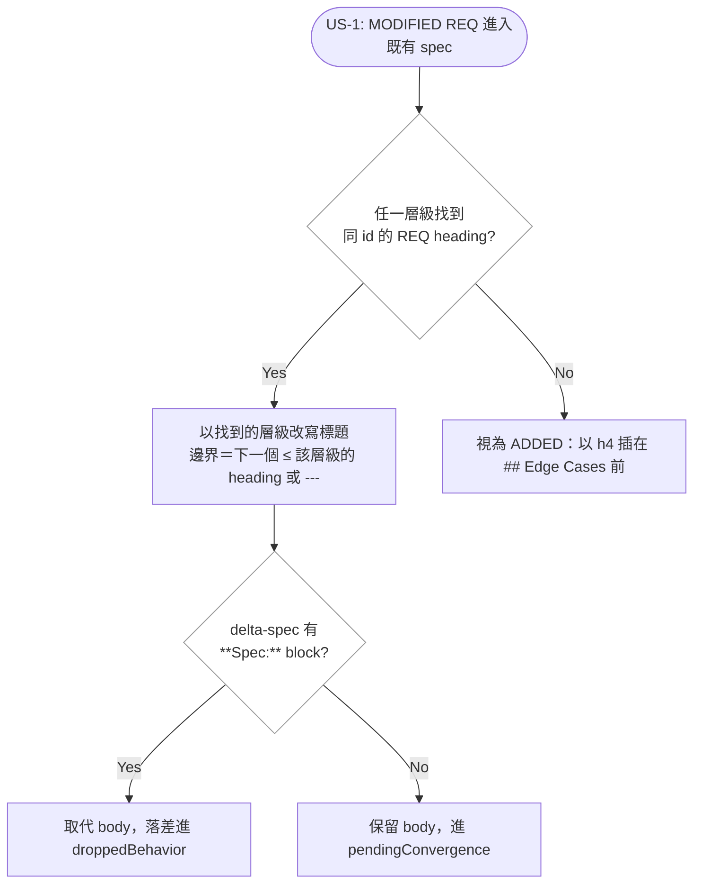

# Implementation Plan: unify-req-heading-matcher

## Overview

archive 的三個寫入點各自用硬編碼的 h4 判準辨識 feature spec 的 REQ heading（`/^####\s+REQ-/`、`content.includes('#### ' + reqId + ':')`），而 drift 引擎的兩個唯讀 collector 用的是層級無關的 `ACTIVE_REQ_HEADING`。窄判準握著唯一的筆，於是偏離 h4 的 spec 會被寫壞：計數歸零、MODIFIED 重複插入、REMOVED 的 stale 探針失效。

策略是把 REQ heading 的辨識抽成 lib 葉節點的單一來源（PB-006），三個寫入點與兩個唯讀點同時改吃它；在 recount 加一道「計數歸零」的寫前拒絕（refuse before writing，與 `verify record`／`change status` 同一慣例）；再新增一道 WARN 級 `spec-counters` check，讓 frontmatter 計數第一次有機器對帳。REQ 的辨識與「哪些 REQ 該計數」是兩件事：層級語意進共用 matcher，Deprecated 區段語意留在 recount。

## Technical Summary

> Auto-synthesized from AI Knowledge for this change's context

### Affected Module Overview

| Module | Core Responsibility | Key API | Dependencies |
|--------|-------------------|---------|--------------|
| types | 凍結登記表與 schema | `DRIFT_CHECK_IDS`（14 → 15） | zod |
| lib | 無狀態工具＋drift 引擎 | 新 `spec-headings.ts`；`collectSpecCounters`／`evaluateSpecCounters`；`ACTIVE_REQ_HEADING` 遷出 `drift-sources` | types |
| services | 每指令一個 `execute()` | `syncToFeatureSpecs`／`recountFeatureSpecCounters`／`executeFinalize`；`check.service` 注入新 collector | types, lib |
| cli | 薄 I/O 層 | `archive-output` 印出被拒絕的 reconciliation | services |
| tests | 4 層金字塔 | 三條迴歸＋matcher 單元＋新 check 三態＋skipped-never-PASS 15 checks | 全部 |

### Existing Patterns (from _conventions.md)

- 依賴方向 `cli → services → lib → types`；`types` 零內部依賴，新 matcher 住 lib 葉節點且不反向 import
- 寫檔一律 `atomicWrite()`；archive 的非致命失敗用 try/catch 不阻斷主流程
- 新 drift check 的既有配方：collector（全部 I/O，來源不可用回 `{available:false, reason}`）＋純 evaluator＋`runChecks` dispatch（exhaustiveness 由型別強制）

### Architecture Constraints (from Constitution)

- TDD：三條迴歸測試先行（RED → GREEN），並以 mutation 驗證非假紅
- Factual Count Integrity：新增 check id 要同步 root README 的 check 列舉（PB-009）與手工維護計數；本變更同時為第三層計數建立第一道機器守門
- 拒絕發生在寫入之前，檔案保持 byte-identical（`verify record`／`change status` 的既有語意）

## Affected Modules

| Module | Impact | Changes |
|--------|--------|---------|
| lib | High | 新 `spec-headings.ts`（單一來源）；`drift-sources` 兩處改吃它、`ACTIVE_REQ_HEADING` 遷出；新 collector＋evaluator |
| services | High | 三個寫入點改吃共用 matcher；recount 加歸零拒絕；`check.service` 注入新 collector |
| types | Medium | `DRIFT_CHECK_IDS` 附加 `spec-counters`（第 15 個，WARN 級） |
| cli | Low | finalize 輸出多一段「被拒絕的 reconciliation」 |
| tests | High | 三條迴歸、matcher 單元、新 check 三態、skipped-never-PASS 15 |

## Call Chain

```
prospec archive <name>
  → cli/commands/archive.ts registerArchiveCommand
  → services/archive.service.execute(options)                  [orchestration]
  → syncToFeatureSpecs(archiveDir, featuresPath, changeName)
  → mergeRequirementInPlace(content, route)                    [in-place merge]
  → lib/spec-headings.matchReqHeading(line) → {id, level}      [single source]
  → lib/fs-utils.atomicWrite(specFile, content)                [write point]

prospec archive finalize <name>
  → cli/commands/archive.ts (finalize subcommand)
  → services/archive.service.executeFinalize({name, dryRun})   [orchestration]
  → recountFeatureSpecCounters(content) → {…, refusal?}        [pure; refuse before write]
  → lib/spec-headings.matchReqHeading(line)
  → atomicWrite(spec) — 被拒絕的檔案跳過

prospec check
  → cli/commands/check.ts → services/check.service.execute()
  → lib/drift-sources.collectSpecCounters(featuresDir)         [all I/O]
  → lib/drift-checker.evaluateSpecCounters(source)             [pure]
  → runChecks(inputs) → DriftReport.checks[]                   [15 ids]
```

## User Story Flow



## Implementation Steps

1. **抽出 `src/lib/spec-headings.ts`（RED 先行）**
   - `matchReqHeading(line, {includeStruck?}) → {id, level} | null`，以現行 `ACTIVE_REQ_HEADING` 的 pattern 為來源
   - `ACTIVE_REQ_HEADING` 遷出 `drift-sources.ts`（不留 re-export shim —— PB-008），`collectReqDefinitions` 的區域 `headingReq` 改用 `includeStruck: true`
   - 掃過每個引用點（src／tests／knowledge 文字）；單元測試涵蓋 h1~h6、`{#anchor}`、`~~struck~~`、非法 prefix

2. **`recountFeatureSpecCounters` 改吃共用 matcher**
   - REQ 判準換成 `matchReqHeading`，Deprecated 區段感知留在原處
   - h3 fixture 的 `req_count` 從「歸零」變成正確值（迴歸 1）

3. **`mergeRequirementInPlace` 與 REMOVED 探針改吃共用 matcher**
   - 以 id 比對取代字串前綴比對；就地取代時保留找到的標題層級
   - skip 邊界從 `/^#{2,4}\s/` 一般化為「下一個 ≤ 找到層級的 heading，或 `---`」（h4 情境下等價）
   - REMOVED 的 stale 探針同步改吃它（迴歸 2、3）

4. **recount 加「計數歸零」拒絕**
   - 任一計數會從 `>0` 變 `0` → 不改寫該檔並回傳拒絕理由；`executeFinalize` 收集成拒絕清單，dry-run 與實跑一致
   - `cli/formatters/archive-output.ts` 印出被拒絕的檔案與理由

5. **新增 `spec-counters` WARN check**
   - `types/drift-report.ts` 附加第 15 個 id（含 per-id 註解 —— 註解是登記表的 source of truth）
   - `collectSpecCounters`（缺目錄／無 spec → skip 並說明理由）＋純 `evaluateSpecCounters`（宣稱 ≠ 實際 → warn，findings codepoint 排序）＋`check.service` 經正規 resolver 注入

6. **同步計數與文件（同一 feature commit）**
   - root `README.md` ＋ `README.zh-TW.md` 的 check 列舉與數字（PB-009 ＋雙語對等）
   - `pnpm counts` 重導測試數；lib 模組 README 的檔案數與 Key Files；services README 的 `recountFeatureSpecCounters` 括號描述；drift-engine 子模組的 check 數
   - 修正既有 spec 漂移：`REQ-TYPES-052` 仍寫 13 個凍結 id（`artifact-language` 的第 14 個從未回填）→ 本變更寫 15

7. **驗證**
   - `pnpm typecheck && pnpm test && pnpm counts:check`；`prospec check` 應為 15 checks 全綠
   - mutation：把共用 matcher 改回 `^####` 必須讓步驟 2/3 的迴歸轉紅（確認非假紅）

## Risk Assessment

| Risk | Impact | Mitigation |
|------|--------|------------|
| 遷移 `ACTIVE_REQ_HEADING` 漏掉引用點（PB-008） | Medium | `rg` 掃 `src/`／`tests/`／`prospec/` 全部字面；不留 shim，讓漏掉的點直接編譯失敗（`pnpm typecheck` 已涵蓋 tests） |
| skip 邊界一般化改壞既有 h4 行為 | High | h4 情境下新規則與 `#{2,4}` 等價；REQ-TESTS-060 的邊界 fixture（最後一個 h4 接 h2／接 `---`／EOF）全部保留並補 h3 對照 |
| 保留原標題層級與格式規範（h4）衝突 | Low | 決策寫進 delta-spec：就地取代不擅自改寫使用者結構；ADDED 仍以 h4 插入，混層由寬容 matcher 正確計數 |
| 新 check 讓下游升級即轉紅 | Medium | 定為 WARN 級（與 `knowledge-size`／`artifact-language` 一致）；來源不可用一律 skip 而非假紅 |
| 歸零拒絕遮蔽「真的歸零」的合法情形 | Low | 只在 frontmatter `>0` 且 body 為 `0` 時拒絕；兩者皆 0（或缺欄位）維持原行為，並有測試釘住 |
| 新 check id 是凍結契約的附加 | Medium | 只 append 不重排；`Record<DriftCheckId, CheckOutcome>` 的 exhaustiveness 讓漏 dispatch 變編譯錯 |

**Knowledge check**: PASS —— Brownfield（6 模組）；已讀 lib／services／types README ＋ lib 的 drift-engine 子模組 ＋ `_conventions.md` ＋ `_diagram-conventions.md`；已比對 `sdd-workflow.md`（REQ-CLI-024／REQ-SERVICES-072／073／REQ-TESTS-060）與 `drift-detection.md`（REQ-TYPES-052／REQ-TESTS-045）的既有需求。

**Layering check**: PASS —— 新 matcher 住 lib 葉節點且零內部依賴（`spec-headings` 不 import 任何 lib 檔，避免 lib→lib cycle）；`drift-sources` 與 `archive.service` 皆單向 import 它；cli 只多印一段既有 Result 欄位，無新業務邏輯。
