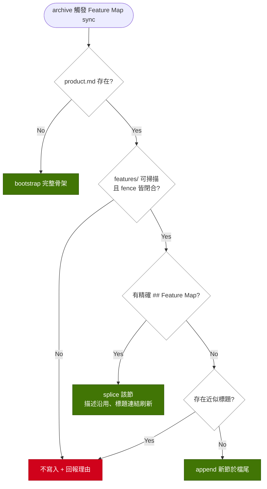

# Implementation Plan: refuse-near-miss-feature-map

## Overview

`generateProductSpec` 現在有三個「決定不寫 product.md」的分支（unclosed fence、`specs/features/` 缺席、以及本次要新增的近似 Feature Map 標題），但實跑時三者皆無輸出，dry-run 也只預告其中一個。本變更把「為何不寫」收斂成單一判定函式，讓實跑與 dry-run 共用同一個答案，並把該答案沿 services → cli 送到 stderr。

關鍵設計決策有二。其一，近似標題採**拒絕**而非寬鬆接管：接管會把作者手寫的策展內容整節抹掉，比現況的重複更難復原；拒絕則保持檔案 byte-identical，補救成本只是改一個標題。其二，判定邏輯放在一個 exported 純函式 `inspectProductSpecSync(content)`，實跑（`generateProductSpec` 內部）與 dry-run（`execute` 的預告分支）各呼叫一次 —— 兩份手抄的守衛正是 PB-006 警告的漂移來源。回傳形狀沿用同檔 `recountFeatureSpecCounters` 的既有慣例：拒絕時原內容原封返回，附上 reason。

## Technical Summary

> Auto-synthesized from AI Knowledge for this change's context

### Affected Module Overview

| Module | Core Responsibility | Key API | Dependencies |
|--------|-------------------|---------|--------------|
| services | archive + spec 層寫入 | `generateProductSpec` / `execute` | lib, types |
| cli | 薄 I/O：解析 → 呼叫服務 → 格式化 | `formatArchiveOutput` | services, types, lib |
| templates | 純資源 `.hbs` | `product-spec-format` / `prospec-archive` | — |
| tests | 四層測試套件 | `pnpm test` | 全部 |

### Existing Patterns

- **Refuse before writing, never after**（services Pitfalls）：檔案維持 byte-identical，拒絕理由隨結果回傳 —— `recountFeatureSpecCounters` 的 `refusal?` 欄位即此形狀
- **Warning-class stderr worklist**（cli Key Files）：`refusedReconciliations` / `pendingConvergence` / `droppedBehavior` 走 stderr、`--quiet` 可見、不影響 exit code
- **一份規則只有一個實作**（PB-006）：`listFeatureSpecFiles` 讓 product.md 與 feature-map.yaml 不可能對同一目錄有異議

### Architecture Constraints

- 依賴方向 `cli → services → lib → types`：判定住在 services，cli 只印
- TDD：每個新行為先有 RED 測試
- Templates 全英文；`.hbs` 修改後須 `pnpm bundle` 再從 source 跑 `agent sync`

## Affected Modules

| Module | Impact | Changes |
|--------|--------|---------|
| services | High | 新增 `inspectProductSpecSync` 判定函式；`generateProductSpec` 改回傳 `{ path, declined }`；`ArchiveResult` 新增 `productSpecDeclined`；dry-run 預告改吃同一判定 |
| cli | Medium | `archive-output.ts` 新增 warning-class stderr 區塊輸出拒絕理由 |
| templates | Medium | `references/product-spec-format.hbs` 補述近似標題規則；`skills/prospec-archive.hbs` Phase 3.6 加一問 |
| tests | Medium | 正規化列舉測試、三種拒絕的 splice 測試、formatter 測試、reference 文字契約 |

## Call Chain

```
prospec archive [--dry-run]
  → cli/commands/archive.ts registerArchiveCommand(program)
  → services/archive.service execute({ dryRun })
      → [real] generateProductSpec(featuresPath, productSpecPath, projectName)
          → inspectProductSpecSync(content) → ProductSpecDecline | null   [唯一判定]
          → declined ≠ null ? { path, declined }（不寫入）
                            : spliceProductSpec(...) → atomicWrite(...)
      → [dry]  inspectProductSpecSync(content) → planned.push({ action: 'skip' | 'write' })
      → result.productSpecDeclined
  → cli/formatters/archive-output.ts formatArchiveOutput(result, logLevel)
      → stderr warning 行（--quiet 可見，不改 exit code）
```

## User Story Flow Diagram



## Implementation Steps

1. **RED：釘住近似判定的命中集合**
   - 列舉式測試：`Feature Map (34 active)` / `feature map` / `Feature Map:` / `4. Feature Map` 命中；`Feature Map Rationale` / `Feature Maps` / `Roadmap` 不命中
   - setext 形式、fenced 內、frontmatter 內三個負向案例

2. **實作 `inspectProductSpecSync(content)`**
   - 依序判定 `unclosed-fence` → `missing-features-dir`（由呼叫端傳入的事實）→ `near-miss-heading`，先命中者勝
   - 近似正規化：case-fold、去開頭序號、去結尾冒號、去單一結尾括號/方括號後綴，等於 `feature map` 即命中
   - 僅在 `findSectionRange` 找不到精確標題時才做近似比對

3. **接上實跑路徑**
   - `generateProductSpec` 回傳 `{ path, declined }`；拒絕時不呼叫 `atomicWrite`，`last_updated` 亦不刷新
   - `ArchiveResult` 新增 `productSpecDeclined: ProductSpecDecline | null`，由 `execute` 填入

4. **接上 dry-run 與 formatter**
   - dry-run 改以同一判定產生 `action: 'skip'`，detail 指名標題與補救方式
   - `archive-output.ts` 比照 `refusedReconciliations` 印 stderr 警示行，文字經 `sanitizeTerminal`

5. **文件面**
   - `references/product-spec-format.hbs`：近似標題會被拒絕，補救是把策展內容改名成自己的區段
   - `skills/prospec-archive.hbs` Phase 3.6：加「sync 未被拒絕」檢查項與對應 Gate 措辭，再加一問「作者區段是否已有換名的等價 feature map」（CLI 的偵測只到詞法層，語意層歸 agent）
   - `pnpm bundle` → `npx tsx src/cli/index.ts agent sync`

6. **綠燈與計數**
   - `pnpm test` / `pnpm typecheck` / `pnpm counts` + `pnpm counts:check`
   - 若測試檔數或測試數變動，同一 feature commit 內更新 index.md 與 tests README 的計數

## Risk Assessment

| Risk | Impact | Mitigation |
|------|--------|------------|
| 正規化過寬造成偽拒絕，永久擋住下游 sync | High | 規則只認四種變形；命中/不命中雙向列舉測試；`Feature Map Rationale` 明列為不命中 |
| `generateProductSpec` 回傳型別變更波及既有測試與子模組文件 | Medium | 型別錯誤是編譯期失敗（`pnpm typecheck` 涵蓋 tests/）；spec-sync 子模組 Public API 行同步更新 |
| `.hbs` 改了沒 bundle → 契約測試紅或部署到舊模板 | Medium | 步驟 5 明列 `pnpm bundle` + 從 source 跑 agent sync（禁用已安裝執行檔） |
| 新增 stderr 輸出被誤解為失敗 | Low | 走 warning-class（不影響 exit code），與既有三個 worklist 同一視覺層級 |
