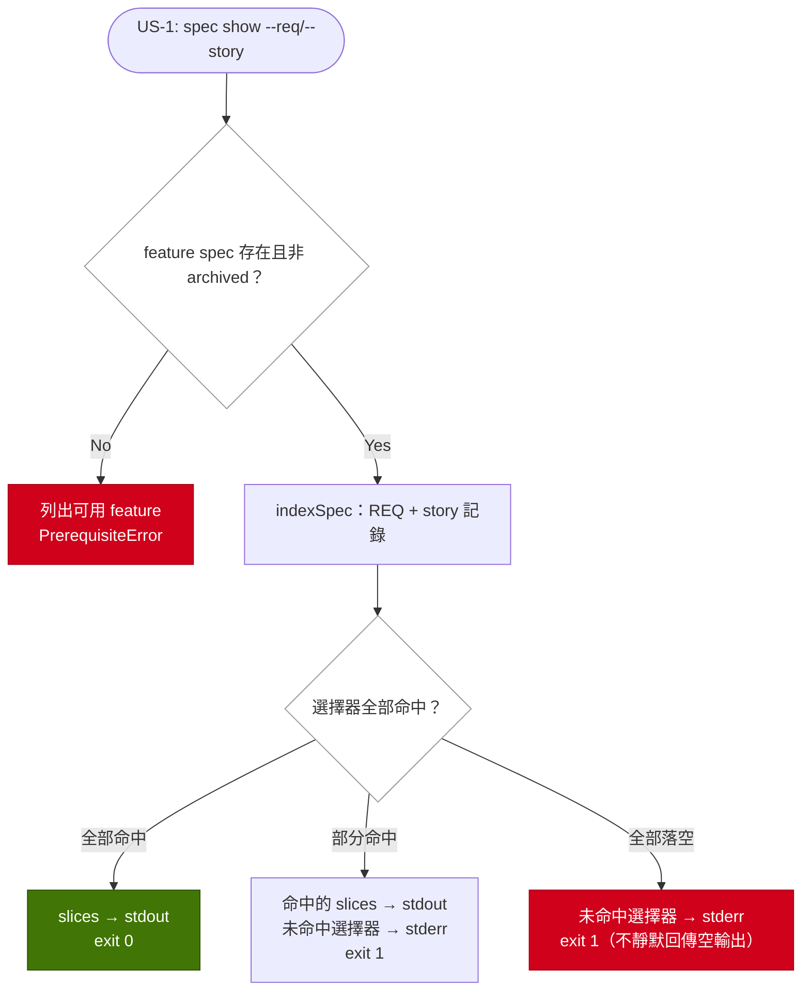

# read-specs-by-req — Implementation Plan

## Overview

verify 與 archive 兩站以整檔為單位讀 feature spec，但它們的判斷單位是 REQ。`sdd-workflow.md` 54,074 tokens、`drift-detection.md` 28,845，而成長維度是已歸檔變更數 —— 讀取成本因此與變更大小脫鉤。本變更補上三道保護中的「按需載入」：以 REQ id／story 為單位的窄讀入口，並讓兩站與 drift 的 `req-references` 共用同一份 REQ 索引。

策略是**介面先於佈局**。索引與切片是純函式，住在 `lib`（`spec-headings.ts` 已是 REQ heading 的單一來源，且是零內部 import 的 leaf）；I/O 與 feature 解析住 `services`；命令與 exit code 住 `cli`。三個消費者（`spec show`、MCP tool、`collectReqDefinitions`）都呼叫同一組 lib 函式，所以 feature spec 之後被切成 slice（issue #142 提案 2）時，只有 `services` 的檔案解析要改，介面與消費者不動。

## Technical Summary

> Auto-synthesized from AI Knowledge for this change's context

### Affected Module Overview

| Module | Core Responsibility | Key API | Dependencies |
|--------|-------------------|---------|--------------|
| lib | 純無狀態工具；`spec-headings.ts` 是 REQ heading 的唯一定義 | `matchReqHeading` / `readSpecCounters` / `REQ_ID_SOURCE`；`knowledge-reader` 的 `readFeatureSpec`／`listFeatureSpecs`／`isArchivedSpec`；`drift-sources` 的 `collectReqDefinitions` | types |
| services | 一命令一 `execute()`；MCP server 為 per-request 讀取 | `execute(options)`；`buildMcpServer()`（8 resources ＋ 2 tools） | types, lib |
| cli | 薄 I/O 層，17 個 top-level 命令 ＋ 26 formatters | `registerXxxCommand(program)` / `formatXxxOutput(result, logLevel)` | types, lib, services |
| templates | 17 skills 的 `.hbs` 來源；經 `agent sync` 部署 | `renderTemplate(name, ctx)` 消費 | — |
| tests | 4 層金字塔；`skill-format.test.ts` 釘住 skill 措辭 | vitest ＋ memfs | 全部 |

### Existing Patterns (from `_conventions.md`)

- Service 一律 `execute(options) → Promise<Result>`；命令一律 `registerXxxCommand(program)`；formatter 一律 `formatXxxOutput(result, logLevel)`
- 成功走 stdout、錯誤走 stderr；`mcp serve` 的 stdout 是 JSON-RPC 通道，不得寫入
- 自訂錯誤繼承 `ProspecError`，帶 `code` 與 `suggestion`；service 丟、cli 接
- 測試檔鏡射原始碼路徑；memfs ＋ `vol.reset()`；AAA

### Architecture Constraints (from Constitution)

- `cli → services → lib → types`，不得反向；lib→lib 允許但必須無環（`spec-slices` → `spec-headings` 單向）
- TDD：測試先行，coverage ≥ 80%
- 新增使用者可見命令 → `README.md` 與 `README.zh-TW.md` 同步（[SHOULD]）
- Factual counts：命令／formatter／檔案數是手維護欄位，須在同一個 feature commit 重導

### Relevant Playbook Entries

- **PB-015**：archive Phase 3.5 必須對**合併後的檔案**逐 REQ 檢查 —— 窄讀入口讀的是 post-sync 的 spec 檔，不是 delta-spec；模板措辭必須明講這一點，否則下一個 agent 會拿 worklist 當 spec 內容
- **PB-017**：已 grep `specs/features/**`，逐條裁決寫進 delta-spec。唯一 MODIFIED 是 `REQ-LIB-041`（heading matcher 的單一來源擴為索引）。不列 MODIFIED 的三條各有理由：`REQ-TEMPLATES-166` 末句「graduation 讀 CLI worklist 而非重讀每份被觸及的 spec」在改動後仍為真（worklist 選 REQ、窄讀取 body），其 body 是 500 餘字的單段落，整段重打的漏抄風險高於措辭收益；`REQ-TEMPLATES-134`（quick 跳過 Feature-Spec 比對項）語意不變；`REQ-TEMPLATES-080`（Startup Loading 逐項標註、靜先動後）不變但**約束** item 7 的改寫形狀
- **PB-006**：`readSpecCounters` 與新 `indexSpec` 不得各自實作一次 Deprecated 區段判定 —— 同檔內一份 walk，兩個公開函式建立在它之上
- **PB-001**：新斷言類別逐一 mutation 驗證；**PB-009** 不適用（未新增 drift check id）

## Affected Modules

| Module | Impact | Changes |
|--------|--------|---------|
| lib | High | `spec-headings.ts` 抽出單一 heading walk ＋ 新增 `indexSpec`；新增 `spec-slices.ts`（純選取／組裝）；`drift-sources.collectReqDefinitions` 改由索引推導 |
| services | High | 新增 `spec-show.service.ts`；`mcp.service.ts` 新增 `get_spec_requirements` tool |
| cli | Medium | 新增 `commands/spec-show.ts` ＋ `formatters/spec-show-output.ts`，於 `index.ts` 註冊（17→18 命令、26→27 formatters） |
| templates | Medium | `prospec-verify.hbs` Startup Loading item 7、`prospec-archive.hbs` Phase 3.5 step 1 改為窄讀 |
| tests | High | 單元（lib×2、services×2）＋ 契約（skill-format、single-source ban）＋ integration（MCP）＋ e2e（命令） |

## Call Chain

```
prospec spec show sdd-workflow --req REQ-CHNG-001,REQ-CHNG-004
  → registerSpecShowCommand.action(feature, opts)            [cli：解析 + resolveLogLevel]
  → specShow.execute({ cwd, feature, req[], story[] })       [services：orchestration]
  → resolveBasePaths(config)                                 [lib：featuresDir]
  → readFeatureSpec(featuresDir, feature)                    [lib：realpath-contained；archived/unsafe → null]
  → indexSpec(content)                                       [lib：一次 walk → REQ + story 記錄]
  → selectSpecSlices(content, index, selectors)              [lib：文件序去重 + misses]
  → formatSpecShowOutput(result, logLevel)                   [cli：slices→stdout、misses→stderr]
  → process.exitCode = 1（僅當 misses 非空）                  [cli：退出碼決策]
```

```
prospec check（req-references）
  → check.service.execute()
  → collectReqDefinitions(featuresDir)                       [lib：列舉 active spec]
  → indexSpec(content, { includeStruck: true })               [lib：同一份索引]
  → evaluateReqReferences(...)                                [lib：純評估，行為不變]
```

```
MCP tool get_spec_requirements({ feature, req?, story? })
  → buildMcpServer(ctx).registerTool handler                  [services：per-request 讀取]
  → readFeatureSpec(ctx.featuresDir, feature) + indexSpec + selectSpecSlices   [lib：與 CLI 同一組函式]
  → structuredResult({ feature, slices, misses })              [services：stdout 保持 JSON-RPC 潔淨]
```

MCP 走 **tool** 而非在 `spec://feature/{name}` 掛 query 參數，是實證決定：SDK 的 `UriTemplate.partToRegExp`（`@modelcontextprotocol/sdk/dist/esm/shared/uriTemplate.js:169-178`）為 `?`／`&` 產生的是 `\?req=([^&]+)` 這種**非選擇性**的 pattern，改成 `spec://feature/{name}{?req,story}` 會使不帶 query 的既有讀取無法匹配。REQ-MCP-003 的 resource 行為（整檔）因此完全不動。

## User Story Flow Diagram



## Implementation Steps

1. **`lib/spec-headings.ts`：一份 walk，兩個公開讀取者**
   - 抽出內部單一 heading walk（`\r?\n` 切行、Deprecated 區段開閉規則、REQ heading 先於 story 分支判定），`readSpecCounters` 改建立在它之上且**計數規則逐字不變**
   - 新增 `indexSpec(content, { includeStruck })` → `{ requirements: [{ id, level, story, deprecated, start, end }], stories: [{ id, title, start, end, requirements }] }`；offset 由同一次 walk 累加，保留原始 EOL
   - 單元測試先行：h1–h6、CRLF、struck、Deprecated 開閉、story 歸屬（`## US-` 與 `### US-` 皆算）、body 內含 code fence、US 編號重複

2. **`lib/spec-slices.ts`：純選取與組裝**
   - `selectSpecSlices(content, index, { req, story })` → `{ slices, misses }`；文件序、同一 REQ 不重複、`--req`／`--story` 聯集
   - 組裝原文 markdown：每段前綴所屬 US 路徑標籤、deprecated 標記；切片邊界不切開 fence
   - 單元測試涵蓋聯集去重、misses 集合、deprecated 標記

3. **`lib/drift-sources.ts`：`collectReqDefinitions` 改由索引推導**
   - id 集合改為 `indexSpec(text, { includeStruck: true })` 的映射；列舉、排序、`isArchivedSpec` 過濾與既有失敗模式（EACCES／`specs/features` 是檔案時的 abort）**維持不變**，不在本變更修既有缺陷
   - 擴充 REQ-LIB-041 的 single-source 契約測試：新增「第二份 REQ body 切片實作」的偵測子，並先證明它會對被移除的形狀變紅

4. **`services/spec-show.service.ts` ＋ CLI 命令**
   - feature 解析：`readFeatureSpec` 回 null → `PrerequisiteError`，訊息列出 `listFeatureSpecs` 的可用清單
   - `--req` 用既有 `collect` 可重複，service 再逗號展開；`--story` 同構
   - formatter：slices→stdout、misses→stderr（`sanitizeTerminal`）、misses 非空 → exit 1；於 `cli/index.ts` 註冊；e2e 覆蓋成功與 miss 退出碼

5. **`services/mcp.service.ts`：`get_spec_requirements` tool**
   - inputSchema `{ feature, req?, story? }`、`readOnlyHint`、`structuredResult`；缺 feature → `toolError`
   - integration 測試走 in-memory transport；新增契約斷言：不帶 query 的 `spec://feature/{name}` 仍回整檔（REQ-MCP-003 未變）

6. **templates：兩站讀取契約**
   - `prospec-verify.hbs` item 7 改為「以本變更 delta-spec 的 REQ 清單呼叫 `prospec spec show`」，保留 `[DYNAMIC]` 標註與靜先動後位置（REQ-TEMPLATES-080）、保留 quick 跳過
   - `prospec-archive.hbs` Phase 3.5 step 1 改為「對 CLI worklist 中的每條 REQ 呼叫 `prospec spec show`，讀的是**合併後的 spec 檔**」（PB-015）
   - `pnpm bundle` → `pnpm build` → `npx tsx src/cli/index.ts agent sync`；`skill-format.test.ts` 以 section-scoped 斷言釘住兩處措辭並逐一 mutation 驗證

7. **文件與計數同步**
   - `README.md` ＋ `README.zh-TW.md` 新增命令（雙語 parity）；lib／services／cli／tests README 的 Key Files 列與檔案數；`index.md` 的命令／formatter 數
   - `pnpm counts` 重導機器欄位；`pnpm counts:check` 綠

8. **量測 SC-001 並記錄**
   - 以 `lib/token-accounting` 估算 16 條 REQ 的 `spec show` 輸出對 54,074 的比例，數字寫進 tasks／summary，不以「應該變小」交差

## Risk Assessment

| Risk | Impact | Mitigation |
|------|--------|------------|
| `readSpecCounters` 改建立在共用 walk 上，計數行為漂移 → `spec-counters` 檢查與 `archive finalize` 寫錯 frontmatter | High | 計數規則逐字保留；改前後各跑一次既有單元測試與 `prospec check` 的 `spec-counters`；對 Deprecated 開閉與 h2-REQ 順序兩條規則 mutation 驗證。**取捨**：不共用會在同一檔內留下第二份區段判定，正是 REQ-LIB-041 存在的理由，寧可承擔可測的迴歸風險 |
| 兩站措辭改寫後，agent 改以 worklist／delta-spec 當 spec 內容，違反 PB-015 | High | 模板明寫「讀 post-sync 的 spec 檔」；契約測試對該句 section-scoped 斷言並 mutation 驗證 |
| 改 `.hbs` 只跑 `pnpm bundle` 未跑 `pnpm build` → e2e spawn 舊 `dist`，全綠是假的 | High | 步驟 6 固定 bundle→build→agent sync 三部曲；改動後重跑全套並 diff 部署後的 `.agents/skills/*/SKILL.md` |
| `collectReqDefinitions` 重構意外改變 id 集合 → `req-references` 由 PASS 轉 FAIL | Medium | SC-004 要求前後同為 PASS；重構前先錄下 id 集合快照做等值比對；`\r?\n` 切行為嚴格超集（不丟 id） |
| MCP 若堅持走 resource query 參數，會打壞既有整檔讀取 | Medium | 已實證選 tool（`uriTemplate.js:169-178`）；resource 行為不動並補一條「不帶 query 仍回整檔」的斷言。**取捨**：偏離 proposal FR-005 的字面（resource 過濾），能力等價但機制不同，delta-spec 以 ADDED REQ-MCP-009 記錄而非 MODIFIED REQ-MCP-003 |
| 六份超預算 feature spec 的 `knowledge-size` WARN 不會因本變更消失 | Low | SC-006 明載檔案佈局不變；summary 誠實揭露 WARN 仍在，切分屬 issue #142 提案 2 |
| 新增 top-level 命令使手維護計數（命令數／formatter 數／檔案數）漂移 | Low | 步驟 7 在同一 feature commit 重導；`pnpm counts:check` 在 CI 擋機器欄位 |

**Knowledge Quality Gate**: PASS — Brownfield（6 modules），已讀 lib（含 drift-engine 子模組）／services／cli／templates README ＋ `_conventions.md`，Technical Summary 已合成，並以 grep 針對 `specs/features/**` 完成 PB-017 掃描（結果見 Relevant Playbook Entries）。
