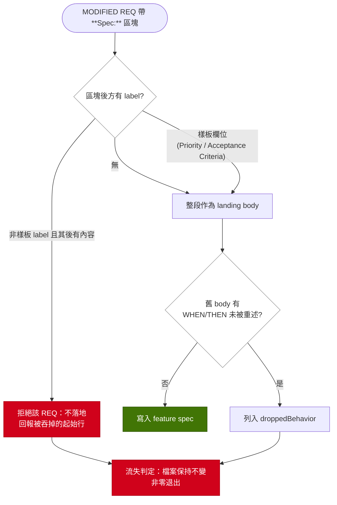

# Implementation Plan: stop-silent-spec-body-loss

## Overview

`prospec archive` 的機械 Feature Spec sync 目前可以在無人察覺下改寫信任區。下游專案的事故同時觸發了四個獨立缺口：`**Spec:**` 區塊被 `**Scenarios:**` 靜默截斷（`extractDeltaBlock` 的邊界判定與 `feature-spec-format` 的 REQ body 骨架互相對撞）、`droppedBehavior` 只認 `- WHEN` 一種條列形狀、報告是不影響退出碼的警告且發生在寫檔之後、以及 delta-spec 落在 provenance 基線外因此 review 後未同步的舊文字可以覆蓋已修好的 REQ。

實作策略是把「機械 sync 遇到不確定就拒絕，並在寫檔之前拒絕」這條既有原則（`services` README Pitfalls：*Refuse before writing, never after*）貫徹到 spec sync：邊界判定改為分類而非一刀切，掉落偵測改為涵蓋實際條列形狀，流失判定提到寫檔之前並反映在退出碼，並為 delta-spec 建立獨立的窄指紋而**不**擴張 `computeChangeDigest` 的 scope。

## Technical Summary

> Auto-synthesized from AI Knowledge for this change's context

### Affected Module Overview

| Module | Core Responsibility | Key API | Dependencies |
|--------|--------------------|---------|--------------|
| services | archive spec sync ＋ check 編排 | `syncToFeatureSpecs`、`execute`、`check.service` 的 `--record-review` 分支 | lib, types |
| lib | drift collectors／pure evaluators／指紋 | `computeChangeDigest`、`collectReviewProvenance`、`runChecks` | types |
| cli | 薄 I/O 層：退出碼與 worklist 渲染 | `commands/archive.ts`、`formatters/archive-output.ts` | services, lib, types |
| templates | 兩份 format reference ＋ archive skill Entry Gate | `delta-spec-format.hbs`、`feature-spec-format.hbs`、`prospec-archive.hbs` | —（由 agent-sync 注入 context） |
| tests | 合成 fixture、真實語料迴歸、契約、mutation | `tests/unit/services/archive-*`、`tests/contract/skill-format` | 全部 |

### Existing Patterns (from _conventions.md / module knowledge)

- **Refuse before writing, never after** — 檔案保持位元組不變才算拒絕（`services` README Pitfalls）
- **收集失敗 fail-closed 回 null**，絕不塌成常數（PB-013；`computeChangeDigest` 兩個 capture 分支皆已如此）
- **集合差集而非計數** — `droppedFor` 既有原則，數量相等仍可能整組換掉
- **新 drift check = collector（drift-sources）＋ evaluator（drift-checker）＋ `types/drift-report.ts` 的 frozen id ＋ 兩份 root README 的 prose 列舉**（PB-009；`pnpm counts` 不涵蓋那份列舉）

### Architecture Constraints (from Constitution)

- 依賴方向 `cli → services → lib → types`：新指紋的計算落在 `lib`，記錄落在 `services`，退出碼落在 `cli`
- TDD：測試先行或同 commit；覆蓋率 ≥ 80%
- 使用者可見面變動須同步 `README.md` 與 `README.zh-TW.md`（[SHOULD]，檢查列舉 15→16 屬之）
- Language Policy：`**Spec:**` 區塊以英文撰寫（具名反向例外）

## Affected Modules

| Module | Impact | Changes |
|--------|--------|---------|
| services | High | `extractDeltaBlock` 邊界分類＋拒絕路徑；`whenThenBullets` 形狀放寬；流失判定前移；`check.service` 記錄 delta-spec 指紋 |
| lib | High | 新增 delta-spec 指紋 collector ＋ `evaluateDeltaSpecProvenance`；`runChecks` 新增第 16 個 check |
| cli | Medium | archive 退出碼語意；`archive-output` 的 worklist 分級改變；check 新 id 的狀態行 |
| templates | Medium | 兩份 format reference 收斂；archive skill Entry Gate 增列第三個 provenance 項；Phase 3.5 措辭 |
| types | Medium | `DRIFT_CHECK_IDS` 第 16 個 frozen id；metadata 的 `delta_spec_provenance` 欄位 |
| tests | High | 合成 fixture、75 份 delta-spec ／ 1,734 條條列的真實語料迴歸、契約測試、mutation |

## Call Chain

```
prospec archive <name>                                    [US-1 / US-2 / US-3]
  → registerArchiveCommand.action(names, {dryRun})
  → archive.service.execute({names, dryRun})              [orchestration]
  → syncToFeatureSpecs(archiveDir, featuresPath, changeName, dryRun)
  → readFeatureRoutes → extractDeltaBlock(bodyLines, 'Spec')
      → classifyBlockTerminator(line)  [NEW] → template-field | suspected-body | heading | rule
  → mergeRequirementInPlace(content, route)
      → landingBody / droppedFor(route, superseded, landing)
      → whenThenBullets(body)  [WIDENED shapes]
      → declaredDrops(bodyLines)  [NEW] ← **Dropped:** 區塊，normalizeBullet 為鍵
  → assessSpecLoss(routes, results)  [NEW]                [判定在寫檔之前]
      → computed \ declared ≠ ∅ → hold；declared \ computed ≠ ∅ → stale 回報
  → atomicWrite(specFile) …只有在無流失或已放行時才發生
  → formatArchiveOutput(result) → process.exitCode = 1 on loss

prospec check --record-review [--change <name>]           [US-4 記錄端]
  → check.service.recordReview(cwd, change)
  → computeChangeDigest(cwd)          [不變，仍排除 .prospec]
  → computeDeltaSpecDigest(changeDir) [NEW，僅 delta-spec.md]
  → Document.set('review_provenance' | 'delta_spec_provenance')

prospec check --json                                      [US-4 判定端]
  → collectDeltaSpecProvenance(cwd)   [NEW，I/O]
  → runChecks(inputs) → evaluateDeltaSpecProvenance(...)  [pure]
  → /prospec-archive Entry Gate 讀取該 check → FAIL 則拒絕畢業
```

## User Story Flow Diagram

> US-1 / US-2 / US-3 共用同一個判定分支，故合併為一張圖。



## Implementation Steps

1. **邊界分類與拒絕路徑（US-1）**
   - 在 `archive.service.ts` 新增樣板欄位登記表（`Priority` / `Acceptance Criteria` / `Feature` / `Story` / `Before` / `After` / `Reason` / `Description`），以登記表而非 regex 決定「這個 label 是正常終止還是疑似 body 內容」
   - `extractDeltaBlock` 回傳值擴充為「內容 ＋ 截斷事實（label 文字、起始行號、被吞行數）」；被吞內容為空時不視為截斷
   - `mergeRequirementInPlace` 在截斷成立時不落地該 REQ，回傳新的 refusal 項；`---` 與 ATX heading 的既有邊界語意不變
   - 同組測試須涵蓋 `_lessons-ledger.md:132` 的鏡像形狀（`**Deviation (recorded at implement time):**` 因括號而不構成邊界）

2. **條列形狀放寬（US-2）**
   - `whenThenBullets` 的條列前綴由 `/^-\s+WHEN\b/i` 放寬到 `-` / `*` / `N.` 三種標記，並允許 `WHEN` 前後帶 `**` 強調
   - 續行仍要求縮排（1526-1530 的既有理由不變：假陽性比漏報更快摧毀 worklist 可信度）
   - 以現有 10 份 feature spec 的 1,734 條條列作迴歸語料，斷言零新增回報

3. **流失判定前移與退出碼（US-3）**
   - 新增 `assessSpecLoss`：把 refusal 與**未宣告的** `droppedBehavior` 收斂為單一「本次是否流失」事實，在任何 `atomicWrite` 之前算出
   - 有流失時該 feature spec 不寫入（其餘無流失的 spec 照常寫入，逐檔判定）
   - `commands/archive.ts` 把流失納入 `unhonored`；`archive-output` 將 `droppedBehavior` 由 WARNING-class 改為 blocking-class 並調整 `REQ-CLI-033` 所述的分級敘述

3b. **刻意廢止的宣告載體（US-3，`REQ-SERVICES-083`）**
   - delta-spec entry 在 `**Spec:**` 之後新增 `**Dropped:**` 區塊，逐條列出刻意廢掉的 bullet；`Dropped` **必須**登記進步驟 1 的樣板欄位表，否則宣告區塊自己會觸發截斷拒絕（這也是該登記表抽象是否正確的自洽性檢驗）
   - 比對重用 `normalizeBullet`：宣告集合 == 計算集合 → 釋放寫入；真子集 → 擋下並點名未宣告者；含計算集合以外條目 → 回報陳舊宣告
   - 宣告只釋放 dropped bullets，截斷拒絕無放行路徑
   - 取得 bullet 原文的既有管道是 `--dry-run` 的逐條全文輸出（`REQ-CLI-032` 正為此存在），流程為 dry-run → 貼進 `**Dropped:**` → 再跑一次

4. **delta-spec 窄指紋（US-4 記錄端）**
   - `lib/drift-sources.ts` 新增 `computeDeltaSpecDigest(changeDir)`：只雜湊該變更的 `delta-spec.md`，capture 失敗 fail-closed 回 null
   - `check.service` 的 `--record-review` 分支在寫 `review_provenance` 的同一次 Document 寫入中一併寫 `delta_spec_provenance`
   - `types/change.ts` 增欄位；沿用既有 `PROVENANCE_AUDITED_STATUSES`

5. **delta-spec-provenance check（US-4 判定端）**
   - `types/drift-report.ts` 的 `DRIFT_CHECK_IDS` 追加第 16 個 id（additive-only，既有 15 個順序凍結）
   - `drift-sources.ts` 新增 collector、`drift-checker.ts` 新增 pure evaluator 並在 `runChecks` 分派（缺分派為編譯錯誤）
   - `prospec-archive.hbs` 的 Entry Gate 由「兩個 provenance check」改為三個，並敘明 stale 的兩種成因與各自的補救
   - 同步兩份 root README 的檢查列舉（PB-009：`pnpm counts` 不涵蓋 prose 列舉）

6. **收斂兩份 format reference（US-5）**
   - `feature-spec-format.hbs` 的 REQ body 骨架與 `delta-spec-format.hbs` 的 Spec 區塊規則對齊：明確說明 `**Scenarios:**` 標籤不得寫進 `**Spec:**` 區塊，以及照骨架寫會被拒絕而非靜默截斷
   - 新增契約測試斷言兩份 reference 對該邊界的敘述不衝突
   - 改 `.hbs` 後先 `pnpm bundle` 再 `pnpm build`，然後 `prospec agent sync` 重新部署

7. **驗證與收尾**
   - 真實語料迴歸：75 份 archived delta-spec 的 128 個終止點全為樣板欄位，新規則零誤判
   - mutation testing 針對新增判定邏輯，存活變異須為 0
   - `pnpm counts` → `pnpm typecheck` / `lint` / 全測試 / `counts:check`
   - 知識同步：`services/spec-sync.md`（worklist 語意）、`cli/README.md`（WARNING-class 列舉）、`lib/drift-engine.md`（第 16 個 check）三處敘述已被本變更推翻，須在 verify S/A commit 前更新

## Risk Assessment

| Risk | Impact | Mitigation |
|------|--------|------------|
| **本缺陷無法靠 dogfood 驗證** — 本 repo 遵守 delta-spec-format 那條規則，跑幾次 archive 都是綠的 | High | 驗證一律以合成 fixture ＋ 真實語料迴歸 ＋ mutation 為準；明文禁止以「跑一次 archive 看看」充當證據 |
| 條列形狀放寬造成假陽性，worklist 失去可信度 | High | 以 1,734 條既有條列為零回報基線；續行仍要求縮排；假陽性誘因（重新縮排／換行重排）各有一條測試 |
| 退出碼改動破壞既有呼叫端與 E2E | Medium | `droppedBehavior` 在 `REQ-CLI-033` 被明文列為「never exit 1」，該 REQ 一併 MODIFIED；E2E 逐項對照 |
| 自舉：本變更要走它正在改的 archive 路徑畢業，且新的阻擋會作用在自己身上 | Medium | dogfood 必用 source CLI（安裝版會當場重演缺陷並污染工件）；archive 前先 `--dry-run` 讀完三份 worklist |
| 18 條 REQ 的 graduation 量大，PB-015／PB-017 的漏抄風險升高 | Medium | 每條 MODIFIED 的 `**Spec:**` 都以 `git show HEAD:{spec}` 的現行 body 為起點增修；Phase 3.5 逐條對照合併後的檔案 |
| 第 16 個 check 的 ripple（frozen contract、README prose、verify／learn／MCP 消費端） | Medium | 依 `lib/drift-engine.md` Modification Guide 逐項；編譯期 exhaustiveness guard 兜住分派遺漏 |
| `**Dropped:**` 宣告的比對過嚴會變成作者與工具打架 | Medium | 比對鍵重用 `droppedFor` 現成的 `normalizeBullet`，重新縮排／換行重排不影響相符；原文由 `--dry-run` 逐條全文提供，不需手打 |
| 宣告區塊自己觸發本變更新增的截斷拒絕 | Medium | `Dropped` 必須登記進樣板欄位表；以一條「entry 帶宣告仍正常落地」的測試釘住（同時是登記表抽象的自洽性檢驗） |

## Open Questions

- 無未決項。US-3 的放行載體已裁決為 delta-spec 的 `**Dropped:**` 宣告（理由見 proposal.md 的 Decisions Already Taken）。
