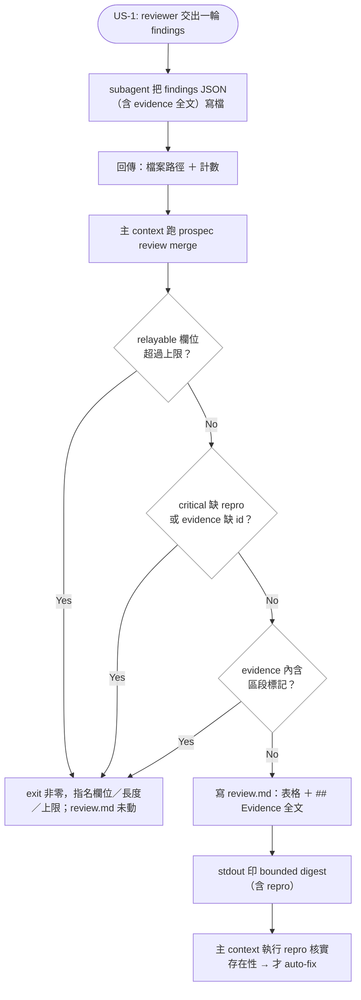

# separate-review-evidence — Implementation Plan

## Overview

`/prospec-review` 的 reviewer／verifier 與 `/prospec-verify` 的 judgment grader 都跑在 fresh context，但它們的**回傳**是整份帶長 evidence 散文的 JSON，全數進主 context；而那些 evidence 在工件裡完全沒有落地處（`review.md` 只有一行 Summary，verify 的判斷依據只存在 chat 報告）。本變更把「回傳」與「證據」拆成兩條路：evidence 全文由 subagent 寫進 findings／dimensions 檔案並由 CLI 落進 `review.md`／`verify.md`；回傳主 context 的只有 claim、一條可重跑的 `repro`、以及檔案路徑。

實作策略是**先立契約再改機制**：上限與新欄位進 `types/station.ts` 成為單一登記表（`RELAYED_FIELD_MAX_CHARS`），由 Zod 在服務層寫檔前驗證，所以「evidence 不要塞進 summary」是 exit 非零的規則而非勸告。evidence 區塊的標記文法抽成 `lib/delegated-evidence.ts` 一份實作，`review.md` 與 `verify.md` 共用 —— 這正是 `markdown-table` 當年被兩個消費者各自手抄後漂移的同一個坑（PB-006），不再重演。skill 側只留兩段短指令並把契約全文放進**共用 on-demand reference**，避免把負擔加到已經超預算的 `prospec-verify.hbs` stable prefix 上。

## Technical Summary

> Auto-synthesized from AI Knowledge for this change's context

### Affected Module Overview

| Module | Core Responsibility | Key API | Dependencies |
|--------|-------------------|---------|--------------|
| types | Zod schemas + frozen registries | `ReviewFindingSchema`, `VERIFY_DIMENSIONS`, `DIMENSION_RESULTS` | zod |
| lib | I/O-free station engines | `mergeFindings`, `renderReviewDocument`, `markdown-table`, `toInlineCodeSpan` | types |
| services | one `execute()` per command | `review-merge.execute`, `verify-record.execute` | lib, types |
| cli | parse → one service → format | `registerReviewCommand`, `registerVerifyRecordCommand`, 兩個 formatter | services, lib, types |
| templates | `.hbs` 資源 | `prospec-review.hbs`, `prospec-verify.hbs`, `references/*.hbs` | — |
| tests | 4 層 Vitest 套件 | `pnpm test` | 全部 |

### Existing Patterns (from _conventions.md 與模組 README)

- **Station 契約**：judgment 以結構化輸入抵達（`types/station.ts`），service 只做決定論寫入，決策住在 `lib` 引擎裡
- **Refuse before writing**：任何拒絕都必須發生在第一個位元組落地前，檔案保持 byte-identical（`verify record` 的 stale digest 守衛即此形狀）
- **表格引擎唯一**：`lib/markdown-table.ts` 是唯一的 pipe-table 實作；消費者只擁有 header predicate 與欄位詞彙
- **Emitter 護欄**：進到 markdown code span 的自由文字必須先過 `lib/markdown-fences` 的 `toInlineCodeSpan`；進終端的自由文字必須先過 `formatters/sanitize.ts` 的 `sanitizeTerminal`
- **三處複述**：`lib/review-merge` 的 identity 規則同時寫在 `review-format.hbs` 與 `prospec-review.hbs` 的 Persistence 段落（templates README pitfall）—— 語意變動必須三處同動

### Architecture Constraints (from Constitution)

- 依賴方向 `cli → services → lib → types`（[SHOULD]）—— 新的 `lib/delegated-evidence.ts` 只能 import types
- TDD（[MUST]）—— 每個新公開函式先有失敗測試，覆蓋率 ≥ 80%
- Pre-Merge CI（[MUST]）—— `lint`／`typecheck`／`test:coverage`／`counts:check`／`agents:check`／`prospec check --strict`
- Factual Count Integrity（[MUST]）—— 新增 reference 與測試檔會動到機器擁有的清單，須跑 `pnpm counts`
- Language Policy（[MUST]）—— 本工件繁中；`**Spec:**` 區塊與所有 `.hbs`／程式碼英文

## Affected Modules

| Module | Impact | Changes |
|--------|--------|---------|
| types | High | `RELAYED_FIELD_MAX_CHARS` 登記表；`ReviewFindingSchema` 新增 `repro`／`evidence` ＋ 兩條交叉規則；新 `JudgmentDimensionsInputSchema` |
| lib | High | 新 `delegated-evidence.ts`（標記文法／解析／渲染／碰撞偵測）；`review-merge.ts` 的 row 擴充、evidence carry-forward 與渲染 |
| services | High | `review-merge.service` 落地 evidence ＋ 碰撞拒絕；`verify-record.service` 追加 `verify.md` |
| cli | Medium | `review merge` 的 bounded digest；`verify record --dimensions` ＋ 互斥拒絕 ＋ 輸出 `verify.md` 路徑 |
| templates | Medium | 新 `references/delegated-evidence-format.hbs`；兩份 SKILL.md 的委派段落與 NEVER；`review-format.hbs` 的 evidence 區段格式 |
| tests | High | 新 lib 單元套件；4 個既有套件擴充；契約（reference 部署／NEVER）；E2E 三個新案例 |

## Call Chain

```
prospec review merge --findings round.json
  → registerReviewCommand.action({findings, change})            [cli: 只解析旗標]
  → services/review-merge.execute(options)                      [orchestration]
  → ReviewFindingsInputSchema.safeParse(json)                   [types: 上限 ＋ critical⇒repro ＋ evidence⇒id]
  → lib/delegated-evidence.containsEvidenceMarker(text)         [refuse before writing]
  → lib/delegated-evidence.splitEvidenceSection(existing)       [## Evidence → Map<id, EvidenceBlock>]
  → lib/review-merge.parseReviewRows(before)                    [表格 → rows（先剝 evidence 區段）]
  → lib/review-merge.mergeFindings(rows, findings)              [identity merge ＋ evidence carry-forward]
  → lib/review-merge.renderReviewDocument(before, rows, name)   [表格 ＋ evidence 區段，列序決定區塊序]
  → lib/fs-utils.atomicWrite(reviewPath, doc)                   [單一寫入點，在所有拒絕之後]
  → cli/formatters/review-merge-output(result)                  [bounded digest → stdout，全走 sanitizeTerminal]
```

```
prospec verify record --dimensions dims.json
  → registerVerifyRecordCommand.action(opts)                    [cli: --dimension 與 --dimensions 互斥]
  → JudgmentDimensionsInputSchema.safeParse(json)               [types: 同一組上限]
  → services/verify-record.execute({judgmentDimensions, judgmentEvidence})
  → (既有) report self-source → computeGrade → appendQualityLogEntry   [quality_log 欄位集合不變]
  → lib/delegated-evidence.renderEvidenceSection(blocks)        [每個 judgment dimension 一塊]
  → lib/fs-utils.atomicWrite(verifyPath, existing + dated section)     [append 語意，與 quality_log 一致]
  → cli/formatters/verify-record-output(result)                 [grade ＋ verify.md 路徑]
```

兩條鏈都在 `cli` 只做解析、在 `services` 只做寫入、把格式決策留在 `lib`；沒有任何一層向上 import。

## User Story Flow Diagram

US-1 的分支結構（三個決策點：上限、交叉規則、標記碰撞，全部發生在寫檔前）：



## Implementation Steps

1. **契約先行（types）**
   - 新增 `RELAYED_FIELD_MAX_CHARS = { location: 300, summary: 500, repro: 600 }`，並在 doc comment 寫明「這是 relay 的上限，evidence 不在其中，因為它從不進 return payload」
   - `ReviewFindingSchema`：`location`／`summary` 加 `.max()`；新增 `repro`（`.max()`）與 `evidence`（無上限）
   - 交叉規則以 `superRefine` 實作：`severity: 'critical'` ⇒ `repro` 必填；`repro` 或 `evidence` 存在 ⇒ `id` 必填
   - 新增 `JudgmentDimensionInputSchema` / `JudgmentDimensionsInputSchema`（`name`／`result`／`summary?`／`repro?`／`evidence?`，共用同一組上限）

2. **evidence 區塊文法（lib，新檔）**
   - `lib/delegated-evidence.ts`：三個標記常數（section／block-open／block-end）共用一個 prefix、`containsEvidenceMarker`、`renderEvidenceBlock`、`renderEvidenceSection`（空集合回 `''`）、`splitEvidenceSection`
   - 區段以**標記**定位而非 `## Evidence` 標題：evidence 會引用文件（標題與表格都可能被引），以散文為錨會在被引的文字上切開文件
   - CR 正規化＋EOF 隱式收尾，使 `render → split → render` 在 CRLF 下仍 byte-identical；零 import，維持 I/O-free

   > **設計調整（實作期）**：原案讓 `repro` 住在 evidence 區塊裡，但那需要一個 `toInlineCodeSpan` 的反函式（padding 剝除與換行收斂皆有損），carry-forward 會讀不回原始指令。改為 `repro` 走**表格第 7 欄** —— 既有 `escapeTableCell`／`splitTableRow` 的 `\|` 轉義是精確可逆的，evidence 區段因此只放散文（原始行，精確可逆）。代價是表格變寬；收益是整條往返鏈上沒有任何有損轉換。連帶把 relayed 欄位加上「不得含換行」規則（三者都是單行表格 cell，這也順手補上 `summary` 既有的隱性有損面）。

3. **review 列擴充與 carry-forward（lib）**
   - `ReviewRow` 新增 `repro?`／`evidence?`；表格加第 7 欄 `Repro`（欄位別名表保留舊 6 欄的解析）；`mergeFindings` 只在 incoming 有值時覆寫（不帶 evidence 的重報不清空既有全文）
   - `renderReviewDocument` 改為：先 `splitEvidenceSection` 取 `before` → 在 `before` 上做既有的表格替換 → 附加重新渲染的 evidence 區段
   - 更新 `lib/review-merge.ts` 檔頭 doc comment（identity 規則的三處複述之一）

4. **review merge 落地（services ＋ cli）**
   - service：schema 驗證 → 標記碰撞檢查 → 解析 → merge → 單一 `atomicWrite`；`ReviewMergeResult` 新增 `criticals[]`（bounded digest）與 `evidenceBlocks` 計數
   - formatter：印 digest（每個 critical 一行 ＋ repro 一行），全部經 `sanitizeTerminal`；evidence 全文不進 stdout

5. **verify record 落地（types ＋ services ＋ cli）**
   - service 新增 `judgmentEvidence?`；grade／`quality_log` 路徑完全不動，evidence 只影響 `verify.md`
   - `verify.md` 追加 `## {date} — grade {G}` 區塊，內含每個有 evidence 的 judgment dimension 一塊
   - command 新增 `--dimensions <file>`，與 `--dimension` 互斥（拒絕在 cli 層，因為這是旗標文法）；`VerifyRecordResult` 新增 `evidencePath?`

6. **skill 與 reference（templates）**
   - 新 `references/delegated-evidence-format.hbs`：payload 契約、上限表、evidence 區塊格式、「per-finding 上限 × finding 數；findings 永不為了預算被丟棄」
   - 註冊到 `getSkillReferences` 的 `prospec-review` 與 `prospec-verify` 兩站
   - `prospec-review.hbs`：Persistence 段落改寫（新欄位 ＋ 上限 ＋ evidence 落地）、The Loop 第 2 步改為「跑 repro 核實」、新增 NEVER 條目
   - `prospec-verify.hbs`：2/5 與 Record 段落改寫成走 `--dimensions`、新增 NEVER 條目
   - `review-format.hbs`：補 evidence 區段格式並與上述三處保持一致
   - `pnpm bundle` → `npx tsx src/cli/index.ts agent sync`（**不可**用已安裝的執行檔，它會部署已發版模板）

7. **測試（tests）**
   - 新 `tests/unit/lib/delegated-evidence.test.ts`；擴充 `review-merge`（lib／service）、`verify-record.service`、兩個 formatter 單元套件
   - 契約：新 reference 在兩站都部署、兩份 SKILL.md 的 NEVER 條目存在
   - E2E：帶 evidence 的 `review merge`、`verify record --dimensions`、兩旗標互斥的拒絕
   - `pnpm counts` 重導機器擁有的清單，`pnpm mutate` 對新 lib 檔做一輪按需變異稽核

8. **知識與文件同步**
   - `types`／`lib`／`services`／`cli`／`templates`／`tests` 六份 README 於 verify S/A commit prompt 同步（不引用未畢業的 REQ id）
   - `README.md` ＋ `README.zh-TW.md`：`review merge`／`verify record` 是使用者可見的 CLI 表面，旗標新增須雙語同動

## Risk Assessment

| Risk | Impact | Mitigation |
|------|--------|------------|
| 使用者裁決把 verify grader 一併納入，範圍是本變更最大的風險（INVEST 的 S 最弱） | High | 契約與 `lib/delegated-evidence` 共用，verify 側只多一個 append 寫入；US-4 標 P2，若 review 側出現未預期的收斂成本，verify 側可獨立退成 follow-up |
| `review.md` 是既有工件，格式變動可能打壞既有檔案的解析 | High | evidence 區段在表格之後且先被剝除；legacy 4 欄／無 id 的表仍走既有 alias 路徑；以「同一輪重跑 byte-identical」與「legacy 檔可解析」兩個測試釘住 |
| evidence 內含區段標記可製造出解析錯位（注入面） | Medium | 寫檔前 `containsEvidenceMarker` 拒絕整輪，檔案保持 byte-identical；E2E 覆蓋 |
| identity 規則在三處複述，只改一處會教到過期版本 | Medium | 步驟 3 與 6 綁在一起執行；契約測試比對 skill 與 reference 的關鍵句 |
| `prospec-verify.hbs` 已超 5,000 token 預算（10,153），加字會惡化 | Medium | 契約全文放 on-demand reference；SC-006 用估算器量測，兩份 SKILL.md 各自漲幅 ≤ 200 tokens |
| `critical ⇒ repro` 是硬性拒絕，可能在 reviewer 無法給出指令時卡住迴圈 | Medium | reference 明訂 repro 的合法形式包含唯讀探針（失敗測試呼叫、或顯示被引用程式碼的讀取／grep 指令），因此總是可產出；上限 600 字元足以容納多步指令 |
| 上限數值是新設的門檻，可能過緊 | Low | 三個值寫在單一登記表，調整是一處編輯；`evidence` 無上限，所以過緊的後果是把散文推去正確的地方，而非丟失資訊 |
| `verify.md` 是新工件面，archive 需搬移 | Low | `archive.service` 以 `readdir` 搬移整個 change 目錄，新檔自動涵蓋；以既有 archive 測試確認 |
